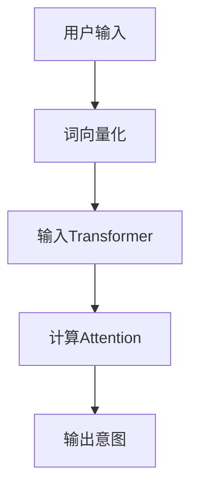
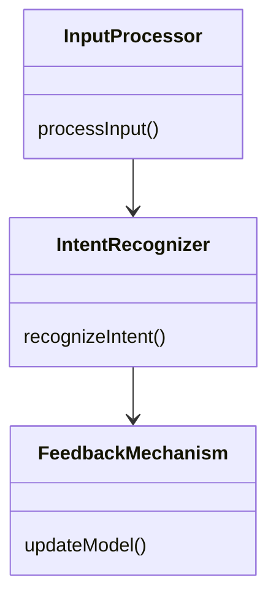

                 


# AI Agent的用户意图推理与预测

**关键词**: AI Agent, 用户意图推理, 机器学习, 自然语言处理, 意图预测, 对话系统, 人机交互

**摘要**:  
本文深入探讨AI Agent在用户意图推理与预测领域的核心技术与实践。从基本概念到算法原理，从系统设计到实际应用，全面解析用户意图推理的关键问题、解决方案及未来趋势。通过具体案例分析和代码实现，帮助读者理解如何在实际项目中构建高效的意图推理系统。

---

## 第一部分: AI Agent的用户意图推理与预测背景与基础

### 第1章: 用户意图推理与预测的概述

#### 1.1 用户意图推理的基本概念

##### 1.1.1 什么是用户意图
用户意图是指用户在与AI Agent交互时所表达的目标、需求或期望的结果。意图可以是显式的（如“我要查询天气”）或隐式的（如“我需要放松，想听音乐”）。

- **显式意图**：用户明确表达的需求，例如“我要预订一张去北京的机票”。
- **隐式意图**：用户未明确表达的需求，例如用户输入“我有点无聊”，AI Agent需要推断用户可能想听音乐或看视频。

##### 1.1.2 用户意图的分类与层次
用户意图可以根据多个维度进行分类：

- **层次性**：
  - **显式意图**：用户明确表达的需求。
  - **隐式意图**：需要通过上下文推断的需求。
- **粒度**：
  - **宏观意图**：用户的整体目标，例如“购买电子产品”。
  - **微观意图**：用户的具体操作，例如“查找具体型号的手机”。

##### 1.1.3 用户意图在人机交互中的作用
用户意图是人机交互的核心，决定了AI Agent的响应策略。准确理解用户意图可以提高交互效率，降低用户 frustration。

#### 1.2 用户意图推理的背景与问题描述

##### 1.2.1 当前人机交互中的挑战
- **歧义性**：用户的输入可能存在多种解释。
- **上下文依赖性**：意图的理解需要结合历史对话和当前场景。
- **动态变化**：用户的意图可能在交互过程中发生变化。

##### 1.2.2 用户意图推理的核心问题
- 如何从用户输入中提取意图？
- 如何处理意图的不确定性和歧义？
- 如何在动态场景中实时更新意图？

##### 1.2.3 用户意图推理的边界与外延
- **边界**：仅关注用户的直接需求，不涉及用户的隐私或深层心理。
- **外延**：扩展到多模态输入（如语音、图像）的意图推理。

#### 1.3 用户意图推理与自然语言处理的关系

##### 1.3.1 NLP在用户意图推理中的应用
- **文本分类**：将用户输入的文本归类到预定义的意图类别。
- **实体识别**：提取文本中的关键实体（如地点、时间）以辅助意图推理。

##### 1.3.2 用户意图推理与对话系统的关系
- **对话系统**：依赖意图推理来生成合适的回复。
- **反馈机制**：根据用户反馈调整意图理解模型。

##### 1.3.3 用户意图推理的未来
- **多模态融合**：结合语音、图像等多种信号进行意图推理。
- **实时推理**：在动态对话中实时更新意图。

---

## 第二部分: 核心概念与联系

### 第2章: 用户意图推理的核心概念与联系

#### 2.1 意图推理的核心原理
意图推理需要结合上下文、用户行为和历史数据，通过模式识别和机器学习技术，推断出用户的潜在需求。

##### 2.1.1 基于规则的意图推理
- **规则引擎**：通过预定义的规则匹配用户输入。
- **优点**：简单易懂，适用于规则明确的场景。
- **缺点**：难以处理复杂场景。

##### 2.1.2 基于机器学习的意图推理
- **监督学习**：使用标注数据训练分类器。
- **无监督学习**：通过聚类技术发现潜在意图。
- **深度学习**：利用神经网络提取高阶特征。

#### 2.2 意图推理的关键模型与技术

##### 2.2.1 基于统计的模型
- **朴素贝叶斯**：常用于文本分类任务。
- **支持向量机（SVM）**：适用于高维特征空间。

##### 2.2.2 基于深度学习的模型
- **循环神经网络（RNN）**：适用于序列数据的处理。
- **Transformer模型**：在自然语言处理领域表现出色。

#### 2.3 实体关系图（ER图）与意图推理

##### 2.3.1 实体关系图的构建
- **实体**：用户、意图、行为、上下文。
- **关系**：用户具有意图，意图触发行为，行为受上下文影响。

##### 2.3.2 ER图的Mermaid表示


---

## 第三部分: 算法原理讲解

### 第3章: 基于Transformer的意图识别模型

#### 3.1 算法原理概述

##### 3.1.1 Transformer模型的数学基础

$$\text{Attention}(Q, K, V) = \text{softmax}\left(\frac{QK^T}{\sqrt{d_k}}\right)V$$

其中，$Q$、$K$、$V$分别为查询、键和值矩阵，$d_k$为键的维度。

##### 3.1.2 模型训练流程

1. **数据预处理**：将用户输入转换为词向量。
2. **模型构建**：定义基于Transformer的意图分类器。
3. **损失函数**：交叉熵损失。
4. **优化器**：Adam优化器。

#### 3.2 算法流程图



---

## 第四部分: 系统分析与架构设计

### 第4章: 用户意图推理系统的架构设计

#### 4.1 项目介绍

##### 4.1.1 项目目标
构建一个基于AI Agent的用户意图推理系统，支持多轮对话中的意图识别。

##### 4.1.2 项目范围
支持文本和语音输入，提供实时意图推理服务。

#### 4.2 系统功能设计

##### 4.2.1 功能模块
- **输入处理模块**：接收用户输入并进行预处理。
- **意图识别模块**：基于模型输出意图。
- **反馈机制模块**：根据用户反馈调整模型。

##### 4.2.2 功能模块的Mermaid类图



#### 4.3 系统架构设计

##### 4.3.1 分层架构


##### 4.3.2 接口设计

```mermaid
sequenceDiagram
    User ->+> Agent: 发送输入
    Agent ->+> IntentRecognizer: 请求意图识别
    IntentRecognizer --> Agent: 返回意图
    Agent ->+> User: 发送回复
```

---

## 第五部分: 项目实战

### 第5章: 意图推理系统实战

#### 5.1 环境安装

```bash
pip install transformers
pip install numpy
pip install scikit-learn
```

#### 5.2 核心代码实现

##### 5.2.1 数据预处理

```python
def preprocess(text):
    return text.lower().split()
```

##### 5.2.2 模型实现

```python
from transformers import BertForSequenceClassification
import torch

model = BertForSequenceClassification.from_pretrained('bert-base-uncased')
```

##### 5.2.3 意图识别

```python
def predict_intent(text):
    inputs = tokenizer(text, return_tensors='np')
    outputs = model(**inputs)
    logits = outputs.logits
    predicted_class = torch.argmax(logits, axis=1).item()
    return predicted_class
```

#### 5.3 案例分析

##### 5.3.1 电商场景

- **输入**：用户输入“我需要买一双红色的运动鞋”。
- **意图识别**：购买红色运动鞋。
- **系统响应**：显示相关商品信息。

##### 5.3.2 客服场景

- **输入**：用户输入“我的订单在哪里？”。
- **意图识别**：查询订单状态。
- **系统响应**：提供订单跟踪信息。

---

## 第六部分: 最佳实践

### 第6章: 用户意图推理的最佳实践

#### 6.1 小结
用户意图推理是AI Agent的核心能力，需要结合上下文和用户行为进行动态调整。

#### 6.2 注意事项
- 数据质量：确保训练数据的多样性和代表性。
- 模型选择：根据场景选择合适的模型。
- 反馈机制：实时更新模型以适应用户行为变化。

#### 6.3 拓展阅读
- 《深度学习》——Ian Goodfellow
- 《自然语言处理入门》——NLP入坑

---

**作者：AI天才研究院/AI Genius Institute & 禅与计算机程序设计艺术 /Zen And The Art of Computer Programming**

