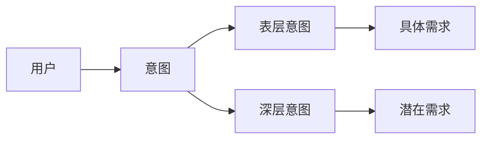
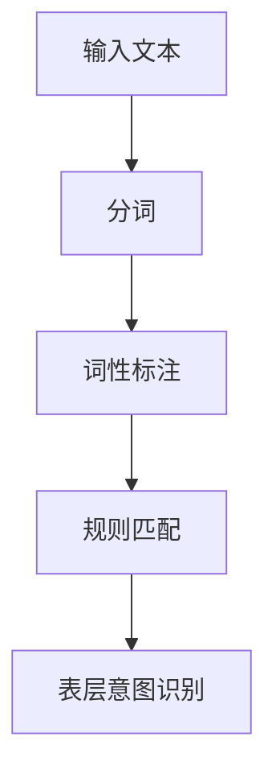

                 


# AI Agent的用户意图理解：从表层到深层

## 关键词：AI Agent, 用户意图, 表层意图, 深层意图, 自然语言处理, 机器学习

## 摘要：AI Agent的用户意图理解是实现智能交互的核心，从表层到深层意图的挖掘需要结合自然语言处理和机器学习技术。本文系统地介绍了用户意图理解的背景、核心概念、算法原理、系统架构，并通过项目实战展示了如何在实际中应用这些技术。通过对意图层次的深入分析，本文为AI Agent的设计与优化提供了理论基础和实践指导。

---

## 第一章: 用户意图理解的背景与概念

### 1.1 问题背景与重要性
用户意图理解是人机交互中的关键问题。随着AI Agent的应用越来越广泛，准确理解用户的意图变得尤为重要。用户的意图可以分为表层和深层，表层意图是用户直接表达的需求，而深层意图则是隐藏在表层背后的真实需求。理解深层意图可以提升AI Agent的智能性和用户体验。

### 1.2 用户意图的层次结构
用户意图分为表层和深层两个层次：

- **表层意图**：用户明确表达的需求，例如“我要找附近的餐厅”。
- **深层意图**：用户未明确表达的需求，例如“我想要一个价格适中且评价好的餐厅”。

### 1.3 表层与深层意图的关系
表层意图是深层意图的外在表现，而深层意图是表层意图的内在驱动。理解表层意图是理解深层意图的基础。



---

## 第二章: AI Agent与用户意图理解的核心概念

### 2.1 核心概念与原理
- **意图理解的三要素**：输入文本、意图分类和意图表示。
- **AI Agent的基本原理**：通过自然语言处理和机器学习技术，将用户输入的文本转化为意图表示。

### 2.2 意图理解的关键特征对比
表层意图和深层意图在特征上有显著差异：

| 特征 | 表层意图 | 深层意图 |
|------|----------|----------|
| 清晰度 | 高       | 低       |
| 明确性 | 高       | 低       |
| 潜在需求 | 无       | 有       |

### 2.3 实体关系图（ER图）


---

## 第三章: 用户意图理解的算法原理

### 3.1 基于规则的意图理解算法

#### 3.1.1 算法流程图



#### 3.1.2 Python代码示例

```python
def intent_rule_matching(text, rules):
    for rule in rules:
        if re.match(rule, text):
            return rule
    return "unknown"
```

### 3.2 统计学习模型

#### 3.2.1 基于TF-IDF的意图分类

```python
from sklearn.feature_extraction.text import TfidfVectorizer
from sklearn.svm import SVC

# 训练数据预处理
vectorizer = TfidfVectorizer()
X = vectorizer.fit_transform(corpus)
y = [0, 1, 2, ...]  # 不同意图的标签

# 模型训练
model = SVC()
model.fit(X, y)
```

### 3.3 深度学习模型

#### 3.3.1 基于BERT的意图理解

```python
import torch
from transformers import BertTokenizer, BertModel

# 加载预训练模型
tokenizer = BertTokenizer.from_pretrained('bert-base-uncased')
model = BertModel.from_pretrained('bert-base-uncased')

# 输入文本处理
inputs = tokenizer.encode_plus("我要找附近的餐厅", return_tensors='pt', padding=True, truncation=True)
outputs = model(**inputs)
intent = outputs.last_layer_hidden_state[:, 0, :].max(1)[1].item()
```

---

## 第四章: 数学模型与公式

### 4.1 概率模型

#### 4.1.1 贝叶斯定理

$$P(A|B) = \frac{P(B|A) \cdot P(A)}{P(B)}$$

### 4.2 向量空间模型

$$\text{相似度} = \frac{\vec{A} \cdot \vec{B}}{|\vec{A}| \cdot |\vec{B}|}$$

---

## 第五章: 系统分析与架构设计

### 5.1 问题场景介绍
AI Agent需要在多种场景中理解用户意图，例如智能音箱、聊天机器人和电商平台。

### 5.2 系统功能设计

- **需求分析模块**：分析用户输入，提取表层和深层意图。
- **意图分类模块**：基于预训练模型，分类用户意图。
- **意图表示模块**：将意图表示为向量，用于后续处理。

### 5.3 系统架构图


---

## 第六章: 项目实战

### 6.1 环境安装
安装所需的库：
```bash
pip install numpy pandas scikit-learn transformers
```

### 6.2 核心实现代码

```python
from transformers import BertTokenizer, BertModel
import torch

# 初始化模型和分词器
tokenizer = BertTokenizer.from_pretrained('bert-base-uncased')
model = BertModel.from_pretrained('bert-base-uncased')

def analyze_intent(text):
    inputs = tokenizer.encode_plus(text, return_tensors='pt', padding=True, truncation=True)
    with torch.no_grad():
        outputs = model(**inputs)
    intent_vector = outputs.last_layer_hidden_state[:, 0, :].numpy()[0]
    return intent_vector
```

### 6.3 案例分析
以电商客服为例，分析用户意图：

1. **输入文本**：我需要退换一件商品。
2. **表层意图**：退换商品。
3. **深层意图**：解决质量问题或对商品不满意。

---

## 第七章: 总结与展望

### 7.1 最佳实践
- 使用预训练模型提升意图理解的准确率。
- 结合上下文信息，提高深层意图的理解能力。

### 7.2 小结
从表层到深层意图的理解是AI Agent智能化的关键。通过结合自然语言处理和机器学习技术，可以实现更精准的意图识别。

### 7.3 注意事项
- 数据质量对意图理解的准确性有重要影响。
- 需要不断优化模型，适应用户需求的变化。

### 7.4 拓展阅读
推荐阅读《深度学习入门：基于Python的理论与实践》和《自然语言处理实战：基于Python的语料库处理》。

---

## 作者：AI天才研究院 & 禅与计算机程序设计艺术

---

通过本文的详细讲解，读者可以全面了解AI Agent用户意图理解的核心概念、算法原理和系统设计，并能够通过实际案例掌握意图理解的技术实现。希望本文能为AI领域的开发者和研究者提供有价值的参考和启示。

