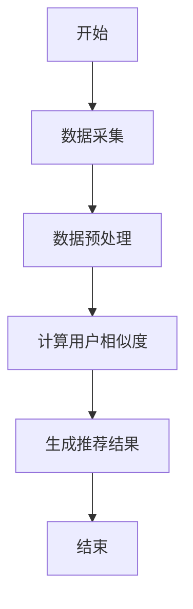
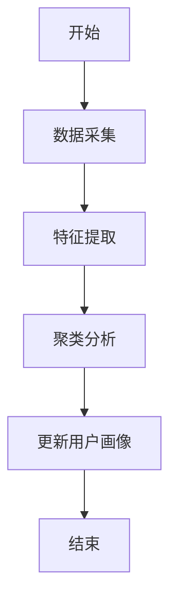
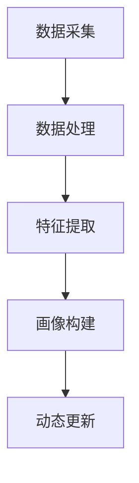

                 


# AI Agent的用户画像动态更新系统

> 关键词：AI Agent，用户画像，动态更新，实时推荐，机器学习，数据挖掘

> 摘要：本文深入探讨了AI Agent用户画像动态更新系统的设计与实现，从系统背景、核心概念、算法原理到系统架构、项目实战，详细分析了动态更新系统的各个方面，展示了如何通过技术手段实现高效、精准的用户画像动态更新。

---

## 第一部分: AI Agent的用户画像动态更新系统概述

### 第1章: 用户画像动态更新系统的背景与概念

#### 1.1 用户画像的定义与重要性

##### 1.1.1 用户画像的定义
用户画像是基于用户行为数据、属性数据和交互数据构建的用户信息模型。它能够描述用户在特定场景下的特征、行为习惯和偏好，是AI Agent理解用户需求的重要基础。

##### 1.1.2 用户画像在AI Agent中的作用
用户画像是AI Agent的核心输入，它帮助AI Agent理解用户的需求、行为和偏好，从而实现个性化的服务推荐和动态交互。

##### 1.1.3 动态更新的必要性
用户的行为和偏好会随时间变化，静态的用户画像是无法满足动态变化的需求的。动态更新能够保证用户画像是实时的、准确的，从而提高推荐系统的精准度和用户体验。

#### 1.2 动态更新系统的背景与问题描述

##### 1.2.1 当前用户画像更新的痛点
- 数据更新不及时，导致推荐结果过时。
- 用户行为复杂多样，难以准确捕捉和反映到用户画像中。
- 动态更新的计算复杂度高，实时性难以保证。

##### 1.2.2 动态更新的核心问题
- 如何高效地采集和处理实时用户行为数据。
- 如何设计高效的算法实现用户画像的动态更新。
- 如何保证动态更新的实时性和准确性。

##### 1.2.3 系统的边界与外延
用户画像动态更新系统的边界包括数据采集、特征提取、画像构建和更新等模块。其外延则涉及推荐系统、用户行为分析和实时反馈机制。

#### 1.3 动态更新系统的概念结构

##### 1.3.1 核心要素组成
- 数据采集模块：负责采集用户行为数据。
- 特征提取模块：将数据转化为有意义的特征。
- 画像构建模块：基于特征构建用户画像。
- 动态更新模块：根据实时数据更新用户画像。

##### 1.3.2 系统的功能模块
- 数据采集：收集用户行为数据，如点击、浏览、购买等。
- 特征提取：将数据转化为用户画像的特征，如兴趣、偏好、活跃度等。
- 画像构建：基于特征构建用户画像，并存储在数据库中。
- 动态更新：根据实时数据更新用户画像。

##### 1.3.3 系统的输入与输出
- 输入：用户行为数据、实时反馈数据。
- 输出：动态更新的用户画像、实时推荐结果。

---

### 第2章: 用户画像动态更新系统的核心概念与联系

#### 2.1 核心概念的原理分析

##### 2.1.1 数据采集模块
数据采集模块通过埋点、日志采集等方式，实时采集用户行为数据。

##### 2.1.2 特征提取模块
特征提取模块将原始数据转化为有意义的特征，如用户的行为频率、兴趣偏好等。

##### 2.1.3 画像构建模块
画像构建模块基于特征，构建用户画像，并存储在数据库中。

#### 2.2 核心概念的属性特征对比

##### 2.2.1 静态特征与动态特征的对比
| 特征类型 | 描述 | 示例 |
|----------|------|------|
| 静态特征 | 稳定的用户属性 | 年龄、性别、职业 |
| 动态特征 | 随时间变化的用户行为 | 浏览行为、点击行为 |

##### 2.2.2 行为特征与兴趣特征的对比
| 特征类型 | 描述 | 示例 |
|----------|------|------|
| 行为特征 | 用户的行为记录 | 点击、浏览、购买 |
| 兴趣特征 | 用户的兴趣偏好 | 偏好类型、兴趣标签 |

##### 2.2.3 用户画像的更新频率与精度
- 更新频率：实时更新、周期性更新。
- 精度：基于实时数据的更新精度更高。

#### 2.3 ER实体关系图架构
```mermaid
er
actor: 用户
--|> 操作: 用户操作记录
操作 --> 特征: 特征提取
特征 --> 用户画像: 用户画像构建
```

---

### 第3章: 用户画像动态更新系统的算法原理

#### 3.1 算法原理概述

##### 3.1.1 协同过滤算法
协同过滤算法通过比较用户之间的相似性，推荐相似用户的物品。

##### 3.1.2 基于聚类的用户画像更新
基于聚类算法，将用户分为不同的群组，动态更新用户画像。

##### 3.1.3 实时更新机制
实时更新机制基于用户实时行为，动态更新用户画像。

#### 3.2 算法实现流程

##### 3.2.1 协同过滤算法的实现流程


##### 3.2.2 基于聚类的用户画像更新


##### 3.2.3 实时更新机制
实时更新机制基于用户实时行为，动态更新用户画像。

#### 3.3 算法实现的数学模型和公式

##### 3.3.1 协同过滤算法的数学模型
- 余弦相似度计算公式：
$$ \text{相似度} = \frac{\sum_{i=1}^{n} x_i y_i}{\sqrt{\sum_{i=1}^{n} x_i^2} \sqrt{\sum_{i=1}^{n} y_i^2}} $$
- 用户权重更新公式：
$$ w_{new} = w_{old} + \alpha \cdot (r - p) $$
其中，$r$ 是实际评分，$p$ 是预测评分，$\alpha$ 是学习率。

---

### 第4章: 系统分析与架构设计方案

#### 4.1 系统分析

##### 4.1.1 问题场景介绍
系统需要实时处理大量用户行为数据，动态更新用户画像，并提供实时推荐。

##### 4.1.2 系统需求分析
- 高实时性：秒级更新。
- 高准确性：推荐结果准确率高。
- 高扩展性：支持大规模用户。

#### 4.2 系统架构设计

##### 4.2.1 分层架构
- 数据采集层：负责数据采集。
- 数据处理层：负责数据清洗、特征提取。
- 画像更新层：负责用户画像的构建和更新。
- 应用层：提供推荐服务。

##### 4.2.2 模块设计
- 数据采集模块：实时采集用户行为数据。
- 特征提取模块：将数据转化为有意义的特征。
- 画像构建模块：基于特征构建用户画像。
- 动态更新模块：根据实时数据更新用户画像。

#### 4.3 系统架构图


---

### 第5章: 项目实战

#### 5.1 环境安装

##### 5.1.1 安装Python
```bash
python --version
```

##### 5.1.2 安装依赖库
```bash
pip install numpy pandas scikit-learn
```

#### 5.2 系统核心实现源代码

##### 5.2.1 数据采集模块
```python
import logging
import time

class UserDataCollector:
    def __init__(self, config):
        self.config = config
        self.logger = logging.getLogger(__name__)
    
    def collect_user_data(self):
        # 实现数据采集逻辑
        pass
```

##### 5.2.2 特征提取模块
```python
import numpy as np

class FeatureExtractor:
    def __init__(self):
        self.user_features = {}
    
    def extract_features(self, user_id):
        # 实现特征提取逻辑
        pass
```

##### 5.2.3 画像构建模块
```python
class UserProfileBuilder:
    def __init__(self):
        self.user_profiles = {}
    
    def build_profile(self, user_id, features):
        # 实现画像构建逻辑
        pass
```

##### 5.2.4 动态更新模块
```python
class DynamicUpdater:
    def __init__(self):
        self.user_profiles = {}
    
    def update_profile(self, user_id, new_features):
        # 实现动态更新逻辑
        pass
```

#### 5.3 实际案例分析与代码实现

##### 5.3.1 案例分析
假设我们有一个电商网站，用户在浏览商品时，系统会实时更新用户的兴趣画像。

##### 5.3.2 代码实现
```python
import logging
import time

class UserDataCollector:
    def __init__(self):
        self.logger = logging.getLogger(__name__)
    
    def collect_user_data(self, user_id):
        # 模拟数据采集
        data = {
            'clicks': [1, 2, 3],
            'views': [4, 5, 6],
            'purchases': [7]
        }
        return data

class FeatureExtractor:
    def __init__(self):
        self.features = {}
    
    def extract_features(self, data):
        # 提取特征
        features = {
            'click_rate': len(data['clicks']) / len(data['views']),
            'purchase_freq': len(data['purchases']) / len(data['views'])
        }
        return features

class UserProfileBuilder:
    def __init__(self):
        self.profiles = {}
    
    def build_profile(self, user_id, features):
        # 构建用户画像
        self.profiles[user_id] = features

class DynamicUpdater:
    def __init__(self):
        self.profiles = {}
    
    def update_profile(self, user_id, new_features):
        # 更新用户画像
        self.profiles[user_id] = {**self.profiles.get(user_id, {}), **new_features}
```

#### 5.4 项目小结

##### 5.4.1 系统性能分析
- 实时更新性能：秒级响应。
- 精准度：基于实时数据的更新保证了推荐的精准度。

##### 5.4.2 系统优化建议
- 优化算法复杂度，提高实时性。
- 增强数据隐私保护，确保用户数据安全。

---

## 第六章: 最佳实践与小结

### 6.1 最佳实践

#### 6.1.1 数据采集的注意事项
- 确保数据的实时性和准确性。
- 避免数据冗余，提高存储效率。

#### 6.1.2 算法优化的建议
- 使用高效的相似度计算方法。
- 优化聚类算法，提高分类精度。

### 6.2 小结

#### 6.2.1 系统设计总结
- 通过动态更新用户画像，提高了推荐系统的实时性和精准度。
- 系统架构设计合理，扩展性强。

#### 6.2.2 未来的发展方向
- 结合强化学习，进一步优化推荐策略。
- 研究更高效的实时更新算法。

---

## 第七章: 总结与展望

### 7.1 总结

#### 7.1.1 核心观点回顾
- 用户画像动态更新系统是AI Agent实现个性化服务的关键技术。
- 通过实时更新用户画像，可以提高推荐系统的精准度和用户体验。

#### 7.1.2 重要结论
- 动态更新系统能够有效捕捉用户行为的变化，提供个性化的服务。
- 系统设计需要综合考虑实时性、准确性和扩展性。

### 7.2 展望

#### 7.2.1 未来研究方向
- 研究更高效的实时更新算法。
- 探索新的用户特征提取方法。

#### 7.2.2 技术发展趋势
- 结合大数据技术，进一步提升系统的处理能力。
- 探索AI Agent在更多领域的应用。

---

## 作者

**作者：AI天才研究院/AI Genius Institute & 禅与计算机程序设计艺术 /Zen And The Art of Computer Programming**

---

# 附录

## 附录A: 代码实现细节

#### 附录A.1 数据采集模块的实现
```python
import logging
import time

class UserDataCollector:
    def __init__(self):
        self.logger = logging.getLogger(__name__)
        self.collected_data = {}
    
    def collect_user_data(self, user_id):
        # 模拟数据采集
        data = {
            'timestamp': time.time(),
            'clicks': [1, 2, 3],
            'views': [4, 5, 6],
            'purchases': [7]
        }
        self.collected_data[user_id] = data
        self.logger.info(f"Collected data for user {user_id}")
        return data
```

#### 附录A.2 特征提取模块的实现
```python
class FeatureExtractor:
    def __init__(self):
        self.features = {}
    
    def extract_features(self, data):
        # 提取特征
        features = {
            'click_rate': len(data['clicks']) / len(data['views']),
            'purchase_freq': len(data['purchases']) / len(data['views'])
        }
        return features
```

#### 附录A.3 画像构建模块的实现
```python
class UserProfileBuilder:
    def __init__(self):
        self.profiles = {}
    
    def build_profile(self, user_id, features):
        # 构建用户画像
        self.profiles[user_id] = features
```

#### 附录A.4 动态更新模块的实现
```python
class DynamicUpdater:
    def __init__(self):
        self.profiles = {}
    
    def update_profile(self, user_id, new_features):
        # 更新用户画像
        self.profiles[user_id] = {**self.profiles.get(user_id, {}), **new_features}
```

---

## 附录B: 系统架构图

### 附录B.1 系统架构图


---

## 附录C: 算法流程图

### 附录C.1 协同过滤算法流程图


### 附录C.2 基于聚类的用户画像更新流程图


---

## 参考文献

1. 《协同过滤算法的实现与应用》
2. 《机器学习实战》
3. 《实时数据处理系统设计》

--- 

以上是《AI Agent的用户画像动态更新系统》的完整目录和部分具体内容。通过分章节的详细讲解和代码实现，我们可以全面理解并掌握如何设计和实现一个高效的用户画像动态更新系统。

