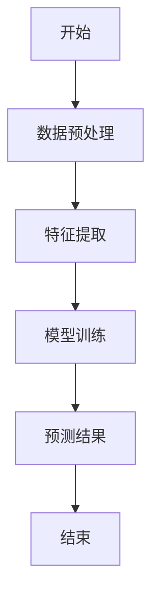
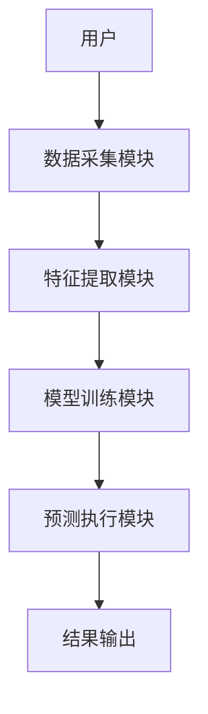
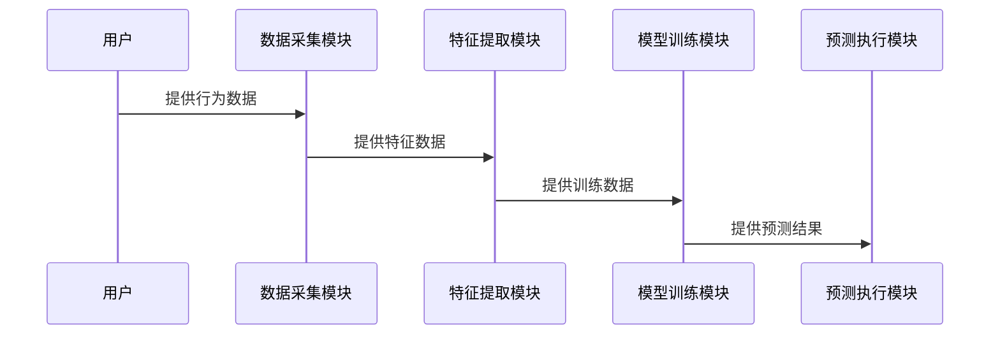

                 


---

# AI Agent的用户行为分析与预测系统

> 关键词：AI Agent，用户行为分析，预测系统，机器学习，数据挖掘，系统架构

> 摘要：本文系统地探讨了AI Agent在用户行为分析与预测中的应用，从理论基础到实际应用，详细分析了AI Agent的工作原理、算法实现、系统架构以及项目实战。通过丰富的案例和详细的代码示例，本文为读者提供了全面的技术指导和实践参考。

---

## 第1章: AI Agent的背景与概念

### 1.1 问题背景与描述

#### 1.1.1 用户行为分析的必要性
用户行为分析是理解用户需求、优化产品体验和提升商业决策的重要手段。通过分析用户的点击、浏览、购买等行为数据，企业可以更好地理解用户行为模式，从而制定更有效的市场策略。

#### 1.1.2 用户行为预测的挑战
用户行为预测具有一定的难度，主要体现在数据的多样性、噪声和不确定性。用户行为受到多种因素的影响，包括用户自身的特点、外部环境的变化以及时间的推移等。这些因素使得用户行为预测成为一个复杂的任务。

#### 1.1.3 AI Agent在行为分析中的作用
AI Agent（智能体）是一种能够感知环境、自主决策并执行任务的智能系统。在用户行为分析与预测中，AI Agent可以通过实时数据采集、特征提取和模型预测，帮助我们更好地理解和预测用户的下一步行为。

### 1.2 问题解决与边界

#### 1.2.1 AI Agent的核心问题解决方法
AI Agent通过机器学习、自然语言处理和大数据分析等技术，能够实时捕捉用户的动态行为，并通过模型预测用户未来的行为。这使得AI Agent成为用户行为分析与预测的重要工具。

#### 1.2.2 用户行为分析的边界与外延
用户行为分析的边界包括数据的采集范围、分析的时间窗口以及预测的范围。外延则涉及从单一用户分析扩展到群体行为分析，从简单的预测扩展到行为模拟和干预。

#### 1.2.3 系统的组成部分与核心要素
AI Agent的用户行为分析与预测系统主要包括数据采集模块、特征提取模块、模型训练模块和预测执行模块。这些模块共同构成了一个完整的用户行为分析与预测系统。

### 1.3 概念结构与核心要素

#### 1.3.1 用户行为分析的基本概念
用户行为分析是指通过收集和分析用户在系统中的行为数据，挖掘用户的行为模式和特征。常见的用户行为数据包括点击流数据、浏览数据、购买数据等。

#### 1.3.2 AI Agent的核心要素
AI Agent的核心要素包括感知能力、决策能力和执行能力。感知能力负责采集和理解用户行为数据，决策能力负责基于数据进行预测和决策，执行能力负责根据决策结果执行相应的操作。

#### 1.3.3 系统架构与核心流程
用户行为分析与预测系统的架构通常包括数据采集层、数据处理层、模型训练层和预测执行层。核心流程包括数据采集、特征提取、模型训练和预测执行。

### 1.4 本章小结
本章介绍了AI Agent在用户行为分析与预测中的背景、核心概念和系统架构。通过对问题背景的分析，我们明确了AI Agent在用户行为分析中的重要作用，并为后续章节的展开奠定了基础。

---

## 第2章: AI Agent的核心概念与联系

### 2.1 核心概念原理

#### 2.1.1 用户行为分析的基本原理
用户行为分析的基本原理包括数据采集、特征提取和模式挖掘。数据采集是获取用户行为数据的关键步骤，特征提取是将数据转换为可分析的特征，模式挖掘则是通过算法发现用户行为中的规律。

#### 2.1.2 AI Agent的工作原理
AI Agent的工作原理包括感知、决策和执行三个阶段。感知阶段通过传感器或数据接口获取环境信息，决策阶段通过算法对信息进行处理并生成决策，执行阶段通过执行器将决策转化为实际操作。

#### 2.1.3 数据驱动的预测机制
数据驱动的预测机制通过机器学习算法，利用历史数据训练模型，并基于模型对未来的用户行为进行预测。这种机制能够有效地捕捉用户行为的模式和趋势。

### 2.2 核心概念属性对比

#### 2.2.1 用户行为特征的属性对比
用户行为特征可以从多个维度进行对比，包括时间维度、空间维度、行为类型维度等。这些对比可以帮助我们更好地理解用户行为的复杂性。

#### 2.2.2 AI Agent功能的对比分析
AI Agent的功能包括数据采集、特征提取、模型训练和预测执行。不同功能之间的对比分析可以帮助我们更好地理解AI Agent的工作流程和功能模块。

#### 2.2.3 系统性能指标的对比
系统性能指标可以从准确率、召回率、F1值等角度进行对比。这些对比可以帮助我们评估不同算法和系统在用户行为预测中的表现。

### 2.3 ER实体关系图

```mermaid
er
    User {
        id: integer
        name: string
        timestamp: datetime
    }
    Behavior {
        id: integer
        type: string
        timestamp: datetime
    }
    Interaction {
        user_id: integer
        behavior_id: integer
        agent_id: integer
    }
```

### 2.4 本章小结
本章详细分析了AI Agent的核心概念和工作原理，并通过实体关系图展示了用户行为分析与预测系统的数据模型。通过对核心概念的深入理解，我们可以更好地设计和实现用户行为分析与预测系统。

---

## 第3章: AI Agent的算法原理

### 3.1 算法原理概述

#### 3.1.1 数据预处理
数据预处理是用户行为分析与预测的第一步，主要包括数据清洗、数据转换和数据标准化。这些步骤能够有效地减少数据中的噪声，提高模型的预测精度。

#### 3.1.2 特征提取
特征提取是将原始数据转换为具有代表性的特征的过程。常用的特征提取方法包括统计特征提取、时间序列特征提取和基于机器学习的特征提取。

#### 3.1.3 模型训练
模型训练是通过机器学习算法对特征数据进行训练，生成能够预测用户行为的模型。常用的模型包括决策树、随机森林、支持向量机和神经网络等。

### 3.2 算法流程图



### 3.3 算法实现代码

```python
import pandas as pd
from sklearn.tree import DecisionTreeClassifier
from sklearn.metrics import accuracy_score

# 数据预处理
data = pd.read_csv('user_behavior.csv')
X = data.drop('target', axis=1)
y = data['target']

# 特征提取
features = X.columns

# 模型训练
model = DecisionTreeClassifier()
model.fit(X, y)

# 预测结果
y_pred = model.predict(X)
print('准确率:', accuracy_score(y, y_pred))
```

### 3.4 数学模型与公式

$$
\text{准确率} = \frac{\text{正确预测的数量}}{\text{总预测数量}}
$$

$$
\text{召回率} = \frac{\text{正确预测的正例数量}}{\text{实际的正例数量}}
$$

### 3.5 本章小结
本章详细介绍了AI Agent的算法原理，包括数据预处理、特征提取和模型训练的步骤。通过具体的代码示例和数学公式的推导，读者可以更好地理解算法的实现过程。

---

## 第4章: 系统分析与架构设计

### 4.1 问题场景介绍

#### 4.1.1 用户行为分析的典型场景
用户行为分析的典型场景包括电子商务平台的用户行为分析、社交媒体的用户行为分析以及在线教育平台的用户行为分析。

#### 4.1.2 项目背景介绍
本项目旨在通过AI Agent实现用户行为的实时分析与预测，帮助企业在实际场景中优化用户体验和提升商业决策的准确性。

### 4.2 系统功能设计

#### 4.2.1 系统功能模块
系统功能模块包括数据采集模块、特征提取模块、模型训练模块和预测执行模块。每个模块都有其特定的功能和实现方式。

#### 4.2.2 系统功能流程
系统功能流程包括数据采集、特征提取、模型训练和预测执行四个步骤。每个步骤之间通过数据流进行连接，确保系统的高效运行。

### 4.3 系统架构设计

#### 4.3.1 系统架构图



#### 4.3.2 系统组件与功能
系统组件包括数据采集模块、特征提取模块、模型训练模块和预测执行模块。每个模块都有其特定的功能和实现方式。

#### 4.3.3 系统接口设计
系统接口设计包括数据接口、模型接口和结果接口。数据接口负责数据的输入和输出，模型接口负责模型的训练和预测，结果接口负责结果的展示和输出。

### 4.4 系统交互设计

#### 4.4.1 系统交互流程图



### 4.5 本章小结
本章详细分析了AI Agent用户行为分析与预测系统的系统架构设计，包括功能模块、架构图和交互流程图。通过对系统的深入理解，我们可以更好地设计和实现用户行为分析与预测系统。

---

## 第5章: 项目实战

### 5.1 环境配置

#### 5.1.1 开发环境
开发环境包括Python编程语言、Jupyter Notebook和相关库的安装。常用库包括pandas、numpy、scikit-learn和xgboost等。

#### 5.1.2 数据集准备
数据集可以从公开数据集获取，如Kaggle平台提供的用户行为数据集。数据集通常包括用户ID、行为类型、时间戳和目标变量等字段。

### 5.2 系统核心实现

#### 5.2.1 数据采集模块
数据采集模块负责从数据库或其他数据源获取用户行为数据。代码示例如下：

```python
import pymysql

# 数据库连接
conn = pymysql.connect(host='localhost', user='root', password='password', db='user_behavior')
cursor = conn.cursor()

# 数据查询
cursor.execute('SELECT * FROM user_behavior LIMIT 1000')
data = cursor.fetchall()

# 数据存储
df = pd.DataFrame(data)
df.to_csv('user_behavior.csv', index=False)
```

#### 5.2.2 特征提取模块
特征提取模块负责将原始数据转换为具有代表性的特征。代码示例如下：

```python
from sklearn.preprocessing import StandardScaler

# 数据标准化
scaler = StandardScaler()
X_scaled = scaler.fit_transform(X)
```

#### 5.2.3 模型训练模块
模型训练模块负责基于特征数据训练预测模型。代码示例如下：

```python
from sklearn.ensemble import RandomForestClassifier

# 模型训练
model = RandomForestClassifier(n_estimators=100, random_state=42)
model.fit(X_scaled, y)
```

#### 5.2.4 预测执行模块
预测执行模块负责基于训练好的模型进行用户行为的实时预测。代码示例如下：

```python
# 预测结果
y_pred = model.predict(X_test_scaled)
print('预测结果:', y_pred)
```

### 5.3 案例分析与结果解读

#### 5.3.1 实际案例分析
以电子商务平台的用户行为预测为例，分析用户在浏览商品、点击商品和加入购物车等行为中的模式和趋势。

#### 5.3.2 结果展示与解读
通过混淆矩阵和分类报告展示模型的预测结果，并对结果进行解读和分析。

### 5.4 项目总结
本项目通过实际案例展示了AI Agent在用户行为分析与预测中的应用。通过对系统的详细实现和结果分析，我们可以看到AI Agent在提升用户体验和商业决策中的重要作用。

---

## 第6章: 最佳实践与注意事项

### 6.1 最佳实践

#### 6.1.1 数据质量管理
数据质量管理是用户行为分析与预测系统成功的关键。建议在数据预处理阶段，对数据进行严格的清洗和标准化，以提高模型的预测精度。

#### 6.1.2 模型选择与优化
模型选择与优化是提高系统性能的重要步骤。建议在模型训练阶段，尝试不同的算法和参数组合，找到最优的模型配置。

#### 6.1.3 系统安全与隐私保护
用户行为分析与预测系统的安全性和隐私保护是不可忽视的重要问题。建议在系统设计阶段，充分考虑数据的安全性和用户隐私的保护。

### 6.2 小结
通过对最佳实践的总结，我们可以更好地设计和实现用户行为分析与预测系统，确保系统的高效性和安全性。

### 6.3 注意事项

#### 6.3.1 数据隐私问题
在处理用户行为数据时，必须遵守相关法律法规，确保用户数据的隐私和安全。

#### 6.3.2 模型的可解释性
模型的可解释性是用户行为分析与预测系统的重要特征。建议在模型设计阶段，充分考虑模型的可解释性，以便更好地理解和优化系统。

#### 6.3.3 系统的实时性
用户的实时行为分析与预测需要系统的高效性和实时性。建议在系统设计阶段，充分考虑系统的实时性，确保系统的快速响应。

### 6.4 拓展阅读
建议读者进一步阅读相关领域的最新研究，如强化学习在用户行为预测中的应用，以及图神经网络在用户行为分析中的应用。

---

## 第7章: 总结与展望

### 7.1 本章总结
本章总结了全文的主要内容，回顾了AI Agent在用户行为分析与预测中的核心概念、算法原理和系统架构设计。

### 7.2 未来展望
随着人工智能技术的不断发展，AI Agent在用户行为分析与预测中的应用前景广阔。未来的研究方向包括模型的可解释性、系统的实时性和多模态数据的融合等。

---

## 作者：AI天才研究院/AI Genius Institute & 禅与计算机程序设计艺术 /Zen And The Art of Computer Programming

---

这篇文章系统地探讨了AI Agent在用户行为分析与预测中的应用，从理论基础到实际应用，详细分析了AI Agent的工作原理、算法实现、系统架构以及项目实战。通过丰富的案例和详细的代码示例，本文为读者提供了全面的技术指导和实践参考。希望本文能够帮助读者更好地理解AI Agent在用户行为分析与预测中的重要作用，并为实际应用提供有益的参考。

