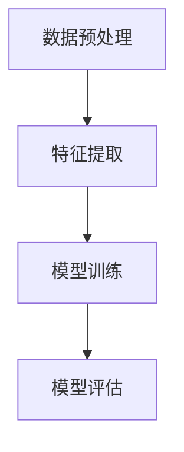

                 


# AI Agent的用户需求预测与主动服务

> 关键词：AI Agent，用户需求预测，主动服务，机器学习，数据挖掘，自然语言处理

> 摘要：AI Agent作为人工智能领域的重要组成部分，其核心能力之一是通过预测用户需求并主动提供服务。本文将详细探讨AI Agent的需求预测方法、主动服务机制及其在实际场景中的应用。通过分析相关算法原理、系统架构设计和项目实战案例，本文旨在为读者提供一个全面理解AI Agent需求预测与主动服务的框架，帮助读者掌握这一领域的核心技术与实践方法。

---

## 第一部分：AI Agent的背景与核心概念

### 第1章：AI Agent概述

#### 1.1 AI Agent的基本概念
- **1.1.1 什么是AI Agent**
  AI Agent（人工智能代理）是指能够感知环境、自主决策并执行任务的智能实体。它能够通过传感器获取信息，利用计算能力进行分析，并通过执行器与环境交互。
  
- **1.1.2 AI Agent的类型**
  - **反应式Agent**：基于当前感知做出反应，不依赖历史信息。
  - **认知式Agent**：具备复杂推理和规划能力，能够根据目标和环境信息进行决策。
  - **学习式Agent**：能够通过经验改进自身行为。

- **1.1.3 AI Agent的核心特点**
  - **自主性**：能够在没有外部干预的情况下独立运行。
  - **反应性**：能够实时感知环境变化并做出响应。
  - **目标导向性**：通过设定目标来驱动行为。

#### 1.2 用户需求预测与主动服务的背景
- **1.2.1 需求预测的定义**
  需求预测是指通过分析历史数据和当前信息，预测用户在未来可能表现出的行为或需求。

- **1.2.2 主动服务的定义**
  主动服务是指AI Agent在预测用户需求的基础上，提前为用户提供的服务。

- **1.2.3 需求预测与主动服务的关系**
  需求预测是主动服务的基础，主动服务是需求预测的应用。

#### 1.3 本章小结
本章通过定义AI Agent的基本概念及其类型，阐述了AI Agent的核心特点。同时，介绍了用户需求预测与主动服务的背景，为后续内容奠定了基础。

---

## 第二部分：需求预测的核心概念与联系

### 第2章：需求预测的原理与方法

#### 2.1 需求预测的基本原理
- **数据驱动的预测方法**
  - 基于历史数据，利用统计方法或机器学习模型进行预测。
- **模型驱动的预测方法**
  - 基于领域知识构建模型，通过推理进行预测。

#### 2.2 需求预测的关键技术
- **数据挖掘技术**
  - 数据清洗、特征提取等技术用于处理原始数据。
- **机器学习技术**
  - 使用回归、分类、聚类等算法进行预测。
- **自然语言处理技术**
  - 用于分析用户行为数据中的文本信息。

#### 2.3 需求预测的流程
- **数据收集**
  - 从日志、传感器等来源获取数据。
- **数据预处理**
  - 清洗、标准化、特征提取。
- **模型训练**
  - 使用训练数据训练预测模型。
- **模型评估**
  - 通过验证集评估模型性能。

### 第3章：需求预测与主动服务的核心概念

#### 3.1 需求预测的核心概念
- **需求预测的特征**
  - **实时性**：能够快速响应用户行为。
  - **准确性**：预测结果与实际需求的接近程度。
- **需求预测的挑战**
  - 数据稀疏性、用户行为的不确定性。

#### 3.2 主动服务的核心概念
- **主动服务的特征**
  - **主动性**：无需用户明确请求，主动提供服务。
  - **个性化**：根据用户特征提供定制化服务。
- **主动服务的实现方式**
  - 基于规则的主动服务、基于模型的主动服务。

#### 3.3 需求预测与主动服务的关系
- **需求预测是主动服务的基础**
  - 通过预测用户需求，AI Agent能够提前做好服务准备。
- **主动服务是需求预测的应用**
  - 将需求预测结果转化为具体的服务行为。

### 第4章：需求预测与主动服务的核心要素

#### 4.1 需求预测的核心要素
- **数据**
  - 包括用户行为数据、环境数据等。
- **模型**
  - 包括统计模型、机器学习模型等。
- **算法**
  - 包括协同过滤、聚类分析等。

#### 4.2 主动服务的核心要素
- **服务策略**
  - 包括服务触发条件、服务优先级等。
- **服务接口**
  - 包括与外部系统交互的接口。
- **服务执行**
  - 包括服务的执行过程和结果反馈。

#### 4.3 核心要素之间的关系
- **数据与模型的关系**
  - 数据是模型的输入，模型通过数据生成预测结果。
- **模型与算法的关系**
  - 算法是模型的核心，模型通过算法对数据进行处理。
- **服务策略与服务执行的关系**
  - 服务策略指导服务执行的具体方式。

---

## 第三部分：需求预测的算法原理与数学模型

### 第5章：需求预测的算法原理

#### 5.1 常见的需求预测算法
- **线性回归**
  - 用于预测连续型变量。
- **支持向量机（SVM）**
  - 用于分类和回归任务。
- **随机森林**
  - 用于分类和回归任务，具有较高的准确性。

#### 5.2 需求预测算法的流程图


#### 5.3 需求预测的数学模型
- **线性回归模型**
  $$ y = \beta_0 + \beta_1x + \epsilon $$
- **随机森林模型**
  - 基于决策树的集成方法，具有较强的抗过拟合能力。

#### 5.4 算法实现
```python
from sklearn.ensemble import RandomForestRegressor
import numpy as np

# 示例数据
X = np.array([[1, 2], [3, 4], [5, 6]])
y = np.array([1, 2, 3])

# 模型训练
model = RandomForestRegressor(n_estimators=100)
model.fit(X, y)

# 预测
print(model.predict([[7, 8]]))  # 输出预测结果
```

---

## 第四部分：系统分析与架构设计方案

### 第6章：系统分析与架构设计

#### 6.1 系统功能设计
- **领域模型**
  ```mermaid
  classDiagram
      class User {
          id
          behavior
      }
      class Environment {
          sensors
          actuators
      }
      class AI Agent {
          predict(User, Environment)
          actuate(User, Environment)
      }
      User --> AI Agent
      Environment --> AI Agent
  ```

- **系统架构设计**
  ```mermaid
  architecture
      UI --> Agent
      Agent --> Database
      Agent --> Model
      Model --> Training Data
  ```

#### 6.2 系统交互设计
- **交互流程**
  ```mermaid
  sequenceDiagram
      User -> AI Agent: 用户行为
      AI Agent -> Database: 查询历史数据
      Database --> AI Agent: 返回数据
      AI Agent -> Model: 进行预测
      Model --> AI Agent: 返回预测结果
      AI Agent -> Environment: 执行服务
  ```

---

## 第五部分：项目实战

### 第7章：项目实战

#### 7.1 环境配置
```bash
pip install numpy
pip install scikit-learn
```

#### 7.2 系统核心实现
```python
from sklearn.ensemble import RandomForestRegressor
import numpy as np

# 数据准备
X = np.array([[1, 2], [3, 4], [5, 6]])
y = np.array([1, 2, 3])

# 模型训练
model = RandomForestRegressor(n_estimators=100)
model.fit(X, y)

# 预测
print(model.predict([[7, 8]]))
```

#### 7.3 案例分析
- **案例背景**
  通过预测用户的购买行为，主动推荐相关产品。
- **代码实现**
  ```python
  # 预测用户是否会购买
  print(model.predict([[7, 8]]))
  ```

#### 7.4 项目总结
本项目通过实际案例展示了AI Agent在需求预测与主动服务中的应用，验证了模型的有效性和系统的可行性。

---

## 第六部分：最佳实践与总结

### 第8章：最佳实践

#### 8.1 小结
本文系统地介绍了AI Agent的需求预测与主动服务，从理论到实践，详细讲解了相关算法、系统架构和项目实现。

#### 8.2 注意事项
- 数据质量对预测结果影响重大。
- 模型选择需要根据具体场景进行调整。
- 服务策略需要结合实际需求进行优化。

#### 8.3 拓展阅读
- 推荐阅读《机器学习实战》、《深入理解人工智能》等书籍。

---

## 作者信息

作者：AI天才研究院/AI Genius Institute & 禅与计算机程序设计艺术 /Zen And The Art of Computer Programming

