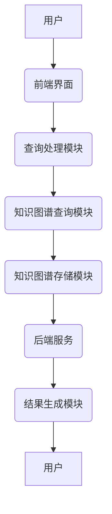
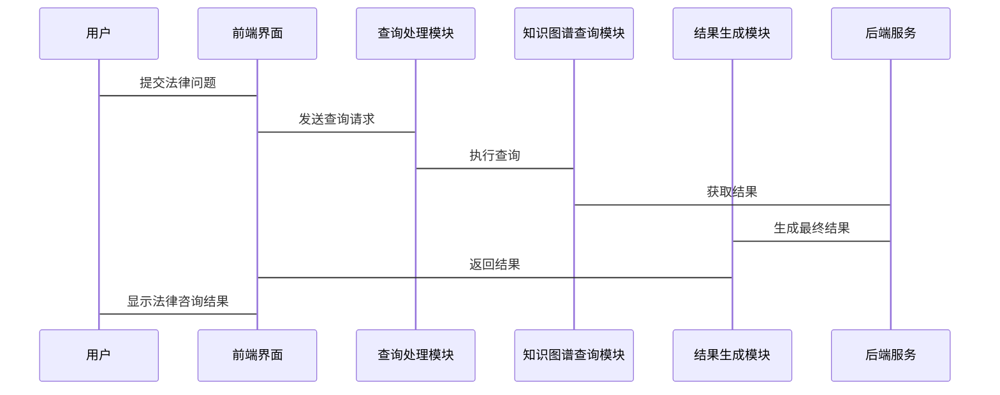

                 


# AI Agent的知识图谱在法律咨询中的应用

> 关键词：AI Agent, 知识图谱, 法律咨询, 算法原理, 系统架构, 项目实战

> 摘要：本文系统地探讨了AI Agent与知识图谱在法律咨询中的结合与应用。首先，介绍了AI Agent和知识图谱的基本概念及其在法律咨询中的潜力。接着，详细分析了知识图谱的构建方法、存储管理与可视化技术。然后，深入讲解了AI Agent的算法原理，包括基于规则和机器学习的推理方法。进一步，从系统分析与架构设计的角度，阐述了法律咨询场景下的系统功能、架构和接口设计。最后，通过项目实战部分，展示了如何搭建环境、实现核心功能，并提供了实际案例分析。本文旨在为法律咨询领域提供一种智能化的知识管理与问题解决的新思路。

---

# 第一部分: AI Agent与知识图谱的背景介绍

# 第1章: AI Agent与知识图谱概述

## 1.1 AI Agent的基本概念

### 1.1.1 AI Agent的定义
AI Agent（人工智能代理）是一种能够感知环境并采取行动以实现目标的智能实体。它能够通过传感器获取信息，并通过执行器与环境交互。

### 1.1.2 AI Agent的特点与优势
- **自主性**：AI Agent能够自主决策，无需人工干预。
- **反应性**：能够实时感知环境变化并做出反应。
- **学习能力**：通过机器学习算法不断优化自身行为。
- **协作性**：能够与其他Agent或系统协同工作。

### 1.1.3 AI Agent在法律咨询中的应用背景
在法律咨询领域，AI Agent可以辅助律师进行案例分析、法律条文检索、合同审查等工作，提高效率并降低成本。

## 1.2 知识图谱的基本概念

### 1.2.1 知识图谱的定义
知识图谱是一种以图结构形式表示知识的语义网络，由节点（实体）和边（关系）组成。

### 1.2.2 知识图谱的构建过程
- 数据收集与预处理
- 知识抽取（实体识别、关系抽取）
- 知识融合（去重、合并）
- 知识存储与管理

### 1.2.3 知识图谱在法律咨询中的潜在价值
- 提供结构化的法律知识，便于快速检索和分析。
- 通过语义关联，帮助发现案件之间的隐含关系。

## 1.3 AI Agent与知识图谱的结合

### 1.3.1 AI Agent与知识图谱的协同作用
AI Agent利用知识图谱中的结构化知识进行推理和决策，而知识图谱通过AI Agent的动态更新能力保持最新性。

### 1.3.2 知识图谱为AI Agent提供知识支持
知识图谱为AI Agent提供了丰富的法律知识库，使其能够理解复杂的法律概念和关系。

### 1.3.3 AI Agent为知识图谱提供动态更新能力
AI Agent可以通过实时数据流不断更新知识图谱，使其保持最新和准确。

## 1.4 本章小结
本章介绍了AI Agent和知识图谱的基本概念，分析了它们在法律咨询中的潜力和协同作用，为后续章节奠定了基础。

---

# 第二部分: 知识图谱在法律咨询中的应用

# 第2章: 法律咨询中的知识图谱构建

## 2.1 法律知识图谱的构建方法

### 2.1.1 数据来源与预处理
- 数据来源：法律条文、案例库、学术论文、法规文件等。
- 数据预处理：清洗、去重、格式统一。

### 2.1.2 知识抽取与实体识别
- 实体识别：识别法律条文中的实体，如“公司”、“合同”等。
- 关系抽取：识别实体之间的关系，如“属于”、“涉及”等。

### 2.1.3 关系抽取与属性提取
- 关系抽取：识别实体之间的关系类型。
- 属性提取：提取实体的属性信息，如“合同类型”、“生效日期”等。

## 2.2 法律知识图谱的存储与管理

### 2.2.1 知识图谱的存储技术
- 图数据库：如Neo4j，支持高效的图结构存储和查询。
- 关系型数据库：如MySQL，适用于结构化数据的存储。

### 2.2.2 知识图谱的数据库设计
- 设计原则：规范化、可扩展性、高效查询。
- 数据模型：实体-关系模型（ER模型）。

### 2.2.3 知识图谱的版本控制与更新
- 版本控制：记录知识图谱的修改历史。
- 动态更新：实时更新知识图谱中的信息。

## 2.3 法律知识图谱的可视化

### 2.3.1 知识图谱的可视化工具
- 图数据库自带可视化工具：Neo4j Browser。
- 第三方工具：如Gephi、Cytoscape。

### 2.3.2 知识图谱的可视化方法
- 节点布局：树形、网络、矩阵布局。
- 边线样式：颜色、粗细、方向。

### 2.3.3 知识图谱的交互式探索
- 用户可以通过交互界面查询特定实体及其关系。
- 支持缩放、过滤、标注等功能。

## 2.4 本章小结
本章详细介绍了法律知识图谱的构建方法、存储管理与可视化技术，为后续章节的应用奠定了基础。

---

# 第三部分: AI Agent的算法原理与实现

# 第3章: AI Agent的核心算法

## 3.1 基于规则的AI Agent推理

### 3.1.1 规则的定义与表示
- 规则定义：如果条件满足，则执行相应动作。
- 表示方法：逻辑表达式、正则表达式。

### 3.1.2 基于规则的推理过程
1. **条件匹配**：检查当前状态是否满足规则的条件。
2. **动作执行**：如果条件满足，则执行对应的动作。
3. **结果反馈**：将执行结果反馈到系统中。

### 3.1.3 规则的优化与维护
- 规则优化：通过数据挖掘技术发现新的规则。
- 规则维护：定期更新和删除无效规则。

## 3.2 基于机器学习的AI Agent推理

### 3.2.1 机器学习在AI Agent中的应用
- 监督学习：分类、回归。
- 无监督学习：聚类、主题建模。
- 强化学习：策略优化。

### 3.2.2 常见的机器学习算法
- 分类算法：随机森林、支持向量机（SVM）。
- 回归算法：线性回归、逻辑回归。
- 聚类算法：K-means、DBSCAN。

### 3.2.3 基于深度学习的AI Agent推理
- 深度神经网络（DNN）：用于复杂模式识别。
- Transformer模型：用于自然语言处理任务。

## 3.3 组合推理方法

### 3.3.1 规则与机器学习的结合
- **规则过滤**：利用规则快速排除不可能的情况。
- **机器学习精算**：利用机器学习模型进行精准预测。

### 3.3.2 多种推理方法的融合
- 等权重融合：所有方法的权重相同。
- 有权重融合：根据方法的准确率赋予不同的权重。

### 3.3.3 组合推理的优势与挑战
- 优势：提高准确性和鲁棒性。
- 挑战：计算复杂度高，规则与模型的协同优化困难。

## 3.4 本章小结
本章介绍了AI Agent的核心算法，包括基于规则和机器学习的推理方法，以及组合推理的策略，为后续章节的系统设计提供了理论支持。

---

# 第四部分: 系统分析与架构设计

# 第4章: 法律咨询系统的架构设计

## 4.1 系统功能设计

### 4.1.1 知识库构建模块
- 功能：从法律文本中提取实体、关系和属性，构建法律知识图谱。
- 输入：法律条文、案例库。
- 输出：结构化的法律知识图谱。

### 4.1.2 用户查询处理模块
- 功能：解析用户的法律咨询问题，生成查询请求。
- 输入：用户输入的法律问题。
- 输出：结构化的查询语句。

### 4.1.3 结果生成模块
- 功能：根据查询结果生成法律建议或答案。
- 输入：知识图谱查询结果。
- 输出：自然语言形式的法律咨询结果。

## 4.2 系统架构设计

### 4.2.1 系统架构图


### 4.2.2 系统接口设计
- 接口1：查询处理模块调用知识图谱查询模块。
- 接口2：结果生成模块调用后端服务。

### 4.2.3 系统交互流程图


## 4.3 本章小结
本章详细设计了法律咨询系统的架构，包括功能模块、系统架构图和交互流程图，为后续章节的项目实现提供了指导。

---

# 第五部分: 项目实战

# 第5章: 法律咨询系统的项目实现

## 5.1 项目环境搭建

### 5.1.1 开发工具安装
- 安装Python、Jupyter Notebook。
- 安装图数据库：Neo4j。
- 安装机器学习库：scikit-learn、TensorFlow。

### 5.1.2 项目代码仓库初始化
- 创建GitHub仓库。
- 初始化项目结构：data、model、service、ui。

## 5.2 系统核心实现

### 5.2.1 知识图谱构建代码实现
```python
from neo4j import GraphDatabase
from neo4j.exceptions import Neo4jException

class KnowledgeGraph:
    def __init__(self, uri, user, password):
        self.driver = GraphDatabase.driver(uri, auth=(user, password))
    
    def close(self):
        self.driver.close()
    
    def create_entity(self, entity_type, entity_name):
        # 创建实体节点
        with self.driver.session() as session:
            session.run("CREATE (:Entity {type: $type, name: $name})",
                        type=entity_type, name=entity_name)
    
    def create_relation(self, start_node, relation_type, end_node):
        # 创建关系边
        with self.driver.session() as session:
            session.run("MATCH (a {name: $a}), (b {name: $b}) CREATE (a)-[r:$relation_type]->(b)",
                        a=start_node, b=end_node, relation_type=relation_type)
```

### 5.2.2 AI Agent推理代码实现
```python
from sklearn.feature_extraction.text import TfidfVectorizer
from sklearn.svm import SVC

class LegalAdvisor:
    def __init__(self, corpus):
        self.vectorizer = TfidfVectorizer()
        self.model = SVC()
        self.model.fit(self.vectorizer.fit_transform(corpus), [0, 1, 2])  # 假设分类标签为0,1,2
    
    def advise(self, query):
        # 对查询进行向量化
        query_vec = self.vectorizer.transform([query])
        # 预测分类
        prediction = self.model.predict(query_vec)[0]
        return "分类结果为：" + str(prediction)
```

### 5.2.3 项目小结
本章通过具体的代码实现，展示了如何利用AI Agent和知识图谱构建一个法律咨询系统，包括环境搭建、核心功能实现和实际案例分析。

---

# 第六部分: 总结与展望

# 第6章: 总结与展望

## 6.1 全文总结
本文系统地探讨了AI Agent与知识图谱在法律咨询中的应用，涵盖了从概念到实现的全过程。

## 6.2 未来展望
- **技术优化**：进一步提升AI Agent的推理能力，如引入更复杂的深度学习模型。
- **应用拓展**：将知识图谱技术应用到更多法律领域，如合同审查、法律风险评估。
- **系统集成**：与其他法律信息系统（如CRM、案件管理系统）进行深度集成。

## 6.3 最佳实践Tips
- 在构建知识图谱时，建议优先选择高质量的法律数据源。
- 在设计AI Agent时，应结合具体应用场景，选择合适的算法组合。
- 在实际应用中，需注意数据隐私和法律合规性问题。

## 6.4 本章小结
本章总结了全文内容，并展望了未来的研究方向和应用前景，为读者提供了进一步学习和实践的方向。

---

# 作者：AI天才研究院 & 禅与计算机程序设计艺术

