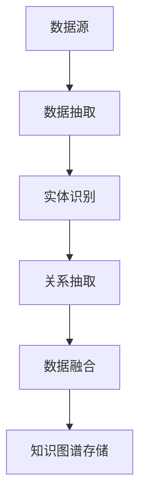
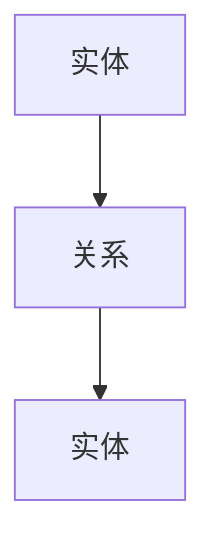

                 


# AI Agent的知识图谱在问答系统中的应用

> 关键词：AI Agent, 知识图谱, 问答系统, 知识抽取, 语义理解, 嵌入技术

> 摘要：本文探讨AI Agent如何利用知识图谱提升问答系统的性能。通过详细分析知识图谱的构建、语义理解、算法原理和系统设计，结合实战案例，展示AI Agent在问答系统中的广泛应用。

---

# 第一部分: AI Agent的知识图谱基础

## 第1章: 知识图谱与问答系统概述

### 1.1 知识图谱的基本概念

#### 1.1.1 知识图谱的定义与特点

知识图谱是一种结构化的语义知识库，由节点（实体）和边（关系）组成。节点代表实体或概念，边表示它们之间的关系。知识图谱具有语义丰富、结构化、可扩展性强的特点。

#### 1.1.2 知识图谱与传统数据库的区别

传统数据库存储的是结构化数据，关注数据的存储和查询效率，而知识图谱不仅存储数据，还建立实体间的关系，注重语义理解和关联推理。

#### 1.1.3 知识图谱的构建流程

知识图谱的构建通常包括数据抽取、清洗、实体识别、关系抽取、数据融合和存储等步骤。



### 1.2 问答系统的概述

#### 1.2.1 问答系统的定义与分类

问答系统是一种能够理解用户问题并给出准确答案的智能系统。根据技术手段，可以分为基于检索的问答系统和基于生成的问答系统。

#### 1.2.2 基于传统方法的问答系统

传统问答系统通常依赖关键词匹配和规则库，存在语义理解能力差、泛化能力弱的问题。

#### 1.2.3 基于深度学习的问答系统

基于深度学习的问答系统利用神经网络模型，能够更好地理解上下文和语义，但对知识库的依赖较大。

### 1.3 AI Agent的基本概念

#### 1.3.1 AI Agent的定义与特点

AI Agent是一种智能体，能够感知环境、执行任务并做出决策。它具有主动性、反应性、社会性和持续性等特点。

#### 1.3.2 AI Agent的应用场景

AI Agent广泛应用于智能助手、推荐系统、自动化监控等领域。

#### 1.3.3 AI Agent与知识图谱的结合

通过知识图谱，AI Agent能够进行语义理解、关联推理，从而更智能地回答问题。

---

## 第2章: 知识图谱的构建与管理

### 2.1 知识抽取与表示

#### 2.1.1 知识抽取的方法

知识抽取包括信息抽取和信息融合。信息抽取从文本中提取实体和关系，信息融合处理多源数据的一致性。

#### 2.1.2 知识表示的模型

知识表示模型包括基于符号的表示（如RDF）和基于向量的表示（如Word2Vec）。符号表示精确但计算复杂，向量表示高效但语义损失较大。

#### 2.1.3 知识图谱的存储方式

知识图谱通常存储在图数据库中，如Neo4j。存储结构包括三元组（subject, predicate, object）。



### 2.2 知识融合与推理

#### 2.2.1 知识融合的技术

知识融合包括实体对齐和关系对齐。实体对齐解决同实体不同表达的问题，关系对齐解决关系多样化的挑战。

#### 2.2.2 知识推理的算法

知识推理算法包括基于规则的推理和基于学习的推理。基于规则的推理依赖人工定义规则，而基于学习的推理利用神经网络模型自动学习推理模式。

#### 2.2.3 知识图谱的动态更新

知识图谱需要定期更新以保持准确性。动态更新包括增量式更新和全量式更新，通常结合版本控制和日志记录。

---

## 第3章: AI Agent的知识图谱应用原理

### 3.1 知识图谱的语义理解

#### 3.1.1 语义分析的基本概念

语义分析通过理解词语、句子的含义，建立文本的语义表示。

#### 3.1.2 基于知识图谱的语义理解技术

基于知识图谱的语义理解利用实体识别、关系抽取和属性抽取技术，构建语义网络，实现对文本的深度理解。

#### 3.1.3 语义理解的挑战与解决方案

语义理解面临词汇歧义、句法歧义、语用歧义等问题。解决方案包括上下文无关和上下文相关的语义理解方法。

### 3.2 基于知识图谱的问答系统

#### 3.2.1 基于知识图谱的问答系统架构

基于知识图谱的问答系统通常包括问题理解、知识查询、结果整合和答案生成四个步骤。

#### 3.2.2 基于知识图谱的问答流程

用户提问经过预处理后，转化为知识图谱查询，匹配相关实体和关系，生成答案。

#### 3.2.3 知识图谱在问答系统中的优势

知识图谱提供了丰富的语义信息，能够准确回答复杂问题，且具有良好的可解释性。

---

## 第4章: AI Agent的知识图谱算法原理

### 4.1 知识图谱嵌入技术

#### 4.1.1 知识图谱嵌入的基本概念

知识图谱嵌入将高维图结构数据映射到低维连续向量空间，便于后续计算。

#### 4.1.2 常见的知识图谱嵌入算法

常用的嵌入算法包括TransE、TransH、DistMult和ComplEx等。这些算法通过不同的方式建模实体和关系。

#### 4.1.3 嵌入技术在问答系统中的应用

嵌入技术用于问题表示和知识匹配，提升问答系统的准确性和效率。

### 4.2 基于知识图谱的问答匹配算法

#### 4.2.1 问答匹配的定义与挑战

问答匹配需要在大规模问答库中找到与用户问题语义最匹配的答案。

#### 4.2.2 基于知识图谱的问答匹配方法

基于知识图谱的问答匹配将问题和候选答案映射到知识图谱中，利用语义相似度进行匹配。

#### 4.2.3 算法实现与优化

优化方法包括负采样、对比学习和注意力机制等，提升匹配准确率。

---

## 第5章: 系统分析与架构设计

### 5.1 问题场景介绍

#### 5.1.1 问答系统的基本功能

问答系统需要实现用户提问、问题理解、知识查询、答案生成和结果展示等功能。

#### 5.1.2 AI Agent在问答系统中的角色

AI Agent作为系统的核心，负责语义理解、知识查询和结果整合。

#### 5.1.3 知识图谱在系统中的作用

知识图谱为问答系统提供语义支持，提升问答的准确性和深度。

### 5.2 系统功能设计

#### 5.2.1 知识图谱构建模块

负责知识抽取、融合和存储，确保知识图谱的准确性和完整性。

#### 5.2.2 AI Agent推理模块

负责语义分析、知识推理和结果整合，生成最终答案。

#### 5.2.3 问答交互模块

负责用户提问的接收、预处理和结果展示。

### 5.3 系统架构设计

#### 5.3.1 系统架构的分层设计

系统分为数据层、知识层、推理层和交互层，各层之间通过API进行交互。

#### 5.3.2 模块间的交互关系

用户提问经过预处理后，传递给推理模块，推理模块调用知识层进行查询，返回结果给交互模块展示。

#### 5.3.3 系统的可扩展性设计

系统采用模块化设计，支持新增知识源和推理算法，便于功能扩展。

---

## 第6章: 项目实战

### 6.1 环境安装与配置

#### 6.1.1 开发环境的选择

推荐使用Python和深度学习框架（如TensorFlow或PyTorch）。

#### 6.1.2 知识图谱构建工具的安装

安装Neo4j图数据库和相关Python客户端库。

#### 6.1.3 AI Agent框架的配置

配置自然语言处理工具如spaCy或HanLP，以及预训练语言模型如BERT。

### 6.2 系统核心实现

#### 6.2.1 知识图谱的构建代码

```python
from neo4j import GraphDatabase
from neo4j.exceptions import ServiceUnavailable

def create_entity(tx, entity_name, entity_type):
    tx.run("CREATE (:Entity {name: $name, type: $type})", name=entity_name, type=entity_type)

def create_relationship(tx, entity1, relationship, entity2):
    tx.run("MATCH (a {name: $a}), (b {name: $b}) CREATE (a)-[r:$r]->(b)", a=entity1, r=relationship, b=entity2)

if __name__ == "__main__":
    driver = GraphDatabase.driver("bolt://localhost:7687", auth=("neo4j", "password"))
    with driver.session() as session:
        session.write_transaction(create_entity, "Alice", "Person")
        session.write_transaction(create_relationship, "Alice", "knows", "Bob")
        session.write_transaction(create_entity, "Bob", "Person")
```

#### 6.2.2 AI Agent推理模块的实现

```python
import spacy

nlp = spacy.load("en_core_web_sm")

def semantic_understanding(text):
    doc = nlp(text)
    entities = [ent.text for ent in doc.ents]
    return entities

print(semantic_understanding("What is the capital of France?"))
```

### 6.3 实际案例分析

#### 6.3.1 案例背景介绍

假设我们构建了一个关于旅游景点的知识图谱，用户询问“哪些景点适合家庭游玩？”。

#### 6.3.2 系统处理流程

系统解析问题，匹配知识图谱中的景点实体和属性，生成符合条件的答案。

#### 6.3.3 结果展示

系统返回适合家庭游玩的景点列表，包括评分、地址等详细信息。

### 6.4 项目小结

通过实际案例分析，展示了知识图谱在问答系统中的应用价值和实现过程。

---

# 第七章: 总结与展望

## 7.1 全文总结

本文详细探讨了AI Agent如何利用知识图谱提升问答系统的性能，包括知识图谱的构建、语义理解、算法原理和系统设计。

## 7.2 未来展望

未来，知识图谱与问答系统的结合将更加紧密，AI Agent将在智能客服、教育辅助等领域发挥更大作用。

## 7.3 最佳实践 Tips

1. 在构建知识图谱时，建议选择合适的工具和算法，确保数据的准确性和完整性。
2. 在设计问答系统时，注意系统的可扩展性和模块化，便于后续优化和功能扩展。
3. 在实际应用中，结合具体场景需求，灵活调整系统参数和算法模型。

---

作者：AI天才研究院/AI Genius Institute & 禅与计算机程序设计艺术 /Zen And The Art of Computer Programming

