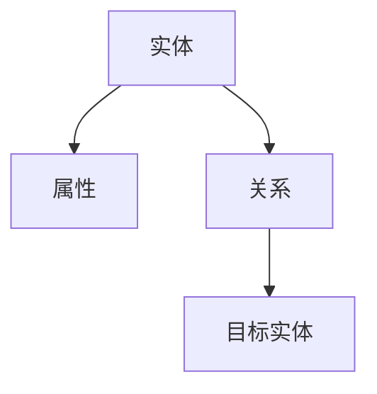
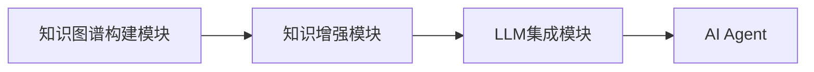

                 


# AI Agent的知识图谱增强：整合LLM与结构化知识

关键词：知识图谱，大语言模型，LLM，AI Agent，结构化知识，知识增强，语义理解

摘要：本文深入探讨了AI Agent的知识图谱增强技术，重点分析了如何整合大语言模型（LLM）与结构化知识图谱，以提升AI Agent的语义理解与知识推理能力。文章从知识图谱与LLM的基本概念出发，系统阐述了知识图谱增强的核心原理、算法实现、系统架构及项目实战，最后总结了最佳实践与未来发展方向。

---

# 第一部分: AI Agent的知识图谱增强背景与概念

## 第1章: 知识图谱与大语言模型概述

### 1.1 知识图谱的基本概念

#### 1.1.1 知识图谱的定义与特点
知识图谱是一种以结构化形式表示知识的图数据，由实体（Entity）、关系（Relation）和属性（Attribute）组成。实体代表具体的事物或概念，关系描述实体之间的关联，属性则用于描述实体的特征或状态。

- **实体（Entity）**：如“苹果”、“iPhone”、“公司”等。
- **关系（Relation）**：如“生产”、“拥有”、“位于”等。
- **属性（Attribute）**：如“品牌”、“型号”、“成立时间”等。

知识图谱的特点包括：
1. **结构化**：通过图结构清晰表示知识的关联性。
2. **可扩展性**：支持大规模知识的构建与扩展。
3. **语义丰富性**：通过实体、关系和属性的组合，提供丰富的语义信息。

#### 1.1.2 知识图谱的构建与应用
知识图谱的构建通常包括数据抽取、实体识别、关系抽取和属性抽取等步骤。其主要应用包括：
1. **搜索引擎优化**：提升搜索结果的相关性和准确性。
2. **智能问答**：基于知识图谱提供更精准的答案。
3. **推荐系统**：通过知识关联提升推荐的个性化和精准度。

#### 1.1.3 知识图谱与结构化知识的关系
知识图谱是结构化知识的一种典型形式，但结构化知识还包括其他形式，如数据库、表格数据等。知识图谱的优势在于其图结构的灵活性和语义表达能力。

### 1.2 大语言模型的基本概念

#### 1.2.1 大语言模型的定义与特点
大语言模型（Large Language Model, LLM）是指基于大规模语料库训练的深度学习模型，如GPT、BERT等。其特点包括：
1. **大规模训练数据**：通常使用数十亿甚至更多的文本数据进行训练。
2. **深度学习架构**：采用Transformer架构，具备强大的上下文理解和生成能力。
3. **多任务适应性**：通过微调（Fine-tuning）可以应用于多种NLP任务，如文本生成、问答、翻译等。

#### 1.2.2 LLM的核心技术与优势
LLM的核心技术包括：
1. **自注意力机制（Self-Attention）**：通过全局上下文信息生成语义表示。
2. **生成式模型**：能够生成自然流畅的文本。
3. **多任务学习能力**：通过共享特征提取器，可以同时处理多种任务。

#### 1.2.3 LLM与知识图谱的结合潜力
LLM擅长语义理解和生成，而知识图谱擅长结构化知识的表示与推理。两者的结合可以互补优势，提升AI Agent的智能水平。

### 1.3 AI Agent的基本概念

#### 1.3.1 AI Agent的定义与分类
AI Agent是一种智能体，能够感知环境、执行任务并做出决策。根据智能水平，AI Agent可以分为：
1. **反应式AI Agent**：基于当前感知做出反应。
2. **认知式AI Agent**：具备推理、规划和学习能力。
3. **混合式AI Agent**：结合反应式与认知式的特点。

#### 1.3.2 AI Agent的核心功能与应用场景
AI Agent的核心功能包括：
1. **感知环境**：通过传感器或数据源获取信息。
2. **决策与推理**：基于知识和经验做出决策。
3. **执行任务**：通过动作或输出实现目标。

应用场景包括智能助手、自动驾驶、智能客服、智能推荐等。

#### 1.3.3 AI Agent与知识图谱的结合意义
通过整合知识图谱，AI Agent可以更高效地理解上下文、推理知识，并做出更智能的决策。

---

## 第2章: 知识图谱增强的必要性与目标

### 2.1 知识图谱增强的背景与问题背景

#### 2.1.1 当前知识图谱的局限性
知识图谱虽然在结构化知识表示方面具有优势，但存在以下问题：
1. **语义缺失**：无法充分表达知识的语义信息。
2. **知识稀疏性**：在某些领域或实体上知识覆盖不足。
3. **动态更新**：难以实时更新知识图谱。

#### 2.1.2 LLM与知识图谱结合的机遇
LLM的语义理解和生成能力可以弥补知识图谱的语义缺失问题，而知识图谱的结构化优势可以为LLM提供更精准的知识支持。

#### 2.1.3 知识图谱增强的目标与意义
知识图谱增强的目标是通过整合LLM的语义理解能力，提升知识图谱的语义表达能力和动态更新能力，从而增强AI Agent的智能水平。

### 2.2 知识图谱增强的核心问题

#### 2.2.1 知识图谱的语义缺失问题
知识图谱主要依赖实体、关系和属性的结构化表示，难以充分表达语义信息。

#### 2.2.2 LLM与结构化知识的整合挑战
如何将LLM的语义理解能力与知识图谱的结构化知识相结合，是一个技术难题。

#### 2.2.3 知识图谱增强的边界与外延
知识图谱增强的边界在于如何在不破坏原有结构化知识的基础上，充分利用LLM的语义能力。

### 2.3 知识图谱增强的核心要素

#### 2.3.1 知识图谱的结构化表示
知识图谱通过实体、关系和属性的组合，提供结构化的知识表示。

#### 2.3.2 LLM的语义理解能力
LLM通过自注意力机制和生成式模型，能够理解上下文语义。

#### 2.3.3 知识图谱增强的实现机制
通过将知识图谱的结构化知识输入LLM，增强其语义理解能力，并通过LLM的输出反哺知识图谱。

---

## 第3章: 知识图谱增强的核心概念与联系

### 3.1 知识图谱增强的核心原理

#### 3.1.1 知识图谱的结构化表示
知识图谱通过实体、关系和属性的组合，提供结构化的知识表示。

#### 3.1.2 LLM的语义理解能力
LLM通过自注意力机制和生成式模型，能够理解上下文语义。

#### 3.1.3 知识图谱增强的实现机制
通过将知识图谱的结构化知识输入LLM，增强其语义理解能力，并通过LLM的输出反哺知识图谱。

### 3.2 核心概念的属性特征对比

#### 3.2.1 实体与属性的对比分析
- 实体：具体的事物或概念，如“苹果”、“iPhone”。
- 属性：描述实体的特征，如“品牌”、“型号”。

#### 3.2.2 关系与语义的对比分析
- 关系：描述实体之间的关联，如“生产”、“拥有”。
- 语义：上下文中的语义信息，需要通过LLM进行理解。

#### 3.2.3 LLM与知识图谱的对比分析
- LLM：擅长语义理解和生成，但缺乏结构化知识。
- 知识图谱：擅长结构化知识表示，但缺乏语义理解能力。

### 3.3 ER实体关系图架构



---

## 第4章: 知识图谱增强的算法与数学模型

### 4.1 知识图谱构建的算法流程

#### 4.1.1 数据预处理
1. 数据清洗：去除噪声数据。
2. 分词与实体识别：通过NLP技术提取实体。
3. 关系抽取：识别实体之间的关系。

#### 4.1.2 知识图谱构建
1. 实体与关系的存储：使用图数据库（如Neo4j）存储。
2. 属性的添加：为实体添加属性信息。

#### 4.1.3 知识图谱优化
1. 知识融合：整合多个数据源的知识。
2. 知识清洗：去除冗余和错误信息。

### 4.2 LLM的训练与优化

#### 4.2.1 LLM的训练流程
1. 数据准备：收集大规模语料库。
2. 模型初始化：基于Transformer架构初始化模型。
3. 模型训练：使用分布式训练优化模型参数。

#### 4.2.2 模型优化
1. 超参数调优：优化学习率、批量大小等参数。
2. 模型剪裁：通过模型剪裁技术减少模型大小。

### 4.3 知识图谱增强的数学模型

#### 4.3.1 知识图谱的表示
知识图谱中的实体、关系和属性可以用图论中的图表示，节点代表实体，边代表关系，属性可以表示为节点的标签或边的权重。

#### 4.3.2 LLM的表示
LLM通过自注意力机制生成语义表示，可以用以下公式表示：
$$
\text{Attention}(Q, K, V) = \text{softmax}\left(\frac{QK^T}{\sqrt{d_k}}\right)V
$$

其中，$Q$ 是查询向量，$K$ 是键向量，$V$ 是值向量，$d_k$ 是维度。

#### 4.3.3 知识图谱增强的损失函数
结合知识图谱和LLM的损失函数可以表示为：
$$
\mathcal{L} = \mathcal{L}_{\text{LLM}} + \lambda \mathcal{L}_{\text{KG}}
$$

其中，$\mathcal{L}_{\text{LLM}}$ 是LLM的损失函数，$\mathcal{L}_{\text{KG}}$ 是知识图谱的损失函数，$\lambda$ 是平衡系数。

---

## 第5章: 系统分析与架构设计

### 5.1 问题场景介绍

#### 5.1.1 问题背景
本文旨在设计一种基于知识图谱增强的AI Agent系统，通过整合LLM与结构化知识图谱，提升AI Agent的语义理解与知识推理能力。

#### 5.1.2 项目介绍
本项目的目标是设计一种知识图谱增强的AI Agent系统，通过整合LLM与结构化知识图谱，提升AI Agent的语义理解与知识推理能力。

### 5.2 系统功能设计

#### 5.2.1 知识图谱构建模块
- 功能：从多种数据源抽取知识，构建知识图谱。
- 实现：使用图数据库（如Neo4j）存储实体、关系和属性。

#### 5.2.2 LLM集成模块
- 功能：将知识图谱的结构化知识输入LLM，增强其语义理解能力。
- 实现：通过API调用LLM进行语义理解。

#### 5.2.3 知识增强模块
- 功能：通过LLM的输出反哺知识图谱，提升知识图谱的语义表达能力。
- 实现：将LLM的输出结果与知识图谱进行关联。

### 5.3 系统架构设计

#### 5.3.1 系统架构图


#### 5.3.2 系统交互设计
1. AI Agent接收用户输入。
2. 知识图谱构建模块从数据源抽取知识，构建知识图谱。
3. 知识增强模块通过LLM的输出反哺知识图谱。
4. LLM集成模块将知识图谱的结构化知识输入LLM，增强其语义理解能力。
5. AI Agent基于增强的知识图谱和LLM的输出，做出决策并执行任务。

---

## 第6章: 项目实战与代码实现

### 6.1 环境安装

#### 6.1.1 安装Python
```bash
python --version
```

#### 6.1.2 安装依赖库
```bash
pip install numpy
pip install matplotlib
pip install neo4j
```

### 6.2 系统核心实现

#### 6.2.1 知识图谱构建模块
```python
from neo4j import GraphDatabase
from neo4j.exceptions import ServiceUnavailable

class KnowledgeGraph:
    def __init__(self, uri, user, password):
        self.driver = GraphDatabase.driver(uri, auth=(user, password))
    
    def close(self):
        self.driver.close()
    
    def create_entity(self, entity_type, entity_name):
        # 创建实体节点
        with self.driver.session() as session:
            session.run("CREATE (n:{ EntityType} {{name: '{ entity_name}'}})".format(EntityType=entity_type, entity_name=entity_name))
    
    def create_relation(self, start_entity, relation_type, end_entity):
        # 创建关系边
        with self.driver.session() as session:
            session.run("MATCH (a {{name: '{ start_entity}'}}), (b {{name: '{ end_entity}'}}) CREATE (a)-[r:{ RelationType}]->(b)".format(start_entity=start_entity, end_entity=end_entity, RelationType=relation_type))
```

#### 6.2.2 LLM集成模块
```python
import openai

class LLMIntegrator:
    def __init__(self, api_key):
        self.client = openai.Client(api_key)
    
    def generate_response(self, prompt):
        response = self.client.chat.completions.create(
            model="gpt-3.5-turbo",
            messages=[{"role": "user", "content": prompt}]
        )
        return response.choices[0].message.content
```

#### 6.2.3 知识增强模块
```python
class KnowledgeEnhancer:
    def __init__(self, kg, llm):
        self.kg = kg
        self.llm = llm
    
    def enhance_knowledge(self, query):
        # 通过LLM生成增强的知识
        enhanced Knowledge = self.llm.generate_response(query)
        # 将增强的知识整合到知识图谱中
        self.kg.create_entity("EnhancedKnowledge", enhanced_Knowledge)
```

### 6.3 代码应用解读与分析

#### 6.3.1 知识图谱构建模块
- 功能：从数据源构建知识图谱。
- 实现细节：使用Neo4j图数据库存储实体、关系和属性。

#### 6.3.2 LLM集成模块
- 功能：将知识图谱的结构化知识输入LLM，增强其语义理解能力。
- 实现细节：通过OpenAI API调用LLM进行语义理解。

#### 6.3.3 知识增强模块
- 功能：通过LLM的输出反哺知识图谱，提升知识图谱的语义表达能力。
- 实现细节：将LLM的输出结果与知识图谱进行关联。

### 6.4 实际案例分析

#### 6.4.1 案例背景
假设我们有一个关于电子产品的产品知识图谱，希望通过知识图谱增强提升AI Agent的产品推荐能力。

#### 6.4.2 实施步骤
1. 从多个数据源抽取电子产品相关的知识，构建知识图谱。
2. 使用LLM对产品知识图谱进行语义增强。
3. 将增强的知识图谱与LLM结合，提升AI Agent的产品推荐能力。

#### 6.4.3 代码实现
```python
kg = KnowledgeGraph("bolt://localhost:7687", "neo4j", "password")
llm = LLMIntegrator("your_openai_api_key")
enhancer = KnowledgeEnhancer(kg, llm)
enhancer.enhance_knowledge("推荐适合我的智能手表")
```

---

## 第7章: 最佳实践与总结

### 7.1 小结
本文系统阐述了AI Agent的知识图谱增强技术，分析了知识图谱与LLM的结合潜力，详细讲解了知识图谱增强的算法实现与系统架构设计，并通过项目实战展示了知识图谱增强的具体实现。

### 7.2 注意事项
1. 知识图谱的构建需要考虑数据质量和覆盖范围。
2. LLM的调优需要根据具体任务进行微调。
3. 知识图谱增强的效果依赖于LLM的语义理解和知识图谱的结构化能力。

### 7.3 拓展阅读
1. 《Large Language Models: A Survey》
2. 《Knowledge Graph Construction: A Comprehensive Survey》
3. 《Enhancing AI Agents with Knowledge Graphs》

---

# 作者：AI天才研究院/AI Genius Institute & 禅与计算机程序设计艺术 /Zen And The Art of Computer Programming

---

以上是《AI Agent的知识图谱增强：整合LLM与结构化知识》的技术博客文章的完整目录大纲和内容概要。

