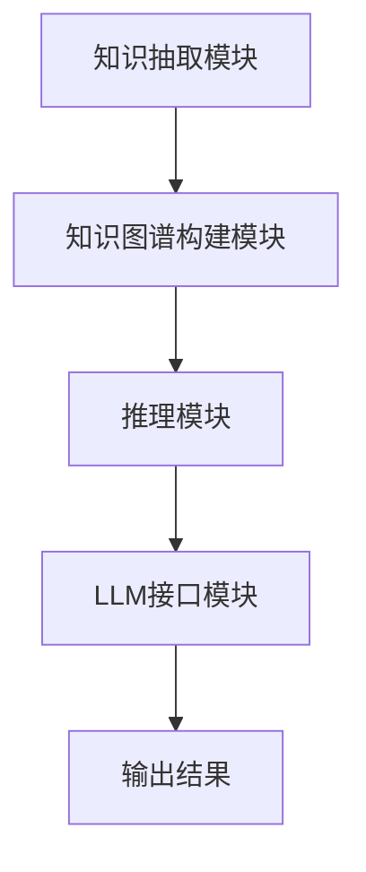
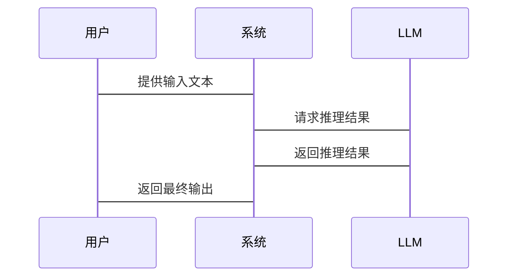

                 


# AI Agent的知识图谱推理：增强LLM的关系理解

> 关键词：AI Agent, 知识图谱, 大语言模型, 知识图谱推理, 关系理解

> 摘要：本文探讨AI Agent如何通过知识图谱推理技术增强大语言模型（LLM）的关系理解能力。首先，我们从知识图谱和LLM的基本概念入手，分析它们的结合方式及其在AI Agent中的应用。接着，深入讲解知识图谱推理的算法原理，并通过具体案例展示其在实际项目中的实现。最后，结合系统架构设计，提出增强LLM关系理解的最佳实践建议。

---

## 第1章 AI Agent与知识图谱的基本概念

### 1.1 AI Agent的定义与特点

AI Agent（智能体）是指能够感知环境并采取行动以实现目标的实体。它具有以下特点：

- **自主性**：能够独立决策和行动。
- **反应性**：能实时感知环境并做出反应。
- **目标导向**：所有行动均以实现特定目标为导向。
- **社交能力**：能够与其他智能体或人类进行交互。

### 1.2 知识图谱的定义与特点

知识图谱是一种以结构化的形式表示知识的网络，节点表示实体，边表示实体之间的关系。其特点包括：

- **语义丰富性**：通过关系和属性描述实体，提供更深层的语义信息。
- **可扩展性**：支持大规模数据的整合和扩展。
- **动态性**：能够实时更新以反映最新信息。

### 1.3 AI Agent与知识图谱的结合

AI Agent通过知识图谱可以实现更智能的决策和推理。具体表现在以下几个方面：

- **知识表示**：知识图谱为AI Agent提供结构化的知识表示。
- **推理能力**：通过知识图谱推理，AI Agent能够推导出隐含的信息。
- **动态更新**：知识图谱的动态更新使AI Agent能够保持最新的知识。

---

## 第2章 知识图谱推理的基本原理

### 2.1 知识图谱的构建

知识图谱的构建过程包括以下步骤：

1. **知识抽取**：从文本中提取实体、关系和属性。
2. **实体识别**：识别文本中的具体实体。
3. **关系抽取**：识别实体之间的关系。
4. **知识存储**：将抽取的知识存储到数据库中。

### 2.2 知识图谱推理的方法

知识图谱推理主要采用以下方法：

- **基于规则的推理**：通过预定义的规则进行推理。
- **基于符号逻辑的推理**：使用逻辑推理方法进行推理。
- **基于机器学习的推理**：利用机器学习模型进行推理。

### 2.3 知识图谱推理的应用场景

知识图谱推理在以下场景中应用广泛：

- **语义理解**：通过推理提升文本理解能力。
- **实体链接**：通过推理将实体与知识图谱中的节点对应起来。
- **问答系统**：通过推理生成更准确的答案。

---

## 第3章 增强LLM的关系理解

### 3.1 LLM的基本原理

大语言模型通过大规模数据的训练，能够理解和生成自然语言文本。其核心在于：

- **深度学习框架**：通常使用Transformer架构。
- **预训练-微调模式**：通过预训练模型在特定任务上进行微调。

### 3.2 知识图谱对LLM的增强作用

知识图谱通过以下方式增强LLM的关系理解能力：

- **知识补全**：为LLM提供额外的知识支持。
- **关系推理**：帮助LLM理解实体之间的关系。
- **上下文理解**：通过知识图谱提供上下文信息，提升理解能力。

### 3.3 知识图谱推理在LLM中的实现

知识图谱推理在LLM中的实现流程如下：

1. **知识抽取**：从文本中抽取实体和关系。
2. **知识存储**：将抽取的知识存储到知识图谱中。
3. **推理过程**：通过推理算法生成新的知识。
4. **结果应用**：将推理结果应用于LLM的输出生成。

---

## 第4章 知识图谱推理的算法原理

### 4.1 知识图谱推理的数学模型

知识图谱推理的数学模型通常包括以下部分：

- **节点表示**：使用向量表示节点。
- **关系表示**：使用向量表示关系。
- **推理公式**：通过公式将节点和关系结合起来进行推理。

### 4.2 知识图谱推理的算法实现

常用的知识图谱推理算法包括：

- **TransE**：通过向量加法进行推理。
- **TransH**：通过向量投影进行推理。
- **RotatE**：通过向量旋转进行推理。

### 4.3 知识图谱推理的评估指标

知识图谱推理的评估指标包括：

- **精确率**：正确推理结果的比例。
- **召回率**：所有正确推理结果中被正确识别的比例。
- **F1分数**：精确率和召回率的调和平均。

---

## 第5章 系统架构设计

### 5.1 问题场景介绍

我们以一个问答系统为例，设计一个结合知识图谱推理和LLM的系统。

### 5.2 系统功能设计

- **知识抽取模块**：从输入文本中抽取实体和关系。
- **知识图谱构建模块**：将抽取的知识存储到知识图谱中。
- **推理模块**：通过推理算法生成新的知识。
- **LLM接口模块**：与大语言模型进行交互，生成最终的输出。

### 5.3 系统架构设计



### 5.4 系统接口设计

- **输入接口**：接收用户的输入文本。
- **输出接口**：输出推理结果和生成的文本。

### 5.5 系统交互设计



---

## 第6章 项目实战

### 6.1 环境安装

需要安装以下工具和库：

- **Python**：用于代码实现。
- **TensorFlow**：用于深度学习模型的实现。
- **Neo4j**：用于知识图谱的存储和管理。

### 6.2 核心实现代码

以下是一个简单的知识图谱推理代码示例：

```python
import tensorflow as tf
from neo4j import GraphDatabase

# 知识图谱构建
class KnowledgeGraph:
    def __init__(self, uri):
        self.driver = GraphDatabase.driver(uri)
    
    def add_entity(self, entity):
        # 实体添加逻辑
        pass
    
    def add_relation(self, relation):
        # 关系添加逻辑
        pass

# 推理算法实现
class Reasoner:
    def __init__(self, graph):
        self.graph = graph
    
    def infer(self, query):
        # 推理逻辑
        pass

# LLM接口
class LLMInterface:
    def __init__(self, model):
        self.model = model
    
    def generate(self, prompt):
        # 生成文本
        pass
```

### 6.3 实际案例分析

以问答系统为例，详细分析知识图谱推理在LLM中的应用。

---

## 第7章 最佳实践

### 7.1 小结

本文详细探讨了AI Agent如何通过知识图谱推理技术增强大语言模型的关系理解能力，并通过具体案例展示了其实现过程。

### 7.2 注意事项

- 确保知识图谱的数据质量和完整性。
- 选择合适的推理算法以提升性能。
- 定期更新知识图谱以保持其时效性。

### 7.3 拓展阅读

- 《Knowledge Graphs and Large Language Models》
- 《Graph Neural Networks for Knowledge Representation》

---

## 作者

作者：AI天才研究院/AI Genius Institute & 禅与计算机程序设计艺术 /Zen And The Art of Computer Programming

