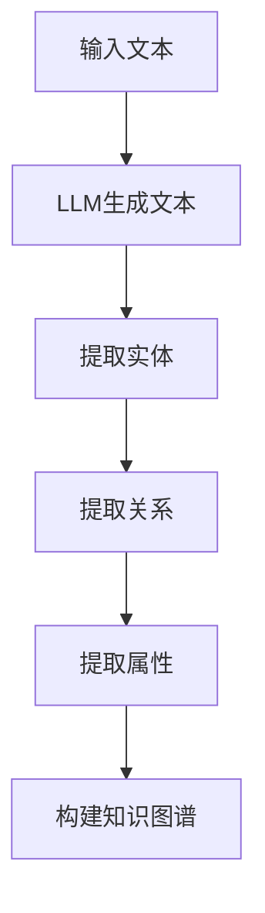

                 


# AI Agent的知识图谱构建：从LLM输出提取结构化信息

**关键词**：AI Agent，知识图谱，LLM，结构化信息，自然语言处理，大语言模型

**摘要**：  
本文详细探讨了AI Agent的知识图谱构建过程，重点从大语言模型（LLM）的输出中提取结构化信息。通过分析知识图谱的核心概念、构建方法以及与LLM的关系，本文为读者提供了从理论到实践的全面指导。文章结合算法原理、系统架构设计和项目实战，深入剖析了如何利用LLM的输出构建高效的知识图谱，为AI Agent的应用提供了坚实的技术基础。

---

## 第一部分：知识图谱构建基础

### 第1章：知识图谱概述

#### 1.1 知识图谱的基本概念

知识图谱是一种以图结构形式表示知识的语义网络，节点表示实体或概念，边表示实体之间的关系。知识图谱的核心目标是将分散的知识点连接起来，形成一个可计算的、结构化的知识表示系统。

- **知识图谱的定义**：知识图谱是一种基于图的语义网络，通过节点和边来表示实体、概念及其关系，旨在构建一个统一的、可扩展的知识库。
- **知识图谱的核心属性**：包括节点（实体或概念）、边（关系）、标签（属性）和权重（关系强度）。
- **知识图谱的构建目标**：实现知识的结构化、语义化和可计算化，为上层应用提供支持。

#### 1.2 知识图谱的构建方法

知识图谱的构建方法主要分为以下三类：

- **基于规则的构建方法**：通过人工定义规则或模板，从结构化数据（如数据库）中抽取知识。
- **基于自然语言处理的构建方法**：利用NLP技术从非结构化文本中提取实体、关系和属性。
- **基于图嵌入的构建方法**：通过深度学习模型（如TransE、BERT）学习实体和关系的向量表示，构建知识图谱。

#### 1.3 知识图谱的应用领域

知识图谱的应用领域广泛，主要包括：

- **智能搜索引擎**：通过知识图谱提升搜索结果的相关性和语义理解能力。
- **智能推荐系统**：基于知识图谱进行个性化推荐，提供更精准的服务。
- **自然语言理解**：利用知识图谱提升NLP模型对上下文的理解能力。

### 第2章：LLM与知识图谱的关系

#### 2.1 LLM的基本概念

- **大语言模型的定义**：LLM（Large Language Model）是一种基于深度学习的自然语言处理模型，能够理解和生成人类语言。
- **LLM的核心技术**：包括词嵌入、注意力机制、Transformer架构等。
- **LLM的应用场景**：文本生成、对话系统、机器翻译、问答系统等。

#### 2.2 LLM在知识图谱构建中的作用

- **LLM输出的特点**：LLM能够生成长文本、上下文相关性强、语义丰富，但输出缺乏结构化信息。
- **LLM在结构化信息提取中的优势**：通过LLM的输出，可以提取实体、关系和属性，构建知识图谱。
- **LLM与知识图谱结合的必要性**：LLM的输出可以作为知识图谱构建的重要来源，弥补传统方法的不足。

### 第3章：从LLM输出提取结构化信息的核心概念

#### 3.1 问题背景与描述

- **问题背景**：知识图谱的构建需要结构化信息，但LLM的输出通常是文本形式，缺乏结构化信息。
- **问题描述**：如何从LLM的输出中提取结构化信息，构建知识图谱。
- **问题解决**：通过NLP技术从LLM的输出中提取实体、关系和属性，构建知识图谱。

#### 3.2 核心概念与联系

- **核心概念原理**：通过自然语言处理技术，从文本中提取实体、关系和属性，构建知识图谱。
- **概念属性特征对比表格**：以下是实体、关系和属性的对比：

| 特征 | 实体 | 关系 | 属性 |
|------|------|------|------|
| 定义 | 表示一个具体事物或概念 | 表示实体之间的关联 | 表示实体的特征或状态 |
| 示例 | 人、地点、组织 | 爱护、属于、参与 | 年龄、性别、职业 |

- **ER实体关系图架构**：以下是知识图谱的ER图：

```mermaid
er
actor(Entity) {
  id: string
  name: string
  type: string
}
actor(Relationship) {
  id: string
  name: string
  direction: string
}
actor(Property) {
  id: string
  name: string
  value: string
}
```

---

## 第二部分：从LLM输出提取结构化信息的算法原理

### 第4章：算法原理

#### 4.1 基于LLM的结构化信息提取方法

- **算法原理**：
  1. 使用LLM生成与目标实体相关的文本。
  2. 通过NLP技术从文本中提取实体、关系和属性。
  3. 将提取的信息构建为知识图谱。

- **算法流程图**：



- **数学模型和公式**：
  - 实体提取的损失函数：
  $$ L = \sum_{i=1}^{n} (y_i - \hat{y}_i)^2 $$
  其中，$y_i$ 是真实标签，$\hat{y}_i$ 是预测标签。
  - 关系抽取的损失函数：
  $$ L = \sum_{i=1}^{m} (y_i - \hat{y}_i)^2 $$

#### 4.2 基于深度学习的结构化信息提取

- **模型选择**：
  - 使用BERT模型进行实体识别。
  - 使用GAT（图注意力网络）进行关系抽取。

- **模型实现代码示例**：

```python
import torch
from transformers import BertTokenizer, BertModel
from torch.utils.data import Dataset, DataLoader

class EntityDataset(Dataset):
    def __init__(self, texts, labels):
        self.texts = texts
        self.labels = labels

    def __len__(self):
        return len(self.texts)

    def __getitem__(self, idx):
        text = self.texts[idx]
        label = self.labels[idx]
        return text, label

def train_model(model, optimizer, criterion, train_loader, epochs):
    for epoch in range(epochs):
        for inputs, labels in train_loader:
            outputs = model(inputs)
            loss = criterion(outputs, labels)
            optimizer.zero_grad()
            loss.backward()
            optimizer.step()
    return model

if __name__ == "__main__":
    texts = ["John works at Google."]
    labels = ["John", "Google"]
    dataset = EntityDataset(texts, labels)
    train_loader = DataLoader(dataset, batch_size=1, shuffle=True)
    model = BertModel.from_pretrained("bert-base-uncased")
    optimizer = torch.optim.Adam(model.parameters(), lr=1e-5)
    criterion = torch.nn.CrossEntropyLoss()
    trained_model = train_model(model, optimizer, criterion, train_loader, 3)
```

---

## 第三部分：系统架构设计与项目实战

### 第5章：系统架构设计

#### 5.1 问题场景介绍

- **目标**：构建一个基于LLM的AI Agent知识图谱。
- **需求**：支持实体识别、关系抽取和知识图谱构建。
- **用户角色**：AI Agent开发者、数据科学家、NLP工程师。

#### 5.2 系统功能设计

- **领域模型**：
  ```mermaid
  classDiagram
  class Entity {
    id: string
    name: string
    type: string
  }
  class Relationship {
    id: string
    name: string
    direction: string
  }
  class Property {
    id: string
    name: string
    value: string
  }
  Entity --> Relationship
  Entity --> Property
  ```

- **系统架构设计**：
  ```mermaid
  architecture
  Client --> API Gateway
  API Gateway --> KnowledgeGraphService
  KnowledgeGraphService --> NLPService
  KnowledgeGraphService --> StorageService
  ```

- **系统交互设计**：
  ```mermaid
  sequenceDiagram
  Client ->> API Gateway: 请求知识图谱构建
  API Gateway ->> KnowledgeGraphService: 调用知识图谱构建接口
  KnowledgeGraphService ->> NLPService: 提取结构化信息
  NLPService ->> StorageService: 存储知识图谱
  KnowledgeGraphService ->> Client: 返回知识图谱
  ```

#### 5.3 项目实战

- **环境安装**：
  ```bash
  pip install torch transformers mermaid4jupyter
  ```

- **核心实现代码**：
  ```python
  from transformers import AutoTokenizer, AutoModelForMaskedLM
  import torch

  class KnowledgeGraphBuilder:
      def __init__(self, model_name="bert-base-uncased"):
          self.tokenizer = AutoTokenizer.from_pretrained(model_name)
          self.model = AutoModelForMaskedLM.from_pretrained(model_name)

      def extract_entities(self, text):
          # 实体提取逻辑
          pass

      def extract_relationships(self, text):
          # 关系抽取逻辑
          pass

  if __name__ == "__main__":
      kg_builder = KnowledgeGraphBuilder()
      text = "John works at Google."
      entities = kg_builder.extract_entities(text)
      relationships = kg_builder.extract_relationships(text)
      print(entities, relationships)
  ```

- **案例分析**：
  - **输入文本**： "John works at Google."
  - **实体提取**： ["John", "Google"]
  - **关系抽取**： ("John", "work_at", "Google")

---

## 第四部分：高级主题与优化技巧

### 第6章：优化方法与应用案例

#### 6.1 知识图谱的优化方法

- **实体消歧**：通过上下文信息消除实体的歧义性。
- **关系优化**：通过图嵌入技术优化关系的表示。
- **知识融合**：将多源数据融合到知识图谱中。

#### 6.2 应用案例分析

- **案例1**：AI Agent问答系统
  - **功能**：基于知识图谱提供智能问答服务。
  - **实现**：通过知识图谱查询实体和关系，生成回答。
- **案例2**：智能推荐系统
  - **功能**：基于知识图谱进行个性化推荐。
  - **实现**：通过知识图谱分析用户行为，推荐相关内容。

---

## 第五部分：总结与展望

### 第7章：总结与展望

#### 7.1 总结

- 本文详细介绍了AI Agent的知识图谱构建过程，重点从LLM的输出中提取结构化信息。
- 结合算法原理、系统架构设计和项目实战，为读者提供了从理论到实践的全面指导。

#### 7.2 展望

- 随着LLM和NLP技术的不断发展，知识图谱的构建将更加高效和智能化。
- 未来的研究方向包括知识图谱的动态更新、多语言知识图谱构建以及知识图谱的轻量化设计。

---

**作者**：AI天才研究院/AI Genius Institute & 禅与计算机程序设计艺术 /Zen And The Art of Computer Programming

