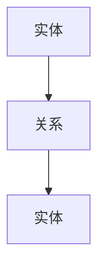
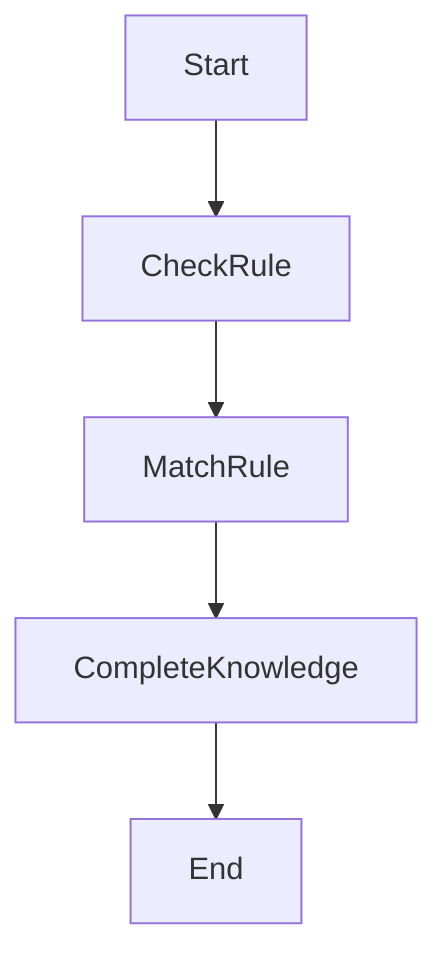
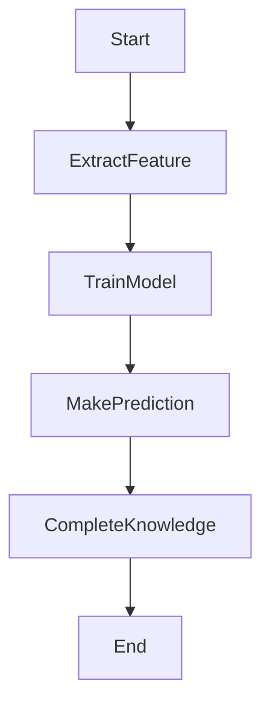
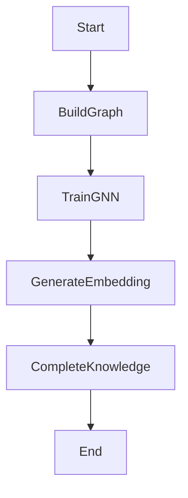
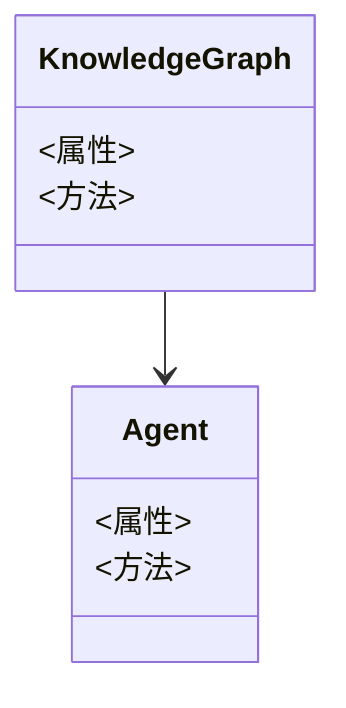

                 


# AI Agent的知识图谱补全技术

> 关键词：知识图谱，AI Agent，知识补全，算法原理，系统设计，项目实战

> 摘要：本文深入探讨了AI Agent的知识图谱补全技术，从基本概念到算法原理，再到系统设计和项目实战，全面解析了如何通过知识图谱补全技术提升AI Agent的能力。文章内容丰富，结构清晰，旨在帮助读者系统地理解并掌握这一技术。

---

## 第1章：背景介绍

### 1.1 知识图谱的基本概念
知识图谱是一种以图结构形式表示知识的数据库，由实体（节点）和关系（边）组成，广泛应用于搜索引擎、问答系统等领域。

### 1.2 AI Agent的基本概念
AI Agent是指具有感知和行动能力的智能体，能够通过环境交互完成特定任务，如推理、学习和规划。

### 1.3 知识图谱在AI Agent中的作用
知识图谱为AI Agent提供了丰富的知识库，使其能够进行更准确的推理和决策。

---

## 第2章：核心概念与联系

### 2.1 核心概念
知识抽取、融合和推理是知识图谱补全的关键步骤。

### 2.2 关系图示


### 2.3 表格对比
| 概念 | 描述 | 属性 |
|------|------|------|
| 实体 | 实体是知识图谱的基本单元 | 名称、类型 |
| 关系 | 描述实体之间的关联 | 名称、方向 |

---

## 第3章：算法原理

### 3.1 基于规则的补全


```python
def rule_based_completion(kg, rule):
    completed_kg = kg.copy()
    for triple in kg:
        if triple matches rule:
            add missing information to completed_kg
    return completed_kg
```

### 3.2 统计学习方法


```python
class StatisticalModel:
    def __init__(self):
        self.model = self.build_model()

    def build_model(self):
        # 构建统计模型
        pass

    def predict(self, input):
        # 预测补全信息
        pass
```

### 3.3 图神经网络


### 3.4 数学公式
知识图谱的表示学习可以用以下公式：
$$
\text{Score}(h, r, t) = \text{similarity}(h, t)
$$
其中，$h$和$t$是实体的嵌入表示，$r$是关系。

---

## 第4章：系统分析与架构设计

### 4.1 问题场景
知识图谱补全系统需要处理大规模数据，支持多种补全方法。

### 4.2 系统设计


### 4.3 系统架构


### 4.4 接口设计
系统提供RESTful API，如：
- `/api/knowledge/completion`
- `/api/model/training`

---

## 第5章：项目实战

### 5.1 环境配置
安装必要的库，如：
```bash
pip install numpy
pip install tensorflow
pip install py2neo
```

### 5.2 核心代码实现
```python
def complete_knowledge(kg, model):
    completed = kg.copy()
    for node in kg.nodes:
        if node needs completion:
            completed.add_complement(node, model.predict(node))
    return completed
```

### 5.3 测试与优化
测试补全效果，评估指标如准确率、召回率，并进行模型调优。

---

## 第6章：最佳实践

### 6.1 小结
本文详细介绍了知识图谱补全技术，从概念到算法再到系统设计，为AI Agent提供了理论和实践指导。

### 6.2 注意事项
- 数据质量影响补全效果
- 算法选择需结合具体场景
- 系统设计要考虑扩展性

### 6.3 拓展阅读
推荐学习知识图谱的构建与应用、图神经网络等技术。

---

## 作者

作者：AI天才研究院 & 禅与计算机程序设计艺术

---

这篇文章系统地介绍了AI Agent的知识图谱补全技术，从背景到实践，帮助读者全面掌握相关知识。

