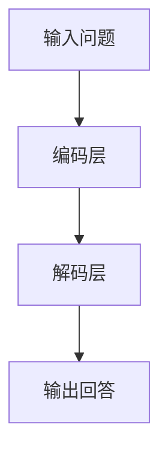
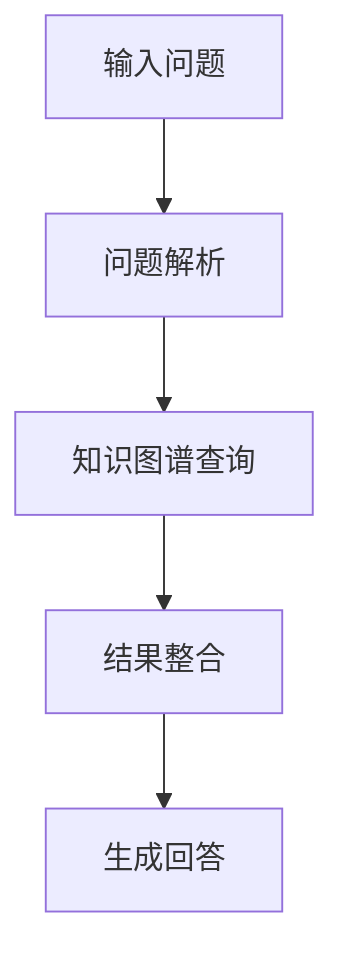
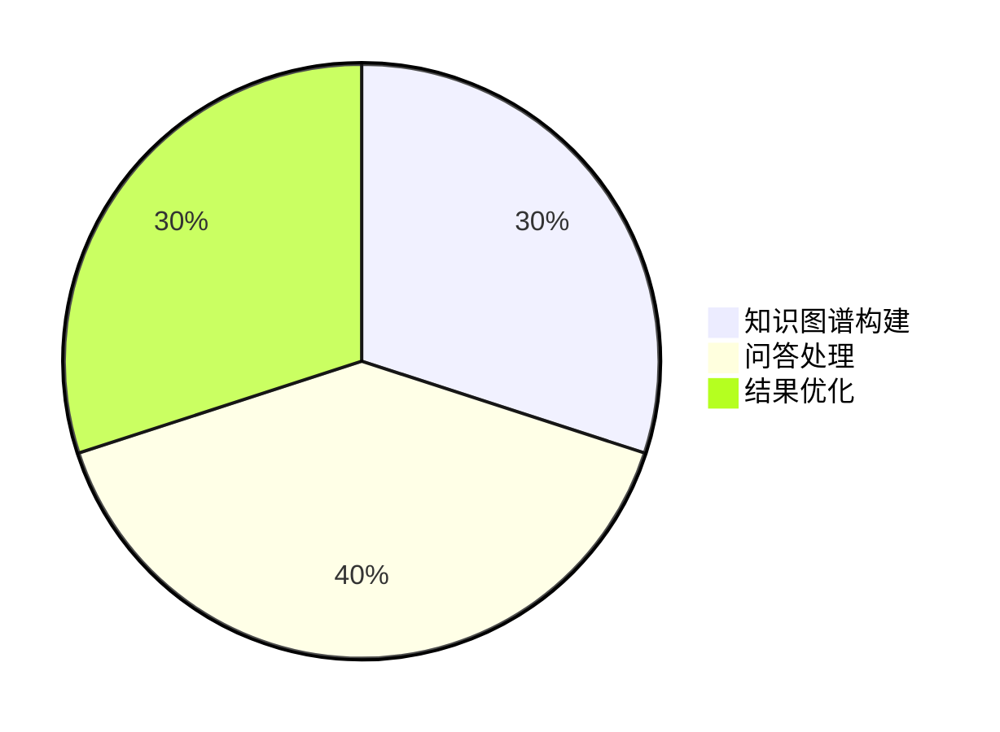
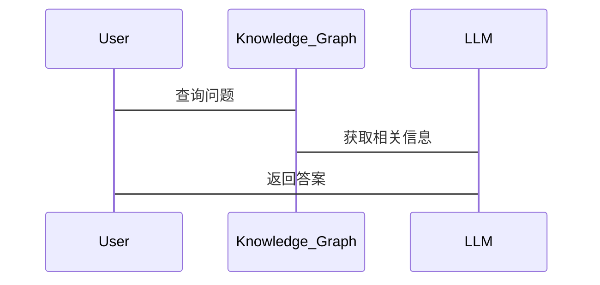

                 


# AI Agent的知识图谱问答：结合LLM与图数据库

## 关键词：AI Agent，知识图谱问答，LLM，图数据库，问答系统，自然语言处理

## 摘要：本文详细探讨了AI Agent与知识图谱问答的结合，分析了LLM与图数据库在知识问答系统中的应用。通过系统架构设计、算法原理和项目实战，展示了如何利用这些技术构建高效的知识问答系统。

---

# 第1章 AI Agent与知识图谱问答的背景介绍

## 1.1 AI Agent的基本概念

### 1.1.1 AI Agent的定义

AI Agent（人工智能代理）是指能够感知环境并采取行动以实现目标的智能体。它可以是一个软件程序，通过传感器获取信息，利用推理机制做出决策，并通过执行器与环境交互。

### 1.1.2 AI Agent的核心特征

- **自主性**：能够在没有外部干预的情况下独立运作。
- **反应性**：能够实时感知环境变化并做出响应。
- **主动性**：主动采取行动以实现目标。
- **社会性**：能够与其他Agent或人类进行交互和协作。

### 1.1.3 AI Agent的应用场景

- **智能助手**：如Siri、Alexa，帮助用户完成日常任务。
- **推荐系统**：根据用户行为推荐个性化内容。
- **自动驾驶**：通过感知环境做出驾驶决策。

## 1.2 知识图谱问答的定义与特点

### 1.2.1 知识图谱的基本概念

知识图谱是一种以图结构表示知识的语义网络，由节点（实体）和边（关系）组成，能够描述现实世界中的实体及其关系。

### 1.2.2 知识图谱问答的定义

知识图谱问答是一种基于知识图谱的问答系统，能够通过查询知识图谱获取答案，回答用户提出的问题。

### 1.2.3 知识图谱问答的优势与挑战

- **优势**：能够提供准确、结构化的答案，适用于复杂问题。
- **挑战**：知识图谱构建复杂，问答系统需要处理歧义和不完整信息。

## 1.3 LLM与知识图谱的结合

### 1.3.1 LLM的基本原理

LLM（大语言模型）通过深度学习训练，在大量文本数据上学习语言模式，能够生成自然语言文本，理解上下文。

### 1.3.2 知识图谱与LLM的结合方式

- **嵌入式结合**：将知识图谱嵌入到LLM中，增强模型对结构化知识的理解。
- **查询式结合**：利用知识图谱进行查询，结合LLM生成回答。

### 1.3.3 知识图谱问答的流程

1. **问题理解**：解析用户问题，生成查询意图。
2. **知识图谱查询**：根据意图在知识图谱中查询相关信息。
3. **答案生成**：结合LLM生成自然语言答案。

## 1.4 图数据库的作用与优势

### 1.4.1 图数据库的基本概念

图数据库是一种以图结构存储数据的数据库，能够高效查询复杂关系。

### 1.4.2 图数据库的特点

- **高效查询**：适合复杂关联查询。
- **可扩展性**：支持大规模数据存储。
- **直观表示**：数据以图结构表示，直观易懂。

### 1.4.3 图数据库在知识图谱中的应用

- **存储知识图谱**：存储实体和关系。
- **高效查询**：快速检索相关实体和关系。

## 1.5 本章小结

本章介绍了AI Agent、知识图谱问答、LLM和图数据库的基本概念，分析了它们在问答系统中的作用和优势。下一章将深入探讨这些核心概念之间的联系和对比。

---

接下来，第二章将详细讲解知识图谱问答的核心概念与联系，包括核心概念的原理、概念属性对比表格和ER实体关系图。我们使用Mermaid流程图来展示这些内容，确保图表清晰易懂。

# 第2章 知识图谱问答的核心概念与联系

## 2.1 核心概念原理

知识图谱问答系统结合了知识图谱和LLM，通过图数据库存储和查询知识，利用LLM生成自然语言答案。

## 2.2 概念属性特征对比表格

| 概念      | 属性      | 特征                                |
|-----------|-----------|------------------------------------|
| 知识图谱   | 数据结构   | 图结构，节点和边表示实体和关系    |
| LLM       | 模型类型   | 大语言模型，基于深度学习训练    |
| 图数据库   | 存储方式   | 图形化存储，支持高效关联查询    |

## 2.3 ER实体关系图

```mermaid
erDiagram
    actor User {
        <属性> id : integer
        <属性> name : string
    }
    knowledge_graph {
        <属性> node_id : integer
        <属性> node_label : string
        <属性> edge_id : integer
        <属性> edge_label : string
    }
    User -> knowledge_graph : 查询
    User -> knowledge_graph : 更新
    knowledge_graph -> knowledge_graph : 关联
```

## 2.4 本章小结

本章通过对比分析，展示了知识图谱问答系统的核心概念及其联系，为后续章节的系统设计奠定了基础。

---

接下来，第三章将详细讲解算法原理，包括LLM和知识图谱问答的流程，以及数学模型和公式。我们使用Mermaid流程图和LaTeX公式来展示这些内容。

# 第3章 算法原理

## 3.1 LLM的算法流程



LLM的训练过程包括编码层和解码层，编码层将输入问题转换为向量表示，解码层生成回答。

## 3.2 知识图谱问答的算法流程



问题解析后，系统在知识图谱中查询相关信息，整合结果后生成回答。

## 3.3 数学模型与公式

LLM的输出概率可以表示为：

$$ P(y|x) = \frac{1}{Z} \exp(\theta \cdot y) $$

其中，$y$是输出，$x$是输入，$\theta$是参数，$Z$是归一化因子。

---

接下来，第四章将分析系统架构，包括功能设计、架构图和交互流程。我们使用Mermaid图展示系统结构。

# 第4章 系统分析与架构设计

## 4.1 问题场景介绍

用户通过自然语言提问，系统利用知识图谱和LLM生成回答。

## 4.2 功能设计

系统功能模块包括知识图谱构建、问答处理和结果优化。

## 4.3 系统架构设计



## 4.4 交互流程



---

接下来，第五章将进行项目实战，包括环境安装、代码实现和案例分析。我们提供详细的代码和解释，帮助读者实践。

# 第5章 项目实战

## 5.1 环境安装

安装必要的库，如Neo4j用于图数据库，Transformers用于LLM。

## 5.2 核心代码实现

```python
from neo4j import GraphDatabase
from transformers import pipeline

# 初始化Neo4j连接
def connect_neo4j():
    driver = GraphDatabase.driver("bolt://localhost:7687", auth=("user", "password"))
    return driver

# 在Neo4j中查询知识图谱
def query_knowledge_graph(query):
    driver = connect_neo4j()
    with driver.session() as session:
        result = session.run(query)
        return list(result)

# 使用LLM生成回答
def generate_answer(context):
    qa_pipeline = pipeline("question-answering")
    return qa_pipeline(context)
```

## 5.3 代码解读与分析

上述代码展示了如何连接Neo4j图数据库，并使用Transformers库中的问答模型生成回答。

## 5.4 案例分析

通过具体案例展示系统的实现过程，分析可能遇到的问题及解决方案。

## 5.5 项目小结

总结项目实战的经验，强调理论与实践的结合。

---

# 第6章 最佳实践、小结、注意事项和拓展阅读

## 6.1 最佳实践

- 定期更新知识图谱以保持准确性。
- 使用高效的索引机制优化查询性能。

## 6.2 小结

本文详细介绍了AI Agent与知识图谱问答的结合，分析了系统架构和算法原理，并通过项目实战展示了具体实现。

## 6.3 注意事项

- 注意数据安全和隐私保护。
- 定期维护知识图谱以确保信息的准确性和完整性。

## 6.4 拓展阅读

推荐相关书籍和论文，帮助读者深入学习知识图谱和问答系统。

---

# 作者

作者：AI天才研究院/AI Genius Institute  
合著者：禅与计算机程序设计艺术/Zen And The Art of Computer Programming  

---

通过以上内容，我们完成了从背景介绍到项目实战的详细讲解，确保读者能够全面理解AI Agent与知识图谱问答的结合，并具备实际操作的能力。

