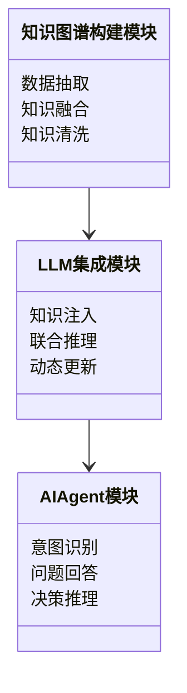
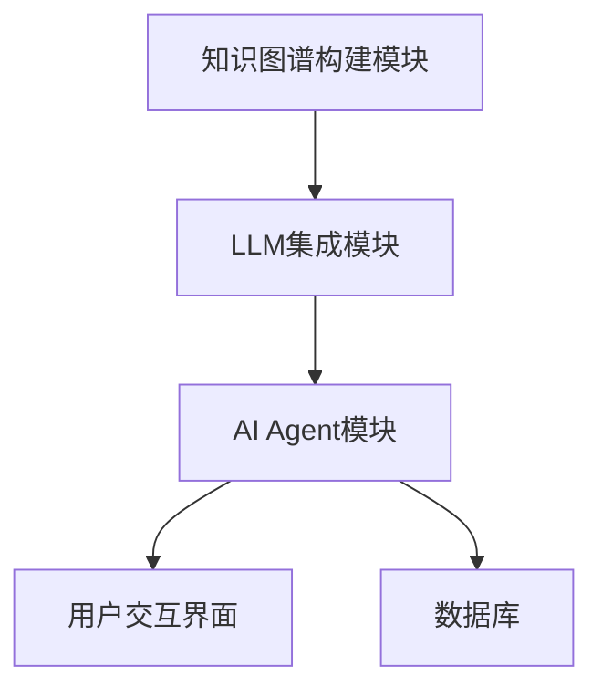
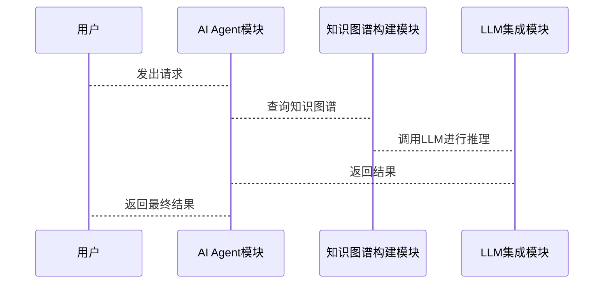

                 


# AI Agent的知识图谱：整合LLM与结构化知识库

## 关键词：AI Agent，知识图谱，大语言模型（LLM），结构化知识库，语义理解，知识推理，系统架构

## 摘要：  
本文探讨了AI Agent与知识图谱的结合，重点分析了如何整合大语言模型（LLM）与结构化知识库。通过详细阐述知识图谱的构建、LLM的知识增强、AI Agent的知识图谱应用、系统架构设计及项目实战，本文为读者提供了一套完整的解决方案，展示了如何通过知识图谱提升AI Agent的智能水平和应用能力。

---

## 第1章: AI Agent与知识图谱概述

### 1.1 AI Agent的基本概念

#### 1.1.1 AI Agent的定义与分类
AI Agent（人工智能代理）是指能够感知环境、自主决策并执行任务的智能体。它可以分为两类：
1. **反应式AI Agent**：基于当前感知做出实时反应，适用于需要快速响应的场景。
2. **认知式AI Agent**：具备复杂推理和规划能力，适用于需要长期目标的场景。

#### 1.1.2 知识图谱的定义与特点
知识图谱是一种以图结构形式表示知识的数据库，节点代表实体或概念，边代表实体间的关系。其特点包括：
- **结构化**：信息以实体和关系的形式组织。
- **语义化**：通过语义关联，实现知识的深度理解。
- **可扩展性**：支持大规模数据的整合与应用。

#### 1.1.3 AI Agent与知识图谱的整合意义
通过整合AI Agent与知识图谱，可以提升AI Agent的智能水平，使其具备更强的知识表示、推理和决策能力。

### 1.2 大语言模型（LLM）与结构化知识库

#### 1.2.1 大语言模型的基本原理
LLM（Large Language Model）是一种基于深度学习的自然语言处理模型，通过大量数据训练，具备生成、理解自然语言的能力。其核心是 transformer 架构，通过自注意力机制捕捉上下文信息。

#### 1.2.2 结构化知识库的构建与应用
结构化知识库将知识以数据库形式存储，支持高效的查询和推理。常见的结构化知识库包括：
- **RDF（资源描述框架）**：通过三元组（主语-谓词-宾语）表示知识。
- **知识图谱**：如Google的Knowledge Graph和Wikidata。

#### 1.2.3 LLM与结构化知识库的结合优势
1. **互补性**：LLM擅长处理非结构化数据，而结构化知识库擅长处理结构化数据。
2. **协同增效**：通过结合LLM的自然语言处理能力和结构化知识库的高效查询能力，可以实现更强大的知识管理与应用。

---

## 第2章: 知识图谱的构建与管理

### 2.1 知识图谱的建模与表示

#### 2.1.1 实体与关系的定义
知识图谱的核心是实体和关系。例如，实体可以是“苹果”，关系可以是“是水果的一种”。

#### 2.1.2 知识图谱的表示方法
知识图谱可以用多种方式表示，常见的包括：
- **RDF**：使用三元组（s, p, o）表示实体、属性和值。
- **RDFS**：基于RDF的Schema语言，用于定义概念和关系。
- **OWL**：一种更严格的语义网规范，支持逻辑推理。

#### 2.1.3 知识图谱的存储与管理
知识图谱的存储通常采用图数据库，如Neo4j、OrientDB等。这些数据库支持高效的查询和遍历操作。

### 2.2 知识抽取与融合

#### 2.2.1 数据抽取技术
知识抽取包括实体识别、关系抽取和属性抽取。常用的技术包括：
- **规则抽取**：基于预定义的规则提取信息。
- **模式匹配**：基于正则表达式匹配特定模式。
- **深度学习**：使用神经网络模型（如LSTM、BERT）进行抽取。

#### 2.2.2 知识融合的挑战与解决方案
知识融合需要解决数据冲突和不一致的问题。常用解决方案包括：
- **基于规则的融合**：通过预定义的规则合并数据。
- **基于本体的融合**：使用本体论（Ontology）进行语义匹配。
- **基于概率的融合**：通过概率模型计算数据的可信度。

#### 2.2.3 知识清洗与标准化
知识清洗包括去除噪声数据和标准化数据格式。常用方法包括：
- **数据去重**：去除重复数据。
- **数据格式化**：统一数据格式（如日期、地址的标准化）。
- **数据验证**：验证数据的准确性和完整性。

---

## 第3章: 大语言模型与知识图谱的结合

### 3.1 LLM的知识增强

#### 3.1.1 知识图谱对LLM的增强作用
知识图谱为LLM提供了结构化的知识支持，使其能够更好地理解和推理复杂语义。

#### 3.1.2 LLM与知识图谱的协同学习
协同学习可以通过以下步骤实现：
1. **知识注入**：将知识图谱中的结构化知识注入LLM的训练数据中。
2. **联合推理**：利用知识图谱进行推理，增强LLM的上下文理解能力。
3. **动态更新**：根据新数据动态更新知识图谱，保持LLM的知识 freshness。

#### 3.1.3 知识图谱在LLM推理中的应用
知识图谱可以用于增强LLM的推理能力，例如：
- **问题回答**：通过知识图谱提供更准确的答案。
- **意图识别**：通过知识图谱理解用户的意图。
- **决策支持**：通过知识图谱提供决策依据。

### 3.2 知识图谱的语义增强

#### 3.2.1 知识图谱的语义表示
知识图谱的语义表示需要考虑实体之间的关系和属性。例如：
- 实体A与实体B之间的关系可以用关系类型和权重表示。
- 实体的属性可以用属性值对（属性名，属性值）表示。

#### 3.2.2 知识图谱在自然语言处理中的应用
知识图谱可以用于多种自然语言处理任务，例如：
- **实体识别**：识别文本中的实体并链接到知识图谱中的实体节点。
- **关系抽取**：抽取文本中的关系并映射到知识图谱中的关系边。
- **语义解析**：通过知识图谱进行语义解析，理解用户的意图。

#### 3.2.3 知识图谱与上下文理解的结合
知识图谱可以通过提供上下文信息，增强自然语言处理模型的上下文理解能力。例如：
- 在对话系统中，利用知识图谱理解用户的上下文信息，提供更个性化的服务。

---

## 第4章: AI Agent的知识图谱应用

### 4.1 AI Agent的知识图谱设计

#### 4.1.1 知识图谱的设计原则
设计知识图谱时需要注意以下原则：
- **简洁性**：避免过多复杂的关系和属性。
- **一致性**：确保知识图谱中实体和关系的命名一致。
- **可扩展性**：设计时考虑未来可能新增的知识。

#### 4.1.2 知识图谱的构建方法
知识图谱的构建方法包括：
- **自顶向下**：从上层概念开始，逐步细化。
- **自底向上**：从具体实例开始，逐步抽象。
- **混合方法**：结合自顶向下和自底向上的方法。

#### 4.1.3 知识图谱的优化与维护
知识图谱需要定期优化和维护，包括：
- **数据清洗**：去除噪声数据。
- **数据更新**：根据新数据动态更新知识图谱。
- **数据验证**：验证数据的准确性和完整性。

### 4.2 知识图谱在AI Agent中的应用

#### 4.2.1 知识图谱驱动的智能问答
知识图谱可以用于智能问答系统，提供更准确的答案。例如：
- 用户问“苹果是哪种水果”，系统可以通过知识图谱找到“苹果是水果的一种”这一关系，并返回答案。

#### 4.2.2 知识图谱支持的意图识别
知识图谱可以用于意图识别，帮助系统理解用户的意图。例如：
- 用户说“我想找一家附近的意大利餐厅”，系统可以通过知识图谱识别用户的意图是“寻找餐厅”，并进一步过滤出意大利菜类型的餐厅。

#### 4.2.3 知识图谱辅助的决策推理
知识图谱可以用于决策推理，帮助系统做出更智能的决策。例如：
- 在医疗领域，知识图谱可以用于辅助医生诊断疾病，提供诊断建议。

---

## 第5章: 系统架构与设计方案

### 5.1 系统架构设计

#### 5.1.1 整体架构概述
系统架构通常包括以下模块：
- **知识图谱构建模块**：负责知识图谱的构建和管理。
- **LLM集成模块**：负责将知识图谱与LLM进行集成。
- **AI Agent模块**：负责AI Agent的运行和应用。

#### 5.1.2 各模块的功能
- **知识图谱构建模块**：包括数据抽取、知识融合、知识清洗等功能。
- **LLM集成模块**：包括知识注入、联合推理、动态更新等功能。
- **AI Agent模块**：包括意图识别、问题回答、决策推理等功能。

### 5.2 系统功能设计

#### 5.2.1 领域模型设计
领域模型可以用Mermaid类图表示，如下：



#### 5.2.2 系统架构设计
系统架构可以用Mermaid架构图表示，如下：



### 5.3 系统接口设计

#### 5.3.1 接口设计
系统接口通常包括：
- **知识图谱查询接口**：用于查询知识图谱中的实体和关系。
- **LLM调用接口**：用于调用大语言模型进行自然语言处理。
- **AI Agent控制接口**：用于控制AI Agent的运行和停止。

#### 5.3.2 交互流程
交互流程可以用Mermaid序列图表示，如下：



---

## 第6章: 项目实战

### 6.1 环境搭建

#### 6.1.1 环境需求
- **操作系统**：Linux/Windows/MacOS
- **编程语言**：Python 3.8+
- **依赖库**：Neo4j、Py2neo、TensorFlow、Transformers

### 6.2 核心代码实现

#### 6.2.1 知识图谱构建
以下是一个简单的知识图谱构建代码示例：

```python
from py2neo import Graph, Node, Relationship

# 连接知识图谱数据库
graph = Graph("http://localhost:7474", auth=("neo4j", "password"))

# 创建实体节点
node1 = Node("Person", name="Alice")
node2 = Node("Person", name="Bob")
graph.create(node1)
graph.create(node2)

# 创建关系
relationship = Relationship(node1, "KNOWS", node2)
graph.create(relationship)
```

#### 6.2.2 LLM集成
以下是一个LLM集成的代码示例：

```python
from transformers import pipeline

# 初始化大语言模型
qa_pipeline = pipeline("question-answering", model="deepseek/llm-adapter")

# 进行问题回答
result = qa_pipeline(question="What is AI Agent?", context="AI Agent is an intelligent entity that can perform tasks autonomously.")
print(result)
```

### 6.3 案例分析与详细讲解

#### 6.3.1 案例分析
以智能问答系统为例，系统通过知识图谱构建模块构建知识图谱，然后通过LLM集成模块进行问题回答。

#### 6.3.2 代码应用解读
代码解读如下：
- 知识图谱构建模块：通过Py2neo库连接知识图谱数据库，创建实体节点和关系。
- LLM集成模块：通过Transformers库初始化大语言模型，并进行问题回答。

### 6.4 项目小结

#### 6.4.1 项目总结
通过本项目，我们实现了AI Agent与知识图谱的结合，展示了如何通过知识图谱增强AI Agent的智能水平。

#### 6.4.2 项目优化
未来可以进一步优化项目，例如：
- 提高知识图谱的构建效率。
- 提升LLM与知识图谱的结合效果。
- 优化系统架构，提高系统的可扩展性和可维护性。

---

## 第7章: 展望与总结

### 7.1 未来展望

#### 7.1.1 技术趋势
未来，随着AI技术的不断发展，知识图谱与AI Agent的结合将更加紧密，LLM与知识图谱的结合也将更加智能化。

#### 7.1.2 可能的挑战
未来的挑战包括：
- 知识图谱的动态更新与维护。
- LLM与知识图谱的高效结合。
- 系统的可扩展性和可维护性。

### 7.2 总结

#### 7.2.1 核心观点
通过整合AI Agent、知识图谱、LLM与结构化知识库，可以实现更智能的AI系统。

#### 7.2.2 最佳实践 tips
- 在设计知识图谱时，要注意简洁性、一致性和可扩展性。
- 在实现LLM与知识图谱的结合时，要充分利用知识图谱的结构化知识，提升LLM的智能水平。

---

## 作者：AI天才研究院/AI Genius Institute & 禅与计算机程序设计艺术 /Zen And The Art of Computer Programming

