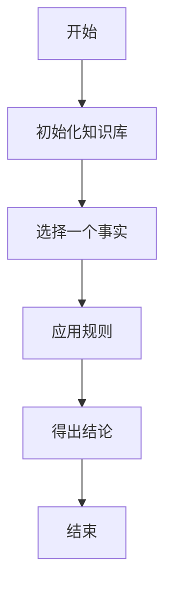
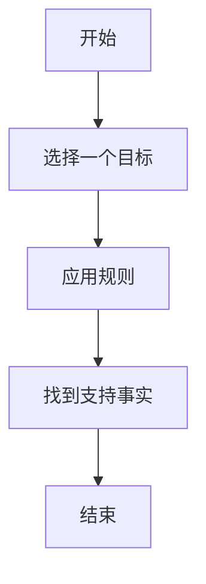
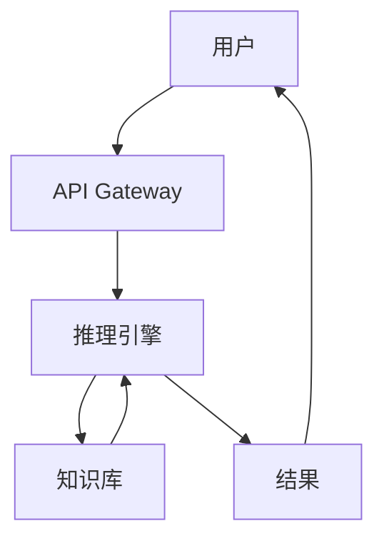

                 


# AI Agent的知识推理：从已知到未知

> 关键词：AI Agent, 知识推理, 知识图谱, 逻辑推理, 推理算法, 系统设计, 实战案例

> 摘要：  
AI Agent（人工智能代理）的知识推理是实现智能决策的核心能力，它通过从已知信息中推导出未知知识，帮助AI Agent理解复杂环境并做出合理决策。本文从知识推理的基本概念出发，逐步分析其在AI Agent中的应用，探讨知识图谱构建、逻辑推理算法、系统设计与实现，最后结合实际案例，展示知识推理的实际应用价值。

---

# 第一部分: AI Agent的知识推理基础

## 第1章: AI Agent与知识推理概述

### 1.1 AI Agent的基本概念

#### 1.1.1 AI Agent的定义
AI Agent是指能够感知环境、自主决策并执行任务的智能实体。它具备感知、推理、规划和执行能力，能够与环境交互并完成特定目标。

#### 1.1.2 AI Agent的核心特征
- **自主性**：能够在没有外部干预的情况下独立运作。
- **反应性**：能够根据环境变化实时调整行为。
- **目标导向**：基于目标驱动决策和行动。
- **推理能力**：通过推理理解环境并做出合理决策。

#### 1.1.3 知识推理在AI Agent中的作用
知识推理是AI Agent实现智能决策的关键能力。它通过处理和分析已知信息，推导出未知信息，帮助AI Agent理解复杂环境并做出合理选择。

### 1.2 知识推理的定义与方法

#### 1.2.1 知识推理的定义
知识推理是指通过已知的知识和逻辑规则，推导出新的知识或结论的过程。它是AI Agent理解世界、解决问题的核心能力。

#### 1.2.2 知识推理的主要方法
1. **基于规则的推理**：通过预定义的规则进行推理。
2. **基于逻辑的推理**：利用逻辑推理方法推导结论。
3. **基于概率的推理**：通过概率模型进行推理，考虑不确定性因素。

#### 1.2.3 知识推理的应用场景
- **问答系统**：通过推理提供准确的答案。
- **智能推荐**：基于用户行为推导偏好。
- **医疗诊断**：根据症状和病史推导诊断。

### 1.3 知识图谱与知识表示

#### 1.3.1 知识图谱的构建
知识图谱是一种结构化的知识表示方式，由实体和关系组成。构建知识图谱需要进行数据抽取、实体识别和关系抽取。

#### 1.3.2 知识表示的形式
- **符号表示**：使用符号逻辑表示知识。
- **语义网络**：通过节点和边表示知识。
- **图嵌入**：通过向量表示实体和关系。

#### 1.3.3 知识图谱的存储与管理
知识图谱通常存储在图数据库中，如Neo4j。管理知识图谱需要考虑数据的动态更新和维护。

---

## 第2章: 知识表示与逻辑推理

### 2.1 知识表示的核心概念

#### 2.1.1 知识表示的层次结构
知识表示可以分为概念层、数据层和表示层。概念层定义领域中的核心概念，数据层存储具体的数据，表示层定义数据的表示方式。

#### 2.1.2 知识表示的特征对比
| 特征 | 符号表示 | 语义网络 | 图嵌入 |
|------|----------|----------|--------|
| 可解释性 | 高       | 中       | 低     |
| 计算效率 | 低       | 中       | 高     |
| 表达能力 | 有限     | 强       | 强     |

#### 2.1.3 知识表示的数学模型
符号表示可以使用一阶逻辑公式表示，例如：
$$ \text{Person}(x) \land \text{Likes}(x, y) \rightarrow \text{Eats}(x, y) $$

### 2.2 逻辑推理的基本原理

#### 2.2.1 命题逻辑与谓词逻辑
- **命题逻辑**：处理简单命题的逻辑关系，如 $p \land q$。
- **谓词逻辑**：处理复杂命题，如 $\forall x \text{Person}(x) \rightarrow \exists y \text{Likes}(x, y)$。

#### 2.2.2 推理规则与证明方法
- **演绎推理**：从一般到具体的推理方式。
- **归纳推理**：从具体到一般的推理方式。

#### 2.2.3 逻辑推理的复杂性分析
逻辑推理的复杂性主要取决于知识图谱的规模和复杂度。复杂度通常用时间复杂度和空间复杂度来衡量。

### 2.3 知识表示与逻辑推理的联系

#### 2.3.1 知识图谱的逻辑结构
知识图谱可以看作是一个逻辑知识库，其中实体和关系可以用谓词逻辑表示。

#### 2.3.2 知识推理的规则引擎
规则引擎是一种实现逻辑推理的工具，它通过预定义的规则进行推理。

#### 2.3.3 知识图谱的推理应用
知识图谱推理可以用于实体识别、属性推导和关系挖掘。

---

## 第3章: 基于符号逻辑的推理算法

### 3.1 前向 chaining 算法

#### 3.1.1 算法原理
前向 chaining 算法从已知的事实出发，逐步应用推理规则，直到得出结论。

#### 3.1.2 算法实现
以下是一个简单的前向 chaining 算法实现：
```python
def forward_chaining(knowledge_base, goal):
    inferred = set()
    queue = deque(knowledge_base)
    while queue:
        clause = queue.popleft()
        if is_fact(clause):
            if clause not in inferred:
                inferred.add(clause)
                queue.extend(rules[clause])
        else:
            # 处理规则
            pass
    return inferred
```

#### 3.1.3 算法优缺点分析
- **优点**：简单易实现。
- **缺点**：在处理复杂问题时效率较低。

#### 3.1.4 算法的Mermaid流程图


### 3.2 反向 chaining 算法

#### 3.2.1 算法原理
反向 chaining 算法从目标出发，逐步回溯推理规则，直到找到支持目标的事实。

#### 3.2.2 算法实现
```python
def backward_chaining(knowledge_base, goal):
    inferred = set()
    stack = [goal]
    while stack:
        clause = stack.pop()
        if is_fact(clause):
            if clause not in inferred:
                inferred.add(clause)
                stack.extend(rules[clause])
        else:
            # 处理规则
            pass
    return inferred
```

#### 3.2.3 算法优缺点分析
- **优点**：在处理特定目标时效率较高。
- **缺点**：在处理复杂规则时容易出现组合爆炸问题。

#### 3.2.4 算法的Mermaid流程图


### 3.3 基于规则的推理算法

#### 3.3.1 规则库的构建
规则库通常由专家定义，包含一系列的规则，例如：
$$ \text{如果}(p \land q) \text{则} r $$

#### 3.3.2 规则匹配与推理过程
规则匹配是通过模式匹配找到与当前事实匹配的规则，然后应用规则进行推理。

#### 3.3.3 规则推理的优化方法
- **规则排序**：优先应用更具体或更可能的规则。
- **剪枝技术**：避免冗余推理。

#### 3.3.4 规则推理的Python实现示例
```python
def rule_based_reasoning(knowledge_base, rules):
    inferred = set()
    for fact in knowledge_base:
        for rule in rules:
            if matches(fact, rule['antecedent']):
                inferred.add(rule['consequent'])
    return inferred
```

---

## 第4章: 知识推理系统的功能设计

### 4.1 系统功能模块划分

#### 4.1.1 知识表示模块
负责将知识表示为结构化的形式，如知识图谱。

#### 4.1.2 推理引擎模块
负责根据知识图谱和推理规则进行推理。

#### 4.1.3 知识库
存储所有已知的知识，包括事实和规则。

#### 4.1.4 用户接口模块
提供与用户交互的接口，接收查询并返回结果。

### 4.2 系统功能实现

#### 4.2.1 知识表示与存储
使用图数据库存储知识图谱，如Neo4j。

#### 4.2.2 推理引擎的选择
根据需求选择合适的推理算法，如前向 chaining 或反向 chaining。

#### 4.2.3 系统接口设计
设计RESTful API，提供推理服务。

#### 4.2.4 系统交互流程
用户通过API提交查询，系统返回推理结果。

### 4.3 知识推理系统的架构设计

#### 4.3.1 系统架构图


#### 4.3.2 接口设计
- **输入**：用户查询。
- **输出**：推理结果。

#### 4.3.3 交互流程
1. 用户提交查询。
2. API Gateway接收请求。
3. 推理引擎进行推理。
4. 返回结果。

### 4.4 本章小结

---

## 第5章: 项目实战——医疗诊断系统的知识推理

### 5.1 项目背景与需求分析

#### 5.1.1 项目背景
医疗诊断系统需要根据患者的症状和病史进行推理，得出可能的诊断。

#### 5.1.2 项目需求
- 实现症状到诊断的推理。
- 提供诊断建议。

### 5.2 项目环境搭建

#### 5.2.1 知识库构建
构建医疗知识图谱，包含疾病、症状和诊断规则。

#### 5.2.2 推理引擎选择
选择基于规则的推理引擎。

#### 5.2.3 技术选型
- 数据库：Neo4j。
- 推理引擎：Rete算法实现。

### 5.3 核心代码实现

#### 5.3.1 知识图谱构建
```python
from neo4j import GraphDatabase

def create_graph(driver):
    # 创建节点
    with driver.session() as session:
        session.run("CREATE (:Disease {name: '流感'})")
        session.run("CREATE (:Symptom {name: '发烧'})")
        session.run("CREATE (:Disease {name: '新冠'})")
        session.run("CREATE (:Symptom {name: '咳嗽'})")
        session.run("MATCH (d:Disease), (s:Symptom) CREATE (d)-[r:HAS_SYMPTOM]->(s)")
```

#### 5.3.2 推理引擎实现
```python
def medical_reasoning(knowledge_base, symptoms):
    inferred = set()
    for disease in knowledge_base:
        for symptom in disease['symptoms']:
            if symptom in symptoms:
                inferred.add(disease['name'])
    return inferred
```

### 5.4 项目总结与优化

#### 5.4.1 项目总结
医疗诊断系统通过知识推理实现了症状到诊断的推理，提高了诊断效率。

#### 5.4.2 系统优化
- 增加不确定性推理能力。
- 优化推理算法，提高效率。

### 5.5 本章小结

---

## 第6章: 最佳实践与总结

### 6.1 全书总结

#### 6.1.1 核心内容回顾
- 知识推理是AI Agent的核心能力。
- 知识图谱和逻辑推理是实现知识推理的关键技术。

#### 6.1.2 技术发展展望
- 结合深度学习，提高推理能力。
- 研究更高效的推理算法。

### 6.2 实践中的注意事项

#### 6.2.1 数据质量的重要性
- 数据的准确性直接影响推理结果。
- 数据的完整性影响推理的全面性。

#### 6.2.2 推理算法的选择
- 根据具体场景选择合适的推理算法。
- 处理复杂问题时，需要结合多种推理方法。

#### 6.2.3 系统设计的优化
- 优化知识表示，提高推理效率。
- 设计高效的推理引擎，降低计算成本。

### 6.3 推荐阅读与拓展学习

#### 6.3.1 推荐书籍
- 《逻辑推理与知识表示》。
- 《图灵奖得主论文集》。

#### 6.3.2 推荐博客与资源
- AI-Agent知识库。
- 逻辑推理开源项目。

### 6.4 本章小结

---

# 结语

AI Agent的知识推理是实现智能系统的核心能力，通过从已知到未知的推理过程，AI Agent能够更好地理解环境并做出智能决策。本文从基础知识到实际应用，详细探讨了知识推理的实现方法，希望对读者有所帮助。

---

作者：AI天才研究院/AI Genius Institute & 禅与计算机程序设计艺术 /Zen And The Art of Computer Programming

