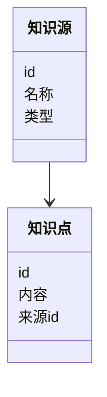

                 


# AI Agent的知识溯源机制：提高LLM输出的可追溯性

> 关键词：AI Agent, 知识溯源机制, 大语言模型（LLM）, 可追溯性, 知识图谱, 系统架构

> 摘要：本文深入探讨了AI Agent的知识溯源机制，分析了如何通过知识图谱和系统架构设计，提高大语言模型（LLM）输出的可追溯性，从而增强AI系统的透明度和可靠性。文章从背景介绍、核心概念、算法原理、系统架构到项目实战，详细阐述了实现知识溯源机制的各个方面。

---

# 第1章: 知识溯源机制的背景与问题描述

## 1.1 人工智能与知识表示的演进
### 1.1.1 从符号逻辑到深度学习的知识表示
- 符号逻辑：基于规则的推理，如专家系统。
- 深度学习：基于神经网络的非符号化知识表示。
- LLM的出现：通过大量数据学习概率分布，生成自然语言文本。

### 1.1.2 大语言模型（LLM）的知识表示特点
- 统计驱动：基于数据的分布特性。
- 黑箱特性：内部机制不透明，难以解释。
- 知识混杂：模型可能包含错误或误导性信息。

### 1.1.3 AI Agent的知识需求与挑战
- AI Agent需要依赖可靠的知识来源进行决策。
- 知识来源的多样性和复杂性增加了可追溯性需求。
- 知识的动态更新与来源追踪的技术挑战。

## 1.2 知识溯源机制的定义与目标
### 1.2.1 知识溯源的基本概念
- 知识溯源：对知识的来源、路径和上下文进行追踪。
- 可追溯性：在需要时，能够回溯知识的来源和生成过程。

### 1.2.2 知识溯源机制的目标
- 确保知识来源的透明性。
- 提供知识生成的上下文信息。
- 支持知识的验证和纠错。

### 1.2.3 知识溯源与可追溯性的关系
- 知识溯源是实现可追溯性的基础。
- 可追溯性是知识溯源的目标和结果。

## 1.3 当前LLM输出的可追溯性问题
### 1.3.1 LLM输出的不可追溯性现状
- 缺乏明确的知识来源标识。
- 知识的混合性导致难以追踪。
- 黑箱特性增加了可追溯性的难度。

### 1.3.2 知识来源模糊对AI Agent的影响
- 影响决策的正确性。
- 增加了系统信任度的缺失。
- 难以进行有效的错误修正。

### 1.3.3 提高LLM输出可追溯性的必要性
- 提升用户信任度。
- 支持法律和伦理合规。
- 促进知识的验证和优化。

## 1.4 本章小结
### 1.4.1 知识溯源机制的核心问题
- 知识的来源标识与追踪。
- 知识表示的结构化与可追溯性。

### 1.4.2 提高LLM可追溯性的关键点
- 知识的结构化表示。
- 知识来源的记录与追踪。

---

# 第2章: 知识溯源机制的核心概念与联系

## 2.1 知识溯源机制的原理
### 2.1.1 知识的来源与传播路径
- 知识来源：数据、文献、网络资源等。
- 传播路径：从数据输入到模型生成输出的处理流程。

### 2.1.2 知识表示的结构化与可追溯性
- 结构化知识表示：将知识分解为基本元素，便于追踪。
- 可追溯性：通过标记和链接，回溯知识的来源。

### 2.1.3 知识图谱与溯源机制的关系
- 知识图谱：结构化知识的表示方式。
- 知识图谱中的实体和关系：为溯源机制提供基础。

## 2.2 核心概念的属性特征对比
### 2.2.1 知识来源的特征对比表
| 特征属性 | 描述 |
|----------|------|
| 来源类型 | 数据、文献、网络等 |
| 时间戳   | 知识生成的时间 |
| 权重     | 知识的可信度或相关性 |

### 2.2.2 知识表示的可追溯性特征
- 可标识性：每个知识元素都有唯一的标识。
- 可链接性：知识元素之间的关联可以被追踪。
- 可扩展性：支持新增知识来源的动态更新。

### 2.2.3 知识图谱的结构化特征
- 实体：知识图谱的基本单元。
- 关系：实体之间的联系。
- 属性：描述实体的特征。

## 2.3 ER实体关系图架构
### 2.3.1 实体关系图的构建
- 实体：知识、数据源、用户查询等。
- 关系：知识来源于数据源，数据源服务于用户查询。

### 2.3.2 知识来源的实体关联
- 数据源 -> 知识 -> 用户查询。
- 知识的生成过程：数据源 -> 数据处理 -> 知识生成。

### 2.3.3 知识图谱的实体关系分
- 实体类型：数据源、知识、用户。
- 关系类型：属于、生成、关联。

---

# 第3章: 知识溯源机制的算法原理

## 3.1 算法流程
### 3.1.1 知识来源记录与追踪
- 记录每条知识的来源信息。
- 在生成过程中动态追踪知识的来源路径。

### 3.1.2 知识表示的结构化处理
- 将知识分解为基本元素，建立结构化的表示。
- 使用图结构表示知识之间的关系。

### 3.1.3 知识溯源标记的生成
- 为每个知识元素生成唯一的标记。
- 在生成过程中嵌入标记信息。

## 3.2 数学模型与公式
### 3.2.1 知识表示的数学模型
$$ 知识 = \{ 实体, 关系, 属性 \} $$

### 3.2.2 知识生成的可追溯性计算
$$ 可追溯性 = f(来源标识, 关联关系, 时间戳) $$

### 3.2.3 示例计算
- 来源标识：文献A、文献B。
- 关联关系：文献A -> 知识点X，文献B -> 知识点Y。
- 时间戳：2023-10-01 10:00:00。

## 3.3 代码实现
### 3.3.1 环境搭建
```bash
pip install networkx
pip install pymermaid
```

### 3.3.2 核心代码
```python
import networkx as nx

# 创建知识图谱
G = nx.Graph()
G.add_nodes_from(["文献A", "文献B", "知识点X", "知识点Y"])
G.add_edges_from([("文献A", "知识点X"), ("文献B", "知识点Y")])

# 可视化知识图谱
from pymermaid import Mermaid
diagram = Mermaid(
    """graph LR
    文献A --> 知识点X
    文献B --> 知识点Y
    """
)
diagram.create_file()
```

---

# 第4章: 系统分析与架构设计

## 4.1 问题场景介绍
- 用户查询：如何提高LLM的可追溯性。
- 系统需求：记录知识来源，支持追溯。

## 4.2 系统功能设计
### 4.2.1 领域模型


### 4.2.2 系统架构设计


---

# 第5章: 项目实战

## 5.1 环境安装
```bash
pip install mermaid
pip install networkx
```

## 5.2 核心代码实现
### 5.2.1 知识来源记录
```python
def record_source(source_id, content):
    return f"知识点{source_id}: {content}"
```

### 5.2.2 知识图谱构建
```python
def build_knowledge_graph(sources):
    G = nx.Graph()
    for source in sources:
        G.add_node(source)
    return G
```

## 5.3 实际案例分析
- 输入：用户查询“如何提高LLM的可追溯性”。
- 输出：知识点X（来自文献A）和知识点Y（来自文献B）。
- 追踪：文献A -> 知识点X，文献B -> 知识点Y。

---

# 第6章: 最佳实践与总结

## 6.1 最佳实践
- 定期更新知识图谱。
- 使用可视化工具辅助分析。
- 结合多种知识表示方法。

## 6.2 小结
- 知识溯源机制的核心是记录和追踪知识的来源。
- 结构化知识表示和知识图谱是实现可追溯性的关键。
- 提高LLM的可追溯性需要系统化的设计和实现。

---

# 作者：AI天才研究院（AI Genius Institute） & 禅与计算机程序设计艺术（Zen And The Art of Computer Programming）

---

本文通过系统的分析和实践，详细阐述了AI Agent的知识溯源机制，为提高LLM输出的可追溯性提供了理论和实践指导。希望本文能为相关领域的研究和应用提供有价值的参考。

