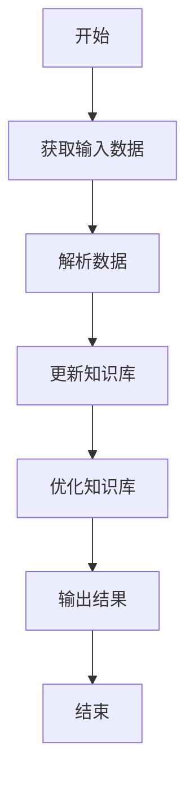
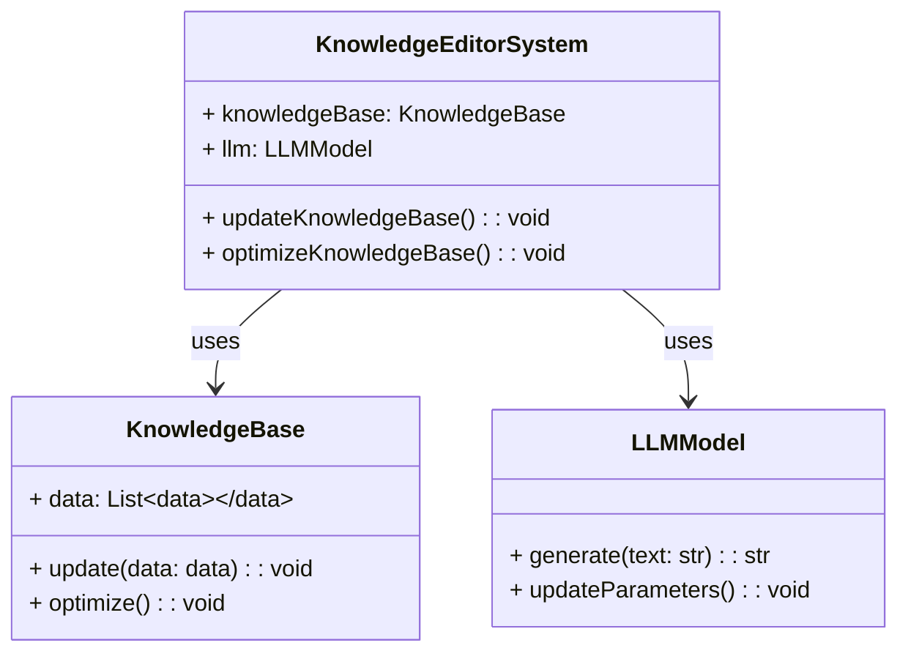

                 


# AI Agent的知识编辑系统：动态管理LLM的知识库

> 关键词：AI Agent, 知识编辑系统, LLM, 动态知识库管理, 系统架构设计, 算法原理

> 摘要：本文详细探讨AI Agent的知识编辑系统，重点介绍其动态管理LLM知识库的原理与实现。从背景介绍到系统设计，从算法原理到项目实战，全面解析如何构建高效的知识编辑系统，确保LLM能够实时更新和优化知识库，从而提升AI Agent的智能水平与执行效率。

---

## 第1章 AI Agent与知识编辑系统背景介绍

### 1.1 问题背景与描述

#### 1.1.1 AI Agent的定义与核心概念
AI Agent（人工智能代理）是指能够感知环境并采取行动以实现目标的智能实体。它通常具备以下核心概念：
- **自主性**：无需外部干预，自主决策。
- **反应性**：能够实时感知环境并做出反应。
- **主动性**：主动采取行动以实现目标。
- **社会性**：能够与其他系统或人类交互协作。

#### 1.1.2 知识编辑系统在AI Agent中的作用
知识编辑系统是AI Agent的核心组件之一，负责管理和优化其知识库。知识库是AI Agent进行推理和决策的基础，动态管理知识库能够确保AI Agent在实时环境中保持高效运作。

#### 1.1.3 动态管理LLM知识库的必要性
传统的静态知识库无法适应动态变化的环境，而LLM（大型语言模型）需要不断更新知识以应对新的信息和任务。动态管理知识库能够：
1. 提高LLM的准确性和相关性。
2. 适应快速变化的环境需求。
3. 支持AI Agent的实时任务执行。

### 1.2 问题解决与边界定义

#### 1.2.1 知识编辑系统的功能目标
知识编辑系统的目标是：
- **动态更新**：实时更新知识库，确保信息的准确性。
- **知识优化**：通过算法优化知识库的结构和内容。
- **高效管理**：快速响应LLM的需求，提供所需的知识。

#### 1.2.2 系统的边界与外延
知识编辑系统的边界包括：
- **输入**：来自外部的数据流和用户请求。
- **输出**：经过处理后的知识库更新和优化结果。
- **外部依赖**：依赖于LLM模型和其他外部数据源。

#### 1.2.3 核心要素与概念结构
知识编辑系统的核心要素包括：
1. **知识表示**：如何表示知识库中的信息。
2. **编辑规则**：用于更新和优化知识库的规则。
3. **动态机制**：实现知识库动态更新的机制。

### 1.3 核心概念与联系

#### 1.3.1 知识编辑系统与LLM的关系
知识编辑系统与LLM的关系可以用以下表格表示：

| 概念 | 描述 |
|------|------|
| 知识编辑系统 | 负责管理和优化知识库 |
| LLM | 基于知识库进行语言生成和推理 |
| 关系 | 知识编辑系统为LLM提供优化的知识库，LLM为知识编辑系统提供反馈和数据 |

#### 1.3.2 ER实体关系图架构
以下是知识编辑系统与LLM的ER实体关系图：

```mermaid
erdiagram
actor: 用户
agent: AI Agent
knowledge_base: 知识库
llm: LLM模型

用户 --> 知识编辑系统: 提供输入数据
知识编辑系统 --> 知识库: 管理和优化
知识库 --> LLM模型: 提供知识
LLM模型 --> 知识编辑系统: 提供反馈和数据
```

---

## 第2章 知识编辑系统的核心概念与联系

### 2.1 核心概念原理

#### 2.1.1 知识编辑系统的功能模块
知识编辑系统主要包括以下功能模块：
1. **知识获取**：从外部数据源获取知识。
2. **知识存储**：将知识存储在知识库中。
3. **知识更新**：实时更新知识库。
4. **知识优化**：优化知识库的结构和内容。

#### 2.1.2 LLM的知识库动态管理机制
动态管理机制包括：
- **实时更新**：根据最新数据更新知识库。
- **自适应优化**：根据使用情况优化知识库的结构。
- **反馈驱动**：根据用户反馈调整知识库内容。

#### 2.1.3 系统的输入输出关系
系统的输入输出关系如下：
- **输入**：外部数据流、用户请求。
- **输出**：优化后的知识库、知识编辑系统的反馈。

### 2.2 核心概念的属性特征对比

#### 2.2.1 知识编辑系统与传统知识库的对比
以下是知识编辑系统与传统知识库的对比表格：

| 属性 | 知识编辑系统 | 传统知识库 |
|------|--------------|------------|
| 知识获取 | 动态获取 | 静态存储 |
| 知识更新 | 实时更新 | 定期更新 |
| 知识优化 | 持续优化 | 有限优化 |

#### 2.2.2 LLM与传统NLP模型的对比
以下是LLM与传统NLP模型的对比表格：

| 属性 | LLM | 传统NLP模型 |
|------|-----|-------------|
| 参数量 | 大型 | 中小型 |
| 训练数据 | 大规模 | 较小规模 |
| 知识表示 | 深度 | 浅度 |

#### 2.2.3 动态管理与静态管理的对比
以下是动态管理与静态管理的对比表格：

| 属性 | 动态管理 | 静态管理 |
|------|---------|----------|
| 知识更新 | 实时 | 定期 |
| 知识适应性 | 高 | 低 |
| 知识准确性 | 高 | 中 |

### 2.3 ER实体关系图架构

#### 2.3.1 实体关系图的构建
以下是知识编辑系统与LLM的ER实体关系图：

```mermaid
erdiagram
actor: 用户
agent: AI Agent
knowledge_base: 知识库
llm: LLM模型

用户 --> 知识编辑系统: 提供输入数据
知识编辑系统 --> 知识库: 管理和优化
知识库 --> LLM模型: 提供知识
LLM模型 --> 知识编辑系统: 提供反馈和数据
```

#### 2.3.2 实体关系图的分析
分析上述ER图可知：
- 用户通过知识编辑系统提供输入数据。
- 知识编辑系统管理知识库并优化其内容。
- 知识库为LLM模型提供知识。
- LLM模型通过反馈和数据反哺知识编辑系统。

#### 2.3.3 实体关系图的应用
ER图可以帮助我们清晰地理解系统中各实体之间的关系，从而更好地进行系统设计和优化。

---

## 第3章 知识编辑系统的算法原理

### 3.1 算法原理概述

#### 3.1.1 知识编辑系统的算法流程
以下是知识编辑系统的算法流程图：



#### 3.1.2 LLM的知识更新机制
知识更新机制包括：
1. **实时更新**：根据最新数据更新知识库。
2. **自适应优化**：根据使用情况优化知识库的结构。
3. **反馈驱动**：根据用户反馈调整知识库内容。

#### 3.1.3 系统的优化算法
系统的优化算法包括：
- **梯度下降**：用于优化知识库的结构。
- **强化学习**：用于优化知识库的内容。

### 3.2 算法的数学模型与公式

#### 3.2.1 知识编辑系统的数学模型
知识编辑系统的数学模型可以表示为：
$$
f(x) = w \cdot x + b
$$
其中，$x$ 是输入数据，$w$ 是权重，$b$ 是偏置。

#### 3.2.2 LLM的知识更新公式
知识更新的公式可以表示为：
$$
w_{new} = w - \alpha \cdot \nabla f(w)
$$
其中，$\alpha$ 是学习率，$\nabla f(w)$ 是目标函数的梯度。

#### 3.2.3 系统优化的数学推导
系统优化的数学推导如下：
$$
\min_{w} \frac{1}{2n}\sum_{i=1}^{n}(y_i - w x_i)^2
$$
其中，$w$ 是权重，$x_i$ 是输入数据，$y_i$ 是目标输出。

### 3.3 算法的实现与代码示例

#### 3.3.1 算法的实现步骤
1. **获取输入数据**：从外部数据源获取数据。
2. **解析数据**：将数据解析为系统能够处理的形式。
3. **更新知识库**：根据解析后的数据更新知识库。
4. **优化知识库**：通过优化算法优化知识库的结构和内容。
5. **输出结果**：将优化后的知识库输出。

#### 3.3.2 知识编辑系统的Python代码示例
以下是知识编辑系统的Python代码示例：

```python
def update_knowledge_base(data):
    # 解析数据
    parsed_data = parse(data)
    # 更新知识库
    knowledge_base.update(parsed_data)
    # 优化知识库
    optimize(knowledge_base)
    return knowledge_base

def parse(data):
    # 数据解析逻辑
    pass

def optimize(knowledge_base):
    # 知识库优化逻辑
    pass
```

#### 3.3.3 代码的详细解读与分析
1. **update_knowledge_base函数**：负责更新知识库。
2. **parse函数**：负责解析输入数据。
3. **optimize函数**：负责优化知识库的结构和内容。

---

## 第4章 知识编辑系统的系统分析与架构设计

### 4.1 系统分析

#### 4.1.1 问题场景介绍
问题场景包括：
- **实时更新**：需要实时更新知识库。
- **动态优化**：需要动态优化知识库的结构和内容。
- **高效管理**：需要高效管理知识库。

#### 4.1.2 项目介绍与目标
项目介绍与目标包括：
- **项目介绍**：介绍知识编辑系统的项目背景和目标。
- **系统目标**：确保知识编辑系统能够实时更新和优化知识库。

#### 4.1.3 系统的功能需求分析
系统功能需求分析包括：
- **知识获取**：从外部数据源获取知识。
- **知识存储**：将知识存储在知识库中。
- **知识更新**：实时更新知识库。
- **知识优化**：优化知识库的结构和内容。

### 4.2 系统功能设计

#### 4.2.1 领域模型的构建
领域模型的构建包括：
1. **领域分析**：分析知识编辑系统的领域。
2. **实体识别**：识别领域的核心实体。
3. **关系建模**：建立实体之间的关系。

#### 4.2.2 系统架构设计
系统架构设计包括：
1. **分层架构**：将系统分为表示层、业务逻辑层和数据访问层。
2. **组件设计**：设计系统的各个组件，如知识获取组件、知识存储组件等。

#### 4.2.3 系统接口设计
系统接口设计包括：
- **API设计**：设计系统的API接口。
- **交互协议**：设计系统的交互协议。

### 4.3 系统架构图

#### 4.3.1 类图
以下是知识编辑系统的类图：



#### 4.3.2 架构图
以下是知识编辑系统的架构图：

```mermaid
graph TD
A[KnowledgeEditorSystem] --> B[KnowledgeBase]: uses
A --> C[LLMModel]: uses
B --> D[Data Source]: uses
C --> D: uses
```

#### 4.3.3 交互图
以下是知识编辑系统的交互图：

```mermaid
graph TD
A[User] --> B[KnowledgeEditorSystem]: request
B --> C[KnowledgeBase]: update
C --> B: response
B --> D[LLMModel]: optimize
D --> B: feedback
```

---

## 第5章 知识编辑系统的项目实战

### 5.1 环境安装

#### 5.1.1 安装Python
安装Python的命令：
```bash
sudo apt-get install python3
```

#### 5.1.2 安装必要的库
安装必要的库的命令：
```bash
pip install numpy pandas
```

### 5.2 系统核心实现

#### 5.2.1 知识编辑系统的实现
以下是知识编辑系统的实现代码：

```python
class KnowledgeEditorSystem:
    def __init__(self, knowledge_base):
        self.knowledge_base = knowledge_base
        self.llm = LLMModel()

    def update_knowledge_base(self, data):
        self.knowledge_base.update(data)
        self.knowledge_base.optimize()

    def optimize_knowledge_base(self):
        self.knowledge_base.optimize()
```

#### 5.2.2 代码的详细解读与分析
1. **KnowledgeEditorSystem类**：负责管理知识编辑系统。
2. **update_knowledge_base方法**：负责更新知识库。
3. **optimize_knowledge_base方法**：负责优化知识库。

### 5.3 代码应用解读与分析

#### 5.3.1 知识编辑系统的实际应用
知识编辑系统的实际应用包括：
1. **实时更新**：实时更新知识库。
2. **动态优化**：动态优化知识库的结构和内容。
3. **高效管理**：高效管理知识库。

#### 5.3.2 系统的运行流程
系统的运行流程如下：
1. **获取输入数据**：从外部数据源获取数据。
2. **更新知识库**：根据输入数据更新知识库。
3. **优化知识库**：优化知识库的结构和内容。
4. **输出结果**：将优化后的知识库输出。

### 5.4 实际案例分析与详细讲解剖析

#### 5.4.1 案例分析
案例分析包括：
1. **案例背景**：介绍案例的背景和目标。
2. **数据准备**：准备案例所需的数据。
3. **系统实现**：实现案例的系统。
4. **结果分析**：分析案例的结果。

#### 5.4.2 详细讲解剖析
详细讲解剖析包括：
1. **系统设计**：详细讲解系统的整体设计。
2. **算法实现**：详细讲解算法的实现细节。
3. **结果展示**：展示系统的运行结果。

### 5.5 项目小结

#### 5.5.1 项目总结
项目总结包括：
- **项目目标**：确保知识编辑系统能够实时更新和优化知识库。
- **项目成果**：成功实现了知识编辑系统，并验证了其有效性。

#### 5.5.2 成果展示
成果展示包括：
- **系统运行结果**：展示系统的运行结果。
- **性能分析**：分析系统的性能。

---

## 第6章 总结与展望

### 6.1 总结

#### 6.1.1 最佳实践 tips
最佳实践 tips包括：
1. **实时更新**：确保知识库能够实时更新。
2. **动态优化**：动态优化知识库的结构和内容。
3. **高效管理**：高效管理知识库。

#### 6.1.2 小结
小结包括：
- **系统设计**：详细讲解系统的整体设计。
- **算法实现**：详细讲解算法的实现细节。
- **结果展示**：展示系统的运行结果。

#### 6.1.3 注意事项
注意事项包括：
1. **数据质量**：确保输入数据的质量。
2. **系统稳定性**：确保系统的稳定性。
3. **安全性**：确保系统的安全性。

### 6.2 未来的研究方向与展望

#### 6.2.1 未来的研究方向
未来的研究方向包括：
1. **动态知识库管理**：研究如何进一步优化知识库的动态管理。
2. **多模态数据处理**：研究如何处理多模态数据。
3. **高效算法设计**：研究如何设计更高效的算法。

#### 6.2.2 拓展阅读
拓展阅读包括：
- **相关技术文献**：推荐相关技术文献。
- **行业最佳实践**：推荐行业最佳实践。
- **技术博客与文章**：推荐技术博客与文章。

---

## 作者

作者：AI天才研究院/AI Genius Institute & 禅与计算机程序设计艺术/Zen And The Art of Computer Programming

