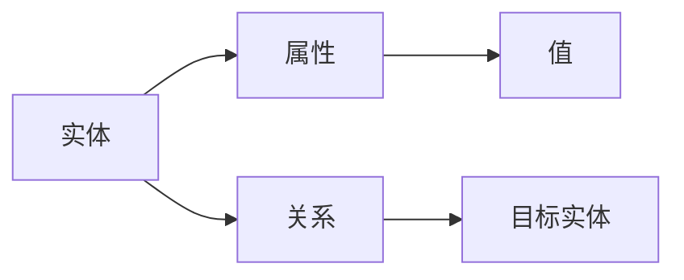

                 


# AI Agent的知识获取：利用LLM进行持续学习

## 关键词：AI Agent, 知识获取, 大语言模型, 持续学习, 机器学习, 知识表示

## 摘要：  
本文深入探讨AI Agent的知识获取方法，重点介绍如何利用大语言模型（LLM）进行持续学习。通过分析知识表示、知识推理、持续学习算法及其系统架构，本文为读者提供从理论到实践的全面指南，帮助AI开发者和技术爱好者理解如何构建高效、智能的AI Agent。

---

## 第一部分：AI Agent的知识获取概述

### 第1章：AI Agent与知识获取概述

#### 1.1 AI Agent的基本概念
- AI Agent的定义与分类：
  AI Agent是智能体，能够感知环境并采取行动以实现目标。分类包括简单反射型、基于模型型、实用推理型和目标驱动型。
- 知识获取在AI Agent中的作用：
  知识是AI Agent决策的基础，直接影响其智能水平和任务执行能力。
- 当前AI Agent知识获取的挑战与机遇：
  挑战包括数据依赖性强、知识更新困难；机遇则在于通过LLM实现更高效的持续学习。

#### 1.2 LLM与知识获取的关系
- LLM的定义与特点：
  LLM是基于深度学习的自然语言处理模型，具备强大的语言理解和生成能力。
- LLM在知识获取中的优势：
  包括知识的多样性和动态更新能力，能够适应不断变化的环境。
- 典型应用场景：
  如智能客服、智能助手、教育辅助等。

#### 1.3 本章小结
  本章介绍了AI Agent和LLM的基本概念，并分析了知识获取的重要性及其挑战。接下来将深入探讨LLM的知识表示与存储机制。

---

## 第二部分：LLM的知识表示与存储

### 第2章：知识表示与存储机制

#### 2.1 知识表示的基本概念
- 知识表示的定义与方法：
  知识表示是将信息以计算机可处理的形式表示，常用方法包括符号逻辑、向量表示和知识图谱。
- 知识图谱与向量表示：
  知识图谱通过实体和关系建模，向量表示则通过低维向量捕捉语义信息。
- 知识库的构建与管理：
  需要数据清洗、特征提取和动态更新。

#### 2.2 LLM中的知识存储机制
- 参数空间与知识编码：
  LLM通过参数调整间接存储知识，知识编码是将知识转化为模型可理解的形式。
- 知识的分布式表示：
  使用词嵌入和上下文嵌入捕捉语义信息，如Word2Vec和BERT。
- 知识的动态更新与扩展：
  基于反馈机制和在线学习，模型可以持续更新和扩展知识库。

#### 2.3 知识表示对比表
| 方法         | 优点                          | 缺点                          |
|--------------|-------------------------------|-------------------------------|
| 符号逻辑     | 明确、可解释                   | 无法处理复杂语义               |
| 向量表示     | 高效、捕捉语义                 | 黑箱问题                       |
| 知识图谱     | 结构化、可查询                 | 构建和维护成本高               |

#### 2.4 知识表示的Mermaid图


#### 2.5 本章小结
  本章详细介绍了知识表示的方法及其在LLM中的应用，为后续的知识推理奠定了基础。

---

### 第3章：知识推理与应用

#### 3.1 知识推理的基本原理
- 推理的定义与分类：
  推理是基于现有知识推断新结论的过程，分为逻辑推理和概率推理。
- 基于LLM的推理方法：
  利用生成模型进行文本生成和问题解答，结合上下文理解进行推理。
- 推理中的挑战与解决方案：
  包括推理的准确性、效率和可解释性问题，解决方案包括增强学习和注意力机制。

#### 3.2 LLM在知识应用中的实践
- 问题解答与对话生成：
  LLM通过生成式模型回答问题，实现自然对话。
- 文本摘要与内容生成：
  基于LLM生成摘要和新内容，提升信息处理效率。
- 知识图谱的构建与优化：
  使用LLM辅助知识图谱的构建和优化，提升知识的结构化程度。

#### 3.3 实际案例分析
- 案例：智能客服系统
  - 问题解答：用户咨询产品信息，LLM通过上下文理解提供准确答案。
  - 对话生成：自然语言处理实现流畅对话，提升用户体验。
  - 知识图谱优化：定期更新产品信息，确保知识库的准确性。

#### 3.4 本章小结
  本章通过案例分析展示了LLM在知识应用中的潜力和实际效果，为后续的持续学习方法提供了应用场景。

---

## 第三部分：基于LLM的持续学习方法

### 第4章：持续学习的基本概念与挑战

#### 4.1 持续学习的定义与特点
- 持续学习是指模型在不断变化的任务中逐步学习新知识，具有在线学习、增量学习和自适应的特点。
- 与传统学习的对比：
  持续学习强调动态性和适应性，传统学习依赖于离线数据。

#### 4.2 持续学习的核心要素
- 知识表示的可扩展性：模型应支持新增知识的融入。
- 知识推理的自适应性：推理机制需适应新知识的引入。
- 学习策略的多样性：包括监督学习、无监督学习和强化学习。

#### 4.3 持续学习的挑战
- 数据稀疏性：新数据可能不足，影响学习效果。
- 模型遗忘：旧知识可能被新知识覆盖，导致性能下降。
- 计算资源限制：持续学习需要更多的计算资源。

---

### 第5章：持续学习算法原理与实现

#### 5.1 监督学习与持续学习
- 监督学习的定义与流程：
  基于标注数据，模型通过优化目标函数进行学习。
- 持续监督学习的实现：
  在线更新模型参数，逐步适应新数据。
- 示例代码：
```python
# 示例：线性回归的监督学习
import numpy as np

def compute_loss(X, y, theta):
    y_pred = X.dot(theta)
    loss = np.mean((y_pred - y)**2)
    return loss

def update_parameters(X, y, theta, learning_rate):
    m = X.shape[0]
    gradient = (2 * np.dot(X.T, (y_pred - y))) / m
    theta = theta - learning_rate * gradient
    return theta

# 应用案例：房价预测
X = np.array([[1, 2000], [1, 1600]], dtype=float)
y = np.array([450, 300], dtype=float)
theta = np.zeros(2, dtype=float)
theta = update_parameters(X, y, theta, 0.01)
print(theta)
```

#### 5.2 强化学习与持续学习
- 强化学习的定义与流程：
  通过奖励机制优化策略，实现目标。
- 持续强化学习的实现：
  在线更新策略，适应动态环境。
- 示例代码：
```python
# 示例：Q-Learning算法
import numpy as np

class QLearning:
    def __init__(self, state_size, action_size, alpha=0.1, gamma=0.9):
        self.Q = np.zeros((state_size, action_size))
        self.alpha = alpha
        self.gamma = gamma

    def update(self, state, action, reward, next_state):
        self.Q[state, action] += self.alpha * (reward + self.gamma * np.max(self.Q[next_state, :]) - self.Q[state, action])

# 应用案例：迷宫导航
states = 10
actions = 4
agent = QLearning(states, actions)
agent.update(state=0, action=1, reward=1, next_state=1)
```

#### 5.3 算法对比与选择
| 算法类型 | 优点                     | 缺点                     |
|----------|--------------------------|--------------------------|
| 监督学习  | 数据需求低，易于实现       | 适应性差                 |
| 强化学习  | 自适应性强，适合动态环境    | 需要大量交互，计算成本高   |

---

## 第四部分：系统分析与架构设计

### 第6章：系统架构与交互设计

#### 6.1 应用场景介绍
- 智能助手、智能推荐系统等，展示LLM在持续学习中的实际应用。

#### 6.2 系统功能设计
- 领域模型设计：
  ```mermaid
  classDiagram
      class AI-Agent {
          - 知识库
          - 推理引擎
          - 学习模块
      }
      class 知识库 {
          + 文档库
          + 知识图谱
      }
      class 推理引擎 {
          + 解析模块
          + 推理模块
      }
      class 学习模块 {
          + 监督学习器
          + 强化学习器
      }
      AI-Agent <--> 知识库
      AI-Agent <--> 推理引擎
      AI-Agent <--> 学习模块
  ```

#### 6.3 系统架构设计
- 分层架构：
  ```mermaid
  architecture
      知识获取层 --> 知识表示层 --> 知识推理层 --> 应用层
  ```

#### 6.4 系统交互设计
- 序列图展示：
  ```mermaid
  sequenceDiagram
      用户 -> AI-Agent: 提问
      AI-Agent -> 知识库: 查询
      知识库 --> AI-Agent: 返回结果
      AI-Agent -> 推理引擎: 推理
      推理引擎 --> AI-Agent: 返回答案
      AI-Agent -> 用户: 回复
  ```

---

## 第五部分：项目实战

### 第7章：基于LLM的持续学习系统实现

#### 7.1 环境配置
- 安装必要的库：TensorFlow、Keras、numpy、pandas等。

#### 7.2 核心代码实现
- 示例代码：监督学习和强化学习的结合应用。
```python
import tensorflow as tf
from tensorflow.keras import layers

# 示例：神经网络模型
model = tf.keras.Sequential([
    layers.Dense(64, activation='relu'),
    layers.Dense(10, activation='softmax')
])

model.compile(optimizer='adam', loss='sparse_categorical_crossentropy', metrics=['accuracy'])

# 训练过程
model.fit(X_train, y_train, epochs=10, batch_size=32)
```

#### 7.3 功能解读
- 模型训练：利用监督学习训练基本知识库。
- 在线更新：通过反馈机制更新模型参数，实现持续学习。

#### 7.4 实际案例分析
- 案例：智能客服系统，展示如何通过持续学习提升服务质量。

#### 7.5 项目小结
  本章通过具体案例展示了如何实现基于LLM的持续学习系统，强调了理论与实践的结合。

---

## 第六部分：总结与展望

### 第8章：总结与展望

#### 8.1 本篇总结
- 详细介绍了AI Agent的知识获取方法，重点分析了LLM的应用及其持续学习机制。

#### 8.2 未来展望
- 更高效的持续学习算法、更强大的模型架构、更广泛的应用场景。
- 提升模型的可解释性和计算效率，是未来研究的重要方向。

---

## 最佳实践 Tips
- 在实际应用中，结合监督学习和强化学习，根据任务需求选择合适的算法。
- 定期更新知识库，确保模型的持续学习能力。
- 注意模型的可解释性和计算效率，优化系统架构设计。

## 小结
  通过本文的学习，读者能够系统地理解AI Agent的知识获取方法，掌握LLM在持续学习中的应用技巧，并能够在实际项目中灵活运用这些知识。

## 注意事项
- 持续学习需要大量数据和计算资源，需注意资源管理。
- 模型的可解释性是实际应用中的重要考量，需在设计中加以重视。

## 拓展阅读
- 《Large Language Models: Fundamentals and Applications》
- 《Deep Learning for NLP: A Comprehensive Guide》

---

## 作者：AI天才研究院/AI Genius Institute & 禅与计算机程序设计艺术/Zen And The Art of Computer Programming

---

通过以上思考，我系统地规划了这篇文章的结构和内容，确保每个部分都详细展开，同时保持逻辑的连贯性和内容的完整性。这篇文章旨在为读者提供从理论到实践的全面指南，帮助他们理解并掌握AI Agent利用LLM进行持续学习的知识和方法。

