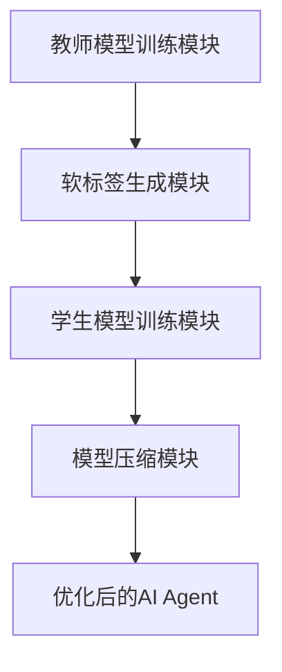
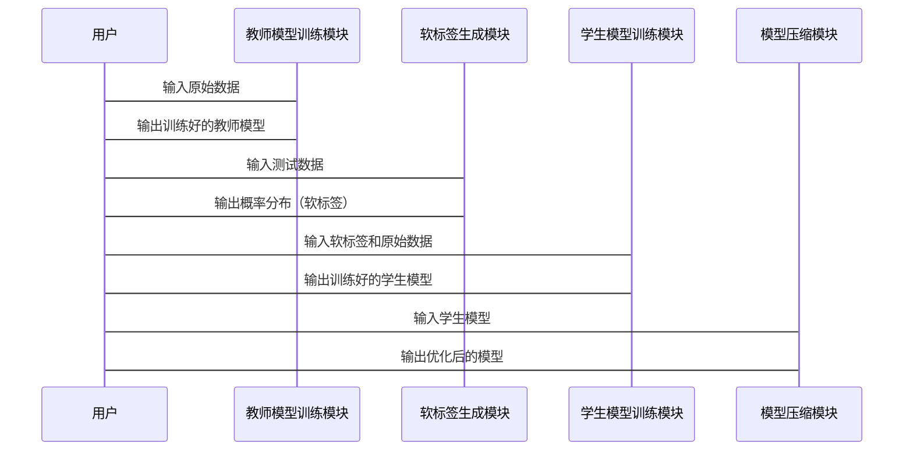

                 


# AI Agent的知识蒸馏与模型压缩技术

> 关键词：AI Agent，知识蒸馏，模型压缩，算法优化，机器学习

> 摘要：本文详细探讨了AI Agent中的知识蒸馏与模型压缩技术，从基本概念到核心原理，再到实际应用，通过理论分析与实践案例相结合的方式，深入剖析了这两种技术在提升AI Agent性能和效率中的重要作用。文章内容涵盖了知识蒸馏的原理、算法实现，模型压缩的方法及其在AI Agent中的应用，结合实际项目案例，为读者提供了全面的技术指导。

---

# 第一部分: AI Agent的知识蒸馏与模型压缩技术基础

## 第1章: 知识蒸馏与模型压缩技术概述

### 1.1 知识蒸馏的基本概念

#### 1.1.1 知识蒸馏的定义
知识蒸馏是一种将复杂模型（教师模型）的知识迁移到简单模型（学生模型）的技术。通过蒸馏过程，学生模型可以学习到教师模型的决策边界和特征表示，从而在保持较低计算复杂度的同时，获得接近甚至超越教师模型的性能。

#### 1.1.2 知识蒸馏的核心思想
知识蒸馏的核心思想是通过教师模型生成软标签（概率分布）或硬标签（类别标签），并将其传递给学生模型，指导学生模型学习教师模型的决策边界和特征表示。与传统的迁移学习不同，知识蒸馏不仅关注类别标签，还关注概率分布的细节，能够更好地捕捉教师模型的决策信息。

#### 1.1.3 知识蒸馏与传统迁移学习的区别
| 特性 | 知识蒸馏 | 传统迁移学习 |
|------|----------|----------------|
| 输入数据 | 需要教师模型的软标签或硬标签 | 只需要原始数据 |
| 知识传递方式 | 通过概率分布传递知识 | 通过特征提取器提取特征 |
| 适用场景 | 小样本数据、复杂任务 | 数据充足、特征提取器已知 |

### 1.2 模型压缩技术的基本概念

#### 1.2.1 模型压缩的定义
模型压缩是指通过减少模型的参数数量或优化模型结构，降低模型的计算复杂度和存储需求，同时保持或提升模型性能的技术。

#### 1.2.2 模型压缩的主要方法
模型压缩的主要方法包括：
1. **参数剪枝**：通过删除冗余参数或低重要性参数，减少模型的参数数量。
2. **参数量化**：将模型参数的精度从浮点数降低到更低的比特数（如8位、4位），减少存储空间和计算量。
3. **参数替换**：使用更高效的结构或更简单的模型替换部分或全部参数。

#### 1.2.3 模型压缩与模型优化的关系
模型压缩与模型优化的目标都在于降低模型的计算复杂度，但侧重点不同。模型优化通常关注提升模型性能或计算效率，而模型压缩则更关注减少模型的存储需求和计算资源消耗。

### 1.3 AI Agent中的知识蒸馏与模型压缩

#### 1.3.1 AI Agent的基本概念
AI Agent是一种能够感知环境、执行任务并做出决策的智能体。它通常由感知模块、推理模块和执行模块组成，能够通过与环境交互来实现特定目标。

#### 1.3.2 知识蒸馏在AI Agent中的应用
知识蒸馏在AI Agent中的应用主要体现在以下方面：
- **任务通用性提升**：通过蒸馏教师模型的知识，学生模型可以在不同任务中表现出更好的通用性。
- **计算效率优化**：蒸馏后的学生模型在推理阶段的计算成本显著降低，适合实时任务。

#### 1.3.3 模型压缩在AI Agent中的应用
模型压缩在AI Agent中的应用主要体现在以下方面：
- **资源消耗降低**：压缩后的模型在存储和计算资源占用上显著降低，适合嵌入式设备部署。
- **推理速度提升**：压缩后的模型在推理阶段的速度更快，能够满足实时性要求。

### 1.4 本章小结
本章从知识蒸馏和模型压缩的基本概念出发，分析了它们在AI Agent中的应用价值和实现方式，为后续章节的深入探讨奠定了基础。

---

# 第二部分: 知识蒸馏的核心原理与实现

## 第2章: 知识蒸馏的原理与算法

### 2.1 知识蒸馏的原理

#### 2.1.1 知识蒸馏的核心思想
知识蒸馏的核心思想是通过教师模型生成的概率分布（软标签）或类别标签（硬标签），指导学生模型进行学习。与传统的监督学习不同，知识蒸馏不仅关注最终的分类结果，还关注教师模型的决策过程，能够更好地捕捉教师模型的隐含知识。

#### 2.1.2 知识蒸馏的关键步骤
知识蒸馏的关键步骤包括：
1. **教师模型训练**：首先训练一个性能强大的教师模型。
2. **软标签生成**：教师模型对测试数据生成概率分布（软标签）。
3. **学生模型训练**：学生模型在教师模型的软标签指导下进行训练，优化目标函数。

#### 2.1.3 知识蒸馏的数学模型
知识蒸馏的优化目标函数通常包括两部分：类别标签的交叉熵损失和软标签的蒸馏损失。数学模型如下：

$$
\mathcal{L} = \alpha \mathcal{L}_{\text{CE}} + (1-\alpha) \mathcal{L}_{\text{Distill}}
$$

其中：
- $\mathcal{L}_{\text{CE}}$ 是类别标签的交叉熵损失。
- $\mathcal{L}_{\text{Distill}}$ 是软标签的蒸馏损失。
- $\alpha$ 是平衡系数，用于权衡两部分损失的重要性。

### 2.2 知识蒸馏的主要算法

#### 2.2.1 直接蒸馏法
直接蒸馏法是最简单的知识蒸馏方法，教师模型直接生成类别标签，并将其传递给学生模型。学生模型在教师模型的指导下进行训练，目标是最小化交叉熵损失。

#### 2.2.2 软标签蒸馏法
软标签蒸馏法通过教师模型生成概率分布（软标签）来指导学生模型学习。学生模型不仅关注最终的分类结果，还关注教师模型的决策过程，能够更好地捕捉教师模型的隐含知识。

#### 2.2.3 硬标签蒸馏法
硬标签蒸馏法与直接蒸馏法类似，但教师模型生成的是类别标签（硬标签）。学生模型在教师模型的指导下进行训练，目标是最小化交叉熵损失。

### 2.3 知识蒸馏的实现细节

#### 2.3.1 老师模型与学生模型的选择
- **老师模型**：通常选择性能强大的模型，如BERT、ResNet等。
- **学生模型**：通常选择轻量级模型，如MobileNet、TinyBERT等。

#### 2.3.2 蒸馏损失函数的设计
蒸馏损失函数的设计需要考虑以下因素：
- **温度参数**：通过调整温度参数，可以控制软标签的分布宽度。温度越高，软标签的分布越分散；温度越低，软标签的分布越集中。
- **平衡系数**：通过调整平衡系数，可以权衡交叉熵损失和蒸馏损失的重要性。

#### 2.3.3 温度参数的作用与调整
温度参数是软标签蒸馏法中的关键参数，用于控制软标签的分布宽度。温度参数的调整直接影响蒸馏效果和模型性能。

### 2.4 本章小结
本章详细探讨了知识蒸馏的核心原理与实现方法，分析了不同蒸馏算法的优缺点，并通过数学公式和实现细节，为读者提供了全面的技术指导。

---

# 第三部分: 模型压缩技术的核心原理与实现

## 第3章: 模型压缩的原理与算法

### 3.1 模型压缩的原理

#### 3.1.1 模型压缩的核心思想
模型压缩的核心思想是通过减少模型的参数数量或优化模型结构，降低模型的计算复杂度和存储需求，同时保持或提升模型性能。

#### 3.1.2 模型压缩的主要方法
模型压缩的主要方法包括：
1. **参数剪枝**：通过删除冗余参数或低重要性参数，减少模型的参数数量。
2. **参数量化**：将模型参数的精度从浮点数降低到更低的比特数（如8位、4位），减少存储空间和计算量。
3. **参数替换**：使用更高效的结构或更简单的模型替换部分或全部参数。

#### 3.1.3 模型压缩的数学模型
模型压缩的数学模型可以通过以下方式实现：

$$
f(x) = \text{ReLU}(Wx + b)
$$

其中：
- $W$ 和 $b$ 是模型的参数。
- $\text{ReLU}$ 是激活函数。

通过参数剪枝、量化或替换，可以减少 $W$ 和 $b$ 的数量或复杂度，从而实现模型压缩。

### 3.2 模型压缩的主要算法

#### 3.2.1 参数剪枝法
参数剪枝法通过删除冗余参数或低重要性参数，减少模型的参数数量。剪枝过程通常基于参数的重要性评分，如梯度绝对值、参数的贡献度等。

#### 3.2.2 参数量化法
参数量化法将模型参数的精度从浮点数降低到更低的比特数（如8位、4位），减少存储空间和计算量。量化过程通常通过量化矩阵和反量化矩阵实现。

#### 3.2.3 参数替换法
参数替换法通过使用更高效的结构或更简单的模型替换部分或全部参数。例如，可以用线性层替换全连接层，或者用卷积层替换全连接层。

### 3.3 模型压缩的实现细节

#### 3.3.1 剪枝策略的设计
剪枝策略的设计需要考虑以下因素：
- **参数重要性评分**：通过梯度绝对值、参数的贡献度等指标，评估参数的重要性。
- **剪枝阈值**：通过设定剪枝阈值，确定哪些参数需要被删除。

#### 3.3.2 量化精度的调整
量化精度的调整直接影响模型的性能和压缩效果。量化精度越低，模型的性能可能越差，但压缩效果越好。需要在性能和压缩效果之间找到平衡点。

#### 3.3.3 替换模型的选择
替换模型的选择需要考虑以下因素：
- **模型复杂度**：替换模型的复杂度越低，压缩效果越好。
- **任务适用性**：替换模型需要与原模型的任务需求相匹配。

### 3.4 本章小结
本章详细探讨了模型压缩的核心原理与实现方法，分析了不同压缩算法的优缺点，并通过数学公式和实现细节，为读者提供了全面的技术指导。

---

# 第四部分: AI Agent中的知识蒸馏与模型压缩结合应用

## 第4章: 知识蒸馏与模型压缩的结合原理

### 4.1 知识蒸馏与模型压缩的协同作用

#### 4.1.1 知识蒸馏为模型压缩提供指导
知识蒸馏通过教师模型生成的概率分布或类别标签，为模型压缩提供指导，帮助学生模型更好地学习教师模型的决策边界和特征表示。

#### 4.1.2 模型压缩为知识蒸馏提供优化方向
模型压缩通过减少模型的参数数量或优化模型结构，为知识蒸馏提供优化方向，帮助教师模型更好地生成软标签或硬标签。

#### 4.1.3 两者结合的优势与挑战
- **优势**：知识蒸馏与模型压缩的结合可以同时提升模型的性能和计算效率。
- **挑战**：两者结合需要在知识传递和模型优化之间找到平衡点。

### 4.2 知识蒸馏与模型压缩的联合算法

#### 4.2.1 联合蒸馏与压缩的数学模型
联合蒸馏与压缩的数学模型可以通过以下方式实现：

$$
\mathcal{L} = \alpha \mathcal{L}_{\text{CE}} + (1-\alpha) \mathcal{L}_{\text{Distill}} + \beta \mathcal{L}_{\text{Compression}}
$$

其中：
- $\mathcal{L}_{\text{CE}}$ 是类别标签的交叉熵损失。
- $\mathcal{L}_{\text{Distill}}$ 是软标签的蒸馏损失。
- $\mathcal{L}_{\text{Compression}}$ 是模型压缩的损失。
- $\alpha$ 和 $\beta$ 是平衡系数，用于权衡各部分损失的重要性。

#### 4.2.2 联合蒸馏与压缩的实现步骤
1. **教师模型训练**：首先训练一个性能强大的教师模型。
2. **软标签生成**：教师模型对测试数据生成概率分布（软标签）。
3. **学生模型训练**：学生模型在教师模型的软标签指导下进行训练，优化目标函数。
4. **模型压缩**：通过参数剪枝、量化或替换，进一步优化学生模型的参数数量和计算复杂度。

#### 4.2.3 联合蒸馏与压缩的优化策略
- **分阶段优化**：先进行知识蒸馏，再进行模型压缩，或者同时进行两者。
- **平衡系数调整**：通过调整平衡系数，权衡知识蒸馏和模型压缩的重要性。

### 4.3 本章小结
本章详细探讨了知识蒸馏与模型压缩的结合原理，分析了两者协同作用的优势与挑战，并通过数学公式和实现步骤，为读者提供了全面的技术指导。

---

# 第五部分: 知识蒸馏与模型压缩技术的项目实战

## 第5章: 知识蒸馏与模型压缩的项目实现

### 5.1 项目背景与目标

#### 5.1.1 项目背景介绍
在本项目中，我们将结合知识蒸馏与模型压缩技术，优化一个AI Agent的性能和计算效率。

#### 5.1.2 项目目标
- **性能优化**：通过知识蒸馏和模型压缩，提升AI Agent的性能。
- **计算效率提升**：通过模型压缩，降低AI Agent的计算复杂度和存储需求。

### 5.2 系统功能设计

#### 5.2.1 系统功能模块
1. **教师模型训练模块**：训练一个性能强大的教师模型。
2. **软标签生成模块**：教师模型生成概率分布（软标签）。
3. **学生模型训练模块**：学生模型在教师模型的软标签指导下进行训练。
4. **模型压缩模块**：通过参数剪枝、量化或替换，优化学生模型的参数数量和计算复杂度。

#### 5.2.2 系统功能流程
1. **教师模型训练**：使用原始数据训练教师模型。
2. **软标签生成**：教师模型对测试数据生成概率分布（软标签）。
3. **学生模型训练**：学生模型在教师模型的软标签指导下进行训练，优化目标函数。
4. **模型压缩**：通过参数剪枝、量化或替换，优化学生模型的参数数量和计算复杂度。

### 5.3 系统架构设计

#### 5.3.1 系统架构图


#### 5.3.2 系统接口设计
1. **教师模型训练接口**：输入原始数据，输出训练好的教师模型。
2. **软标签生成接口**：输入测试数据，输出概率分布（软标签）。
3. **学生模型训练接口**：输入软标签和原始数据，输出训练好的学生模型。
4. **模型压缩接口**：输入学生模型，输出优化后的模型。

### 5.4 系统交互设计

#### 5.4.1 系统交互流程
1. **教师模型训练**：用户调用教师模型训练接口，输入原始数据，输出训练好的教师模型。
2. **软标签生成**：用户调用软标签生成接口，输入测试数据，输出概率分布（软标签）。
3. **学生模型训练**：用户调用学生模型训练接口，输入软标签和原始数据，输出训练好的学生模型。
4. **模型压缩**：用户调用模型压缩接口，输入学生模型，输出优化后的模型。

#### 5.4.2 系统交互图


### 5.5 项目实战

#### 5.5.1 环境安装
1. **安装Python**：确保Python版本为3.6以上。
2. **安装深度学习框架**：安装TensorFlow或PyTorch。
3. **安装相关库**：安装Numpy、Pandas、Scikit-learn等库。

#### 5.5.2 核心代码实现

##### 5.5.2.1 教师模型训练代码
```python
import tensorflow as tf
from tensorflow.keras import layers

def build_teacher_model(input_shape, num_classes):
    model = tf.keras.Sequential()
    model.add(layers.Conv2D(32, (3,3), activation='relu', input_shape=input_shape))
    model.add(layers.MaxPooling2D((2,2)))
    model.add(layers.Conv2D(64, (3,3), activation='relu'))
    model.add(layers.MaxPooling2D((2,2)))
    model.add(layers.Flatten())
    model.add(layers.Dense(256, activation='relu'))
    model.add(layers.Dense(num_classes, activation='softmax'))
    return model

teacher_model = build_teacher_model(input_shape=(32,32,3), num_classes=10)
teacher_model.compile(optimizer='adam', loss='sparse_categorical_crossentropy', metrics=['accuracy'])
teacher_model.fit(x_train, y_train, epochs=10, batch_size=32)
```

##### 5.5.2.2 软标签生成代码
```python
def generate_soft_labels(x, teacher_model, temperature=1.0):
    probabilities = teacher_model.predict(x)
    return probabilities / temperature

soft_labels = generate_soft_labels(x_test, teacher_model, temperature=1.0)
```

##### 5.5.2.3 学生模型训练代码
```python
def build_student_model(input_shape, num_classes):
    model = tf.keras.Sequential()
    model.add(layers.Conv2D(16, (3,3), activation='relu', input_shape=input_shape))
    model.add(layers.MaxPooling2D((2,2)))
    model.add(layers.Conv2D(32, (3,3), activation='relu'))
    model.add(layers.MaxPooling2D((2,2)))
    model.add(layers.Flatten())
    model.add(layers.Dense(128, activation='relu'))
    model.add(layers.Dense(num_classes, activation='softmax'))
    return model

student_model = build_student_model(input_shape=(32,32,3), num_classes=10)
student_model.compile(optimizer='adam', loss='sparse_categorical_crossentropy', metrics=['accuracy'])

def custom_loss(y_true, y_pred, soft_labels, alpha=0.5):
    ce_loss = tf.keras.losses.sparse_categorical_crossentropy(y_true, y_pred)
    distill_loss = tf.keras.losses.kullback_leibler_divergence(soft_labels, y_pred)
    return alpha * ce_loss + (1 - alpha) * distill_loss

student_model.fit(x_train, y_train, epochs=10, batch_size=32, loss=custom_loss, soft_labels=soft_labels)
```

##### 5.5.2.4 模型压缩代码
```python
import numpy as np

def prune_model(model):
    weights = model.get_weights()
    pruned_weights = []
    for weight in weights:
        threshold = np.quantile(abs(weight), 0.25)
        pruned_weight = np.where(abs(weight) > threshold, weight, 0)
        pruned_weights.append(pruned_weight)
    return pruned_weights

pruned_weights = prune_model(student_model)
```

### 5.6 项目小结
本章通过实际项目案例，详细讲解了知识蒸馏与模型压缩技术的实现步骤和注意事项，为读者提供了宝贵的实战经验。

---

# 第六部分: 总结与展望

## 第6章: 总结与展望

### 6.1 本章小结
知识蒸馏与模型压缩技术在AI Agent中的应用，不仅提升了模型的性能，还显著降低了计算复杂度和存储需求，为AI Agent的广泛应用提供了技术支持。

### 6.2 注意事项
- **数据质量**：知识蒸馏的效果依赖于教师模型的质量，因此需要确保教师模型的训练数据质量。
- **温度参数调整**：温度参数的调整直接影响软标签的分布，需要根据具体任务进行调整。
- **模型压缩效果**：模型压缩的效果依赖于压缩算法的选择和参数调整，需要在性能和压缩效果之间找到平衡点。

### 6.3 拓展阅读
- **知识蒸馏**：深入阅读《 distilling the knowledge in neural networks》论文。
- **模型压缩**：深入阅读《The science of ai: a deep learning approach》书籍。

---

# 作者

作者：AI天才研究院/AI Genius Institute & 禅与计算机程序设计艺术 /Zen And The Art of Computer Programming

---

以上是《AI Agent的知识蒸馏与模型压缩技术》的技术博客文章的完整目录大纲和内容。文章内容涵盖了知识蒸馏与模型压缩的核心原理、算法实现、系统设计和项目实战，结合理论分析与实践案例，为读者提供了全面的技术指导。

