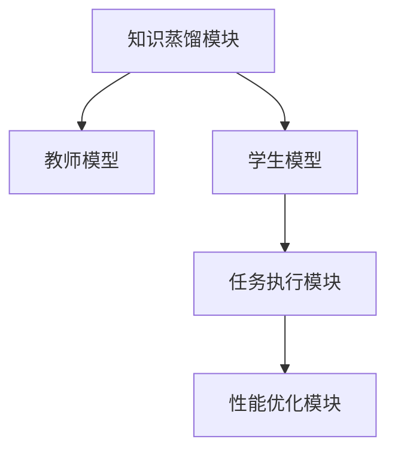
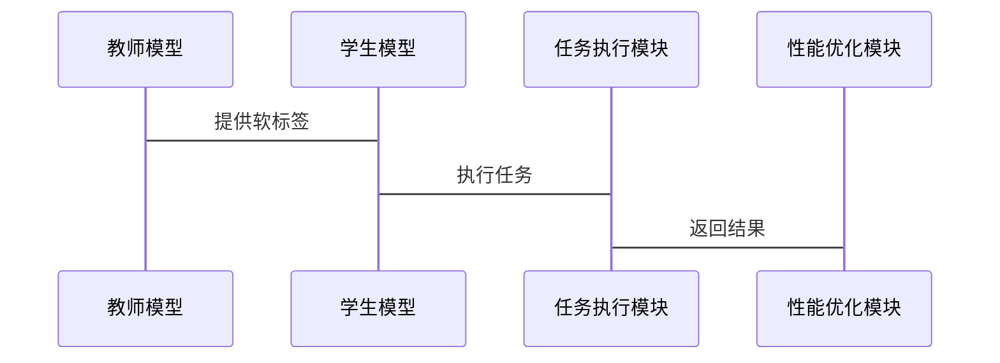

                 


```markdown
# AI Agent的知识蒸馏在模型压缩中的应用

> 关键词：AI Agent、知识蒸馏、模型压缩、机器学习、深度学习

> 摘要：知识蒸馏是一种有效的模型压缩技术，用于将大型AI模型的知识迁移到更小、更高效的模型中。本文详细探讨了知识蒸馏在AI Agent中的应用，分析了其核心原理、算法实现、系统设计以及实际应用案例，为读者提供全面的技术解读。

---

# 第一部分：AI Agent的知识蒸馏基础

## 第1章：知识蒸馏的概念与背景

### 1.1 知识蒸馏的定义与背景

#### 1.1.1 什么是知识蒸馏
知识蒸馏是一种通过将大模型的知识迁移到小模型的技术，类似于“教师”向“学生”传授知识的过程。其核心在于通过损失函数的设计，使小模型能够学习到大模型的决策边界和特征表示。

#### 1.1.2 知识蒸馏的背景与动机
随着深度学习模型的快速发展，大型模型（如GPT-4、BERT等）在性能上表现出色，但其计算成本和存储需求也急剧上升。在实际应用中，特别是在资源受限的场景（如移动设备、边缘计算等），如何将大模型的性能迁移到更小、更高效的模型中成为亟待解决的问题。

#### 1.1.3 知识蒸馏的核心问题与目标
知识蒸馏的核心问题是如何设计有效的损失函数，使得学生模型能够充分学习教师模型的知识，同时保持自身的轻量化特性。其目标包括：
1. 降低模型的计算复杂度。
2. 减少模型的存储需求。
3. 提高模型的推理速度。
4. 保持或接近原模型的性能。

### 1.2 AI Agent的基本概念

#### 1.2.1 什么是AI Agent
AI Agent（人工智能代理）是指能够感知环境、自主决策并执行任务的智能实体。它可以是一个软件程序、机器人或其他智能系统，具备以下核心特征：
- **自主性**：能够独立决策。
- **反应性**：能够感知环境并实时响应。
- **主动性**：能够主动采取行动以实现目标。
- **社会性**：能够与其他实体（人或机器）进行交互。

#### 1.2.2 AI Agent的分类与特点
AI Agent可以根据功能、智能水平和应用场景进行分类：
- **按功能分类**：分为导航型Agent、对话型Agent、推荐型Agent等。
- **按智能水平分类**：分为反应式Agent、认知式Agent等。
- **按应用场景分类**：分为服务机器人、智能音箱、自动驾驶等。

#### 1.2.3 AI Agent的应用场景
AI Agent广泛应用于各个领域，包括但不限于：
- **自然语言处理**：智能对话系统、机器翻译。
- **计算机视觉**：图像识别、视频监控。
- **机器人技术**：工业机器人、服务机器人。
- **自动驾驶**：智能驾驶系统。

### 1.3 知识蒸馏与AI Agent的结合

#### 1.3.1 知识蒸馏在AI Agent中的作用
知识蒸馏可以有效提升AI Agent的性能，同时降低其计算和存储需求。通过将大模型的知识迁移到轻量级模型中，AI Agent可以在资源受限的环境中依然保持高性能。

#### 1.3.2 知识蒸馏如何提升AI Agent性能
- **减少计算成本**：通过模型压缩，降低推理时的计算量。
- **提高推理速度**：轻量级模型可以更快地做出决策。
- **优化资源利用**：在边缘设备上运行时，减少带宽和存储需求。

#### 1.3.3 知识蒸馏与模型压缩的关系
知识蒸馏是一种特殊的模型压缩技术，通过知识迁移实现模型的轻量化。与传统的剪枝、量化等压缩方法相比，知识蒸馏能够更好地保持模型的性能，因为它不仅压缩了模型的结构，还保留了大模型的知识。

---

## 第2章：知识蒸馏的核心概念与原理

### 2.1 知识蒸馏的核心概念

#### 2.1.1 知识蒸馏的基本原理
知识蒸馏的核心思想是通过教师模型（Teacher）指导学生模型（Student）进行学习。教师模型通常是一个训练好的大型模型，而学生模型是一个小型模型。通过设计合适的损失函数，学生模型能够从教师模型中学习到其决策边界和特征表示。

#### 2.1.2 知识蒸馏的关键技术
- **软标签**：教师模型输出的概率分布作为软标签，用于指导学生模型的优化。
- **硬标签**：教师模型的类别预测结果作为硬标签，用于监督学生模型的分类任务。
- **注意力机制**：通过注意力机制，学生模型可以关注教师模型的关键特征。

#### 2.1.3 知识蒸馏的优缺点
- **优点**：
  - 能够有效提升学生模型的性能。
  - 适用于各种任务，包括分类、回归、生成等。
- **缺点**：
  - 需要额外的训练过程，增加计算成本。
  - 教师模型的性能依赖于其本身的训练质量。

### 2.2 知识蒸馏的数学模型与公式

#### 2.2.1 知识蒸馏的损失函数
经典的软标签蒸馏损失函数如下：
$$L = \alpha L_{KL}(P, Q) + (1-\alpha) L_{CE}(Q, y)$$
其中：
- $L$ 是总的损失函数。
- $L_{KL}(P, Q)$ 是KL散度，衡量学生模型预测分布 $Q$ 与教师模型预测分布 $P$ 的差异。
- $L_{CE}(Q, y)$ 是交叉熵损失，衡量学生模型预测分布 $Q$ 与真实标签 $y$ 的差异。
- $\alpha$ 是平衡系数，控制蒸馏损失和分类损失的权重。

#### 2.2.2 KL散度与交叉熵损失的对比
KL散度和交叉熵损失在统计学上有不同的含义：
- KL散度（Kullback-Leibler Divergence）：衡量两个概率分布之间的差异，是一个相对熵。
- 交叉熵（Cross Entropy）：衡量两个概率分布之间的差异，是一个绝对熵。

#### 2.2.3 知识蒸馏的数学推导
通过优化损失函数 $L$，学生模型的参数 $\theta$ 可以通过梯度下降算法进行更新：
$$\theta \leftarrow \theta - \eta \frac{\partial L}{\partial \theta}$$
其中 $\eta$ 是学习率。

### 2.3 知识蒸馏的流程与步骤

#### 2.3.1 知识蒸馏的基本流程
1. **训练教师模型**：在大规模数据上训练一个高性能的大型模型。
2. **初始化学生模型**：设计一个轻量级的小型模型，并初始化其参数。
3. **蒸馏训练**：在蒸馏数据集上，通过优化损失函数，将教师模型的知识迁移到学生模型中。
4. **微调优化**：在目标任务数据上对学生模型进行微调，进一步优化其性能。

#### 2.3.2 知识蒸馏的关键步骤
- **教师模型的选择**：选择一个性能优秀且适合蒸馏的教师模型。
- **损失函数的设计**：根据任务需求设计合适的损失函数，平衡蒸馏损失和分类损失。
- **蒸馏数据集的准备**：准备用于蒸馏训练的数据集，通常与目标任务数据集一致。

---

## 第3章：知识蒸馏的算法原理与实现

### 3.1 知识蒸馏的经典算法

#### 3.1.1 Softmax蒸馏
Softmax蒸馏是最经典的蒸馏方法，通过教师模型的Softmax输出作为软标签，指导学生模型的优化。

#### 3.1.2 Attention蒸馏
Attention蒸馏通过注意力机制，关注教师模型的关键特征，进一步提升蒸馏效果。

#### 3.1.3 知识蒸馏的其他变体
- **特征蒸馏**：直接迁移教师模型的特征表示。
- **决策蒸馏**：通过迁移学习的方式，将教师模型的决策边界迁移到学生模型。

### 3.2 知识蒸馏的算法实现

#### 3.2.1 算法实现的步骤
1. **定义模型结构**：定义教师模型和学生模型的网络结构。
2. **定义损失函数**：实现知识蒸馏的损失函数，包括KL散度和交叉熵损失。
3. **训练过程**：在蒸馏数据集上进行训练，优化学生模型的参数。
4. **微调优化**：在目标任务数据上进行微调，提升学生模型的性能。

#### 3.2.2 算法实现的代码示例
以下是一个简单的知识蒸馏实现示例：

```python
import torch
import torch.nn as nn
import torch.optim as optim

# 定义教师模型和学生模型
class TeacherModel(nn.Module):
    def __init__(self):
        super(TeacherModel, self).__init__()
        self.fc = nn.Linear(784, 10)

class StudentModel(nn.Module):
    def __init__(self):
        super(StudentModel, self).__init__()
        self.fc = nn.Linear(784, 10)

# 初始化模型
teacher_model = TeacherModel()
student_model = StudentModel()

# 定义损失函数
criterion = nn.KLDivLoss()  # KL散度损失
cross_criterion = nn.CrossEntropyLoss()  # 交叉熵损失

# 定义优化器
optimizer = optim.SGD(student_model.parameters(), lr=0.01)

# 蒸馏训练
for batch_input, batch_target in dataloader:
    # 前向传播
    teacher_output = teacher_model(batch_input)
    student_output = student_model(batch_input)
    
    # 计算损失
    alpha = 0.5
   蒸馏损失 = alpha * criterion(torch.log_softmax(student_output, dim=1), torch.softmax(teacher_output, dim=1))
   交叉熵损失 = (1 - alpha) * cross_criterion(student_output, batch_target)
    total_loss = 蒸馏损失 + 交叉熵损失
    
    # 反向传播与优化
    optimizer.zero_grad()
    total_loss.backward()
    optimizer.step()
```

---

## 第4章：AI Agent的知识蒸馏应用系统分析

### 4.1 系统分析与架构设计

#### 4.1.1 问题场景介绍
在AI Agent的应用中，知识蒸馏可以用于将大模型的知识迁移到轻量级模型中，提升其在资源受限场景下的性能。

#### 4.1.2 系统功能设计
- **知识蒸馏模块**：实现教师模型和学生模型的交互，完成知识迁移。
- **任务执行模块**：学生模型在完成蒸馏后，能够独立执行目标任务。
- **性能优化模块**：通过蒸馏和微调，优化学生模型的性能。

#### 4.1.3 系统架构设计
以下是一个简单的系统架构图：



#### 4.1.4 系统接口设计
- **知识蒸馏接口**：用于教师模型和学生模型之间的交互。
- **任务执行接口**：学生模型接收输入并返回结果。
- **性能优化接口**：用于调整学生模型的参数，优化其性能。

#### 4.1.5 系统交互流程
以下是一个系统交互流程图：



---

## 第5章：项目实战与经验总结

### 5.1 环境安装与配置

#### 5.1.1 环境要求
- **Python**：3.6+
- **深度学习框架**：TensorFlow/PyTorch
- **依赖库**：numpy、scikit-learn、matplotlib等。

#### 5.1.2 安装步骤
```bash
pip install torch
pip install numpy
pip install matplotlib
```

### 5.2 系统核心实现

#### 5.2.1 知识蒸馏的实现
```python
def train_student_with_distillation(teacher_model, student_model, dataloader, epochs=100, alpha=0.5):
    optimizer = optim.SGD(student_model.parameters(), lr=0.01)
    for epoch in range(epochs):
        for batch_input, batch_target in dataloader:
            teacher_output = teacher_model(batch_input)
            student_output = student_model(batch_input)
            
            # 计算损失
           蒸馏损失 = alpha * nn.KLDivLoss()(torch.log_softmax(student_output, dim=1), torch.softmax(teacher_output, dim=1))
           交叉熵损失 = (1 - alpha) * nn.CrossEntropyLoss()(student_output, batch_target)
            total_loss = 蒸馏损失 + 交叉熵损失
            
            # 反向传播与优化
            optimizer.zero_grad()
            total_loss.backward()
            optimizer.step()
```

#### 5.2.2 任务执行模块的实现
```python
def execute_task(student_model, input_data):
    output = student_model(input_data)
    return output.argmax(dim=1).item()
```

### 5.3 案例分析与详细解读

#### 5.3.1 案例分析
假设我们有一个图像分类任务，教师模型是一个大型卷积神经网络（CNN），学生模型是一个轻量级的CNN。通过知识蒸馏，学生模型能够从教师模型中学习到其决策边界，从而在资源受限的设备上实现高效的图像分类。

#### 5.3.2 详细解读
- **训练阶段**：教师模型在大规模数据上预训练，学生模型通过蒸馏训练学习教师模型的知识。
- **推理阶段**：学生模型在目标任务数据上进行微调，进一步优化其性能。

### 5.4 项目总结与经验分享

#### 5.4.1 项目总结
知识蒸馏是一种有效的模型压缩技术，能够将大模型的知识迁移到轻量级模型中，提升其在资源受限场景下的性能。

#### 5.4.2 经验分享
- **选择合适的教师模型**：教师模型的性能直接影响蒸馏效果。
- **设计合理的损失函数**：平衡蒸馏损失和分类损失，找到合适的 $\alpha$。
- **优化蒸馏过程**：通过调整学习率、蒸馏温度等超参数，优化蒸馏效果。

---

## 第6章：参考文献与延伸阅读

### 6.1 参考文献
1. Hinton, G., Vinyals, O., & Dean, J. (2015). Distilling the knowledge in neural networks. arXiv preprint arXiv:1503.02577.
2. van der Kar, J., & Wichern, B. (2019). Simple and effective model compression via knowledge distillation without student network. arXiv preprint arXiv:1910.06429.
3. Zhang, X., & Pan, B. (2020). A survey on knowledge distillation. arXiv preprint arXiv:2003.05137.

### 6.2 延伸阅读
- 《Deep Learning》—— Ian Goodfellow
- 《Neural Networks and Deep Learning》—— Andrew Ng
- 《Model Compression: A Survey》—— OpenAI

---

## 作者：AI天才研究院/AI Genius Institute & 禅与计算机程序设计艺术 /Zen And The Art of Computer Programming
```

