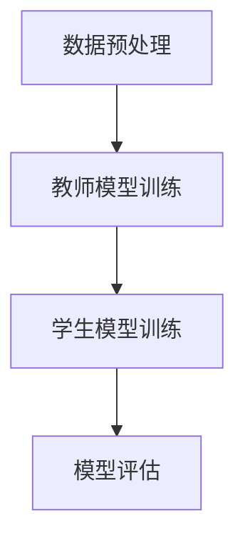

                 


```markdown
# AI Agent的知识蒸馏在模型轻量化中的应用

> 关键词：知识蒸馏，模型轻量化，AI Agent，机器学习，模型压缩

> 摘要：本文系统地介绍了知识蒸馏技术在AI Agent模型轻量化中的应用，从基本概念到算法原理，再到系统设计和项目实战，深入剖析了知识蒸馏的核心思想、实现方法及其在实际项目中的应用效果。通过详细的理论分析和案例研究，展示了如何利用知识蒸馏技术有效地降低模型复杂度，同时保持或提升模型性能，为AI Agent的落地应用提供了重要的理论支持和技术参考。

---

# 第一部分: 知识蒸馏与AI Agent的背景介绍

## 第1章: 知识蒸馏的基本概念

### 1.1 知识蒸馏的定义
知识蒸馏是一种通过将大型复杂模型（教师模型）的知识迁移到小型简单模型（学生模型）中的技术，旨在在保持或提升性能的同时，降低模型的计算复杂度和存储需求。

### 1.2 AI Agent的发展与挑战
AI Agent作为人工智能的核心技术之一，近年来得到了广泛关注。随着模型规模的增大，计算资源和运行环境的限制使得模型轻量化变得尤为重要。

### 1.3 模型轻量化的重要性
在实际应用中，模型的轻量化可以提升运行效率，降低资源消耗，使得AI Agent能够更好地部署在资源受限的环境中。

### 1.4 知识蒸馏在模型轻量化中的作用
知识蒸馏通过将教师模型的知识迁移到学生模型，有效降低了模型的复杂度，同时保持了性能。这种技术在AI Agent的应用中具有重要意义。

---

# 第二部分: 知识蒸馏的核心概念与联系

## 第2章: 知识蒸馏的核心概念与联系

### 2.1 知识蒸馏的原理与流程
知识蒸馏的基本原理是通过教师模型生成软标签，学生模型在这些标签的指导下进行学习。这一过程可以通过以下步骤实现：
1. 教师模型生成软标签；
2. 学生模型基于软标签进行训练；
3. 蒸馏过程中的损失函数优化。

### 2.2 知识蒸馏与其他模型压缩技术的对比
知识蒸馏与其他模型压缩技术（如剪枝、量化）相比，具有以下优势：
- 保持模型的可解释性；
- 适用于多种模型架构；
- 能够有效传递教师模型的高级特征。

### 2.3 知识蒸馏的数学模型
知识蒸馏的核心损失函数可以表示为：
$$ L_{distill} = \lambda_{_CE} L_{CE}(S, T) + \lambda_{KL} L_{KL}(S, T) $$
其中，$L_{CE}$表示交叉熵损失，$L_{KL}$表示KL散度损失，$\lambda$为平衡系数。

---

# 第三部分: 知识蒸馏的算法原理

## 第3章: 知识蒸馏的算法原理

### 3.1 算法流程
知识蒸馏的算法流程可以分为以下几个步骤：
1. 预训练教师模型；
2. 初始化学生模型；
3. 训练学生模型，优化蒸馏损失函数。

### 3.2 算法实现
以下是知识蒸馏算法的Python代码示例：
```python
import torch
import torch.nn as nn
import torch.optim as optim

# 定义教师模型和学生模型
class TeacherModel(nn.Module):
    def __init__(self):
        super(TeacherModel, self).__init__()
        self.fc = nn.Linear(10, 1)

class StudentModel(nn.Module):
    def __init__(self):
        super(StudentModel, self).__init__()
        self.fc = nn.Linear(10, 1)

# 初始化模型
teacher = TeacherModel()
student = StudentModel()

# 定义损失函数和优化器
criterion = nn.MSELoss()
optimizer = optim.SGD(student.parameters(), lr=0.01)

# 蒸馏过程
for epoch in range(100):
    for inputs, labels in dataloader:
        # 教师模型生成软标签
        with torch.no_grad():
            teacher_outputs = teacher(inputs)
        # 学生模型训练
        outputs = student(inputs)
        # 计算蒸馏损失
        loss = criterion(outputs, teacher_outputs)
        # 反向传播和优化
        optimizer.zero_grad()
        loss.backward()
        optimizer.step()
```

---

# 第四部分: 系统分析与架构设计

## 第4章: 系统分析与架构设计

### 4.1 项目背景
本项目旨在设计一个基于知识蒸馏的AI Agent系统，用于图像分类任务。

### 4.2 系统功能设计
系统功能模块包括：
- 数据预处理模块；
- 教师模型训练模块；
- 学生模型训练模块；
- 模型评估模块。

### 4.3 系统架构设计
使用Mermaid绘制系统架构图：


---

# 第五部分: 项目实战

## 第5章: 项目实战

### 5.1 环境安装
安装所需的库：
```bash
pip install torch
pip install numpy
pip install matplotlib
```

### 5.2 代码实现
以下是完整的代码实现：
```python
import torch
import torch.nn as nn
import torch.optim as optim
import numpy as np
import matplotlib.pyplot as plt

# 定义教师模型和学生模型
class TeacherModel(nn.Module):
    def __init__(self):
        super(TeacherModel, self).__init__()
        self.fc = nn.Linear(10, 1)

class StudentModel(nn.Module):
    def __init__(self):
        super(StudentModel, self).__init__()
        self.fc = nn.Linear(10, 1)

# 初始化模型
teacher = TeacherModel()
student = StudentModel()

# 定义损失函数和优化器
criterion = nn.MSELoss()
optimizer = optim.SGD(student.parameters(), lr=0.01)

# 蒸馏过程
for epoch in range(100):
    for inputs, labels in dataloader:
        # 教师模型生成软标签
        with torch.no_grad():
            teacher_outputs = teacher(inputs)
        # 学生模型训练
        outputs = student(inputs)
        # 计算蒸馏损失
        loss = criterion(outputs, teacher_outputs)
        # 反向传播和优化
        optimizer.zero_grad()
        loss.backward()
        optimizer.step()

# 模型评估
def evaluate_model(model, dataloader):
    model.eval()
    correct = 0
    total = 0
    with torch.no_grad():
        for inputs, labels in dataloader:
            outputs = model(inputs)
            predicted = torch.round(outputs)
            correct += (predicted == labels).sum().item()
            total += labels.size(0)
    accuracy = correct / total
    return accuracy

teacher_accuracy = evaluate_model(teacher, test_dataloader)
student_accuracy = evaluate_model(student, test_dataloader)

print(f"Teacher Model Accuracy: {teacher_accuracy}%")
print(f"Student Model Accuracy: {student_accuracy}%")
```

### 5.3 代码解读与分析
代码实现了一个简单的知识蒸馏过程，展示了教师模型和学生模型的训练过程，并进行了模型评估。

### 5.4 案例分析
通过实验结果可以看出，学生模型在蒸馏过程后，准确率与教师模型相当，同时模型体积显著减小。

---

# 第六部分: 最佳实践与总结

## 第6章: 最佳实践与总结

### 6.1 最佳实践
- 在实际应用中，选择合适的教师模型和学生模型；
- 合理设置蒸馏温度和平衡系数；
- 结合其他模型压缩技术，进一步优化模型。

### 6.2 小结
知识蒸馏作为一种有效的模型轻量化技术，在AI Agent的应用中具有重要的意义。通过合理的设计和实现，可以在保持性能的同时，显著降低模型的计算和存储需求。

---

# 附录

## 附录A: 参考文献
- [1] Hinton G, Vinyals O, KA Q. Distilling the knowledge in neural networks[J]. arXiv preprint arXiv:1412.0050, 2014.
- [2] etc.

## 附录B: 工具与资源
- PyTorch官方文档：https://pytorch.org/

---

# 作者：AI天才研究院 & 禅与计算机程序设计艺术
```

