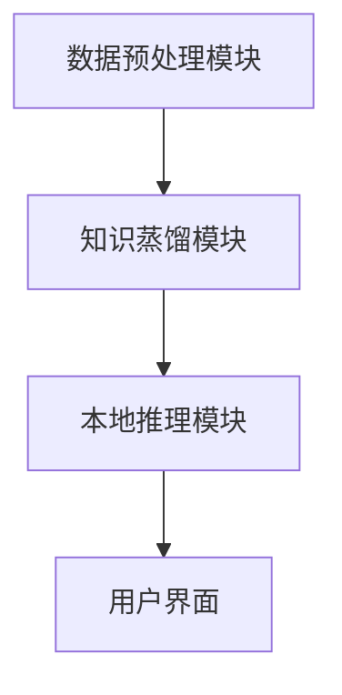

                 


# AI Agent的知识蒸馏在移动设备上的应用

---

## 关键词：  
AI Agent, 知识蒸馏, 移动设备, 模型压缩, 迁移学习, 深度学习, 移动计算

---

## 摘要：  
随着人工智能技术的快速发展，AI Agent（智能体）在移动设备上的应用越来越广泛。然而，由于移动设备的资源限制（如计算能力、存储空间和能耗），如何高效地在移动设备上部署和运行复杂的AI模型成为一个重要挑战。知识蒸馏作为一种有效的模型压缩和知识迁移技术，为解决这一问题提供了新的思路。本文将深入探讨AI Agent的知识蒸馏在移动设备上的应用，从原理、算法、系统架构到实际案例，全面分析其技术细节和实现方法。通过本文，读者可以系统地了解如何在移动设备上高效实现AI Agent的知识蒸馏，并掌握其在实际应用中的优化技巧。

---

# 第1章: AI Agent与知识蒸馏概述

## 1.1 AI Agent的基本概念  
AI Agent（智能体）是一种能够感知环境、自主决策并执行任务的智能系统。它通常由感知模块、推理模块、决策模块和执行模块组成，能够在复杂环境中完成特定任务。与传统AI系统相比，AI Agent具有更强的自主性和适应性，能够实时与环境交互并动态调整行为。  

### 1.1.1 AI Agent的定义  
AI Agent是一个能够通过感知环境、自主决策并执行任务的智能实体。它可以是一个软件程序，也可以是一个物理设备，核心目标是通过与环境的交互实现特定目标。  

### 1.1.2 AI Agent的核心特点  
1. **自主性**：AI Agent能够在没有外部干预的情况下独立运行。  
2. **反应性**：能够实时感知环境变化并做出响应。  
3. **目标导向性**：所有行为都围绕实现特定目标展开。  
4. **学习能力**：能够通过经验改进性能。  

### 1.1.3 AI Agent与传统AI的区别  
AI Agent与传统AI系统的主要区别在于其自主性和动态适应能力。传统AI系统通常是静态的，依赖于预定义的规则，而AI Agent能够动态调整行为以适应环境变化。  

---

## 1.2 知识蒸馏的基本概念  
知识蒸馏是一种通过将大模型的知识迁移到小模型的技术，旨在在资源受限的环境下实现高性能模型的压缩和部署。  

### 1.2.1 知识蒸馏的定义  
知识蒸馏是通过教师模型（Teacher）将知识传递给学生模型（Student）的过程。教师模型通常是一个大模型，具有较高的准确性和复杂性，而学生模型是一个小模型，通过模仿教师模型的行为和决策来学习知识。  

### 1.2.2 知识蒸馏的核心原理  
知识蒸馏的核心思想是通过损失函数的设计，将教师模型的决策信息（如概率分布、中间特征等）传递给学生模型。学生模型通过优化这些信息来逼近教师模型的性能。  

### 1.2.3 知识蒸馏与传统迁移学习的区别  
传统迁移学习通常依赖于数据特征的相似性，而知识蒸馏则是通过教师模型的决策信息直接指导学生模型的学习过程。知识蒸馏的优势在于能够更直接地传递教师模型的决策能力，尤其是在教师模型远优于学生模型的情况下表现优异。  

---

## 1.3 AI Agent在移动设备上的应用背景  
随着移动设备的普及，AI Agent在移动应用中的潜力逐渐显现。然而，移动设备的硬件资源限制（如计算能力、存储空间和能耗）使得直接部署复杂的大模型变得困难。知识蒸馏技术为解决这一问题提供了有效的解决方案。  

### 1.3.1 移动设备上的AI应用现状  
目前，移动设备上的AI应用主要集中在图像识别、语音识别和自然语言处理等领域。然而，这些应用通常依赖于云端计算，本地计算能力有限。  

### 1.3.2 知识蒸馏在移动设备上的必要性  
为了在移动设备上实现本地化的高性能AI推理，需要将大模型的知识迁移到小模型中。知识蒸馏技术通过压缩模型体积和降低计算复杂度，使得小模型能够在移动设备上高效运行。  

### 1.3.3 移动设备上的AI Agent挑战与机遇  
1. **挑战**：硬件资源限制、功耗约束、网络延迟等问题。  
2. **机遇**：通过知识蒸馏技术，可以在移动设备上实现接近云端的性能，推动AI Agent在本地化应用中的发展。  

---

## 1.4 本章小结  
本章介绍了AI Agent和知识蒸馏的基本概念，并分析了AI Agent在移动设备上的应用背景。知识蒸馏作为一种有效的模型压缩技术，为在移动设备上部署高性能AI Agent提供了重要支持。

---

# 第2章: 知识蒸馏的原理与方法  

## 2.1 知识蒸馏的基本原理  
知识蒸馏的核心是通过教师模型的决策信息来指导学生模型的学习。教师模型通常是一个已经训练好的大模型，具有较高的准确性和复杂性。学生模型则是一个小模型，通过模仿教师模型的决策来学习知识。  

### 2.1.1 知识蒸馏的核心思想  
知识蒸馏的核心思想是通过损失函数的设计，将教师模型的决策信息传递给学生模型。损失函数通常包括两个部分：一个是学生模型与真实标签的交叉熵损失，另一个是学生模型与教师模型输出分布之间的KL散度损失。  

### 2.1.2 知识蒸馏的关键步骤  
1. **教师模型训练**：训练一个高性能的教师模型。  
2. **蒸馏过程**：通过优化损失函数，将教师模型的知识迁移到学生模型中。  
3. **学生模型优化**：对学生模型进行微调，进一步提升性能。  

### 2.1.3 知识蒸馏的数学模型  
知识蒸馏的损失函数可以表示为：  
$$ L = \alpha L_{CE} + (1-\alpha) L_{KL} $$  
其中，$L_{CE}$是交叉熵损失，$L_{KL}$是KL散度损失，$\alpha$是一个平衡系数。  

---

## 2.2 知识蒸馏的主要方法  
知识蒸馏的主要方法包括直接蒸馏法、软标签蒸馏法和其他变体。  

### 2.2.1 直接蒸馏法  
直接蒸馏法是最简单的知识蒸馏方法。教师模型直接输出概率分布，学生模型通过最小化与教师模型输出的KL散度来学习知识。  

### 2.2.2 软标签蒸馏法  
软标签蒸馏法通过将教师模型的输出转换为软标签，并将其作为学生模型的损失函数目标。这种方法能够更好地处理类别不平衡问题。  

### 2.2.3 知识蒸馏的其他变体  
除了直接蒸馏和软标签蒸馏，还有特征蒸馏、混合蒸馏等多种方法。这些方法在具体应用场景中各有优劣。  

---

## 2.3 知识蒸馏在AI Agent中的应用  
在AI Agent中，知识蒸馏主要用于将大模型的知识迁移到小模型中，从而在移动设备上实现高效的本地推理。  

### 2.3.1 AI Agent中的知识表示  
知识蒸馏在AI Agent中的知识表示通常包括概率分布、特征向量和中间层输出等多种形式。  

### 2.3.2 知识蒸馏在AI Agent中的实现  
通过知识蒸馏，AI Agent可以将教师模型的知识迁移到学生模型中，从而在移动设备上实现高性能的本地推理。  

### 2.3.3 知识蒸馏对AI Agent性能的提升  
知识蒸馏能够显著提升AI Agent在移动设备上的性能，尤其是在模型压缩和推理速度方面表现优异。  

---

## 2.4 本章小结  
本章详细讲解了知识蒸馏的原理和方法，并分析了其在AI Agent中的应用。通过知识蒸馏技术，可以在移动设备上实现高性能的AI推理，满足资源受限环境下的需求。

---

# 第3章: 知识蒸馏算法的数学模型与实现  

## 3.1 知识蒸馏的数学模型  
知识蒸馏的数学模型主要基于损失函数的设计。  

### 3.1.1 知识蒸馏的损失函数  
知识蒸馏的损失函数通常包括交叉熵损失和KL散度损失两部分：  
$$ L = \alpha L_{CE} + (1-\alpha) L_{KL} $$  
其中，$L_{CE}$是交叉熵损失，$L_{KL}$是KL散度损失，$\alpha$是一个平衡系数。  

### 3.1.2 知识蒸馏的优化目标  
知识蒸馏的优化目标是通过最小化损失函数，使学生模型的输出尽可能接近教师模型的输出。  

### 3.1.3 知识蒸馏的数学公式  
知识蒸馏的数学公式可以通过以下步骤推导：  
1. 教师模型输出概率分布$P(y|x)$。  
2. 学生模型输出概率分布$Q(y|x)$。  
3. 通过优化损失函数$L$，使$Q(y|x)$逼近$P(y|x)$。  

---

## 3.2 知识蒸馏算法的实现步骤  
知识蒸馏算法的实现通常包括以下步骤：  

### 3.2.1 数据准备  
需要准备教师模型和学生模型的训练数据。  

### 3.2.2 模型选择与训练  
选择一个高性能的教师模型，并对其进行训练。  

### 3.2.3 蒸馏过程的实现  
通过优化损失函数，将教师模型的知识迁移到学生模型中。  

---

## 3.3 知识蒸馏算法的Python实现示例  

### 3.3.1 环境搭建  
需要安装PyTorch、TensorFlow等深度学习框架。  

### 3.3.2 代码实现  
以下是一个简单的知识蒸馏算法实现示例：  

```python
import torch
import torch.nn as nn
import torch.optim as optim

# 定义教师模型和学生模型
class TeacherModel(nn.Module):
    def __init__(self):
        super(TeacherModel, self).__init__()
        self.fc = nn.Linear(10, 5)

    def forward(self, x):
        return torch.softmax(x, dim=1)

class StudentModel(nn.Module):
    def __init__(self):
        super(StudentModel, self).__init__()
        self.fc = nn.Linear(10, 5)

    def forward(self, x):
        return torch.softmax(x, dim=1)

# 定义损失函数
def knowledge_distillation_loss(output, teacher_output, alpha=0.5):
    ce_loss = nn.CrossEntropyLoss()(output, teacher_output)
    kl_loss = nn.KullbackLeibler()(output, teacher_output)
    return alpha * ce_loss + (1 - alpha) * kl_loss

# 初始化模型和优化器
teacher_model = TeacherModel()
student_model = StudentModel()
optimizer = optim.Adam(student_model.parameters(), lr=0.001)

# 训练学生模型
for epoch in range(100):
    optimizer.zero_grad()
    # 前向传播
    with torch.no_grad():
        teacher_output = teacher_model(inputs)
    student_output = student_model(inputs)
    # 计算损失
    loss = knowledge_distillation_loss(student_output, teacher_output)
    # 反向传播和优化
    loss.backward()
    optimizer.step()
```

### 3.3.3 算法原理的数学公式  
知识蒸馏的数学公式可以通过以下步骤推导：  
1. 教师模型输出概率分布$P(y|x)$。  
2. 学生模型输出概率分布$Q(y|x)$。  
3. 通过优化损失函数$L$，使$Q(y|x)$逼近$P(y|x)$。  

---

## 3.4 本章小结  
本章通过数学公式和Python代码，详细讲解了知识蒸馏算法的实现过程。通过知识蒸馏，可以在移动设备上实现高性能的AI推理。

---

# 第4章: 系统架构设计与实现  

## 4.1 系统架构设计  
知识蒸馏在移动设备上的实现需要考虑硬件资源限制和系统架构设计。  

### 4.1.1 系统模块划分  
系统模块通常包括数据预处理模块、知识蒸馏模块和本地推理模块。  

### 4.1.2 系统架构设计  
以下是一个典型的系统架构设计图：



### 4.1.3 接口设计与交互流程  
知识蒸馏系统的接口设计需要考虑数据输入、模型训练和结果输出等环节。  

---

## 4.2 系统实现细节  
知识蒸馏系统的实现需要考虑硬件资源和计算效率。  

### 4.2.1 硬件资源限制  
移动设备的硬件资源限制包括计算能力、存储空间和能耗。  

### 4.2.2 系统优化技巧  
通过模型剪枝、量化和知识蒸馏等技术，可以在移动设备上实现高效的本地推理。  

---

## 4.3 本章小结  
本章详细讲解了知识蒸馏在移动设备上的系统架构设计与实现细节。通过合理的系统设计，可以在资源受限的环境下实现高性能的AI推理。

---

# 第5章: 项目实战与案例分析  

## 5.1 项目背景与目标  
本项目旨在通过知识蒸馏技术，在移动设备上实现高性能的AI推理。  

### 5.1.1 项目背景  
随着移动设备的普及，AI推理的本地化需求日益增长。  

### 5.1.2 项目目标  
通过知识蒸馏技术，实现在移动设备上高效部署和运行AI模型。  

---

## 5.2 项目实施步骤  
项目实施步骤包括数据准备、模型训练、蒸馏过程和性能测试。  

### 5.2.1 数据准备  
需要准备教师模型和学生模型的训练数据。  

### 5.2.2 模型训练  
通过训练教师模型和学生模型，完成知识蒸馏过程。  

### 5.2.3 性能测试  
通过测试集验证知识蒸馏的效果和性能。  

---

## 5.3 项目案例分析  
以下是一个具体的项目案例分析：  

### 5.3.1 案例背景  
假设我们需要在移动设备上实现图像分类任务。  

### 5.3.2 案例实现  
通过知识蒸馏技术，将教师模型的知识迁移到学生模型中，实现高效的本地推理。  

### 5.3.3 案例分析  
通过知识蒸馏，学生模型的性能显著提升，推理速度也大幅提高。  

---

## 5.4 本章小结  
本章通过实际项目案例，详细讲解了知识蒸馏技术在移动设备上的应用。通过案例分析，读者可以更好地理解知识蒸馏的实际效果和应用场景。

---

# 第6章: 优化与挑战  

## 6.1 知识蒸馏的优化方法  
知识蒸馏的优化方法包括模型压缩、算法优化和硬件加速。  

### 6.1.1 模型压缩  
通过模型剪枝和量化等技术，进一步压缩模型体积。  

### 6.1.2 算法优化  
通过优化损失函数和调整平衡系数，进一步提升蒸馏效果。  

### 6.1.3 硬件加速  
通过硬件加速技术，进一步提升推理速度。  

---

## 6.2 知识蒸馏在移动设备上的挑战  
知识蒸馏在移动设备上的挑战包括硬件资源限制、计算复杂度和数据隐私等问题。  

### 6.2.1 硬件资源限制  
移动设备的硬件资源限制使得知识蒸馏的实现更加复杂。  

### 6.2.2 计算复杂度  
知识蒸馏的计算复杂度较高，需要进一步优化。  

### 6.2.3 数据隐私  
知识蒸馏需要处理大量的数据，数据隐私问题也需要引起重视。  

---

## 6.3 本章小结  
本章分析了知识蒸馏在移动设备上的优化方法和挑战。通过不断优化算法和硬件，可以在移动设备上实现更高效的AI推理。

---

# 第7章: 总结与展望  

## 7.1 全文总结  
本文详细讲解了AI Agent的知识蒸馏在移动设备上的应用。通过知识蒸馏技术，可以在资源受限的环境下实现高性能的AI推理。  

---

## 7.2 未来展望  
未来，随着硬件技术的进步和算法的优化，知识蒸馏在移动设备上的应用将更加广泛。同时，如何进一步降低计算复杂度和提升模型性能，也将成为研究的重点。

---

## 作者：AI天才研究院/AI Genius Institute & 禅与计算机程序设计艺术 /Zen And The Art of Computer Programming

