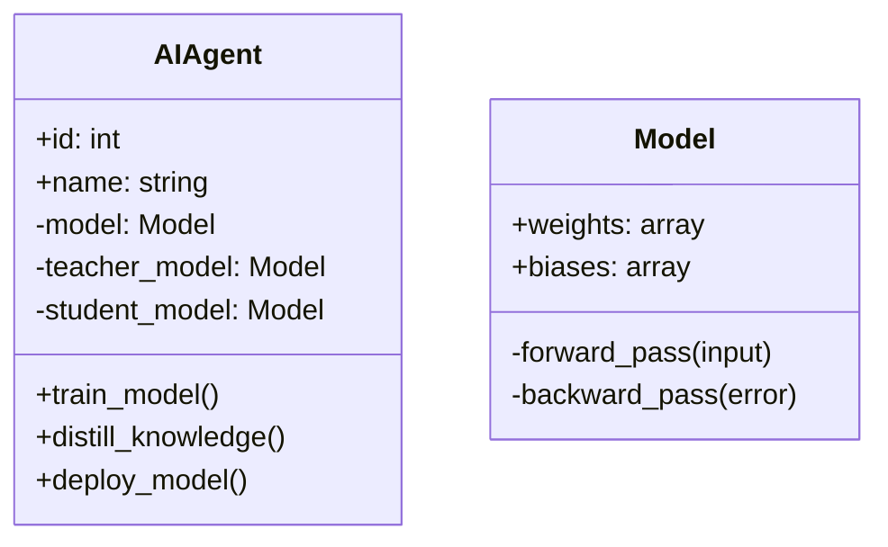
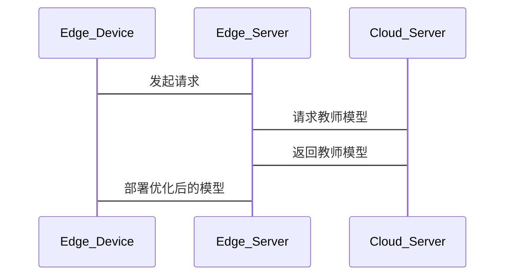

                 


# AI Agent的知识蒸馏在边缘AI中的优化策略

> 关键词：AI Agent，知识蒸馏，边缘AI，模型压缩，优化策略

> 摘要：  
> 随着边缘AI技术的快速发展，AI Agent在边缘计算环境中的应用日益广泛。然而，边缘设备的计算资源有限，如何在保持性能的同时优化AI Agent的模型大小和计算效率成为一个重要挑战。知识蒸馏作为一种有效的模型压缩技术，能够在保持模型性能的前提下显著减少模型的复杂性。本文系统地探讨了AI Agent的知识蒸馏在边缘AI中的优化策略，从理论基础到实际应用，全面分析了其在边缘环境中的优势、挑战及解决方案。

---

# 第一部分: AI Agent与知识蒸馏基础

## 第1章: AI Agent与知识蒸馏概述

### 1.1 AI Agent的基本概念
#### 1.1.1 AI Agent的定义
AI Agent（人工智能代理）是指能够感知环境、自主决策并执行任务的智能实体。它可以是一个软件程序、一个机器人，或者任何能够实现智能行为的实体。

#### 1.1.2 AI Agent的核心特点
- **自主性**：能够自主决策，无需外部干预。
- **反应性**：能够实时感知环境并做出反应。
- **目标导向性**：基于目标进行决策和行动。
- **学习能力**：能够通过经验或数据优化自身行为。

#### 1.1.3 AI Agent与传统AI的区别
传统的AI系统通常依赖于固定的规则和数据，而AI Agent具备更强的自主性和适应性，能够在动态环境中完成复杂任务。

---

### 1.2 知识蒸馏的定义与原理
#### 1.2.1 知识蒸馏的定义
知识蒸馏（Knowledge Distillation）是一种模型压缩技术，通过将大型复杂模型（教师模型）的知识迁移到小型简单模型（学生模型），从而在保持性能的同时减少模型的复杂性。

#### 1.2.2 知识蒸馏的核心原理
知识蒸馏的核心思想是将教师模型的决策过程（概率分布）传递给学生模型，使学生模型能够学习教师模型的决策逻辑。

#### 1.2.3 知识蒸馏与传统模型压缩的区别
| 特性 | 知识蒸馏 | 传统模型压缩 |
|------|----------|---------------|
| 方法 | 基于概率分布的迁移 | 基于剪枝或量化 |
| 优势 | 保持模型性能 | 显著减少模型大小 |
| 应用 | 适用于边缘AI | 适用于特定场景 |

---

### 1.3 边缘AI的背景与挑战
#### 1.3.1 边缘AI的定义与特点
边缘AI是指在边缘计算环境中部署和运行AI模型的技术。边缘计算的特点是数据靠近设备端处理，减少对云端的依赖。

#### 1.3.2 边缘AI的应用场景
- 智能物联网设备
- 边缘服务器
- 移动终端

#### 1.3.3 边缘AI中的计算资源限制
- 计算能力有限
- 存储空间有限
- 带宽受限

---

### 1.4 知识蒸馏在边缘AI中的应用前景
#### 1.4.1 知识蒸馏在边缘AI中的潜在价值
- 减少模型大小，降低计算成本
- 提高模型运行效率
- 适用于资源受限的边缘设备

#### 1.4.2 边缘AI中知识蒸馏的优势
- 知识蒸馏能够显著减少模型复杂性，同时保持性能
- 适用于边缘AI中多设备协同工作的场景

#### 1.4.3 边缘AI中知识蒸馏的挑战与机遇
- 挑战：边缘设备的计算资源有限，如何高效实施知识蒸馏是一个难点
- 机遇：知识蒸馏能够提升边缘AI的部署效率和运行性能

---

## 第2章: 知识蒸馏的核心概念与原理

### 2.1 知识蒸馏的基本原理
#### 2.1.1 知识蒸馏的过程
1. **教师模型**：训练一个大型复杂模型（教师模型）。
2. **知识迁移**：将教师模型的知识迁移到学生模型。
3. **学生模型优化**：通过蒸馏过程优化学生模型的性能。

#### 2.1.2 知识蒸馏的关键步骤
1. **教师模型的训练**：训练一个高性能的教师模型。
2. **蒸馏过程**：通过损失函数将教师模型的概率分布迁移到学生模型。
3. **学生模型的优化**：通过蒸馏过程优化学生模型的参数。

#### 2.1.3 知识蒸馏的核心要素
- **教师模型**：提供知识的来源
- **学生模型**：接收并学习知识的模型
- **损失函数**：衡量教师模型和学生模型之间的差异

---

### 2.2 AI Agent的知识蒸馏模型
#### 2.2.1 AI Agent的知识蒸馏模型的定义
AI Agent的知识蒸馏模型是一种将教师模型的知识迁移到学生模型的AI代理，能够在边缘设备上高效运行。

#### 2.2.2 AI Agent的知识蒸馏模型的结构
1. **教师模型**：大型复杂模型
2. **学生模型**：小型简单模型
3. **蒸馏过程**：通过损失函数将教师模型的知识迁移到学生模型

#### 2.2.3 AI Agent的知识蒸馏模型的特点
- **高效性**：能够在边缘设备上高效运行
- **轻量化**：模型大小显著减少
- **高性能**：保持较高的模型性能

---

### 2.3 知识蒸馏在边缘AI中的应用
#### 2.3.1 知识蒸馏在边缘AI中的应用模式
1. **边缘设备上的知识蒸馏**：在边缘设备上直接进行知识蒸馏
2. **云端的知识蒸馏**：在云端完成知识蒸馏后，将优化后的模型部署到边缘设备

#### 2.3.2 边缘AI中知识蒸馏的优势
- **减少计算成本**：通过知识蒸馏显著减少模型的计算复杂度
- **提高部署效率**：通过知识蒸馏快速部署高性能模型
- **降低带宽需求**：通过知识蒸馏减少模型传输的带宽需求

#### 2.3.3 边缘AI中知识蒸馏的挑战
- **计算资源限制**：边缘设备的计算资源有限，如何高效实施知识蒸馏是一个难点
- **模型兼容性**：如何确保教师模型和学生模型在边缘设备上的兼容性

---

## 第3章: 知识蒸馏的算法原理

### 3.1 知识蒸馏的基本算法
#### 3.1.1 KD（知识蒸馏）算法
KD算法是一种经典的知识蒸馏算法，通过损失函数将教师模型的概率分布迁移到学生模型。

#### 3.1.2 KD算法的数学模型
$$
L = \lambda L_{cls} + (1-\lambda) L_{dist}
$$

其中：
- $L_{cls}$：分类损失
- $L_{dist}$：蒸馏损失
- $\lambda$：平衡参数

#### 3.1.3 KD算法的实现步骤
1. **训练教师模型**：训练一个高性能的教师模型。
2. **定义损失函数**：定义包含分类损失和蒸馏损失的损失函数。
3. **优化学生模型**：通过优化算法优化学生模型的参数。

---

### 3.2 AI Agent的知识蒸馏算法
#### 3.2.1 AI Agent知识蒸馏算法的定义
AI Agent的知识蒸馏算法是一种将教师模型的知识迁移到学生模型的算法，能够在边缘设备上高效运行。

#### 3.2.2 AI Agent知识蒸馏算法的数学模型
$$
L_{agent} = \lambda L_{dist} + (1-\lambda) L_{task}
$$

其中：
- $L_{dist}$：蒸馏损失
- $L_{task}$：任务损失
- $\lambda$：平衡参数

#### 3.2.3 AI Agent知识蒸馏算法的实现步骤
1. **训练教师模型**：训练一个高性能的教师模型。
2. **定义损失函数**：定义包含蒸馏损失和任务损失的损失函数。
3. **优化学生模型**：通过优化算法优化学生模型的参数。

---

### 3.3 知识蒸馏在边缘AI中的优化策略
#### 3.3.1 边缘AI中知识蒸馏的优化目标
- **减少模型大小**：通过知识蒸馏显著减少模型的大小
- **提高运行效率**：通过知识蒸馏提高模型的运行效率
- **保持模型性能**：通过知识蒸馏保持模型的性能

#### 3.3.2 边缘AI中知识蒸馏的优化方法
- **动态蒸馏**：根据边缘设备的资源情况动态调整蒸馏过程
- **多目标蒸馏**：同时优化多个目标，如模型大小和性能
- **分布式蒸馏**：在分布式环境中进行知识蒸馏

#### 3.3.3 边缘AI中知识蒸馏的优化效果
- **模型大小显著减少**：通过知识蒸馏，模型大小减少
- **运行效率提高**：通过知识蒸馏，运行效率提高
- **性能保持稳定**：通过知识蒸馏，性能保持稳定

---

## 第4章: 知识蒸馏的系统分析与架构设计

### 4.1 边缘AI的系统分析
#### 4.1.1 系统功能需求
1. **数据采集**：采集边缘设备的数据
2. **模型训练**：训练教师模型
3. **知识蒸馏**：将教师模型的知识迁移到学生模型
4. **模型部署**：将优化后的模型部署到边缘设备

#### 4.1.2 系统性能需求
1. **计算效率**：高效完成知识蒸馏过程
2. **资源利用率**：充分利用边缘设备的资源
3. **模型性能**：保持模型的高性能

---

### 4.2 系统架构设计
#### 4.2.1 领域模型类图


#### 4.2.2 系统架构图
```mermaid
graph LR
    Edge_Device -> Edge_Server: 数据传输
    Edge_Server -> Cloud_Server: 请求教师模型
    Cloud_Server -> Edge_Server: 返回教师模型
    Edge_Server -> Edge_Device: 部署优化后的模型
```

---

### 4.3 接口设计与交互流程图
#### 4.3.1 系统接口设计
1. **数据接口**：数据采集接口
2. **模型接口**：模型训练接口
3. **蒸馏接口**：知识蒸馏接口
4. **部署接口**：模型部署接口

#### 4.3.2 系统交互流程图


---

## 第5章: 项目实战与案例分析

### 5.1 项目环境与工具安装
#### 5.1.1 环境要求
- **操作系统**：Linux/Windows/macOS
- **编程语言**：Python
- **框架**：TensorFlow/PyTorch
- **依赖库**：numpy, scikit-learn, matplotlib

#### 5.1.2 工具安装
```bash
pip install numpy scikit-learn matplotlib
```

---

### 5.2 知识蒸馏算法实现
#### 5.2.1 教师模型训练
```python
import tensorflow as tf
from tensorflow import keras

# 定义教师模型
teacher_model = keras.Sequential([
    keras.layers.Dense(128, activation='relu'),
    keras.layers.Dense(10, activation='softmax')
])

# 编译教师模型
teacher_model.compile(optimizer='adam', loss='sparse_categorical_crossentropy', metrics=['accuracy'])

# 训练教师模型
teacher_model.fit(x_train, y_train, epochs=10, batch_size=32)
```

#### 5.2.2 知识蒸馏过程
```python
# 定义学生模型
student_model = keras.Sequential([
    keras.layers.Dense(64, activation='relu'),
    keras.layers.Dense(10, activation='softmax')
])

# 编译学生模型
student_model.compile(optimizer='adam', loss='sparse_categorical_crossentropy', metrics=['accuracy'])

# 知识蒸馏过程
teacher_predictions = teacher_model.predict(x_train)
distillation_loss = tf.keras.losses.KLDivergence(reduction='none')
distillation_loss = tf.reduce_mean(distillation_loss(student_predictions, student_predictions))
total_loss = 0.5 * distillation_loss + 0.5 * student_model.loss
```

---

### 5.3 实际案例分析
#### 5.3.1 案例背景
- **任务**：图像分类
- **数据集**：CIFAR-10
- **教师模型**：ResNet50
- **学生模型**：MobileNet

#### 5.3.2 案例实现
```python
# 加载数据集
(x_train, y_train), (x_test, y_test) = keras.datasets.cifar10.load_data()

# 定义教师模型
teacher_model = keras.applications.ResNet50(weights='imagenet', include_top=False)

# 定义学生模型
student_model = keras.Sequential([
    keras.layers.Conv2D(32, (3,3), activation='relu', input_shape=(32,32,3)),
    keras.layers.MaxPooling2D((2,2)),
    keras.layers.Conv2D(64, (3,3), activation='relu'),
    keras.layers.MaxPooling2D((2,2)),
    keras.layers.Flatten(),
    keras.layers.Dense(10, activation='softmax')
])

# 知识蒸馏过程
teacher_predictions = teacher_model.predict(x_train)
distillation_loss = tf.keras.losses.KLDivergence(reduction='none')
distillation_loss = tf.reduce_mean(distillation_loss(teacher_predictions, student_model.predict(x_train)))
total_loss = 0.5 * distillation_loss + 0.5 * student_model.loss

# 优化学生模型
student_model.fit(x_train, y_train, epochs=50, batch_size=32)
```

---

## 第6章: 知识蒸馏的优化策略与最佳实践

### 6.1 知识蒸馏的优化策略
#### 6.1.1 选择合适的蒸馏方法
- **软标签蒸馏**：适用于分类任务
- **硬标签蒸馏**：适用于回归任务
- **多任务蒸馏**：适用于多任务学习

#### 6.1.2 优化蒸馏过程
- **动态调整蒸馏参数**：根据边缘设备的资源情况动态调整蒸馏参数
- **分布式蒸馏**：在分布式环境中进行知识蒸馏

#### 6.1.3 提高蒸馏效率
- **并行蒸馏**：利用多线程或分布式计算提高蒸馏效率
- **增量蒸馏**：逐步优化学生模型，减少计算成本

---

### 6.2 知识蒸馏的最佳实践
#### 6.2.1 小结
知识蒸馏在边缘AI中的应用前景广阔，通过优化蒸馏过程可以显著减少模型的复杂性，同时保持高性能。

#### 6.2.2 注意事项
- **模型兼容性**：确保教师模型和学生模型在边缘设备上的兼容性
- **资源分配**：合理分配边缘设备的计算资源
- **模型更新**：定期更新教师模型以保持学生模型的性能

#### 6.2.3 拓展阅读
- 《Distilling the Knowledge in Neural Networks》
- 《Knowledge Distillation for Deep Neural Networks》

---

## 作者信息

作者：AI天才研究院/AI Genius Institute & 禅与计算机程序设计艺术 /Zen And The Art of Computer Programming

