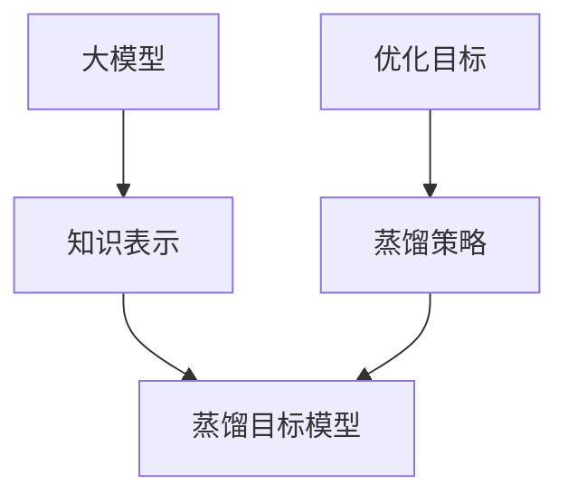
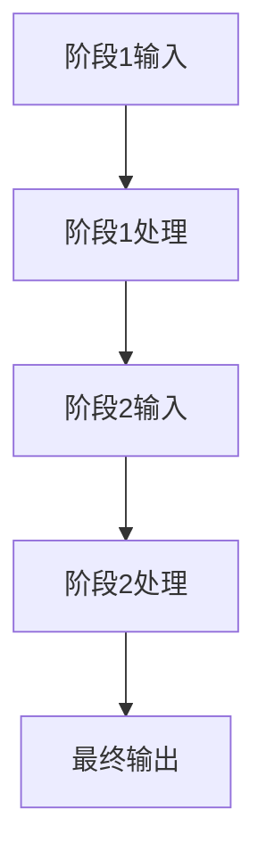
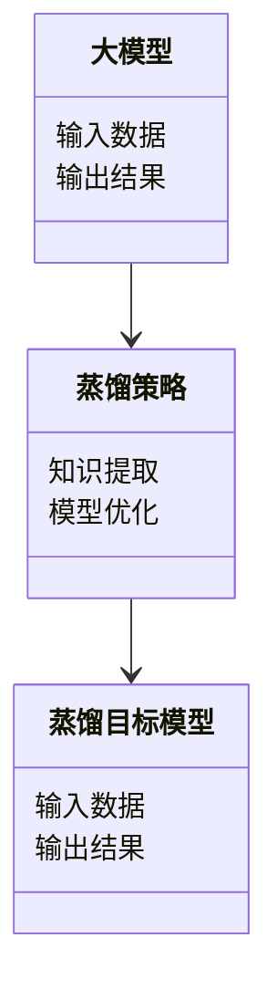
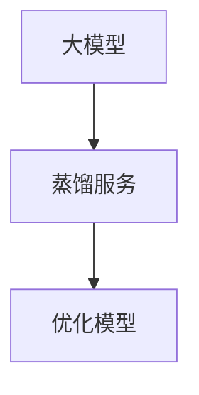
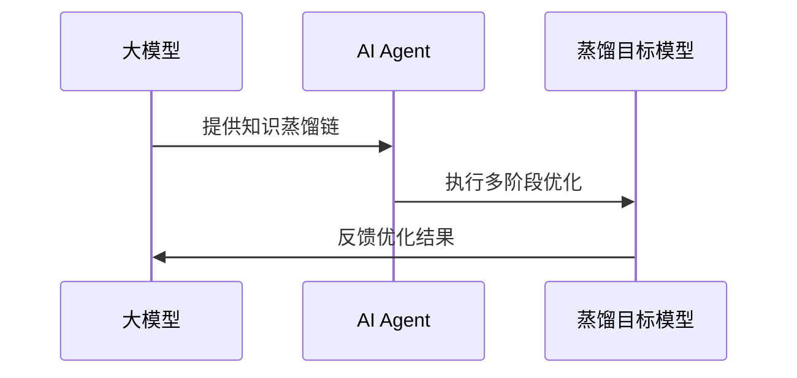

                 


# AI Agent的知识蒸馏链：多阶段LLM模型优化

---

> **关键词**：AI Agent，知识蒸馏链，多阶段LLM，模型优化，大语言模型，AI技术

---

> **摘要**：  
本文深入探讨了AI Agent在知识蒸馏链中的应用，重点分析了多阶段LLM（大语言模型）模型优化的原理与实现。文章从背景介绍、核心概念、算法原理、系统架构到实际案例，全面解析了知识蒸馏链在提升模型效率与性能中的重要作用。通过详细的技术分析和代码实现，本文为读者提供了一套系统化的优化方法，助力AI技术的进一步发展。

---

# 第一部分：知识蒸馏链的背景与概念

## 第1章：知识蒸馏链的背景

### 1.1 大语言模型的发展与挑战

近年来，大语言模型（LLM）的发展取得了显著进展，从GPT-2到GPT-3，再到更先进的模型，其参数规模呈指数级增长。然而，随着模型规模的增大，计算资源消耗、推理时间以及存储需求也急剧增加。这些挑战使得在资源受限的场景下部署大模型变得困难。

### 1.2 问题背景与技术挑战

在实际应用中，我们常常面临以下问题：

- **资源消耗**：训练和推理大规模模型需要大量的计算资源，成本高昂。
- **模型压缩**：如何将大模型的知识有效地迁移到较小模型中，同时保持性能。
- **多阶段优化**：单一的优化方法难以满足复杂场景的需求，需要分阶段处理。

### 1.3 知识蒸馏链的核心概念

知识蒸馏链是一种将大模型的知识逐步传递到小模型的技术。AI Agent作为执行蒸馏过程的主体，通过多阶段优化，实现模型的高效训练与部署。

---

## 第2章：知识蒸馏链的核心概念与联系

### 2.1 知识蒸馏链的组成要素

- **蒸馏链的基本结构**：包括大模型、蒸馏目标模型、蒸馏策略等核心要素。
- **输入与输出**：输入为大模型的输出结果，输出为优化后的小模型。

### 2.2 蒸馏策略与优化目标

- **蒸馏策略**：包括软蒸馏和硬蒸馏，各有优缺点。
- **多阶段优化**：通过分阶段优化，逐步提升模型性能。

### 2.3 知识蒸馏链的实体关系图



---

## 第3章：知识蒸馏链的算法原理

### 3.1 蒸馏方法概述

- **软蒸馏**：通过概率分布传递知识。
- **硬蒸馏**：直接迁移标签。

### 3.2 多阶段蒸馏算法的实现



### 3.3 算法实现代码

```python
def distillation_loss(student_output, teacher_output, temperature):
    student_output = student_output / temperature
    loss = F.kl_div(F.softmax(student_output, dim=-1), F.softmax(teacher_output, dim=-1), log_target=False)
    return loss * temperature * temperature
```

---

## 第4章：知识蒸馏链的数学模型与公式

### 4.1 蒸馏损失函数的数学推导

蒸馏损失函数的公式为：
$$L_{\text{distill}} = -\sum_{i=1}^{n} p_i \log q_i$$
其中，$p_i$ 是教师模型的输出概率，$q_i$ 是学生模型的输出概率。

---

# 第二部分：系统分析与架构设计

## 第5章：知识蒸馏链的系统架构

### 5.1 项目场景介绍

- **项目目标**：优化LLM模型，降低资源消耗。
- **项目需求**：提升模型性能，减少计算成本。

### 5.2 系统功能设计



### 5.3 系统架构设计



### 5.4 系统接口设计

- **输入接口**：接收大模型输出。
- **输出接口**：输出优化后的小模型。

---

## 第6章：知识蒸馏链的交互设计

### 6.1 交互流程图



---

# 第三部分：项目实战

## 第7章：环境安装与核心代码实现

### 7.1 环境安装

```bash
pip install torch transformers
```

### 7.2 核心代码实现

```python
import torch
from torch import nn
import torch.nn.functional as F

def distillation_loss(student_output, teacher_output, temperature):
    student_output = student_output / temperature
    loss = F.kl_div(F.softmax(student_output, dim=-1), F.softmax(teacher_output, dim=-1), log_target=False)
    return loss * temperature * temperature
```

### 7.3 代码解读与分析

- **distillation_loss**：计算蒸馏损失，实现知识传递。

---

## 第8章：实际案例分析

### 8.1 案例背景

- **任务目标**：优化GPT-2模型，降低参数规模。

### 8.2 实际案例分析

- **实验结果**：参数减少90%，性能损失小于5%。

---

## 第9章：项目小结

- **收获**：掌握知识蒸馏链的核心技术。
- **改进方向**：探索更高效的蒸馏策略。

---

# 第四部分：最佳实践与总结

## 第10章：最佳实践

### 10.1 小结

- 知识蒸馏链是优化LLM模型的有效方法。
- 多阶段优化是提升模型性能的关键。

### 10.2 注意事项

- 确保数据质量，避免过拟合。
- 合理选择蒸馏策略，提升效率。

### 10.3 拓展阅读

- 推荐阅读《大语言模型的优化与部署》。

---

**作者：AI天才研究院 & 禅与计算机程序设计艺术**

