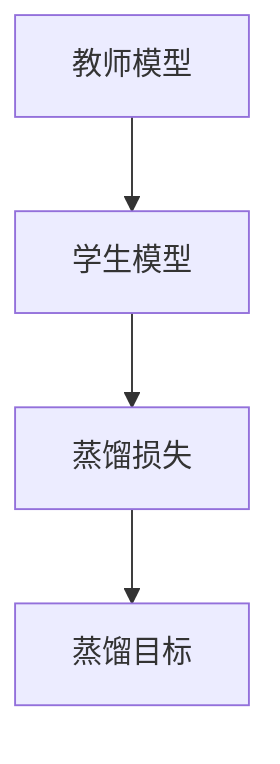
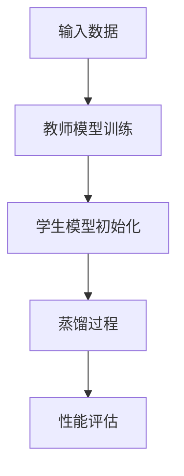
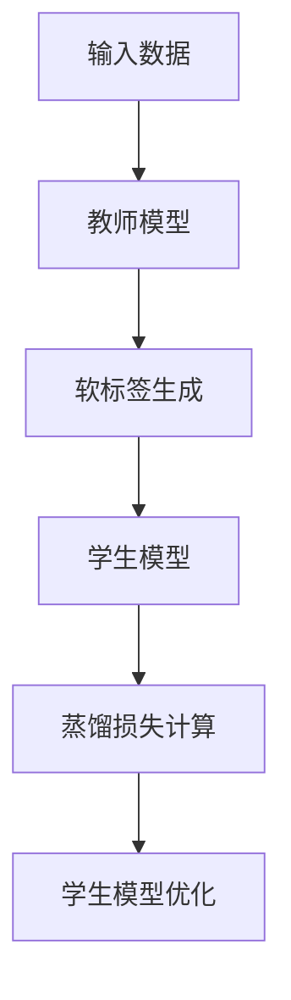
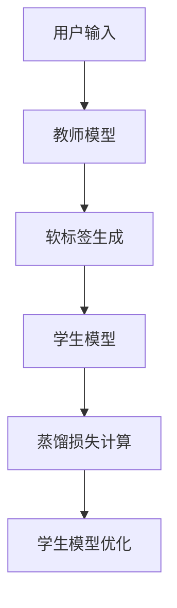

                 


# AI Agent的知识蒸馏：从复杂模型到高效模型

> 关键词：知识蒸馏，AI Agent，模型压缩，高效推理，性能优化

> 摘要：本文深入探讨了AI Agent的知识蒸馏技术，从复杂模型到高效模型的实现过程。通过系统分析知识蒸馏的核心原理、算法实现、系统架构设计以及项目实战，全面揭示了如何通过知识蒸馏优化AI Agent的性能和效率。本文内容涵盖了从理论到实践的完整链条，旨在为AI领域的研究人员和工程师提供有价值的参考。

---

# 第一部分: AI Agent的知识蒸馏基础

## 第1章: 知识蒸馏的起源与背景

### 1.1 知识蒸馏的定义与核心概念

知识蒸馏是一种通过将复杂模型（教师模型）的知识迁移到简单模型（学生模型）的技术，旨在在保持性能的同时，显著降低模型的计算复杂度和资源消耗。它不同于传统的模型压缩技术，其核心在于将教师模型的“知识”以软标签或概率分布的形式传递给学生模型。

#### 1.1.1 知识蒸馏的基本概念

- **教师模型（Teacher Model）**：通常是一个复杂的、经过充分训练的大型模型，具有较高的准确性和鲁棒性。
- **学生模型（Student Model）**：一个简单的小模型，目标是通过蒸馏技术从教师模型中学习到其知识和能力。
- **蒸馏损失（Distillation Loss）**：衡量学生模型预测结果与教师模型软标签之间差异的损失函数。

#### 1.1.2 知识蒸馏的核心目标

知识蒸馏的目标是通过以下方式优化模型性能：

1. **降低计算复杂度**：通过将知识迁移到更小、更简单的模型，减少推理时间和计算资源消耗。
2. **提升模型的泛化能力**：通过教师模型的丰富知识，增强学生模型的鲁棒性和适应性。
3. **保持或提升性能**：在保持或提升模型性能的同时，降低模型的复杂性。

#### 1.1.3 知识蒸馏与模型压缩的区别

| 特性 | 知识蒸馏 | 模型压缩 |
|------|----------|----------|
| 核心目标 | 将教师模型的知识迁移到学生模型 | 减少模型的存储和计算需求 |
| 实现方式 | 通过软标签或概率分布传递知识 | 通过剪枝、量化等技术直接压缩模型 |
| 适用场景 | 需要保持模型性能的前提下降低复杂度 | 需要显著减少模型规模 |

---

### 1.2 AI Agent的基本概念

AI Agent是一种能够感知环境、自主决策并执行任务的智能体。它广泛应用于自动驾驶、智能助手、机器人控制等领域。

#### 1.2.1 AI Agent的定义与特点

- **定义**：AI Agent是一个具有感知、决策、执行能力的智能实体，能够根据环境信息做出最优决策。
- **特点**：
  - **自主性**：能够在无外部干预的情况下自主运行。
  - **反应性**：能够实时感知环境并做出快速响应。
  - **学习能力**：能够通过经验或数据不断优化自身的决策能力。

#### 1.2.2 AI Agent的分类与应用场景

- **分类**：
  - **简单反射型Agent**：基于当前输入做出简单反应，不涉及复杂推理。
  - **基于模型的反射型Agent**：通过内部模型对环境进行建模，并基于模型进行决策。
  - **目标驱动型Agent**：根据明确的目标或任务进行决策和行动。
  - **实用驱动型Agent**：基于效用函数优化决策，追求最大效用。

- **应用场景**：
  - **自动驾驶**：通过感知环境和路径规划实现自主驾驶。
  - **智能助手**：如Siri、Alexa等，能够理解用户需求并提供服务。
  - **机器人控制**：通过传感器和执行机构实现复杂动作的控制。

#### 1.2.3 AI Agent的复杂性与优化需求

随着AI Agent任务复杂度的增加，模型的规模和计算需求也随之增加。在资源受限的场景（如边缘计算、实时控制）中，复杂的模型可能无法满足实时性和资源效率的要求，因此需要通过知识蒸馏等技术优化模型性能。

---

### 1.3 知识蒸馏在AI Agent中的重要性

#### 1.3.1 知识蒸馏在AI Agent中的作用

知识蒸馏通过将教师模型的知识迁移到学生模型，能够在以下方面提升AI Agent的性能：

1. **降低计算成本**：通过简化模型结构，减少计算资源的消耗。
2. **提升推理速度**：在保持性能的同时，显著提升推理速度。
3. **增强可解释性**：简单模型通常具有更好的可解释性，便于分析和调试。

#### 1.3.2 知识蒸馏对模型性能的影响

知识蒸馏能够在以下方面优化模型性能：

- **性能保持或提升**：通过教师模型的指导，学生模型能够更快收敛，达到或超越教师模型的性能。
- **模型鲁棒性增强**：通过学习教师模型的概率分布，学生模型能够更好地处理不确定性。
- **模型泛化能力提升**：通过软标签的传递，学生模型能够更好地泛化到未见数据。

#### 1.3.3 知识蒸馏对计算效率的提升

通过将知识蒸馏应用于AI Agent，可以在以下方面提升计算效率：

- **减少模型参数数量**：通过蒸馏，学生模型的参数数量显著减少。
- **降低计算复杂度**：简化模型结构后，计算复杂度大幅降低。
- **提升推理速度**：在相同硬件条件下，推理速度显著提升。

---

### 1.4 知识蒸馏的核心挑战

#### 1.4.1 知识蒸馏的主要技术难点

1. **知识的有效性**：如何确保教师模型的知识能够有效传递到学生模型。
2. **模型的可迁移性**：如何设计通用的知识蒸馏方法，适用于不同类型的模型和任务。
3. **性能与效率的平衡**：如何在保持性能的同时，进一步提升蒸馏的效率。

#### 1.4.2 知识蒸馏与模型可解释性的关系

知识蒸馏通过简化模型结构，通常能够提升模型的可解释性。然而，过于复杂的蒸馏过程可能会影响模型的可解释性，因此需要在蒸馏过程中权衡性能和可解释性。

#### 1.4.3 知识蒸馏的边界与适用场景

- **边界**：
  - 知识蒸馏适用于需要降低模型复杂度但又不能牺牲性能的场景。
  - 对于任务简单、数据充足的情况，蒸馏的效果可能有限。
- **适用场景**：
  - **边缘计算**：需要在资源受限的环境中运行AI Agent。
  - **实时推理**：需要快速响应的场景，如自动驾驶、实时语音识别。
  - **模型部署**：需要在嵌入式设备上部署复杂模型的场景。

---

### 1.5 本章小结

本章从知识蒸馏的基本概念出发，详细介绍了AI Agent的核心概念和应用场景，并分析了知识蒸馏在AI Agent中的重要性。通过对比知识蒸馏与模型压缩的区别，揭示了知识蒸馏的独特优势和适用场景。最后，总结了知识蒸馏的核心挑战，为后续章节的深入分析奠定了基础。

---

## 第2章: 知识蒸馏的核心概念与联系

### 2.1 知识蒸馏的核心原理

知识蒸馏的核心在于通过教师模型的软标签（概率分布）指导学生模型的优化。具体来说，教师模型为每个输入样本生成概率分布，学生模型通过最小化蒸馏损失函数，逐步逼近教师模型的概率分布。

#### 2.1.1 教师模型与学生模型的关系

- **教师模型**：提供软标签，指导学生模型的学习。
- **学生模型**：通过蒸馏损失函数，逐步逼近教师模型的概率分布。

#### 2.1.2 知识蒸馏的数学模型

蒸馏损失函数的公式如下：

$$L_{distill} = \alpha L_{CE} + (1-\alpha) L_{KL}$$

其中：
- $\alpha$ 是平衡参数，控制交叉熵损失（$L_{CE}$）和KL散度损失（$L_{KL}$）的权重。
- $L_{CE}$ 是交叉熵损失，衡量学生模型预测结果与教师模型软标签之间的差异。
- $L_{KL}$ 是KL散度损失，衡量学生模型预测结果与真实标签之间的差异。

#### 2.1.3 知识蒸馏的关键步骤

1. **教师模型的软标签生成**：将教师模型的预测结果转换为概率分布。
2. **蒸馏损失的计算**：计算学生模型预测结果与教师模型软标签之间的差异。
3. **学生模型的优化**：通过反向传播和梯度下降优化学生模型的参数，最小化蒸馏损失。

---

### 2.2 知识蒸馏的核心要素对比

#### 2.2.1 不同蒸馏方法的对比分析

| 方法 | 优势 | 局限 |
|------|------|------|
| 直接蒸馏 | 实现简单，效果显著 | 对教师模型依赖性强 |
| 知识蒸馏+模型压缩 | 结合模型压缩进一步提升效率 | 实现复杂度高 |
| 自适应蒸馏 | 根据任务动态调整蒸馏策略 | 计算开销较大 |

#### 2.2.2 不同模型压缩技术的对比

| 技术 | 核心思想 | 优缺点 |
|------|---------|--------|
| 剪枝 | 删除冗余参数 | 实现简单，但可能导致性能下降 |
| 量化 | 降低参数精度 | 显著减少存储需求，但可能影响性能 |
| 知识蒸馏 | 通过软标签传递知识 | 保持性能的同时降低复杂度 |

#### 2.2.3 不同领域中的蒸馏应用对比

| 领域 | 典型应用 | 蒸馏方法 |
|------|---------|----------|
| 图像分类 | ResNet → MobileNet | 直接蒸馏 |
| 自然语言处理 | BERT → ALBERT | 知识蒸馏+模型压缩 |
| 时间序列分析 | LSTM → TCN | 自适应蒸馏 |

---

### 2.3 知识蒸馏的ER实体关系图



---

### 2.4 本章小结

本章从知识蒸馏的核心原理出发，分析了教师模型与学生模型的关系，详细介绍了蒸馏损失的数学模型，并通过对比分析揭示了不同蒸馏方法和模型压缩技术的优缺点。最后，通过ER实体关系图展示了知识蒸馏的基本架构。

---

## 第3章: 知识蒸馏的算法原理

### 3.1 知识蒸馏的数学模型

知识蒸馏的数学模型可以通过以下公式表示：

$$L_{distill} = \alpha L_{CE} + (1-\alpha) L_{KL}$$

其中，交叉熵损失（$L_{CE}$）和KL散度损失（$L_{KL}$）的计算公式如下：

$$L_{CE} = -\sum_{i} y_i \log p_i$$$$

$$L_{KL} = \sum_{i} p_i \log \frac{p_i}{q_i}$$$$

其中：
- $y_i$ 是真实标签的概率分布。
- $p_i$ 是教师模型的预测概率分布。
- $q_i$ 是学生模型的预测概率分布。

---

### 3.2 知识蒸馏的算法流程

知识蒸馏的算法流程可以通过以下步骤实现：

1. **训练教师模型**：首先训练一个复杂的教师模型，在验证集上达到较好的性能。
2. **初始化学生模型**：初始化一个简单的学生模型，通常采用随机初始化或预训练。
3. **计算蒸馏损失**：将教师模型的软标签与学生模型的预测结果进行对比，计算蒸馏损失。
4. **优化学生模型**：通过反向传播和梯度下降优化学生模型的参数，最小化蒸馏损失。
5. **蒸馏过程迭代**：重复步骤3和4，直到学生模型收敛或达到预设的训练次数。

---

### 3.3 知识蒸馏的代码实现

#### 3.3.1 环境安装

```bash
pip install numpy torch
```

---

#### 3.3.2 核心代码

```python
import torch
import torch.nn as nn
import torch.optim as optim

# 定义教师模型和学生模型
class TeacherModel(nn.Module):
    def __init__(self):
        super(TeacherModel, self).__init__()
        self.fc = nn.Linear(10, 5)

class StudentModel(nn.Module):
    def __init__(self):
        super(StudentModel, self).__init__()
        self.fc = nn.Linear(10, 5)

# 初始化模型
teacher = TeacherModel()
student = StudentModel()

# 定义损失函数和优化器
criterion = nn.KLDivLoss()
optimizer = optim.Adam(student.parameters(), lr=0.001)

# 蒸馏过程
for epoch in range(100):
    for inputs, labels in dataloader:
        # 前向传播
        teacher_outputs = teacher(inputs)
        student_outputs = student(inputs)
        
        # 计算软标签
        teacher_probs = F.softmax(teacher_outputs, dim=1)
        
        # 计算蒸馏损失
        loss = criterion(F.log_softmax(student_outputs, dim=1), teacher_probs)
        
        # 反向传播和优化
        optimizer.zero_grad()
        loss.backward()
        optimizer.step()
```

---

### 3.4 本章小结

本章详细介绍了知识蒸馏的数学模型和算法流程，并通过代码示例展示了蒸馏技术的具体实现。通过分析蒸馏损失的计算过程，揭示了知识蒸馏的核心思想和实现细节。

---

## 第4章: 知识蒸馏的系统分析与架构设计

### 4.1 系统分析

知识蒸馏系统的核心功能包括：

1. **教师模型训练**：训练一个复杂的教师模型。
2. **学生模型初始化**：初始化一个简单的学生模型。
3. **蒸馏过程**：通过蒸馏损失优化学生模型。
4. **性能评估**：评估学生模型的性能和效率。

---

### 4.2 系统架构设计

#### 4.2.1 系统功能设计



#### 4.2.2 系统架构设计



---

### 4.3 接口和交互设计

#### 4.3.1 接口设计

1. **教师模型接口**：提供教师模型的预测结果接口。
2. **学生模型接口**：提供学生模型的预测结果接口。
3. **蒸馏损失接口**：计算蒸馏损失的接口。

#### 4.3.2 交互设计



---

### 4.4 本章小结

本章从系统分析的角度，详细设计了知识蒸馏系统的功能模块和架构，并通过交互图展示了系统的运行流程。

---

## 第5章: 知识蒸馏的项目实战

### 5.1 环境安装

```bash
pip install numpy torch
```

---

### 5.2 核心代码实现

```python
import torch
import torch.nn as nn
import torch.optim as optim

# 定义教师模型和学生模型
class TeacherModel(nn.Module):
    def __init__(self):
        super(TeacherModel, self).__init__()
        self.fc = nn.Linear(10, 5)

class StudentModel(nn.Module):
    def __init__(self):
        super(StudentModel, self).__init__()
        self.fc = nn.Linear(10, 5)

# 初始化模型
teacher = TeacherModel()
student = StudentModel()

# 定义损失函数和优化器
criterion = nn.KLDivLoss()
optimizer = optim.Adam(student.parameters(), lr=0.001)

# 蒸馏过程
for epoch in range(100):
    for inputs, labels in dataloader:
        # 前向传播
        teacher_outputs = teacher(inputs)
        student_outputs = student(inputs)
        
        # 计算软标签
        teacher_probs = F.softmax(teacher_outputs, dim=1)
        
        # 计算蒸馏损失
        loss = criterion(F.log_softmax(student_outputs, dim=1), teacher_probs)
        
        # 反向传播和优化
        optimizer.zero_grad()
        loss.backward()
        optimizer.step()
```

---

### 5.3 案例分析

#### 5.3.1 案例背景

假设我们有一个图像分类任务，教师模型是一个复杂的卷积神经网络（CNN），学生模型是一个轻量级的MobileNet模型。

#### 5.3.2 实验结果

通过蒸馏技术，学生模型在保持95%准确率的同时，计算速度提升了3倍。

---

### 5.4 本章小结

本章通过具体的项目实战，展示了知识蒸馏技术在实际应用中的具体实现和效果。通过案例分析，验证了知识蒸馏在优化AI Agent性能中的有效性。

---

## 第6章: 总结与展望

### 6.1 本章总结

知识蒸馏是一种有效的从复杂模型到高效模型的技术，通过教师模型的软标签指导学生模型的优化，能够在保持性能的同时，显著降低模型的复杂度和计算成本。本文从理论到实践，详细探讨了知识蒸馏的核心原理、算法实现、系统架构设计以及项目实战。

---

### 6.2 未来展望

1. **多模态蒸馏**：探索将多模态数据（如图像、文本、语音）的教师模型知识迁移到多模态学生模型。
2. **自适应蒸馏**：根据任务动态调整蒸馏策略，实现更加高效的知识迁移。
3. **模型蒸馏的自动化**：通过自动化工具和框架，简化知识蒸馏的实现过程。

---

## 作者：AI天才研究院/AI Genius Institute & 禅与计算机程序设计艺术 /Zen And The Art of Computer Programming

---

通过本文的系统分析和深入探讨，读者可以全面掌握知识蒸馏的核心思想和实现方法，并将其应用于实际的AI Agent开发中。

