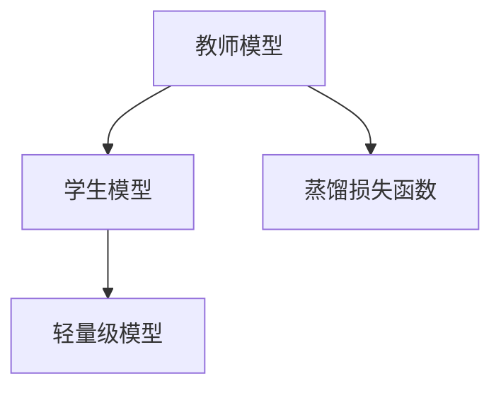
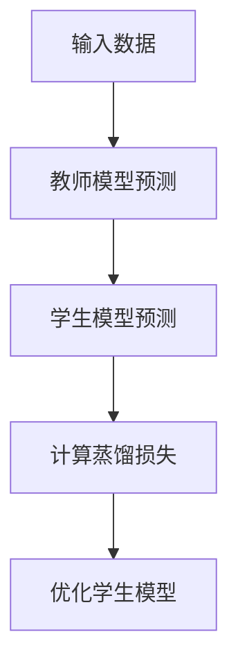
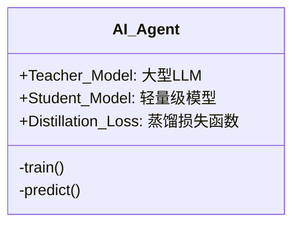
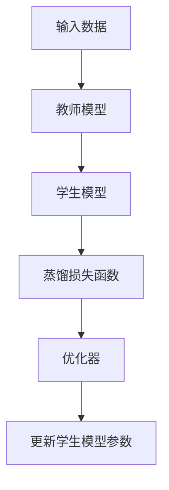

                 


# 《AI Agent的知识蒸馏：从大型LLM到轻量级模型》

---

## 关键词

- AI Agent
- 知识蒸馏
- 大型LLM
- 轻量级模型
- 系统架构设计
- 实战案例

---

## 摘要

本文系统地探讨了AI Agent的知识蒸馏技术，从大型语言模型（LLM）到轻量级模型的转换过程。文章首先介绍了知识蒸馏的基本概念、核心原理和应用场景，接着深入分析了蒸馏过程中的算法原理、系统架构设计以及实际项目实现。通过详细的代码示例和案例分析，本文帮助读者理解如何在实际项目中应用知识蒸馏技术，优化AI Agent的性能和资源利用率。最后，文章总结了知识蒸馏的关键点和未来发展方向。

---

## 第一部分: AI Agent的知识蒸馏概述

---

## 第二部分: 知识蒸馏的核心概念

### 第1章: 知识蒸馏的核心概念

#### 1.1 问题背景与目标

- **1.1.1 从大型LLM到轻量级模型的挑战**
  - 大型LLM的计算资源消耗高
  - 轻量级模型的需求：推理速度快、资源消耗低
  - 知识蒸馏的目标：将大型模型的知识迁移到轻量级模型

- **1.1.2 知识蒸馏的定义与目标**
  - 知识蒸馏：通过教师模型（大型LLM）指导学生模型（轻量级模型）学习的过程
  - 核心目标：保持教师模型的知识和性能，同时降低学生模型的资源消耗

- **1.1.3 AI Agent在知识蒸馏中的作用**
  - AI Agent作为知识蒸馏的载体
  - 通过蒸馏技术优化AI Agent的性能和资源利用率

---

#### 1.2 知识蒸馏的基本原理

- **1.2.1 教师模型与学生模型的关系**
  - 教师模型：大型预训练模型，知识丰富但计算资源消耗高
  - 学生模型：轻量级模型，目标是学习教师模型的知识
  - 蒸馏过程：教师模型通过输出概率分布指导学生模型学习

- **1.2.2 知识蒸馏的关键步骤**
  - 1. 教师模型输出：教师模型对输入的特征进行编码并生成概率分布
  - 2. 学生模型预测：学生模型对同一输入进行预测
  - 3. 蒸馏损失计算：计算教师模型和学生模型预测结果的差异
  - 4. 模型优化：通过反向传播优化学生模型的参数

- **1.2.3 蒸馏过程中的信息传递机制**
  - 教师模型通过概率分布向学生模型传递知识
  - 学生模型通过不断逼近教师模型的输出来学习知识

---

#### 1.3 知识蒸馏的核心要素

- **1.3.1 教师模型的选择与优化**
  - 教师模型的选择标准：知识丰富性、计算效率
  - 教师模型的优化：调整教师模型的输出概率分布，使其更适合学生模型学习

- **1.3.2 学生模型的构建与训练**
  - 学生模型的选择：根据具体任务选择轻量级模型架构
  - 学生模型的训练：结合蒸馏损失和任务损失进行联合优化

- **1.3.3 蒸馏损失函数的设计与应用**
  - 蒸馏损失函数的设计：结合KL散度和交叉熵损失
  - 蒸馏损失函数的应用：通过调整权重参数平衡蒸馏损失和任务损失

---

### 第2章: 知识蒸馏的核心概念与联系

#### 2.1 核心概念原理

- **2.1.1 知识蒸馏的基本原理**
  - 通过概率分布的相似性度量（如KL散度）进行知识传递
  - 学生模型通过优化蒸馏损失函数逼近教师模型的输出

- **2.1.2 蒸馏过程中的信息传递**
  - 教师模型通过概率分布向学生模型传递知识
  - 学生模型通过不断优化逼近教师模型的输出

- **2.1.3 蒸馏与迁移学习的区别与联系**
  - 蒸馏：直接从教师模型的输出中提取知识
  - 迁移学习：从数据中提取特征进行学习
  - 区别：蒸馏依赖于教师模型的输出，迁移学习依赖于特征提取

---

#### 2.2 核心概念对比表格

| 概念 | 教师模型 | 学生模型 | 蒸馏过程 |
|------|----------|----------|----------|
| 定义 | 大型预训练模型 | 轻量级模型 | 知识传递过程 |
| 特点 | 高准确率，低效率 | 低资源消耗，可扩展 | 高效知识传递 |
| 作用 | 提供知识指导 | 学习知识 | 知识传递 |

---

#### 2.3 ER实体关系图



---

## 第三部分: 知识蒸馏的算法原理

---

### 第3章: 知识蒸馏的算法原理

#### 3.1 蒸馏算法的基本流程

- **3.1.1 教师模型的输出**
  - 教师模型对输入数据进行编码并生成概率分布
  - 输出形式：概率向量或概率矩阵

- **3.1.2 学生模型的预测**
  - 学生模型对同一输入进行预测
  - 输出形式：概率向量或概率矩阵

- **3.1.3 蒸馏损失的计算与优化**
  - 计算教师模型和学生模型预测结果的KL散度
  - 结合任务损失（如交叉熵损失）进行联合优化

---

#### 3.2 蒸馏损失函数的数学模型

- **3.2.1 KL散度公式**
  $$ \text{KL}(P||Q) = \sum P_i \log \frac{P_i}{Q_i} $$

- **3.2.2 蒸馏损失的计算**
  $$ L_{\text{distill}} = \alpha \cdot \text{KL}(P||Q) + (1-\alpha) \cdot \text{CE}(Q, Y) $$
  - $\alpha$：蒸馏损失的权重参数
  - $\text{CE}(Q, Y)$：交叉熵损失

---

#### 3.3 算法流程图



---

## 第四部分: 系统分析与架构设计方案

---

### 第4章: 系统分析与架构设计方案

#### 4.1 问题场景介绍

- **AI Agent的知识蒸馏场景**
  - 场景描述：AI Agent需要通过知识蒸馏技术，将大型LLM的知识迁移到轻量级模型中
  - 问题需求：优化AI Agent的性能和资源利用率

---

#### 4.2 项目介绍

- **项目目标**
  - 将大型LLM的知识迁移到轻量级模型中
  - 提高AI Agent的推理速度和资源利用率

- **项目范围**
  - 知识蒸馏技术的研究与实现
  - 轻量级模型的构建与优化
  - AI Agent系统架构设计

---

#### 4.3 系统功能设计

- **领域模型（类图）**


---

#### 4.4 系统架构设计



---

## 第五部分: 项目实战

---

### 第5章: 项目实战

#### 5.1 环境安装

```bash
pip install numpy
pip install matplotlib
pip install torch
```

---

#### 5.2 系统核心实现源代码

```python
import torch
import torch.nn as nn
import torch.optim as optim
import numpy as np

class Teacher_Model(nn.Module):
    def __init__(self):
        super(Teacher_Model, self).__init__()
        self.linear = nn.Linear(10, 5)
    
    def forward(self, x):
        return torch.softmax(x, dim=1)

class Student_Model(nn.Module):
    def __init__(self):
        super(Student_Model, self).__init__()
        self.linear = nn.Linear(10, 5)
    
    def forward(self, x):
        return torch.softmax(x, dim=1)

def distillation_loss(y_true, y_pred, alpha=0.5):
    criterion = nn.KLDivLoss()
    loss_distill = criterion(torch.log(y_pred), torch.log(y_true))
    loss_task = nn.CrossEntropyLoss()(y_pred, y_true)
    return alpha * loss_distill + (1 - alpha) * loss_task

def train_model():
    teacher = Teacher_Model()
    student = Student_Model()
    optimizer = optim.Adam(student.parameters(), lr=0.001)
    criterion = nn.CrossEntropyLoss()
    
    for epoch in range(100):
        inputs = torch.randn(10, 10)
        labels = torch.randint(0, 5, (10, 1))
        
        with torch.no_grad():
            teacher_outputs = teacher(inputs)
        student_outputs = student(inputs)
        
        loss = distillation_loss(teacher_outputs, student_outputs)
        optimizer.zero_grad()
        loss.backward()
        optimizer.step()
    
    return student

student_model = train_model()
```

---

#### 5.3 代码应用解读与分析

- **代码解读**
  - 教师模型和学生模型的定义：均为简单的线性模型
  - 蒸馏损失函数：结合KL散度和交叉熵损失
  - 训练过程：通过优化学生模型参数，使学生模型的输出逼近教师模型的输出

---

## 第六部分: 最佳实践、小结、注意事项

---

### 第6章: 最佳实践与注意事项

#### 6.1 最佳实践

- **教师模型的选择**
  - 选择知识丰富的大型模型
  - 调整教师模型的输出概率分布，使其更适合学生模型学习

- **学生模型的优化**
  - 根据具体任务选择合适的模型架构
  - 通过蒸馏损失和任务损失的联合优化提升性能

- **蒸馏损失的调整**
  - 根据任务需求调整蒸馏损失的权重参数$\alpha$
  - 通过实验验证不同$\alpha$值对模型性能的影响

---

#### 6.2 小结

- 知识蒸馏是一种有效的知识传递技术
- 通过教师模型和学生模型的协作，可以将大型模型的知识迁移到轻量级模型中
- 知识蒸馏的应用可以显著提升AI Agent的性能和资源利用率

---

#### 6.3 注意事项

- **模型选择**
  - 教师模型和学生模型的选择需要根据具体任务需求进行调整
  - 避免选择过于复杂的模型，增加计算资源消耗

- **蒸馏过程中的参数调整**
  - 蒸馏损失的权重参数$\alpha$需要通过实验确定
  - 避免过高的蒸馏损失权重导致模型过拟合教师模型的输出

---

## 第七部分: 拓展阅读

---

### 第7章: 拓展阅读

#### 7.1 拓展方向

- **多教师蒸馏**
  - 多个教师模型协作进行知识蒸馏
  - 提高知识传递的多样性和鲁棒性

- **自适应蒸馏**
  - 根据学生模型的学习进度动态调整蒸馏策略
  - 提高蒸馏过程的效率和效果

- **领域适应蒸馏**
  - 根据具体任务领域调整蒸馏过程
  - 提高模型在特定领域的性能

---

## 作者

作者：AI天才研究院/AI Genius Institute & 禅与计算机程序设计艺术 /Zen And The Art of Computer Programming

--- 

以上是《AI Agent的知识蒸馏：从大型LLM到轻量级模型》的完整目录大纲。

