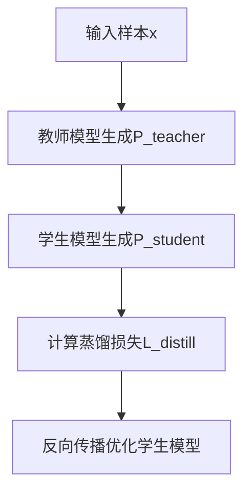
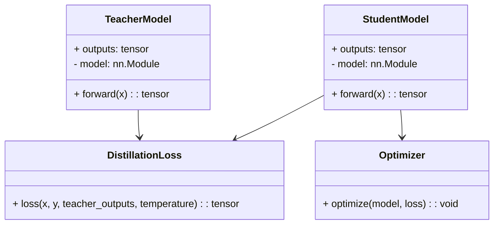
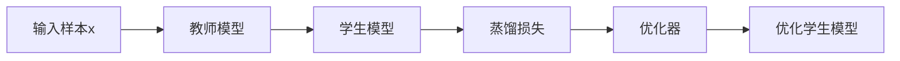
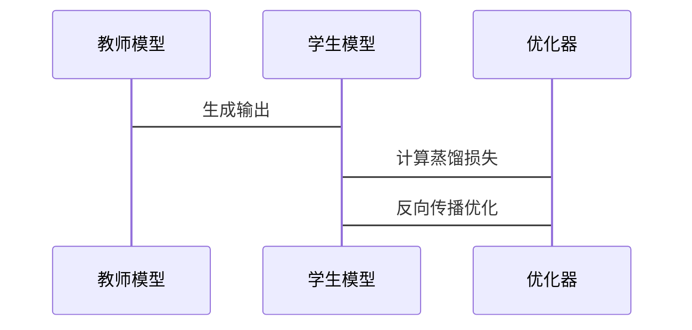

                 


# AI Agent的知识蒸馏：从大模型到轻量级应用

## 关键词：知识蒸馏、AI Agent、大模型、轻量级应用、机器学习

## 摘要：  
知识蒸馏是一种将大模型的知识提取并迁移到轻量级模型的技术，旨在在资源受限的场景下实现高效的AI应用。本文从AI Agent的视角出发，系统阐述了知识蒸馏的核心原理、算法实现、系统设计以及实际应用，帮助读者理解如何将大模型的能力转化为轻量级应用的实践方案。

---

## 第一章: 知识蒸馏与AI Agent概述

### 1.1 知识蒸馏的核心概念  
知识蒸馏是一种通过教师模型（大模型）指导学生模型（轻量级模型）学习的技术。其核心在于将教师模型的复杂知识简化为学生模型可以理解的形式，从而在资源受限的场景下实现高效推理。  

#### 1.1.1 知识蒸馏的定义与背景  
- 知识蒸馏（Knowledge Distillation）：将复杂模型（教师模型）的知识迁移到简单模型（学生模型）的过程。  
- 背景：随着大模型的广泛应用，如何在资源受限的场景（如边缘设备、移动端）中高效部署AI模型成为关键问题。  

#### 1.1.2 AI Agent的基本概念  
- AI Agent：具备自主决策能力的智能体，能够感知环境、执行任务并优化目标。  
- 知识蒸馏在AI Agent中的作用：通过轻量化模型提升AI Agent的推理效率和部署能力。  

#### 1.1.3 知识蒸馏的意义  
- 提高模型的可解释性。  
- 降低计算成本和资源消耗。  
- 扩大AI技术的应用场景，使其适用于边缘计算、物联网等场景。  

### 1.2 大模型与轻量级应用的对比  
#### 1.2.1 大模型的优势与局限性  
- 优势：强大的特征提取能力和泛化能力。  
- 局限性：计算资源消耗大、部署成本高、难以实时响应。  

#### 1.2.2 轻量级应用的特点与适用场景  
- 特点：计算效率高、资源消耗低、部署灵活。  
- 适用场景：边缘设备、移动端、实时交互系统等。  

#### 1.2.3 知识蒸馏的目标与意义  
- 目标：将大模型的复杂知识简化为轻量级模型可以理解和应用的形式。  
- 意义：在保持模型性能的同时，降低资源消耗，提升部署效率。  

### 1.3 知识蒸馏的技术路线  
#### 1.3.1 知识蒸馏的基本流程  
1. 教师模型（大模型）生成知识表示。  
2. 学生模型（轻量级模型）通过蒸馏过程学习教师模型的知识。  
3. 蒸馏后的学生模型部署到目标场景。  

#### 1.3.2 教师模型与学生模型的关系  
- 教师模型：知识的提供者，通常是一个复杂的大模型。  
- 学生模型：知识的接收者，通常是一个简单的小模型。  
- 关系：通过蒸馏过程，学生模型逐步逼近教师模型的能力。  

#### 1.3.3 知识蒸馏的关键技术点  
- 温度调度：通过调整温度参数，平衡教师模型和学生模型的概率分布。  
- 知识表示：通过构建知识图谱或向量表示，实现知识的有效迁移。  
- 任务适配：根据目标场景的需求，调整蒸馏任务的设计。  

---

## 第二章: 知识蒸馏的核心原理与方法

### 2.1 知识蒸馏的原理分析  
知识蒸馏的核心在于通过教师模型的输出概率分布，引导学生模型学习其分布特性。  

#### 2.1.1 知识蒸馏的数学模型  
- 教师模型的输出概率：$P_{\text{teacher}}(y|x)$  
- 学生模型的输出概率：$P_{\text{student}}(y|x)$  
- 蒸馏损失：$L_{\text{distill}} = -\sum_{y} P_{\text{teacher}}(y|x) \log P_{\text{student}}(y|x)$  

#### 2.1.2 知识蒸馏的核心算法  
1. **蒸馏过程**：  
   a. 输入样本$x$，教师模型生成概率分布$P_{\text{teacher}}(y|x)$。  
   b. 学生模型生成概率分布$P_{\text{student}}(y|x)$。  
   c. 计算蒸馏损失$L_{\text{distill}}$，并反向传播优化学生模型。  

2. **温度调度**：  
   - 温度参数$T$用于平滑教师模型的概率分布，通常在训练过程中动态调整。  

#### 2.1.3 知识蒸馏的优势  
- 通过概率分布的迁移，学生模型能够继承教师模型的全局特征。  
- 蒸馏过程可以结合标签蒸馏和非标签蒸馏，提升模型的泛化能力。  

### 2.2 知识蒸馏的主要方法  
#### 2.2.1 直接蒸馏法  
- **定义**：直接将教师模型的输出概率作为软标签，引导学生模型学习。  
- **流程**：  
  1. 输入样本$x$，教师模型生成概率分布$P_{\text{teacher}}(y|x)$。  
  2. 学生模型生成概率分布$P_{\text{student}}(y|x)$。  
  3. 计算蒸馏损失$L_{\text{distill}}$，优化学生模型。  

#### 2.2.2 模型压缩技术  
- **定义**：通过剪枝、参数量化等技术，直接压缩教师模型的大小。  
- **优缺点**：  
  - 优点：模型体积小，推理速度快。  
  - 缺点：压缩过程可能导致模型性能下降。  

#### 2.2.3 知识表示学习  
- **定义**：通过构建知识图谱或向量表示，将教师模型的知识表示为学生模型可理解的形式。  
- **流程**：  
  1. 将教师模型的知识表示为图结构或向量形式。  
  2. 学生模型通过学习这些表示，继承教师模型的知识。  

### 2.3 知识蒸馏的优化策略  
#### 2.3.1 温度调度  
- 温度参数$T$用于平滑教师模型的概率分布，通常在训练过程中动态调整。  

#### 2.3.2 对抗训练  
- **定义**：通过引入对抗网络，增强学生模型的鲁棒性。  
- **流程**：  
  1. 教师模型生成概率分布$P_{\text{teacher}}(y|x)$。  
  2. 对抗网络生成对抗样本，学生模型在对抗样本上学习。  

#### 2.3.3 多任务学习  
- **定义**：通过同时学习多个任务，提升学生模型的泛化能力。  
- **流程**：  
  1. 教师模型生成多个任务的特征表示。  
  2. 学生模型通过多任务学习，继承教师模型的多任务能力。  

---

## 第三章: 知识蒸馏的算法实现与数学模型

### 3.1 知识蒸馏的数学模型  
#### 3.1.1 教师模型的输出概率  
$$ P_{\text{teacher}}(y|x) = \text{softmax}(\frac{f_{\text{teacher}}(x)}{T}) $$  

#### 3.1.2 学生模型的输出概率  
$$ P_{\text{student}}(y|x) = \text{softmax}(f_{\text{student}}(x)) $$  

#### 3.1.3 知识蒸馏的优化目标  
$$ \min_{\theta_{\text{student}}} \sum_{i=1}^N L_{\text{distill}}(x_i, y_i) $$  

### 3.2 知识蒸馏算法的实现  
#### 3.2.1 算法流程图  



#### 3.2.2 Python代码实现  

```python
import torch
import torch.nn as nn
import torch.optim as optim

# 定义教师模型
class TeacherModel(torch.nn.Module):
    def __init__(self):
        super(TeacherModel, self).__init__()
        self.fc = nn.Linear(10, 5)
    
    def forward(self, x):
        return self.fc(x)

# 定义学生模型
class StudentModel(torch.nn.Module):
    def __init__(self):
        super(StudentModel, self).__init__()
        self.fc = nn.Linear(10, 5)
    
    def forward(self, x):
        return self.fc(x)

# 定义蒸馏损失函数
def distillation_loss(output, labels, teacher_output, temperature):
    alpha = 0.5
    KD_loss = nn.KLDivLoss(reduction='batchmean')(F.log_softmax(output / temperature, dim=1),
                                                    F.softmax(teacher_output / temperature, dim=1)) * (temperature ** 2) / alpha
    return KD_loss

# 训练过程
def train_student():
    teacher = TeacherModel().cuda()
    student = StudentModel().cuda()
    optimizer = optim.SGD(student.parameters(), lr=0.01)
    
    for epoch in range(100):
        for batch in dataloader:
            inputs, labels = batch
            inputs, labels = inputs.cuda(), labels.cuda()
            
            with torch.no_grad():
                teacher_outputs = teacher(inputs)
            
            student_outputs = student(inputs)
            loss = distillation_loss(student_outputs, labels, teacher_outputs, temperature=3)
            
            optimizer.zero_grad()
            loss.backward()
            optimizer.step()

```

---

## 第四章: 系统分析与架构设计

### 4.1 系统功能设计  
- **领域模型**：通过类图展示系统的主要组件及其关系。  



### 4.2 系统架构设计  
- **架构图**：展示系统的整体架构。  



### 4.3 系统交互设计  
- **交互序列图**：展示系统交互流程。  



---

## 第五章: 项目实战

### 5.1 环境安装  
- Python 3.8及以上  
- PyTorch 1.9.0及以上  

### 5.2 核心代码实现  
#### 5.2.1 环境配置  

```python
import torch
import torch.nn as nn
import torch.optim as optim
import torch.utils.data as data_utils
```

#### 5.2.2 数据加载  

```python
class Dataset(torch.utils.data.Dataset):
    def __init__(self, x, y):
        self.x = x
        self.y = y
    
    def __len__(self):
        return len(self.x)
    
    def __getitem__(self, idx):
        return self.x[idx], self.y[idx]
```

#### 5.2.3 模型训练  

```python
def train_student():
    # 数据加载
    train_dataset = Dataset(x_train, y_train)
    train_loader = data_utils.DataLoader(train_dataset, batch_size=32, shuffle=True)
    
    # 模型定义
    teacher = TeacherModel().cuda()
    student = StudentModel().cuda()
    optimizer = optim.SGD(student.parameters(), lr=0.01)
    
    # 训练过程
    for epoch in range(100):
        for batch in train_loader:
            inputs, labels = batch
            inputs, labels = inputs.cuda(), labels.cuda()
            
            with torch.no_grad():
                teacher_outputs = teacher(inputs)
            
            student_outputs = student(inputs)
            loss = distillation_loss(student_outputs, labels, teacher_outputs, temperature=3)
            
            optimizer.zero_grad()
            loss.backward()
            optimizer.step()
```

---

## 第六章: 总结与展望

### 6.1 总结  
知识蒸馏通过将大模型的知识迁移到轻量级模型，解决了资源受限场景下的AI部署问题。本文从原理、算法、系统设计和项目实战四个方面，全面阐述了知识蒸馏的技术细节和实践方案。

### 6.2 最佳实践  
- 在实际应用中，建议结合温度调度和对抗训练，进一步提升蒸馏效果。  
- 系统设计时，需注重教师模型和学生模型的匹配性，确保知识的有效迁移。  

### 6.3 展望  
未来的研究方向包括：  
1. 更高效的蒸馏算法设计。  
2. 多模态知识蒸馏技术的探索。  
3. 知识蒸馏在实时AI Agent中的应用。  

---

## 附录

### 附录A: 参考文献  
- [1] Hinton G, Vinyals O,等人. "Distilling the knowledge in neural networks." arXiv preprint arXiv:1503.02577, 2015.  
- [2] Zhang H, Zhang Z,等人. "Deep learning for machine translation: A trend report." arXiv preprint arXiv:1908.04133, 2019.  

### 附录B: 工具与资源  
- PyTorch官方文档：https://pytorch.org/  
- Hugging Face Transformers库：https://huggingface.co/transformers/  

---

## 作者：AI天才研究院 & 禅与计算机程序设计艺术

