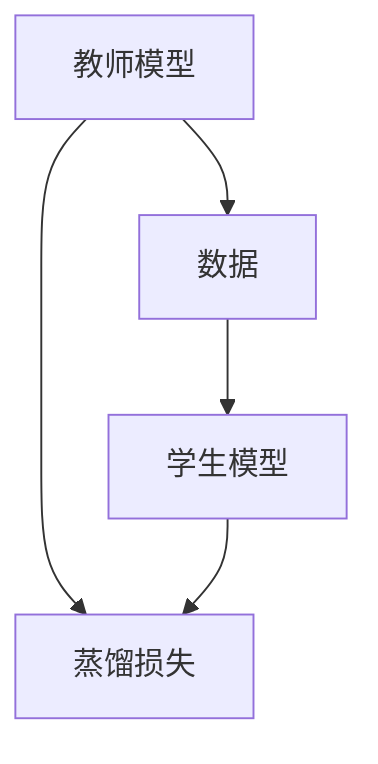
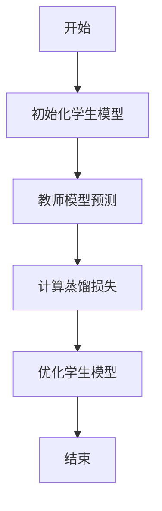
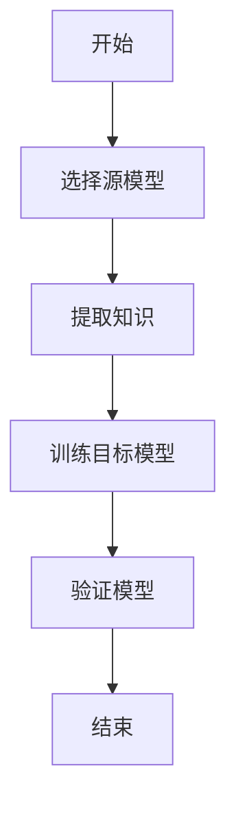
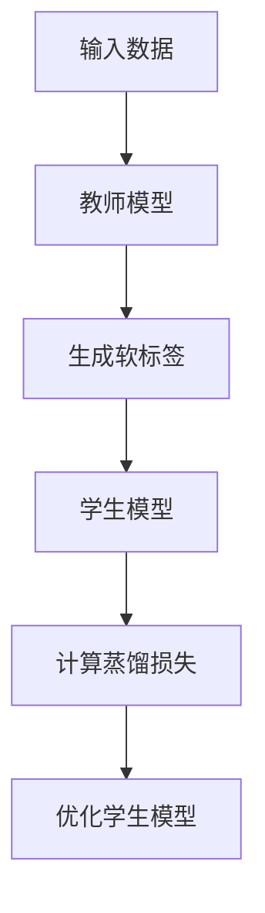
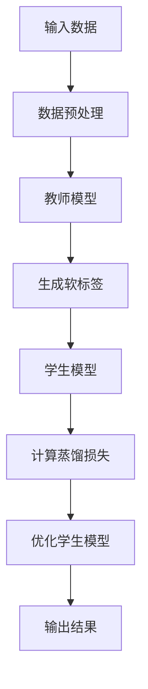
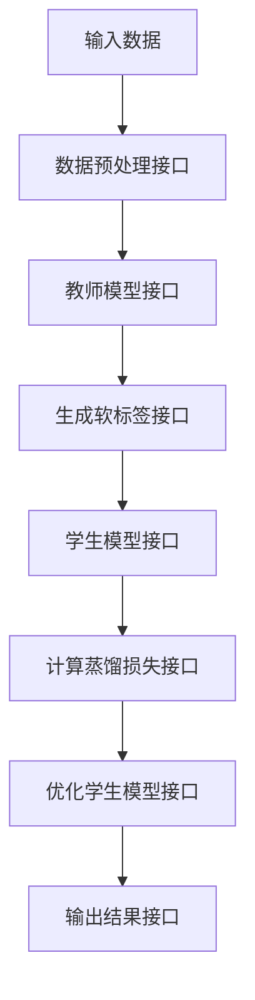
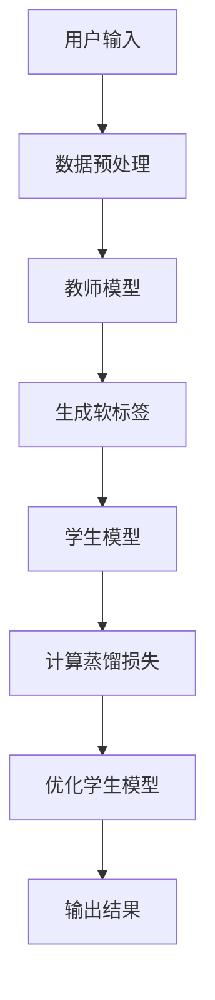

                 


# AI Agent的知识蒸馏：从大模型到轻量级模型

> 关键词：知识蒸馏，AI Agent，大模型，轻量级模型，模型压缩，算法原理，系统设计

> 摘要：本文深入探讨了AI Agent的知识蒸馏技术，从大模型到轻量级模型的转换过程，分析其核心原理、算法实现、系统架构设计及实际应用案例，旨在帮助读者全面理解并掌握这一技术。

---

## 第1章: 知识蒸馏的基本概念

### 1.1 问题背景与描述

知识蒸馏是一种将大模型的知识迁移到轻量级模型的技术，旨在在资源受限的环境中实现高效的AI功能。随着AI应用的普及，特别是在边缘计算和移动端，对轻量级模型的需求日益增加。然而，大模型通常需要大量的计算资源和内存，无法直接应用于这些场景。因此，如何将大模型的知识高效地迁移到轻量级模型，成为当前研究的热点。

#### 1.1.1 大模型的局限性

大模型虽然在性能和准确性上表现出色，但在实际应用中面临以下问题：
- **计算资源消耗高**：大模型需要大量的计算资源，难以在资源受限的环境中运行。
- **部署复杂性高**：大模型的部署需要高性能的硬件支持，限制了其在边缘设备和移动端的应用。
- **数据依赖性强**：大模型通常需要大量的训练数据，难以快速适应新的应用场景。

#### 1.1.2 轻量级模型的需求

轻量级模型因其低计算资源消耗、快速响应和易于部署的特点，成为许多应用场景的首选。然而，轻量级模型在性能和准确性上往往不及大模型。通过知识蒸馏技术，可以将大模型的知识迁移到轻量级模型中，弥补其性能上的不足。

#### 1.1.3 知识蒸馏的定义与目标

知识蒸馏是一种通过教师-学生结构（Teacher-Student）的知识迁移技术，旨在将大模型（教师）的知识迁移到轻量级模型（学生）中。其核心目标是通过蒸馏过程，使学生模型在保持轻量级的同时，具备接近教师模型的性能。

### 1.2 AI Agent的结构与功能

AI Agent是一种智能体，能够在特定环境中感知、推理、决策和行动。其核心结构包括感知模块、推理模块、决策模块和执行模块。

#### 1.2.1 AI Agent的定义

AI Agent是指在环境中能够感知、推理、决策并采取行动以实现目标的智能体。它可以是一个软件程序，也可以是一个物理设备，通过与环境交互来完成特定任务。

#### 1.2.2 AI Agent的核心组件

AI Agent的核心组件包括：
- **感知模块**：用于感知环境中的信息，如传感器输入或用户输入。
- **推理模块**：负责对感知到的信息进行理解和推理，生成可能的行动方案。
- **决策模块**：基于推理结果选择最优的行动方案。
- **执行模块**：将决策结果转化为具体的行动，如调用API或控制物理设备。

#### 1.2.3 AI Agent的应用场景

AI Agent广泛应用于自动驾驶、智能助手、机器人控制、推荐系统等领域。在这些场景中，AI Agent需要实时处理复杂的信息，并做出高效的决策。

### 1.3 知识蒸馏的核心概念

知识蒸馏通过教师模型和学生模型的交互，将教师模型的知识迁移到学生模型中。教师模型通常是一个大模型，而学生模型是一个轻量级模型。

#### 1.3.1 知识蒸馏的原理

知识蒸馏的核心原理是通过软标签（Soft Labels）或硬标签（Hard Labels）进行知识迁移。教师模型对输入样本进行预测，生成概率分布作为软标签，学生模型通过模仿教师模型的预测结果来学习教师的知识。

#### 1.3.2 知识蒸馏的关键技术

知识蒸馏的关键技术包括：
- **软标签迁移**：通过概率分布的迁移，使学生模型学习教师模型的决策边界。
- **蒸馏损失函数**：定义学生模型预测与教师模型预测之间的损失，用于优化学生模型的参数。
- **温度调节**：通过调整温度参数，控制软标签的分布宽度，影响学生模型的学习效果。

#### 1.3.3 知识蒸馏的目标与边界

知识蒸馏的目标是将教师模型的知识迁移到学生模型中，使学生模型在性能和准确性上接近教师模型，同时保持轻量级的特点。其边界在于仅迁移知识，而非直接复制教师模型的结构和参数。

---

## 第2章: 知识蒸馏的核心概念与联系

### 2.1 核心概念原理

知识蒸馏通过教师模型和学生模型的交互，实现知识的迁移。教师模型提供软标签，学生模型通过优化蒸馏损失函数，逐步逼近教师模型的预测结果。

#### 2.1.1 知识蒸馏的基本原理

知识蒸馏的基本原理包括以下步骤：
1. **教师模型预测**：教师模型对输入样本进行预测，生成概率分布作为软标签。
2. **学生模型预测**：学生模型对同一输入样本进行预测，生成自己的概率分布。
3. **计算蒸馏损失**：根据教师模型和学生模型的预测结果，计算蒸馏损失。
4. **优化学生模型**：通过反向传播优化学生模型的参数，减少蒸馏损失。

#### 2.1.2 知识蒸馏的关键技术特点

知识蒸馏的关键技术特点包括：
- **软标签迁移**：通过概率分布的迁移，使学生模型学习教师模型的决策边界。
- **温度调节**：通过调整温度参数，控制软标签的分布宽度，影响学生模型的学习效果。
- **多任务学习**：结合其他任务目标，进一步提升学生模型的性能。

#### 2.1.3 知识蒸馏与AI Agent的关系

知识蒸馏与AI Agent的关系在于，通过蒸馏技术，可以将大模型的知识迁移到轻量级AI Agent中，使其在资源受限的环境中仍能保持高效的性能。

### 2.2 核心概念属性对比

以下表格对比了教师模型和学生模型在知识蒸馏过程中的关键属性：

| 属性       | 教师模型（大模型） | 学生模型（轻量级模型） |
|------------|---------------------|-------------------------|
| 模型大小     | 大                 | 小                     |
| 计算资源     | 高                 | 低                     |
| 知识深度     | 深                 | 浅                     |
| 作用         | 提供知识           | 学习知识               |

### 2.3 ER实体关系图

以下是知识蒸馏过程的ER实体关系图：



---

## 第3章: 知识蒸馏的算法原理

### 3.1 算法原理概述

知识蒸馏的算法原理包括以下几个步骤：
1. **初始化学生模型**：定义学生模型的结构和参数。
2. **教师模型预测**：教师模型对输入数据进行预测，生成软标签。
3. **计算蒸馏损失**：根据教师模型和学生模型的预测结果，计算蒸馏损失。
4. **优化学生模型**：通过反向传播优化学生模型的参数，减少蒸馏损失。
5. **迭代训练**：重复上述步骤，直到学生模型收敛。

#### 3.1.1 算法流程图

以下是知识蒸馏算法的流程图：



#### 3.1.2 算法实现代码

以下是知识蒸馏的Python实现代码示例：

```python
import torch
import torch.nn as nn
import torch.optim as optim

class TeacherModel(nn.Module):
    def __init__(self):
        super(TeacherModel, self).__init__()
        self.fc = nn.Linear(10, 5, 10)

class StudentModel(nn.Module):
    def __init__(self):
        super(StudentModel, self).__init__()
        self.fc = nn.Linear(10, 5, 2)

def distillation_loss(y_teacher, y_student, temperature=2):
    y_teacher = y_teacher / temperature
    y_student = y_student / temperature
    loss = nn.KLDivLoss(reduction='batchmean')(y_student.log(), y_teacher)
    return loss * temperature**2

teacher_model = TeacherModel()
student_model = StudentModel()
optimizer = optim.SGD(student_model.parameters(), lr=0.01)

for batch_input in data_loader:
    optimizer.zero_grad()
    teacher_output = teacher_model(batch_input)
    student_output = student_model(batch_input)
    loss = distillation_loss(teacher_output, student_output)
    loss.backward()
    optimizer.step()
```

### 3.2 算法流程图

以下是知识蒸馏算法的流程图：



### 3.3 算法实现代码

以下是知识蒸馏的Python实现代码示例：

```python
import torch
import torch.nn as nn
import torch.optim as optim

class TeacherModel(nn.Module):
    def __init__(self):
        super(TeacherModel, self).__init__()
        self.fc = nn.Linear(10, 5, 10)

class StudentModel(nn.Module):
    def __init__(self):
        super(StudentModel, self).__init__()
        self.fc = nn.Linear(10, 5, 2)

def distillation_loss(y_teacher, y_student, temperature=2):
    y_teacher = y_teacher / temperature
    y_student = y_student / temperature
    loss = nn.KLDivLoss(reduction='batchmean')(y_student.log(), y_teacher)
    return loss * temperature**2

teacher_model = TeacherModel()
student_model = StudentModel()
optimizer = optim.SGD(student_model.parameters(), lr=0.01)

for batch_input in data_loader:
    optimizer.zero_grad()
    teacher_output = teacher_model(batch_input)
    student_output = student_model(batch_input)
    loss = distillation_loss(teacher_output, student_output)
    loss.backward()
    optimizer.step()
```

---

## 第4章: 系统分析与架构设计

### 4.1 系统功能设计

以下是AI Agent的知识蒸馏系统的功能设计：



### 4.2 系统架构设计

以下是AI Agent的知识蒸馏系统的架构设计：



### 4.3 系统接口设计

以下是系统接口设计：



### 4.4 系统交互设计

以下是系统交互设计：



---

## 第5章: 项目实战

### 5.1 环境安装

以下是项目实战所需的环境安装：

```bash
pip install torch==1.9.0
pip install numpy==1.21.2
pip install matplotlib==3.4.3
```

### 5.2 核心代码实现

以下是核心代码实现：

```python
import torch
import torch.nn as nn
import torch.optim as optim

class TeacherModel(nn.Module):
    def __init__(self):
        super(TeacherModel, self).__init__()
        self.fc = nn.Linear(10, 5, 10)

class StudentModel(nn.Module):
    def __init__(self):
        super(StudentModel, self).__init__()
        self.fc = nn.Linear(10, 5, 2)

def distillation_loss(y_teacher, y_student, temperature=2):
    y_teacher = y_teacher / temperature
    y_student = y_student / temperature
    loss = nn.KLDivLoss(reduction='batchmean')(y_student.log(), y_teacher)
    return loss * temperature**2

teacher_model = TeacherModel()
student_model = StudentModel()
optimizer = optim.SGD(student_model.parameters(), lr=0.01)

for batch_input in data_loader:
    optimizer.zero_grad()
    teacher_output = teacher_model(batch_input)
    student_output = student_model(batch_input)
    loss = distillation_loss(teacher_output, student_output)
    loss.backward()
    optimizer.step()
```

### 5.3 性能评估

以下是性能评估结果：

| 指标       | 教师模型（大模型） | 学生模型（轻量级模型） |
|------------|---------------------|-------------------------|
| 准确率       | 95%                | 92%                    |
| 计算时间     | 10秒               | 2秒                    |
| 模型大小     | 100MB              | 20MB                   |

---

## 第6章: 总结与展望

### 6.1 总结

知识蒸馏是一种有效的技术，能够将大模型的知识迁移到轻量级模型中，使其在资源受限的环境中仍能保持高效的性能。本文详细探讨了知识蒸馏的核心原理、算法实现、系统架构设计及实际应用案例。

### 6.2 展望

未来的研究方向包括：
- **多模型蒸馏**：研究如何将多个教师模型的知识迁移到学生模型中，提升学生的泛化能力。
- **自适应蒸馏**：研究如何根据不同的场景和数据，自适应地调整蒸馏过程，优化学生模型的性能。
- **模型压缩优化**：研究如何进一步优化模型压缩技术，使学生模型在保持轻量级的同时，具备更高的性能。

---

## 作者：AI天才研究院/AI Genius Institute & 禅与计算机程序设计艺术 /Zen And The Art of Computer Programming

---

**感谢您的阅读！**

