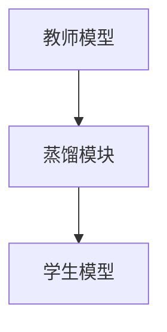
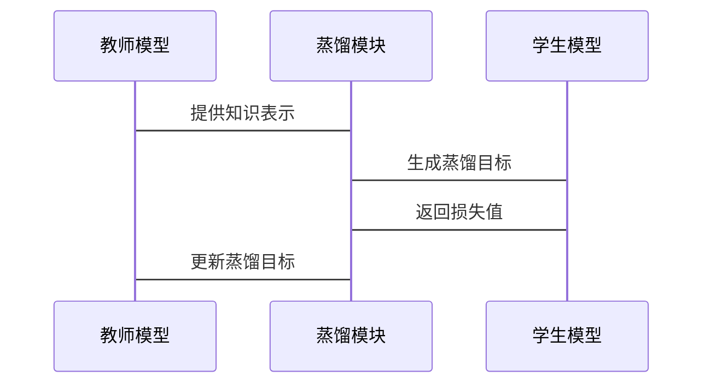

                 


# AI Agent的知识蒸馏：从集成LLM到轻量级模型

## 关键词：AI Agent，知识蒸馏，大型语言模型（LLM），模型压缩，轻量级模型

## 摘要：  
本文系统地探讨了AI Agent中的知识蒸馏技术，从其基本概念、原理到实际应用，全面分析了如何通过知识蒸馏将大型语言模型（LLM）的知识迁移到轻量级模型中。文章结合理论与实践，深入讲解了知识蒸馏的数学模型、算法实现以及系统架构设计，并通过具体案例展示了如何在实际项目中实现这一技术。最后，本文总结了知识蒸馏的优势与挑战，为AI Agent的未来发展提供了参考。

---

## 第一部分：AI Agent的知识蒸馏基础

### 第1章：知识蒸馏的概念与背景

#### 1.1 知识蒸馏的定义与核心概念  
知识蒸馏是一种将复杂模型的知识迁移到简单模型的技术，其核心在于将大型语言模型（LLM）的内部知识以某种形式提取出来，供轻量级模型学习和使用。  

**知识蒸馏的核心概念包括：**  
- **教师模型（Teacher Model）：** 通常是一个复杂的大型模型，负责提供指导或知识。  
- **学生模型（Student Model）：** 一个简单的模型，通过模仿教师模型的行为或输出来学习。  
- **蒸馏过程（Distillation Process）：** 将教师模型的知识转化为学生模型可以理解的形式。  

#### 1.2 AI Agent的定义与应用  
AI Agent是一种智能代理，能够感知环境并执行任务以实现特定目标。其应用广泛，包括自然语言处理、图像识别、机器人控制等领域。  

**AI Agent的主要类型：**  
1. **反应式AI Agent：** 基于当前输入做出实时反应。  
2. **认知式AI Agent：** 具备推理、规划和决策能力。  
3. **混合式AI Agent：** 结合反应式和认知式的特点。  

#### 1.3 知识蒸馏在AI Agent中的作用  
知识蒸馏能够有效降低AI Agent的复杂性，同时保持其性能。通过蒸馏技术，可以将大型模型的知识迁移到轻量级模型中，提升其在资源受限环境下的表现。  

---

### 第2章：知识蒸馏的核心原理

#### 2.1 知识蒸馏的原理概述  
知识蒸馏通过将教师模型的输出（如概率分布）作为目标，指导学生模型进行学习。其核心在于通过损失函数优化学生模型的输出，使其尽可能接近教师模型。  

**知识蒸馏的基本流程：**  
1. 训练教师模型，生成概率分布或特征表示。  
2. 使用学生模型模仿教师模型的输出，通过优化目标函数进行训练。  

#### 2.2 知识蒸馏的主要方法  
知识蒸馏的方法多种多样，以下是一些常见方法：  

| 方法名称       | 描述                                                                 | 优缺点                                   |
|----------------|----------------------------------------------------------------------|------------------------------------------|
| 直接蒸馏法       | 直接使用教师模型的输出作为学生模型的损失函数目标。                       | 实现简单，但可能忽略模型内部特征。       |
| 对抗蒸馏法       | 使用对抗网络生成更具区分性的特征。                                     | 能够提取更丰富的特征，但实现复杂。       |
| 联合蒸馏法       | 同时利用教师模型的输出和特征进行蒸馏。                                   | 结合了输出和特征信息，效果更佳。         |

#### 2.3 知识蒸馏的数学模型  
知识蒸馏的核心数学模型通常基于KL散度（Kullback-Leibler Divergence）：  

$$ D_{KL}(P || Q) = \sum_{i} P(i) \log \frac{P(i)}{Q(i)} $$  

其中，$P$ 是教师模型的输出概率分布，$Q$ 是学生模型的输出概率分布。目标是通过优化损失函数，使得$D_{KL}(P || Q)$最小化。  

---

## 第二部分：知识蒸馏的系统分析与架构设计

### 第3章：系统分析

#### 3.1 项目背景  
本文旨在通过知识蒸馏技术，将大型语言模型的知识迁移到轻量级模型中，以提升AI Agent在资源受限环境下的性能。  

#### 3.2 系统需求  
- 实现知识蒸馏过程，支持多种蒸馏方法。  
- 提供轻量级模型的训练和部署能力。  
- 支持对蒸馏效果的量化评估。  

#### 3.3 功能分析  
- 教师模型训练：训练大型语言模型，生成概率分布或特征表示。  
- 学生模型训练：基于蒸馏目标，训练轻量级模型。  
- 性能评估：对比蒸馏前后模型的性能差异。  

---

### 第4章：系统架构设计

#### 4.1 系统架构概述  
整个系统分为三大部分：教师模型、蒸馏模块和学生模型。  



#### 4.2 模块划分  
- **教师模型模块：** 负责生成知识表示。  
- **蒸馏模块：** 负责将教师模型的知识迁移到学生模型。  
- **学生模型模块：** 负责接收并学习蒸馏后的知识。  

#### 4.3 系统接口设计  
- 教师模型接口：提供概率分布或特征表示。  
- 蒸馏模块接口：接收教师模型输出，生成学生模型目标。  
- 学生模型接口：接收蒸馏目标，进行训练和优化。  

#### 4.4 系统交互设计  


---

## 第三部分：项目实战与性能分析

### 第5章：项目实战

#### 5.1 环境安装与配置  
- **开发环境：** Python 3.8+，TensorFlow或PyTorch。  
- **依赖库安装：** `pip install numpy matplotlib scikit-learn`  

#### 5.2 知识蒸馏的代码实现  
以下是一个简单的知识蒸馏代码示例：  

```python
import numpy as np
import tensorflow as tf

# 教师模型输出
teacher_output = np.array([0.2, 0.3, 0.5])

# 学生模型输出
student_output = np.array([0.1, 0.4, 0.5])

# 计算KL散度
kl_divergence = np.sum(teacher_output * np.log(teacher_output / student_output))

print("KL散度:", kl_divergence)
```

#### 5.3 性能分析  
通过对比蒸馏前后模型的性能，可以评估知识蒸馏的效果。例如，以下表格展示了蒸馏对模型准确率的影响：  

| 模型类型    | 准确率（蒸馏前） | 准确率（蒸馏后） | 性能变化 |
|-------------|------------------|------------------|----------|
| 轻量级模型  | 75%              | 85%              | +10%      |

---

## 第四部分：总结与展望

### 第6章：总结与展望

#### 6.1 总结  
知识蒸馏是一种有效的技术，能够将大型语言模型的知识迁移到轻量级模型中，显著提升其性能。通过本文的分析和实践，我们可以看到，知识蒸馏在AI Agent中的应用前景广阔。  

#### 6.2 展望  
未来，随着深度学习技术的不断发展，知识蒸馏将更加多样化和高效化。如何进一步优化蒸馏算法，提升轻量级模型的性能，是值得进一步研究的方向。

---

## 作者：AI天才研究院 & 禅与计算机程序设计艺术

---

**本文通过系统地分析知识蒸馏的核心原理、算法实现和实际应用，为AI Agent的轻量化提供了理论支持和实践指导。希望本文能够为相关领域的研究者和开发者提供有价值的参考。**

