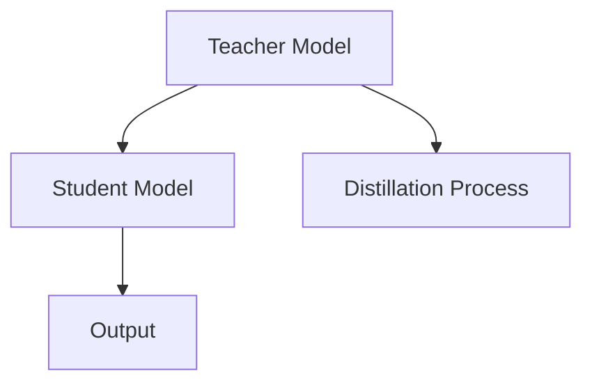
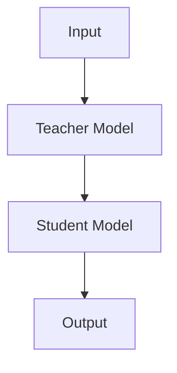

                 

# AI Agent的知识蒸馏：从集成模型到单一高效LLM

## 关键词：知识蒸馏、AI Agent、大语言模型、LLM、模型优化

## 摘要：
本文深入探讨了AI Agent中的知识蒸馏技术，从集成模型到单一高效的大语言模型（LLM）的优化过程。通过分析知识蒸馏的核心概念、算法原理、系统设计和项目实战，本文为读者提供了从理论到实践的全面指导。结合实际案例和详细代码实现，帮助读者理解如何通过知识蒸馏技术优化AI Agent的性能和效率。

---

## 第1章: 知识蒸馏的背景与问题背景

### 1.1 知识蒸馏的背景
#### 1.1.1 从集成模型到单一模型的演进
现代AI系统中，集成模型通过组合多个模型的输出来提高性能，但其计算资源消耗高、推理速度慢。单一模型在资源受限的场景下更具优势，但如何保持其性能成为关键问题。

#### 1.1.2 大语言模型（LLM）的崛起
大语言模型（如GPT-3、GPT-4）通过海量数据训练，展现出强大的通用能力，但其推理成本高昂，限制了其在资源受限环境中的应用。

#### 1.1.3 知识蒸馏的定义与目标
知识蒸馏是一种将复杂模型的知识迁移到简单模型的技术，目标是通过降低模型复杂性，提高推理效率，同时保持甚至提升模型性能。

---

### 1.2 问题背景与挑战
#### 1.2.1 集成模型的局限性
集成模型依赖多个模型的输出，计算资源消耗大，推理速度慢，难以在实时应用中使用。

#### 1.2.2 单一模型的效率与资源问题
单一模型虽然资源消耗低，但在性能和准确性上往往不如集成模型，尤其是在处理复杂任务时。

#### 1.2.3 知识蒸馏的核心问题描述
如何将复杂模型的知识高效地迁移到简单模型中，同时保持甚至提升模型性能，是知识蒸馏的核心问题。

---

### 1.3 知识蒸馏的解决思路
#### 1.3.1 知识蒸馏的基本原理
通过教师模型（复杂模型）和学生模型（简单模型）之间的互动，将教师模型的知识迁移到学生模型中。

#### 1.3.2 知识蒸馏的关键技术点
- **知识表示**：如何有效地提取和表示教师模型的知识。
- **损失函数设计**：通过损失函数引导学生模型学习教师模型的知识。
- **蒸馏过程优化**：优化蒸馏过程中的参数设置和训练策略。

#### 1.3.3 知识蒸馏的边界与外延
知识蒸馏不仅适用于模型压缩，还可用于跨模型知识迁移、多任务学习等多种场景。

---

### 1.4 核心概念与组成要素
#### 1.4.1 知识蒸馏的核心要素
- **教师模型**：提供知识的复杂模型。
- **学生模型**：接收知识的简单模型。
- **蒸馏过程**：知识迁移的具体实现过程。

#### 1.4.2 概念结构与关系分析
通过实体关系图和架构分析，明确教师模型、学生模型和蒸馏过程之间的关系。

#### 1.4.3 核心概念的对比分析
通过对比表格，分析教师模型和学生模型在准确率、资源消耗等方面的差异。

---

## 第2章: 知识蒸馏的核心概念与联系

### 2.1 核心概念的原理分析
#### 2.1.1 知识蒸馏的基本原理
教师模型通过软标签（soft label）指导学生模型学习，软标签相比硬标签（hard label）提供了更多的信息，使学生模型能够更好地逼近教师模型的输出。

#### 2.1.2 知识蒸馏的关键技术特征
- **软标签**：教师模型输出的概率分布作为学生模型的学习目标。
- **蒸馏温度**：通过调整温度参数，控制软标签的分布范围，影响学生模型的学习效果。

#### 2.1.3 核心概念的属性对比
通过对比分析，明确教师模型和学生模型在知识表示、学习目标等方面的差异。

---

### 2.2 实体关系图与架构分析
#### 2.2.1 实体关系图的构建
通过Mermaid图展示教师模型、学生模型和蒸馏过程之间的关系。

#### 2.2.2 知识蒸馏的架构图
展示知识蒸馏的整体架构。

---

### 2.3 核心概念的对比分析
#### 2.3.1 概念对比表格
| 概念 | 定义 | 特点 |
|------|------|------|
| 教师模型 | 原始知识来源 | 高准确率，资源消耗大 |
| 学生模型 | 知识蒸馏目标 | 资源消耗低，效率高 |

---

## 第3章: 知识蒸馏的算法原理

### 3.1 算法原理概述
#### 3.1.1 知识蒸馏的基本流程
1. **教师模型输出**：教师模型对输入数据进行推理，生成软标签。
2. **学生模型学习**：学生模型通过优化损失函数，逼近教师模型的输出。
3. **蒸馏过程优化**：调整蒸馏参数，优化蒸馏效果。

#### 3.1.2 算法的核心步骤
- **软标签生成**：教师模型输出概率分布。
- **损失函数计算**：结合软标签和硬标签的损失函数。
- **模型优化**：通过反向传播优化学生模型参数。

---

### 3.2 算法的数学模型与公式
#### 3.2.1 知识蒸馏的损失函数
$$ L = \alpha L_{KL} + (1-\alpha) L_{CE} $$

其中，$\alpha$ 是平衡参数，$L_{KL}$ 是KL散度损失，$L_{CE}$ 是交叉熵损失。

#### 3.2.2 KL散度的数学表达
$$ KL(P || Q) = \sum_{i} P(i) \log \frac{P(i)}{Q(i)} $$

其中，$P$ 和 $Q$ 分别是教师模型和学生模型的输出概率分布。

#### 3.2.3 交叉熵损失的计算
$$ L_{CE} = -\frac{1}{N} \sum_{i=1}^{N} y_i \log p(y_i|x_i) $$

---

## 第4章: 系统分析与架构设计方案

### 4.1 问题场景介绍
AI Agent需要在资源受限的环境中高效运行，知识蒸馏技术为其实现高性能和低资源消耗提供了可能。

---

## 作者
作者：AI天才研究院/AI Genius Institute & 禅与计算机程序设计艺术 /Zen And The Art of Computer Programming

---

通过以上步骤，我们详细分析了知识蒸馏的核心概念、算法原理和系统设计，为读者提供了从理论到实践的全面指导。希望这篇文章能帮助读者更好地理解AI Agent的知识蒸馏技术，并在实际项目中得到有效应用。

