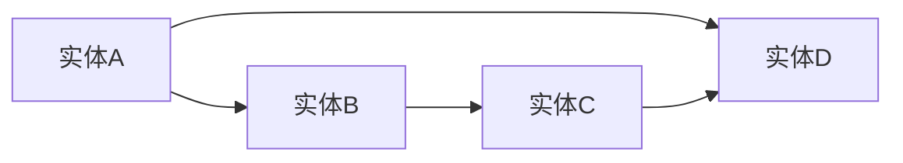

                 


# AI Agent的知识融合：整合多源异构信息

> 关键词：知识融合，AI Agent，多源数据，异构信息，语义对齐

> 摘要：本文详细探讨了AI Agent中知识融合的核心概念、算法原理和系统设计，重点分析了多源异构信息的整合方法，通过实际案例展示了知识融合在智能系统中的应用，为读者提供了从理论到实践的全面指导。

---

## 第1章 知识融合的背景与问题背景

### 1.1 知识融合的定义与必要性

知识融合是将来自不同来源、格式和语义的信息整合到一个统一的知识表示中的过程。其必要性在于：

- **提高数据利用率**：多源数据往往包含冗余和不一致，通过融合可以提取更丰富的信息。
- **增强智能系统能力**：AI Agent需要整合多源信息以做出更准确的决策。
- **支持复杂任务**：在自然语言处理、推荐系统等领域，知识融合能够显著提升性能。

### 1.2 多源异构信息的特点与挑战

多源异构信息的特点包括：
- **多样性**：数据可以是结构化、半结构化或非结构化。
- **异构性**：不同数据源可能使用不同的格式和语义。
- **动态性**：数据可能随时间变化。

挑战在于：
- **语义差异**：不同数据源可能对同一概念有不同的表示。
- **数据质量**：数据可能存在噪声和不一致性。
- **计算复杂性**：融合异构数据需要复杂的算法和计算资源。

### 1.3 知识融合的目标与应用场景

知识融合的目标是将多源异构信息整合为一致、完整的知识表示。应用场景包括：
- **智能问答系统**：通过融合多种数据源提供更准确的答案。
- **推荐系统**：结合用户行为和产品信息提供个性化推荐。
- **知识图谱构建**：整合多源数据构建大规模知识图谱。

---

## 第2章 知识融合的核心概念与联系

### 2.1 知识表示与语义理解

知识表示是将信息以计算机可处理的形式表示的过程。常用方法包括：
- **符号逻辑表示**：使用谓词逻辑表示知识。
- **分布式表示**：使用向量表示词语或实体。

语义理解是通过上下文理解数据含义的过程。例如，自然语言处理中的句法分析和语义角色标注。

#### 表格对比：符号逻辑与分布式表示的优缺点

| 特性                | 符号逻辑表示          | 分布式表示          |
|---------------------|----------------------|--------------------|
| 可解释性            | 高                  | 低                  |
| 处理复杂性          | 低                  | 高                  |
| 对上下文的处理能力  | 有限                | 强                  |

### 2.2 异构数据的语义对齐

语义对齐是将不同数据源中的实体或概念映射到同一语义空间的过程。常用方法包括：
- **基于符号逻辑的对齐**：通过规则匹配对齐实体。
- **基于分布式表示的对齐**：通过计算向量相似性对齐实体。

#### 表格对比：符号逻辑与分布式对齐方法的效果

| 方法                | 符号逻辑对齐        | 分布式对齐          |
|---------------------|--------------------|--------------------|
| 精度                | 中等                | 高                  |
| 可解释性            | 高                  | 低                  |
| 计算复杂性          | 低                  | 高                  |

### 2.3 知识融合的实体关系图

实体关系图展示了实体之间的关系，帮助理解数据结构。以下是知识融合的实体关系图：



---

## 第3章 知识融合的算法原理

### 3.1 知识表示学习算法

知识表示学习算法通过将知识图谱中的实体和关系映射到低维向量空间来实现知识表示。

#### Word2Vec算法

Word2Vec通过上下文预测单词或单词预测上下文来学习词向量。其核心公式为：

$$ \text{score} = \log P(w_i | w_{i-1}) $$

#### BERT模型

BERT通过预训练任务学习上下文表示。其编码器结构如下：

```mermaid
graph LR
    Input --> Embedding
    Embedding --> Multi-head Attention
    Multi-head Attention --> Feed-forward Network
    Feed-forward Network --> Output
```

#### 知识图谱嵌入算法

知识图谱嵌入算法通过将实体和关系嵌入到低维空间来表示知识图谱。常用算法包括TransE、TransH等。

#### TransE模型

TransE的优化目标是将关系表示为头实体和尾实体之间的向量差：

$$ \text{TransE}： r = h - t $$

### 3.2 异构数据融合算法

异构数据融合算法将不同数据源中的信息整合到统一的知识表示中。

#### 符号逻辑融合

符号逻辑融合通过规则匹配将异构数据对齐。例如，使用SPARQL查询将不同数据源中的实体匹配到同一概念。

#### 概率融合

概率融合通过概率模型处理数据不确定性。例如，使用马尔可夫随机场对齐实体。

#### 图神经网络融合

图神经网络融合通过图结构信息进行数据融合。例如，使用图注意力网络对齐实体。

### 3.3 知识融合的数学模型

知识融合的数学模型通过优化目标函数实现。例如，TransE的损失函数为：

$$ L = \sum_{(h,r,t) \in T} (f(h,r,t) - f(h',r,t))^2 $$

其中，$f(h,r,t)$是目标函数，$T$是训练数据集。

---

## 总结

知识融合是AI Agent整合多源异构信息的关键技术。通过理解核心概念、掌握算法原理和设计系统架构，可以有效实现知识融合，提升智能系统的性能。

---

作者：AI天才研究院 & 禅与计算机程序设计艺术

