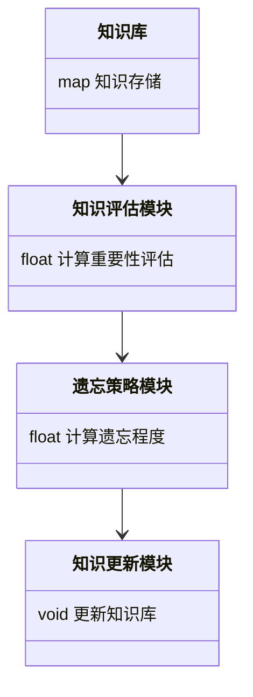
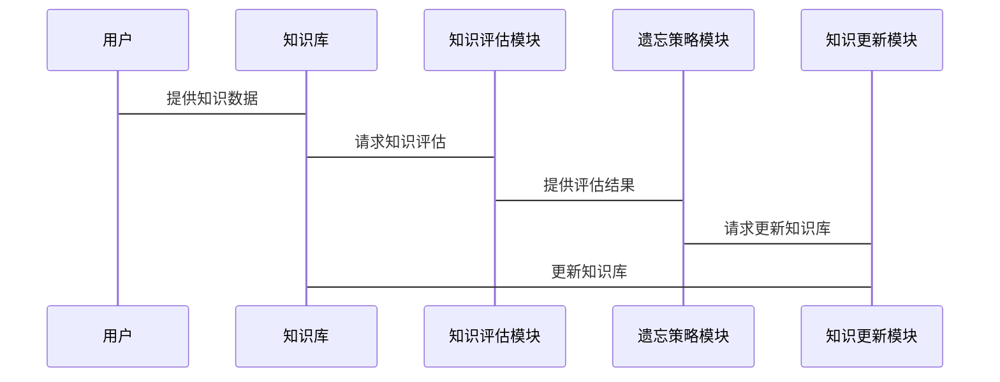

                 


# AI Agent的知识遗忘管理：平衡记忆与效率

> **关键词**：AI Agent, 知识管理, 遗忘曲线, 动态知识库, 知识效率  
> **摘要**：本文探讨了AI Agent在知识管理中的挑战，特别是如何在记忆与效率之间找到平衡。通过分析知识遗忘的原理、模型和算法，结合系统设计与实际案例，提出了一种高效的知识遗忘管理方法，旨在优化AI Agent的知识存储和应用效率。

---

# 第1章: 问题背景与概念

## 1.1 知识遗忘管理的背景

### 1.1.1 AI Agent的核心挑战
AI Agent在处理复杂任务时，需要依赖大量的知识存储。然而，随着数据量的爆炸式增长，知识的存储和管理成为一项巨大的挑战。知识的冗余存储会导致计算资源的浪费，而过多的知识存储也会降低AI Agent的响应速度和效率。

### 1.1.2 知识爆炸与计算资源的限制
现代AI系统需要处理的数据量呈指数级增长，而计算资源（如存储空间和处理能力）的增长速度远远跟不上数据的增长速度。在这种情况下，如何有效地管理知识成为AI Agent设计中的一个关键问题。

### 1.1.3 知识遗忘管理的必要性
知识遗忘管理的目标是在不损失重要信息的前提下，最大限度地减少存储负担。通过合理地遗忘不重要的知识，AI Agent可以更高效地运行，并能够更好地适应动态变化的环境。

## 1.2 问题描述与目标

### 1.2.1 知识遗忘管理的定义
知识遗忘管理是指通过一定的策略和机制，动态地选择性地遗忘部分知识，以优化AI Agent的知识存储和计算效率，同时保持对任务执行的关键信息。

### 1.2.2 AI Agent知识管理的核心问题
AI Agent在知识管理中面临的主要问题包括：如何评估知识的重要性，如何选择性地遗忘不重要的知识，以及如何动态地调整知识存储策略以适应变化的环境。

### 1.2.3 平衡记忆与效率的目标
知识遗忘管理的目标是在知识存储和计算效率之间找到平衡点，既要保证AI Agent能够完成任务，又要避免因为存储过载而导致的性能下降。

## 1.3 知识遗忘管理的解决方案

### 1.3.1 知识选择与遗忘策略
知识选择与遗忘策略是知识遗忘管理的核心。通过评估知识的重要性，AI Agent可以选择性地遗忘那些不重要的知识，从而减少存储负担。

### 1.3.2 动态知识库管理
动态知识库管理是指根据任务需求和环境变化，动态地调整知识库的内容。通过定期评估知识的有效性，AI Agent可以主动地遗忘过时或不重要的知识。

### 1.3.3 基于遗忘曲线的知识更新
遗忘曲线模型（Ebbinghaus曲线）描述了人类记忆的遗忘规律。AI Agent可以利用类似的模型来优化知识更新策略，定期复习或遗忘那些已经被证明不再需要的知识。

## 1.4 知识遗忘管理的边界与外延

### 1.4.1 知识遗忘管理的适用范围
知识遗忘管理主要适用于那些需要动态调整知识存储的AI系统，尤其是那些需要处理大量实时数据的应用场景。

### 1.4.2 与相关概念的区分
知识遗忘管理与知识检索、知识存储等概念密切相关，但又有其独特的特点。例如，知识检索关注的是如何快速找到所需的知识，而知识遗忘管理关注的是如何有效地管理知识存储。

### 1.4.3 知识遗忘管理的潜在应用场景
知识遗忘管理可以应用于多个领域，如自然语言处理、推荐系统、自动驾驶等。在这些场景中，AI Agent需要高效地管理知识，以应对复杂的任务需求。

## 1.5 核心概念结构与组成

### 1.5.1 知识遗忘管理的系统架构
知识遗忘管理系统的架构包括知识评估模块、遗忘策略模块、知识更新模块等核心组件。这些模块协同工作，确保知识遗忘管理的高效性。

### 1.5.2 核心要素与相互关系
知识遗忘管理的核心要素包括知识的重要性评估、遗忘策略的选择、知识更新的机制等。这些要素之间相互关联，共同决定了知识遗忘管理的效果。

### 1.5.3 知识遗忘管理的数学模型框架
知识遗忘管理的数学模型框架包括遗忘速率模型、知识重要性评估模型等。这些模型为知识遗忘管理提供了理论基础和计算依据。

---

# 第2章: 知识遗忘管理的原理与模型

## 2.1 知识遗忘管理的原理

### 2.1.1 知识遗忘的基本规律
知识遗忘的基本规律可以通过遗忘曲线模型来描述。遗忘曲线表明，人类记忆中的知识会随着时间的推移而逐渐遗忘。AI Agent可以利用这一规律来优化知识更新策略。

### 2.1.2 基于时间的遗忘模型
基于时间的遗忘模型是一种常用的知识遗忘模型。它假设知识的遗忘速率与时间有关，可以通过指数衰减函数来描述。

### 2.1.3 知识重要性评估方法
知识重要性评估方法是知识遗忘管理的核心。通过评估知识的重要性，AI Agent可以决定哪些知识需要保留，哪些知识可以遗忘。

## 2.2 知识遗忘管理的核心模型

### 2.2.1 遗忘曲线模型
遗忘曲线模型（Ebbinghaus曲线）描述了知识遗忘的规律。AI Agent可以利用这一模型来优化知识更新策略。

### 2.2.2 知识价值评估模型
知识价值评估模型通过评估知识的价值来决定哪些知识需要保留，哪些知识可以遗忘。价值评估可以基于知识的使用频率、任务相关性等多种因素。

### 2.2.3 动态遗忘速率模型
动态遗忘速率模型是一种更复杂的遗忘模型，它考虑了知识遗忘速率的变化。动态遗忘速率模型可以根据知识的使用情况动态调整遗忘速率。

## 2.3 核心概念属性对比表

| 概念 | 属性 | 描述 |
|------|------|------|
| 知识遗忘 | 时间依赖性 | 知识遗忘速率与时间相关 |
| 知识重要性 | 评估标准 | 知识的重要性基于其使用频率和任务相关性 |
| 知识更新 | 策略选择 | 知识更新策略基于遗忘曲线模型和知识重要性评估 |

---

# 第3章: 知识遗忘管理的算法原理

## 3.1 算法原理概述

### 3.1.1 算法选择与比较
知识遗忘管理的算法选择需要考虑多个因素，如算法的复杂度、计算效率、遗忘策略的灵活性等。不同的算法适用于不同的应用场景。

### 3.1.2 算法实现的步骤
知识遗忘管理算法的实现通常包括以下几个步骤：知识评估、遗忘策略选择、知识更新等。

## 3.2 遗忘曲线模型的数学公式

### 3.2.1 遗忘曲线模型的数学表达
遗忘曲线模型可以用指数衰减函数来描述：
$$
f(t) = e^{-kt}
$$
其中，$k$ 是遗忘速率常数，$t$ 是时间。

### 3.2.2 知识重要性评估的数学公式
知识重要性评估可以通过加权平均的方式来计算：
$$
I = \sum_{i=1}^{n} w_i \cdot f_i
$$
其中，$w_i$ 是第$i$个特征的权重，$f_i$ 是第$i$个特征的评估值。

## 3.3 算法实现的代码示例

```python
import numpy as np

def forget_curve(current_time, initial_time, k):
    return np.exp(-k * current_time / initial_time)

def knowledge_importance评估(知识特征):
    # 假设知识特征是一个字典，包含各个特征的权重和评估值
    总重要性 = 0
    for feature in 知识特征:
        总重要性 += 知识特征[feature]['权重'] * 知识特征[feature]['评估值']
    return 总重要性

# 示例使用
current_time = 10
initial_time = 100
k = 0.1
遗忘程度 = forget_curve(current_time, initial_time, k)
print("遗忘程度:", 遗忘程度)
```

---

# 第4章: 系统分析与架构设计方案

## 4.1 问题场景介绍

### 4.1.1 系统目标与范围
知识遗忘管理系统的目标是优化AI Agent的知识存储和计算效率。系统范围包括知识评估、遗忘策略选择、知识更新等功能。

### 4.1.2 系统输入与输出
系统输入包括知识库、时间戳、遗忘策略参数等。系统输出包括更新后的知识库、遗忘日志等。

## 4.2 系统设计与架构

### 4.2.1 领域模型设计
领域模型描述了系统的核心组件及其相互关系。以下是一个简单的领域模型：



### 4.2.2 系统架构设计


### 4.2.3 接口设计
知识遗忘管理系统的接口设计包括知识库接口、评估接口、遗忘策略接口等。每个接口定义了输入和输出的数据格式以及调用方式。

### 4.2.4 系统交互流程



---

# 第5章: 项目实战

## 5.1 环境安装与配置

### 5.1.1 系统依赖
知识遗忘管理系统需要安装以下依赖：
- Python 3.8+
- NumPy
- Mermaid工具

### 5.1.2 环境配置
安装依赖：
```bash
pip install numpy
```

## 5.2 系统核心实现

### 5.2.1 知识评估模块实现
```python
import numpy as np

def calculate_importance(features, weights):
    return np.dot(features, weights)
```

### 5.2.2 遗忘策略模块实现
```python
def forget_curve(current_time, initial_time, k):
    return np.exp(-k * current_time / initial_time)
```

### 5.2.3 知识更新模块实现
```python
def update_knowledge_base(knowledge_base, importances, threshold):
    updated_kb = {}
    for key in knowledge_base:
        if importances[key] > threshold:
            updated_kb[key] = knowledge_base[key]
    return updated Kb
```

## 5.3 代码应用解读与分析

### 5.3.1 代码实现细节
知识遗忘管理系统的实现包括以下几个步骤：
1. 读取知识库数据。
2. 计算知识的重要性评估。
3. 计算遗忘程度。
4. 更新知识库。

### 5.3.2 实际案例分析
以一个简单的知识库为例，假设知识库包含以下内容：
```
{
    "A": {"value": 0.8, "importance": 0.7},
    "B": {"value": 0.6, "importance": 0.5},
    "C": {"value": 0.9, "importance": 0.8}
}
```
通过遗忘曲线模型计算遗忘程度：
```
current_time = 10
initial_time = 100
k = 0.1
forget_degree = forget_curve(current_time, initial_time, k)  # 输出结果
```

## 5.4 项目小结

### 5.4.1 项目实现的关键点
知识遗忘管理系统的实现关键在于知识评估和遗忘策略的选择。

### 5.4.2 项目实现的经验总结
通过实际项目，我们发现遗忘曲线模型在知识遗忘管理中具有重要作用，同时，知识的重要性评估也需要结合具体的任务需求进行调整。

---

# 第6章: 最佳实践、小结与展望

## 6.1 最佳实践 Tips

### 6.1.1 知识遗忘管理的实施建议
在实施知识遗忘管理时，建议结合具体的任务需求，选择合适的遗忘模型和评估方法。

### 6.1.2 系统设计中的注意事项
在系统设计中，需要注意知识评估和遗忘策略的灵活性，以适应不同的应用场景。

### 6.1.3 知识更新的频率与时机
知识更新的频率和时机需要根据任务需求和环境变化进行动态调整。

## 6.2 小结

### 6.2.1 本文的核心内容总结
本文系统地探讨了AI Agent的知识遗忘管理问题，提出了基于遗忘曲线模型的知识更新策略，并通过实际案例展示了系统的实现过程。

### 6.2.2 知识遗忘管理的重要意义
知识遗忘管理是优化AI Agent性能的重要手段，通过合理地管理知识存储，可以显著提高系统的效率和响应速度。

## 6.3 展望

### 6.3.1 知识遗忘管理的未来研究方向
未来的研究可以集中在以下几个方向：
1. 更复杂的遗忘模型，如动态遗忘速率模型。
2. 多模态知识评估方法。
3. 知识遗忘管理的实时性优化。

### 6.3.2 知识遗忘管理在更多场景中的应用
随着AI技术的不断发展，知识遗忘管理将在更多领域中得到应用，如自动驾驶、智能推荐系统等。

---

# 作者

**作者：AI天才研究院 / AI Genius Institute**  
**禅与计算机程序设计艺术 / Zen And The Art of Computer Programming**

