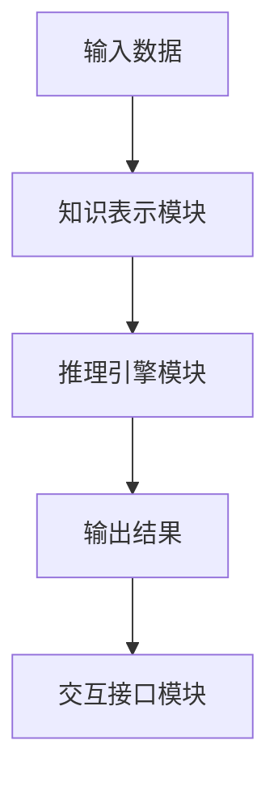

                 


# AI Agent的神经-符号混合架构实现

> 关键词：AI Agent，神经符号混合架构，符号逻辑，神经网络，知识表示，推理引擎

> 摘要：本文详细探讨了AI Agent的神经-符号混合架构的实现，从基本概念到算法原理，再到系统设计和项目实战，全面解析了神经符号混合架构的核心思想和应用场景。通过理论分析与实践结合，展示了如何将符号逻辑与神经网络相结合，实现更加智能和可解释的AI系统。

---

# 第一部分: AI Agent的神经-符号混合架构背景与概念

## 第1章: AI Agent与神经-符号混合架构概述

### 1.1 AI Agent的基本概念

#### 1.1.1 AI Agent的定义与特点
AI Agent（智能体）是指能够感知环境、自主决策并执行任务的智能实体。它可以是一个软件程序、机器人或其他智能系统，其核心目标是通过与环境交互来实现特定目标。AI Agent的特点包括：

- **自主性**：能够在没有外部干预的情况下独立运作。
- **反应性**：能够实时感知环境并做出响应。
- **目标导向**：所有行为都以实现特定目标为导向。
- **可解释性**：决策过程需要具备一定的透明性和可解释性。

#### 1.1.2 神经-符号混合架构的意义
传统的AI Agent通常采用单一的方法，如基于符号逻辑的专家系统或基于神经网络的深度学习模型。然而，这两种方法各有优缺点：

- **符号逻辑**：具有可解释性，但难以处理复杂和模糊的问题。
- **神经网络**：能够处理复杂数据，但缺乏可解释性和灵活性。

神经-符号混合架构通过结合神经网络的特征提取能力和符号逻辑的可解释性，弥补了两者的不足，使得AI Agent能够更好地处理复杂任务，同时保持决策的透明性和可解释性。

#### 1.1.3 神经符号混合架构的应用领域
神经符号混合架构在多个领域具有广泛的应用潜力，包括：

- **自然语言处理**：结合符号逻辑与深度学习，提升模型的可解释性和推理能力。
- **机器人控制**：通过符号逻辑指导神经网络的决策过程，实现更智能的机器人行为。
- **自动驾驶**：结合符号逻辑的规则和神经网络的感知能力，提升自动驾驶的安全性和决策能力。

---

## 第2章: 神经符号混合架构的核心概念

### 2.1 神经符号混合架构的原理

#### 2.1.1 神经网络与符号逻辑的结合方式
神经符号混合架构的核心思想是将符号逻辑与神经网络结合，形成一个统一的模型。常见的结合方式包括：

- **符号增强的神经网络**：在神经网络中嵌入符号逻辑规则，提升模型的推理能力。
- **符号驱动的神经推理**：通过符号逻辑指导神经网络的推理过程，实现端到端的学习与推理。

#### 2.1.2 神经符号混合架构的数学模型
神经符号混合架构的数学模型通常由两部分组成：符号逻辑模块和神经网络模块。符号逻辑模块负责将问题转化为符号表示，神经网络模块负责处理符号表示并生成输出。

例如，符号逻辑模块可以将自然语言文本转化为符号形式（如谓词逻辑表示），神经网络模块则负责对这些符号进行处理，生成最终的输出（如回答或决策）。

#### 2.1.3 神经符号混合架构的实现步骤
神经符号混合架构的实现通常包括以下步骤：

1. **符号化**：将输入数据转化为符号表示。
2. **神经网络处理**：对符号表示进行神经网络处理，生成中间结果。
3. **符号推理**：结合符号逻辑规则，对中间结果进行推理，生成最终输出。

### 2.2 神经符号混合架构的核心概念对比

#### 2.2.1 神经网络与符号逻辑的对比
| 特性                | 神经网络                     | 符号逻辑                     |
|---------------------|-----------------------------|-----------------------------|
| 可解释性             | 低                         | 高                         |
| 处理能力             | 复杂模式，但缺乏灵活性       | 简洁规则，但缺乏处理复杂数据的能力 |
| 学习方式             | 监督学习，端到端             | 基于规则，符号推理           |

#### 2.2.2 神经符号混合架构的优缺点
| 特性                | 优点                         | 缺点                         |
|---------------------|-----------------------------|-----------------------------|
| 可解释性             | 高                         | 需要在符号逻辑与神经网络之间找到平衡 |
| 处理能力             | 强大，能够处理复杂数据       | 实现复杂，需要结合两种不同方法 |
| 灵活性               | 高，能够适应多种任务         | 开发难度较高                 |

---

## 第3章: 神经符号混合架构的算法原理

### 3.1 神经符号混合架构的算法流程

#### 3.1.1 神经符号混合架构的输入处理
神经符号混合架构的输入通常包括两种类型的数据：符号数据和非符号数据。符号数据（如规则、谓词）需要经过符号化处理，而非符号数据（如图像、文本）则需要经过特征提取。

例如，对于自然语言处理任务，输入文本需要经过分词、词性标注等符号化处理，生成对应的符号表示。

#### 3.1.2 神经符号混合架构的符号推理
符号推理是神经符号混合架构的核心步骤。符号逻辑规则被嵌入到神经网络中，指导模型的推理过程。例如，可以通过符号逻辑规则对神经网络的输出进行约束，确保推理结果符合逻辑。

#### 3.1.3 神经符号混合架构的结果输出
最终的输出结果可以是符号形式或非符号形式。例如，对于自然语言理解任务，输出可能是符号化的谓词逻辑表达式或自然语言文本。

### 3.2 神经符号混合架构的数学模型

#### 3.2.1 神经符号混合架构的数学公式
神经符号混合架构的数学模型通常由符号逻辑模块和神经网络模块两部分组成。符号逻辑模块将输入数据转化为符号表示，神经网络模块对符号表示进行处理，生成最终的输出。

例如，符号逻辑模块可以将输入文本转化为符号表示 $S$，神经网络模块对符号表示 $S$ 进行处理，生成最终的输出 $O$：

$$ O = f(S) $$

其中，$f$ 是神经网络模型。

#### 3.2.2 神经符号混合架构的符号
神经符号混合架构中的符号逻辑通常采用谓词逻辑表示。例如，谓词逻辑表达式可以表示为：

$$ P(x, y) $$

其中，$P$ 是谓词，$x$ 和 $y$ 是变量。

---

## 第4章: 神经符号混合架构的系统分析与架构设计

### 4.1 系统分析与架构设计

#### 4.1.1 系统功能设计
神经符号混合架构的系统功能设计通常包括以下几个模块：

1. **知识表示模块**：负责将输入数据转化为符号表示。
2. **推理引擎模块**：负责对符号表示进行推理，生成中间结果。
3. **交互接口模块**：负责与用户或其他系统进行交互，接收输入并输出结果。

#### 4.1.2 系统架构设计
以下是神经符号混合架构的系统架构图：



#### 4.1.3 接口设计与交互流程
神经符号混合架构的接口设计通常包括以下步骤：

1. **输入处理**：接收输入数据并进行预处理。
2. **符号化**：将输入数据转化为符号表示。
3. **推理**：对符号表示进行推理，生成中间结果。
4. **输出处理**：将中间结果转化为最终输出。

---

## 第5章: 项目实战

### 5.1 环境安装与配置
为了实现神经符号混合架构，需要安装以下环境和工具：

- **Python**：用于编写代码。
- **TensorFlow/PyTorch**：用于神经网络的实现。
- **符号逻辑库**：如`logpy`，用于符号逻辑的处理。

### 5.2 系统核心实现

#### 5.2.1 神经符号混合架构的核心代码实现
以下是神经符号混合架构的核心代码实现示例：

```python
import tensorflow as tf
from logpy import predicate, fact, query

# 定义符号逻辑规则
@predicate
def rule(x, y):
    return x == y

# 神经网络模型
class NeuralModel(tf.keras.Model):
    def __init__(self):
        super(NeuralModel, self).__init__()
        self.dense = tf.keras.layers.Dense(10, activation='relu')
        self.output = tf.keras.layers.Dense(1, activation='sigmoid')

    def call(self, inputs):
        x = self.dense(inputs)
        return self.output(x)

# 组合神经网络和符号逻辑
def neural_symbolic_model(inputs):
    symbols = rule(inputs, inputs)
    outputs = NeuralModel()(inputs)
    return outputs, symbols

# 使用神经符号混合架构进行推理
inputs = tf.constant([1.0, 2.0, 3.0])
outputs, symbols = neural_symbolic_model(inputs)
print("输出结果:", outputs.numpy())
print("符号表示:", symbols)
```

#### 5.2.2 知识库的构建与推理
知识库的构建是神经符号混合架构的重要部分。以下是构建知识库的示例：

```python
# 定义知识库
facts = [
    ('a', 'b'),
    ('b', 'c'),
    ('c', 'd')
]

# 将知识库转化为符号表示
for fact in facts:
    rule(fact[0], fact[1])
```

通过上述代码，可以实现知识库的构建和符号推理。

---

## 第6章: 总结与展望

### 6.1 本章总结
神经符号混合架构通过结合神经网络的特征提取能力和符号逻辑的可解释性，为AI Agent的实现提供了新的思路。本文详细探讨了神经符号混合架构的核心概念、算法原理、系统设计和项目实现，展示了其在实际应用中的潜力。

### 6.2 注意事项与未来研究方向
在实现神经符号混合架构时，需要注意以下几点：

- **符号逻辑的设计**：符号逻辑的设计需要合理，能够指导神经网络的推理过程。
- **模型的可解释性**：神经符号混合架构需要保持较高的可解释性，以便更好地应用于实际场景。

未来的研究方向包括：

- **更复杂的符号逻辑设计**：探索更加复杂的符号逻辑，提升模型的推理能力。
- **神经符号混合架构的优化**：进一步优化神经符号混合架构的实现，提升其性能和可扩展性。

### 6.3 最佳实践 tips
- 在实现神经符号混合架构时，建议先从简单的符号逻辑开始，逐步增加复杂度。
- 使用符号逻辑库（如`logpy`）可以简化符号逻辑的实现过程。
- 神经网络模型的选择需要根据具体任务的需求进行调整。

---

作者：AI天才研究院/AI Genius Institute & 禅与计算机程序设计艺术 /Zen And The Art of Computer Programming

---

通过本文的详细讲解，读者可以全面了解AI Agent的神经符号混合架构的核心思想和实现方法，并能够在实际项目中应用这些知识，开发出更加智能和可解释的AI系统。

