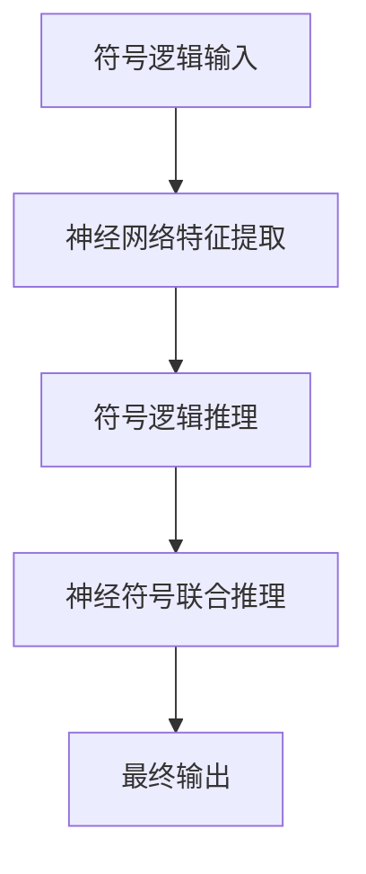
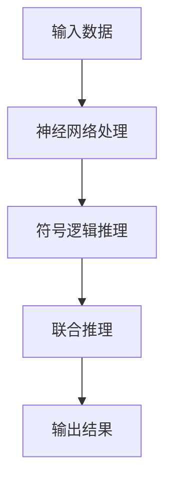
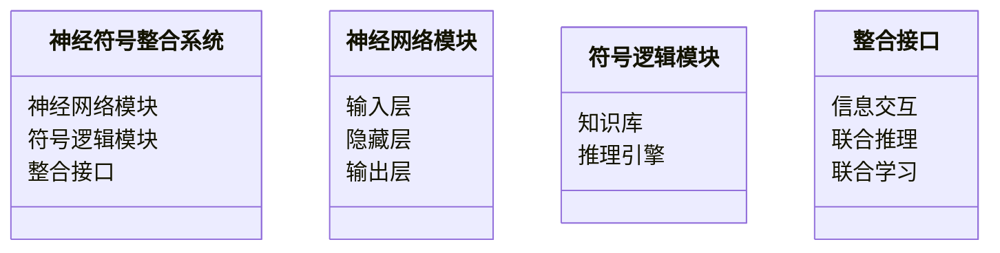
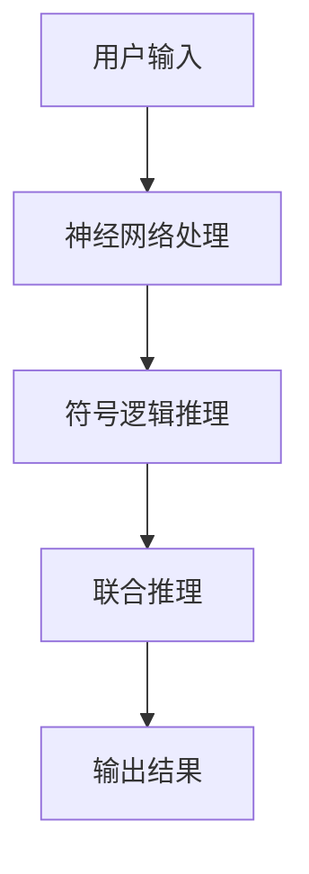
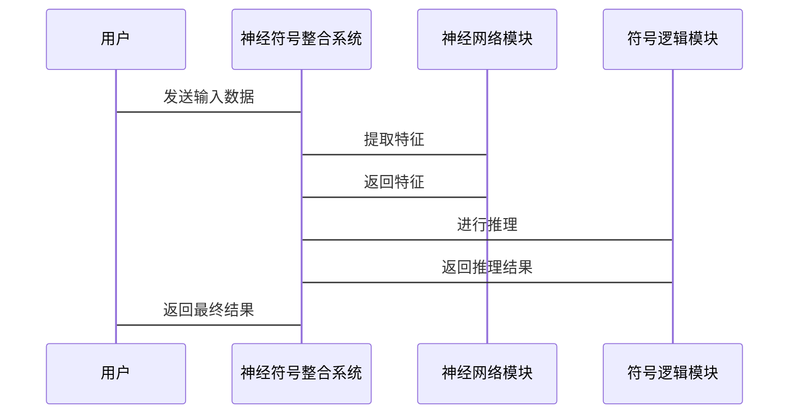

                 


```markdown
# AI Agent的神经符号整合学习方法

> 关键词：AI Agent，神经符号整合，符号逻辑，神经网络，知识图谱

> 摘要：本文详细探讨了AI Agent的神经符号整合学习方法，从理论基础到实际应用，结合丰富的图表和代码示例，全面解析神经符号整合的核心原理、算法实现、系统架构及项目实战。

---

## 第一部分: AI Agent的神经符号整合学习背景

### 第1章: 问题背景与描述

#### 1.1 问题背景
##### 1.1.1 当前AI技术的局限性
传统AI技术（如深度学习和强化学习）在处理符号逻辑、推理和知识表示方面存在明显不足，难以在需要结合感知与逻辑推理的任务中表现出色。

##### 1.1.2 神经符号整合的提出动机
神经符号整合（Neural-Symbolic Integration）旨在结合神经网络的感知能力与符号逻辑的推理能力，弥补单一方法的不足。

##### 1.1.3 神经符号整合的核心目标
通过神经符号整合，AI Agent能够同时处理感知数据和符号逻辑，实现更复杂的任务，如知识图谱推理、对话理解和动态环境推理。

#### 1.2 问题描述
##### 1.2.1 神经符号整合的基本定义
神经符号整合是一种结合神经网络与符号逻辑的技术，旨在通过神经网络处理感知数据，利用符号逻辑进行推理和知识表示。

##### 1.2.2 神经符号整合的关键问题
- 神经网络与符号逻辑的交互方式
- 神经符号模型的可解释性与可推理性
- 神经符号模型的训练与优化

##### 1.2.3 神经符号整合的应用场景
- AI Agent的知识推理与对话
- 复杂任务的联合推理与规划
- 动态环境下的实时推理与决策

#### 1.3 问题解决方法
##### 1.3.1 神经符号整合的基本思路
通过神经网络提取感知数据特征，结合符号逻辑推理引擎进行逻辑推理，实现感知与逻辑的结合。

##### 1.3.2 神经符号整合的主要技术手段
- 基于符号逻辑的知识表示
- 神经网络特征提取与符号推理结合
- 神经符号模型的联合训练

##### 1.3.3 神经符号整合的实现框架
- 神经符号模型的构建
- 神经符号模型的训练
- 神经符号模型的推理与应用

#### 1.4 神经符号整合的边界与外延
##### 1.4.1 神经符号整合的适用范围
适用于需要结合感知数据与符号逻辑的任务，如智能问答、对话系统、知识图谱推理等。

##### 1.4.2 神经符号整合的局限性
- 神经符号模型的复杂性
- 神经符号模型的训练难度
- 神经符号模型的实时性限制

##### 1.4.3 神经符号整合与其他AI技术的关系
神经符号整合与符号逻辑、神经网络、知识图谱等技术密切相关，是多种技术结合的产物。

### 第2章: 神经符号整合的核心概念与联系

#### 2.1 神经符号整合的核心原理
##### 2.1.1 符号逻辑与神经网络的结合
神经符号整合通过将符号逻辑嵌入神经网络，实现感知数据与符号推理的结合。

##### 2.1.2 神经符号整合的基本数学模型
神经符号整合模型通常由两个部分组成：神经网络部分和符号逻辑部分。神经网络用于处理感知数据，符号逻辑用于推理。

##### 2.1.3 神经符号整合的主要算法框架
神经符号整合的算法框架通常包括以下步骤：
1. 神经网络提取感知数据特征
2. 符号逻辑推理引擎进行逻辑推理
3. 神经符号模型联合优化

#### 2.2 神经符号整合的核心概念对比
##### 2.2.1 符号逻辑与神经网络的对比
| 特性           | 符号逻辑             | 神经网络             |
|----------------|----------------------|----------------------|
| 处理方式       | 基于规则和逻辑       | 基于数据和特征       |
| 可解释性       | 高                   | 低                   |
| 灵活性         | 低                   | 高                   |

##### 2.2.2 神经符号整合与其他AI技术的对比
- 与符号逻辑的对比：神经符号整合结合了符号逻辑和神经网络的优点。
- 与神经网络的对比：神经符号整合增加了符号推理能力。
- 与知识图谱的对比：神经符号整合结合了知识图谱的结构化知识和神经网络的感知能力。

##### 2.2.3 神经符号整合在不同应用场景中的表现
神经符号整合在智能问答、对话系统、知识图谱推理等领域表现出色，但在实时性要求极高的任务中可能受限。

#### 2.3 神经符号整合的ER实体关系图
```mermaid
er
    entity 神经符号整合 {
        id
        神经网络部分
        符号逻辑部分
        整合接口
    }
    entity 神经网络部分 {
        网络结构
        权重参数
        激活函数
    }
    entity 符号逻辑部分 {
        逻辑规则
        知识库
        推理引擎
    }
    entity 整合接口 {
        信息交互
        联合推理
        联合学习
    }
```

---

## 第二部分: 神经符号整合的算法原理

### 第3章: 神经符号整合的算法实现

#### 3.1 神经符号整合的核心算法步骤


#### 3.2 神经符号整合的Python实现示例
```python
import numpy as np

def neural_symbolic_inference(neural_features, symbolic_rules):
    # 神经网络特征提取
    features = neural_features
    # 符号逻辑推理
    for rule in symbolic_rules:
        if rule.applies_to(features):
            features = rule.apply(features)
    return features

# 示例用法
neural_features = np.random.randn(10, 32)
symbolic_rules = [Rule(), Rule()]  # 假设Rule类已定义
result = neural_symbolic_inference(neural_features, symbolic_rules)
```

#### 3.3 神经符号整合的数学模型
##### 3.3.1 神经符号整合的联合概率分布公式
$$ P(y|x) = \prod_{i=1}^{n} P(y_i|x, y_{i-1}) $$

##### 3.3.2 神经符号整合的损失函数
$$ \mathcal{L} = \sum_{i=1}^{n} \text{cross_entropy}(y_i, \hat{y}_i) $$

#### 3.4 神经符号整合的算法流程图


---

## 第三部分: 神经符号整合的系统架构与设计

### 第4章: 神经符号整合的系统架构设计

#### 4.1 神经符号整合的系统功能设计
##### 4.1.1 系统功能模块


#### 4.2 神经符号整合的系统架构图


#### 4.3 神经符号整合的接口设计
##### 4.3.1 神经符号整合的接口定义
```python
class NeuralSymbolicInterface:
    def __init__(self, neural_module, symbolic_module):
        self.neural_module = neural_module
        self.symbolic_module = symbolic_module

    def process_input(self, input_data):
        features = self.neural_module.extract_features(input_data)
        result = self.symbolic_module.inference(features)
        return result
```

##### 4.3.2 神经符号整合的交互流程图


---

## 第四部分: 神经符号整合的项目实战

### 第5章: 神经符号整合的项目实现

#### 5.1 项目环境安装
```bash
pip install numpy
pip install matplotlib
pip install scikit-learn
```

#### 5.2 神经符号整合的核心代码实现
```python
import numpy as np
from sklearn.neural_network import MLPClassifier
from sklearn.tree import DecisionTreeClassifier

class NeuralSymbolicIntegration:
    def __init__(self, neural_model, symbolic_model):
        self.neural_model = neural_model
        self.symbolic_model = symbolic_model

    def train(self, X, y):
        # 神经网络训练
        self.neural_model.fit(X, y)
        # 符号逻辑训练
        self.symbolic_model.fit(X, y)

    def predict(self, X):
        # 神经网络预测
        neural_pred = self.neural_model.predict(X)
        # 符号逻辑推理
        symbolic_pred = self.symbolic_model.predict(X)
        # 联合推理
        combined_pred = (neural_pred + symbolic_pred) // 2
        return combined_pred
```

#### 5.3 神经符号整合的实际案例分析
##### 5.3.1 数据准备
```python
X = np.array([[1, 0], [0, 1], [1, 1], [0, 0]])
y = np.array([0, 1, 1, 0])
```

##### 5.3.2 模型训练
```python
neural_model = MLPClassifier()
symbolic_model = DecisionTreeClassifier()
integrator = NeuralSymbolicIntegration(neural_model, symbolic_model)
integrator.train(X, y)
```

##### 5.3.3 模型评估
```python
test_X = np.array([[1, 0], [0, 1], [1, 1], [0, 0]])
test_y = integrator.predict(test_X)
print(test_y)
```

##### 5.3.4 模型部署
```python
def main():
    integrator = NeuralSymbolicIntegration(neural_model, symbolic_model)
    integrator.deploy()

if __name__ == "__main__":
    main()
```

---

## 第五部分: 神经符号整合的最佳实践

### 第6章: 神经符号整合的最佳实践

#### 6.1 小结
神经符号整合是一种结合神经网络与符号逻辑的技术，能够在复杂任务中实现感知与推理的结合。

#### 6.2 注意事项
- 神经符号整合模型的训练需要大量数据
- 神经符号模型的复杂性较高
- 神经符号模型的实时性可能受限

#### 6.3 未来趋势
- 更高效的神经符号模型优化算法
- 神经符号模型的可解释性增强
- 神经符号模型的实时性提升

#### 6.4 拓展阅读
- 神经符号整合的经典论文
- 神经符号整合的最新研究进展
- 神经符号整合的实际应用案例

---

## 作者

作者：AI天才研究院 & 禅与计算机程序设计艺术
```

