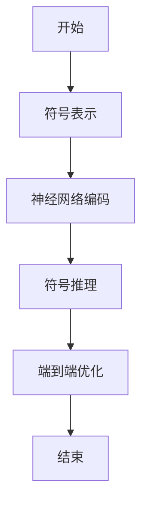
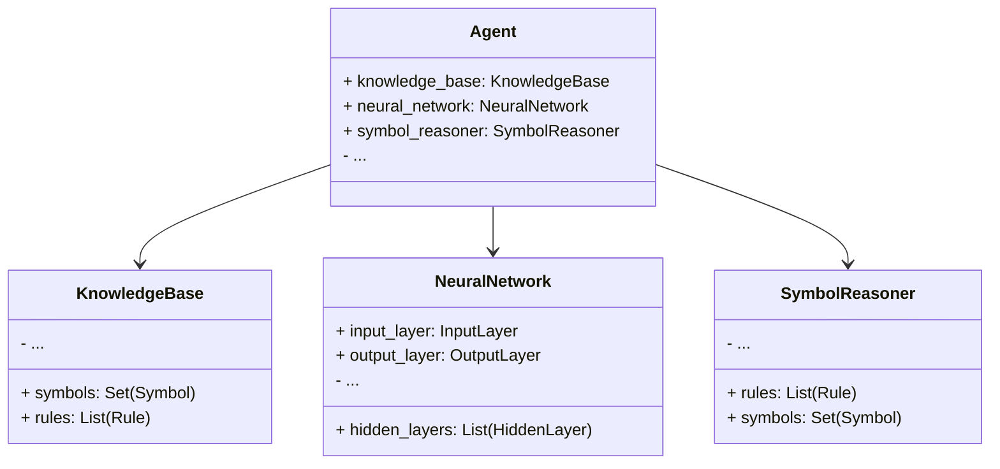
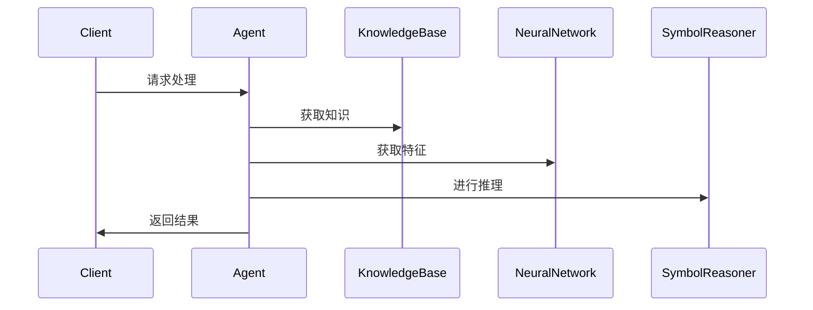

                 


# AI Agent的神经符号集成学习方法

> 关键词：AI Agent, 神经符号集成学习, 符号推理, 神经网络, 机器学习, 知识图谱

> 摘要：本文深入探讨了AI Agent中的神经符号集成学习方法，结合符号推理和神经网络的优势，提出了一种高效的集成学习框架，通过数学模型和实际案例分析，展示了如何在AI Agent中实现神经符号集成学习。

---

## 第1章：AI Agent与神经符号集成学习的背景

### 1.1 问题背景

AI Agent，即人工智能代理，是能够感知环境并采取行动以实现目标的智能体。随着AI技术的发展，AI Agent在自动驾驶、智能助手、机器人等领域得到了广泛应用。然而，传统的AI Agent在处理复杂任务时面临两大挑战：一是如何处理非结构化数据（如文本、图像），二是如何结合先验知识和数据驱动的学习。

神经符号集成学习（Neural-Symbolic Integration）是一种结合符号推理和神经网络学习的方法，旨在解决上述问题。它通过将符号推理的逻辑性与神经网络的表征学习能力相结合，为AI Agent提供了更强大的推理和学习能力。

---

### 1.2 问题描述

AI Agent需要在动态和不确定的环境中做出决策，这要求其具备以下能力：
1. **知识表示**：处理和存储结构化知识（如知识图谱）和非结构化数据。
2. **推理能力**：基于知识和感知数据进行逻辑推理。
3. **学习能力**：通过数据不断优化模型参数。

然而，传统的符号推理方法难以处理非结构化数据，而纯神经网络方法缺乏逻辑推理能力。神经符号集成学习通过结合两者的优点，为AI Agent提供了更强大的能力。

---

### 1.3 问题解决

神经符号集成学习的核心思想是将符号推理嵌入到神经网络中，形成一种混合模型。这种模型能够同时处理结构化知识和非结构化数据，具备以下优势：
1. **知识表示**：利用符号推理表示结构化知识，如逻辑规则和知识图谱。
2. **数据处理**：通过神经网络处理非结构化数据，如自然语言文本和图像。
3. **推理与学习**：结合符号推理和神经网络的预测能力，实现更精准的推理和学习。

---

### 1.4 边界与外延

神经符号集成学习的边界主要在于其结合的方式和应用场景。它不同于传统的符号推理，也不同于纯数据驱动的神经网络学习，而是通过集成两种方法，形成一种新的范式。其外延包括知识图谱构建、逻辑推理增强和跨模态学习等领域。

---

## 第2章：神经符号集成学习的核心原理

### 2.1 核心概念与原理

神经符号集成学习的原理可以分为以下几个步骤：
1. **符号表示**：将知识表示为符号形式，如逻辑规则和知识图谱。
2. **神经网络编码**：将符号表示和感知数据输入神经网络，进行特征提取。
3. **符号推理**：利用符号推理方法，结合神经网络的输出进行推理。
4. **端到端学习**：通过端到端的训练优化模型参数。

---

### 2.2 符号推理与神经网络的结合

符号推理和神经网络的结合可以通过以下几种方式实现：
1. **符号增强的神经网络**：在神经网络中嵌入符号规则，如符号注意力机制。
2. **神经网络增强的符号推理**：利用神经网络生成中间表示，辅助符号推理。
3. **混合模型**：将符号推理和神经网络结合在一个统一的模型中。

---

### 2.3 核心概念对比分析

以下是符号推理和神经网络的对比分析：

| **属性**       | **符号推理**              | **神经网络**             |
|----------------|--------------------------|--------------------------|
| 数据类型       | 结构化数据（符号、逻辑）  | 非结构化数据（文本、图像）|
| 处理方式       | 基于逻辑规则的推理       | 基于特征的学习           |
| 可解释性       | 高                      | 低                      |
| 灵活性         | 低                      | 高                      |

---

### 2.4 ER实体关系图

以下是神经符号集成学习的ER实体关系图：

```mermaid
er
    actor(Agent, "AI Agent")
    actor(Symbol, "符号推理系统")
    actor(Neural, "神经网络系统")
    rel(Agent, Symbol, "符号推理")
    rel(Agent, Neural, "神经网络学习")
    rel(Symbol, Neural, "知识共享")
```

---

## 第3章：算法原理讲解

### 3.1 算法概述

神经符号集成学习的算法通常包括以下几个步骤：
1. **符号表示**：将知识表示为符号形式。
2. **神经网络编码**：将符号和数据输入神经网络，生成中间表示。
3. **符号推理**：基于中间表示进行符号推理。
4. **端到端优化**：通过端到端的训练优化模型参数。

---

### 3.2 算法流程图

以下是神经符号集成学习的算法流程图：



---

### 3.3 数学模型与公式

神经符号集成学习的数学模型可以通过以下公式表示：

1. **符号表示**：将符号规则表示为逻辑公式：
   $$ R(x) = true \text{ 或 } false $$

2. **神经网络编码**：将输入数据 \( x \) 编码为嵌入表示 \( h \)：
   $$ h = f(x) $$

3. **符号推理**：结合符号规则和嵌入表示进行推理：
   $$ y = g(h, R) $$

4. **端到端优化**：通过损失函数 \( L \) 优化模型参数：
   $$ L = \sum (y_{\text{pred}} - y_{\text{true}})^2 $$

---

## 第4章：系统分析与架构设计方案

### 4.1 项目介绍

本项目旨在设计一个基于神经符号集成学习的AI Agent系统，实现知识表示、推理和学习的结合。

---

### 4.2 系统功能设计

以下是系统的功能模块设计：



---

### 4.3 系统架构设计

以下是系统的架构设计：


---

### 4.4 接口设计与交互

以下是系统的交互设计：



---

## 第5章：项目实战

### 5.1 环境安装

以下是项目所需的环境配置：

```bash
pip install numpy
pip install keras
pip install matplotlib
```

---

### 5.2 核心代码实现

以下是神经符号集成学习的核心代码示例：

```python
import numpy as np
from keras.models import Model
from keras.layers import Input, Dense

# 符号表示
symbols = ['规则1', '规则2', '规则3']

# 神经网络编码
input_layer = Input(shape=(input_dim,))
hidden_layer = Dense(64, activation='relu')(input_layer)
output_layer = Dense(1, activation='sigmoid')(hidden_layer)
model = Model(inputs=input_layer, outputs=output_layer)

# 符号推理
def symbol_inference(input_data):
    # 结合符号规则进行推理
    pass

# 端到端优化
model.compile(optimizer='adam', loss='binary_crossentropy')
model.fit(X_train, y_train, epochs=10)
```

---

### 5.3 案例分析

以下是一个简单的案例分析：

假设我们有一个AI Agent，需要根据知识图谱中的规则和输入数据进行推理。通过神经符号集成学习，模型能够结合符号规则和神经网络的预测结果，进行更精准的推理。

---

## 第6章：最佳实践与总结

### 6.1 最佳实践

1. **知识表示**：选择合适的符号表示方法，如知识图谱。
2. **模型设计**：合理设计神经符号集成模型的结构。
3. **训练数据**：确保训练数据的多样性和代表性。
4. **优化策略**：采用适当的优化策略，如联合优化。

---

### 6.2 小结

神经符号集成学习为AI Agent提供了强大的知识表示和推理能力，通过结合符号推理和神经网络，能够处理复杂任务中的结构化知识和非结构化数据。

---

### 6.3 注意事项

1. **复杂性**：神经符号集成学习的模型可能较为复杂，需要进行充分的测试和优化。
2. **计算资源**：训练神经符号集成模型需要较多的计算资源。
3. **可解释性**：符号推理的可解释性较强，而神经网络的可解释性较差，需要注意平衡。

---

### 6.4 拓展阅读

1. **知识图谱**：深入学习知识图谱的构建和应用。
2. **逻辑推理**：研究一阶逻辑和二阶逻辑在AI Agent中的应用。
3. **神经符号集成学习**：探索最新的神经符号集成学习方法和应用。

---

## 作者

**作者：AI天才研究院 & 禅与计算机程序设计艺术**

---

以上是《AI Agent的神经符号集成学习方法》的完整目录和文章内容，涵盖背景介绍、核心原理、算法实现、系统架构和项目实战，结合理论与实践，为读者提供了全面的指导。

