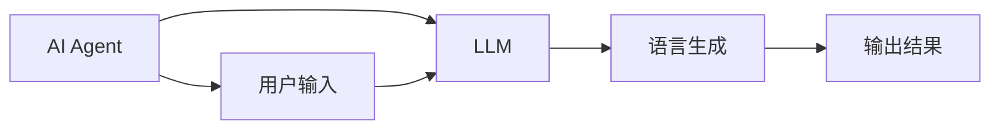
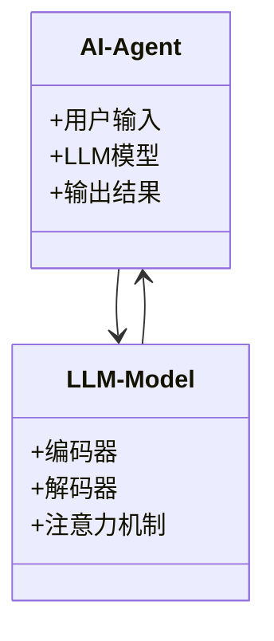
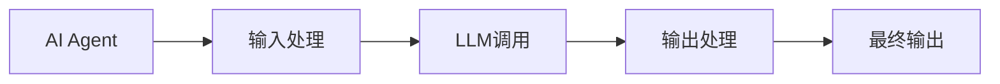
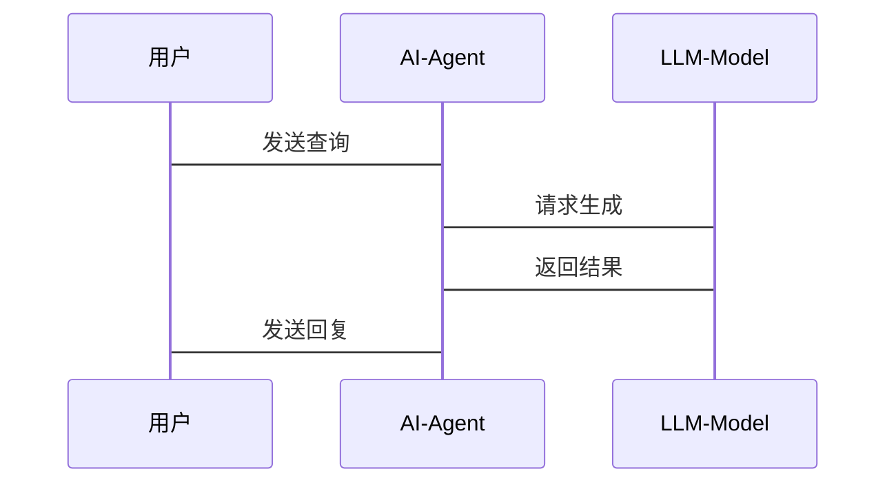

                 


# AI Agent的精确语言生成：细粒度控制LLM的输出质量

---

## 关键词：
- AI Agent
- LLM（Large Language Model）
- 语言生成
- 细粒度控制
- 自然语言处理
- 对齐模型
- 系统架构

---

## 摘要：
本文深入探讨了AI Agent在精确语言生成中的应用，重点分析如何通过细粒度控制大语言模型（LLM）的输出质量。文章从问题背景、核心概念、算法原理、系统架构、项目实战到最佳实践，系统性地介绍了实现高质量语言生成的关键技术与方法。通过详细讲解转换器架构、注意力机制、损失函数优化等算法细节，结合实际项目案例，为读者提供了一套完整的解决方案。同时，本文还探讨了未来发展方向，为AI Agent与自然语言处理的结合提供了新的思路。

---

# 第一部分: AI Agent与精确语言生成的背景介绍

## 第1章: AI Agent与精确语言生成概述

### 1.1 问题背景

#### 1.1.1 当前自然语言生成的挑战
自然语言生成（Natural Language Generation, NLG）是人工智能领域的重要分支，旨在让计算机能够生成符合人类语言习惯的文本。然而，现有的生成模型（如GPT系列）在实际应用中仍存在以下问题：
1. **输出质量不稳定**：模型生成的内容可能缺乏逻辑性或相关性。
2. **细粒度控制不足**：难以根据具体场景对生成结果进行精准控制。
3. **可解释性差**：生成结果的决策过程往往难以追溯。

#### 1.1.2 AI Agent在语言生成中的作用
AI Agent是一种能够感知环境、执行任务并做出决策的智能体。在语言生成领域，AI Agent可以作为桥梁，连接用户的意图与生成模型，实现更精准的输出控制。

#### 1.1.3 细粒度控制的重要性
细粒度控制是指在生成过程中，对输出的每个细节进行精确调节，以满足特定场景的需求。例如，在客服对话系统中，生成的回复需要根据用户情绪和历史记录进行微调，这正是细粒度控制的核心价值所在。

---

### 1.2 问题描述

#### 1.2.1 语言生成质量的衡量标准
语言生成质量可以从以下维度进行评估：
1. **准确性**：生成内容是否符合事实或语法规则。
2. **相关性**：生成内容是否与上下文相关。
3. **流畅性**：生成文本是否通顺自然。
4. **创造性**：生成内容是否具有创新性。

#### 1.2.2 细粒度控制的目标与边界
细粒度控制的目标是实现对生成过程的多维度干预，包括：
- 调整生成长度。
- 控制输出风格（如正式、口语化）。
- 限制特定词汇的使用。
- 根据输入条件动态调整生成策略。

#### 1.2.3 当前技术的局限性
现有技术在细粒度控制方面仍存在以下不足：
1. **模型的黑箱特性**：生成结果难以完全预测和控制。
2. **计算资源消耗**：复杂的控制策略可能带来额外的计算开销。
3. **多模态信息整合**：如何结合视觉、语音等信息实现更精准的控制仍是一个挑战。

---

### 1.3 问题解决方法

#### 1.3.1 细粒度控制的实现路径
细粒度控制可以通过以下方式实现：
1. **输入干预**：在输入端加入特定的指令或标签。
2. **生成过程中的动态调整**：通过修改解码过程中的参数。
3. **后处理优化**：对生成结果进行二次修改。

#### 1.3.2 AI Agent的多模态能力
AI Agent可以通过整合多模态信息（如图像、语音、上下文）来实现更智能的语言生成控制。

#### 1.3.3 语言生成的可解释性
通过引入可解释性机制（如注意力权重分析），可以更好地理解生成结果的决策过程，从而实现更有效的控制。

---

### 1.4 本章小结
本章从背景出发，分析了AI Agent在语言生成中的重要性，并提出了细粒度控制的实现路径。接下来将深入探讨AI Agent与LLM的核心概念及其联系。

---

## 第2章: AI Agent与LLM的核心概念

### 2.1 AI Agent的基本原理

#### 2.1.1 AI Agent的定义与分类
- **定义**：AI Agent是一种能够感知环境、执行任务并做出决策的智能体。
- **分类**：根据智能水平，可以分为反应式Agent和认知式Agent。

#### 2.1.2 LLM在AI Agent中的角色
- **LLM的作用**：作为AI Agent的语言生成模块，负责将输入转化为自然语言输出。
- **交互流程**：用户输入 → AI Agent解析 → LLM生成 → 输出结果。

#### 2.1.3 细粒度控制的实现机制
- **输入干预**：通过调整输入的格式或内容。
- **动态参数调整**：在生成过程中实时修改模型参数。

---

### 2.2 LLM的内部结构与工作原理

#### 2.2.1 转换器架构的原理
- **编码器**：将输入文本转化为固定长度的向量表示。
- **解码器**：根据编码结果生成输出序列。
- **自注意力机制**：捕捉输入中的长距离依赖关系。

#### 2.2.2 注意力机制的作用
- **多头注意力**：通过多个子空间的注意力计算，增强模型的表达能力。
- **位置编码**：为序列中的每个位置赋予独特的特征。

#### 2.2.3 损失函数的优化过程
- **交叉熵损失函数**：衡量生成结果与真实标签的差异。
- **梯度下降**：通过优化器调整模型参数。

---

### 2.3 AI Agent与LLM的实体关系图



---

### 2.4 本章小结
本章详细介绍了AI Agent与LLM的核心概念及其关系，为后续的细粒度控制实现奠定了基础。

---

## 第3章: 细粒度控制的算法原理

### 3.1 转换器架构的数学模型

#### 3.1.1 编码器-解码器结构
- **编码器**：将输入序列 $x = (x_1, x_2, ..., x_n)$ 转化为向量表示 $z = (z_1, z_2, ..., z_n)$。
- **解码器**：根据编码结果生成输出序列 $y = (y_1, y_2, ..., y_m)$。

#### 3.1.2 自注意力机制的公式推导
- **自注意力权重计算**：
$$
\text{Attention}(Q, K, V) = \text{softmax}\left(\frac{QK^T}{\sqrt{d_k}}\right)V
$$
其中，$Q$、$K$、$V$分别是查询、键、值矩阵。

#### 3.1.3 损失函数的计算过程
- **交叉熵损失**：
$$
\text{Loss} = -\sum_{i=1}^{m} \text{log}(P(y_i|x))
$$

---

### 3.2 注意力机制的实现细节

#### 3.2.1 多头注意力的原理
- **多头机制**：将查询、键、值分解为多个子空间进行独立计算，最后将结果拼接。
- **子空间维度**：
$$
d_k = \frac{d}{n}
$$
其中，$d$是嵌入维度，$n$是头数。

#### 3.2.2 位置编码的数学表达
- **绝对位置编码**：
$$
P(i) = \sum_{k=0}^{n-1} \sin\left(\frac{\pi i (2k + 1)}{10000}\right)
$$

#### 3.2.3 解码器中的采样策略
- **贪婪采样**：选择概率最高的词。
- **随机采样**：根据概率分布随机选择词。

---

### 3.3 本章小结
本章通过数学公式和流程图详细讲解了细粒度控制的算法原理，为后续实现提供了理论基础。

---

## 第4章: 系统分析与架构设计方案

### 4.1 问题场景介绍
- **场景描述**：以电商客服对话系统为例，AI Agent需要根据用户输入生成个性化的回复。

### 4.2 系统功能设计

#### 4.2.1 领域模型设计


#### 4.2.2 系统架构设计


#### 4.2.3 系统交互设计


---

## 第5章: 项目实战

### 5.1 环境安装
- **工具安装**：安装Python、TensorFlow、Hugging Face库。

### 5.2 核心代码实现

#### 5.2.1 LLM模型加载
```python
from transformers import AutoModelWithLMHead, AutoTokenizer

model = AutoModelWithLMHead.from_pretrained('gpt2')
tokenizer = AutoTokenizer.from_pretrained('gpt2')
```

#### 5.2.2 细粒度控制实现
```python
def generate_text(prompt, max_length=50):
    inputs = tokenizer.encode(prompt, return_tensors='np')
    outputs = model.generate(inputs, max_length=max_length, do_sample=True)
    return tokenizer.decode(outputs[0], skip_special_tokens=True)
```

---

## 第6章: 最佳实践与总结

### 6.1 最佳实践
- **模型调优**：根据具体任务调整模型参数。
- **数据质量控制**：确保训练数据的多样性和相关性。
- **多模态能力**：整合其他模态信息提升生成效果。

### 6.2 本章小结
本文系统性地介绍了AI Agent在精确语言生成中的应用，通过理论分析与实践案例，为读者提供了一套实现高质量语言生成的解决方案。未来，随着技术的进步，细粒度控制将更加智能化和个性化。

---

## 作者：AI天才研究院/AI Genius Institute & 禅与计算机程序设计艺术 /Zen And The Art of Computer Programming

---

希望这篇文章能够为您提供有价值的见解和启发！如果需要进一步讨论或优化，请随时联系。

