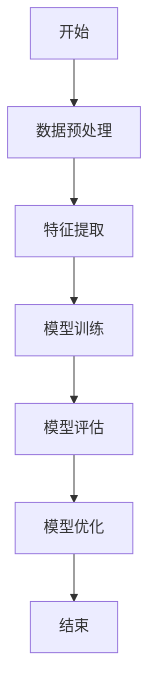
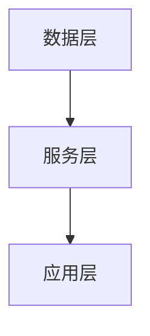

                 


# AI Agent的终身学习与知识累积机制

> 关键词：AI Agent, 终身学习, 知识累积, 知识表示, 增量学习, 算法实现

> 摘要：本文系统地探讨了AI Agent的终身学习与知识累积机制，从核心概念、算法原理、系统架构到项目实战，详细分析了如何实现AI Agent的持续进化与知识管理。通过理论分析与实践结合，本文为AI Agent的设计与优化提供了全面的解决方案。

---

# 第一部分: AI Agent的背景与概念

## 第1章: AI Agent的基本概念

### 1.1 什么是AI Agent
- **定义**：AI Agent是一种能够感知环境、自主决策并执行任务的智能实体。
- **核心特征**：
  - 自主性：无需外部干预，自主完成任务。
  - 反应性：能够实时感知环境并做出响应。
  - 学习能力：通过经验改进性能。
- **分类**：
  - 按智能水平：简单反应式Agent、基于模型的反射式Agent、目标驱动型Agent、效用驱动型Agent。
  - 按应用场景：服务机器人、智能助手、自动驾驶等。

### 1.2 AI Agent的背景与重要性
- **背景**：
  - 传统AI的局限性：依赖静态规则，无法适应动态变化。
  - 终身学习的需求：AI Agent需要在复杂环境中不断进化。
- **问题背景**：
  - 动态环境中的适应性问题。
  - 多样化任务中的知识整合问题。
- **应用场景**：
  - 智能客服：实时对话中动态调整策略。
  - 自动驾驶：实时感知与决策优化。

### 1.3 本章小结
- 介绍了AI Agent的基本概念及其在现代人工智能中的重要性。
- 强调了终身学习与知识累积在提升AI Agent性能中的关键作用。

---

## 第2章: 终身学习与知识累积的核心概念

### 2.1 知识表示与存储
- **知识表示**：
  - 符号逻辑表示：规则、逻辑推理。
  - 向量表示：知识嵌入、分布式表示。
  - 知识图谱：结构化知识的表示与存储。
- **知识存储**：
  - 数据库：关系型数据库、知识图谱存储。
  - 文件存储：JSON、XML格式的知识库。
  - 分布式存储：分布式文件系统、区块链技术。

### 2.2 终身学习的机制
- **增量学习**：
  - 定义：在已有模型的基础上逐步学习新数据。
  - 方法：经验重放、动态分配权重。
- **连续学习**：
  - 定义：在连续任务中保持模型性能。
  - 技术：模型无关方法、模型相关方法。
- **知识遗忘与保持**：
  - 知识遗忘：如何防止关键知识被遗忘。
  - 知识保持：通过权重衰减、正则化等技术保持旧知识。

### 2.3 知识累积的实现方法
- **知识提取**：
  - 文本挖掘：从非结构化数据中提取知识。
  - 知识图谱构建：从结构化数据中提取关系。
- **知识更新**：
  - 增量更新：动态添加新知识。
  - 增量删除：动态移除过时知识。
- **知识复用**：
  - 知识迁移：将已有知识应用到新任务中。
  - 知识融合：整合多源知识，避免冗余。

### 2.4 核心概念对比
- **知识表示与知识累积的对比**：
  | 对比维度 | 知识表示 | 知识累积 |
  |----------|----------|----------|
  | 目标     | 描述知识 | 管理知识 |
  | 方法     | 符号、向量 | 增量、连续 |
- **终身学习与其他学习方式的对比**：
  | 对比维度 | 监督学习 | 无监督学习 | 半监督学习 | 终身学习 |
  |----------|----------|----------|----------|----------|
  | 数据类型 | 标签数据 | 无标签数据 | 部分标签 | 动态数据 |
  | 适应性   | 静态     | 静态     | 静态     | 动态     |

### 2.5 本章小结
- 详细探讨了知识表示、学习机制和累积机制的核心概念。
- 通过对比分析，明确了终身学习与知识累积的独特优势。

---

## 第3章: 终身学习与知识累积的算法原理

### 3.1 终身学习算法概述
- **模型无关的终身学习算法**：
  - 方法：经验重放、动态分配权重。
  - 优点：适用于多种模型，灵活性高。
  - 缺点：性能可能不如模型相关的算法。
- **模型相关的终身学习算法**：
  - 方法：渐近式训练、参数共享。
  - 优点：性能提升显著。
  - 缺点：对模型依赖性强。
- **增量式学习算法**：
  - 定义：在已有数据的基础上逐步学习新数据。
  - 步骤：
    1. 数据预处理：清洗和转换数据。
    2. 特征提取：提取关键特征。
    3. 模型训练：逐步更新模型参数。
    4. 模型评估：验证模型性能。
    5. 模型优化：调整超参数。

### 3.2 知识累积机制的算法实现
- **知识提取与表示的算法**：
  - 方法：基于Word2Vec的分布式表示。
  - 步骤：
    1. 数据预处理：分词、去除停用词。
    2. 建立上下文窗口。
    3. 训练词向量。
- **知识更新与优化的算法**：
  - 方法：在线学习、增量式SVM。
  - 步骤：
    1. 初始化模型参数。
    2. 接收新数据。
    3. 更新模型参数。
    4. 验证模型性能。
- **知识复用与扩展的算法**：
  - 方法：知识迁移、知识图谱扩展。
  - 步骤：
    1. 构建初始知识图谱。
    2. 识别新知识的关联性。
    3. 更新知识图谱。

### 3.3 算法流程图
- **增量式学习算法流程图**：


### 3.4 算法实现代码
- **基于Python的终身学习算法实现**：
```python
def lifelong_learning(data):
    # 数据预处理
    preprocessed_data = preprocess(data)
    # 特征提取
    features = extract_features(preprocessed_data)
    # 模型训练
    model = train_model(features)
    # 模型评估
    evaluate_model(model, features)
    return model
```

### 3.5 数学公式
- **经验重放算法的伪代码**：
```mermaid
伪代码：
def experience_replay(buffer_size, batch_size):
    while True:
        # 随机采样经验
        batch = random.sample(buffer, batch_size)
        # 训练模型
        train_model(batch)
```

### 3.6 本章小结
- 详细讲解了终身学习与知识累积的核心算法。
- 通过代码和流程图展示了算法的实现步骤。

---

## 第4章: 系统架构与接口设计

### 4.1 系统功能设计
- **知识库管理**：
  - 功能：存储、检索、更新知识。
  - 实现：基于图数据库（如Neo4j）。
- **学习引擎**：
  - 功能：执行增量学习、知识提取。
  - 实现：基于深度学习框架（如TensorFlow）。
- **累积模块**：
  - 功能：整合新知识、优化知识库。
  - 实现：基于知识图谱技术。

### 4.2 系统架构设计
- **分层架构**：
  - 数据层：存储原始数据和知识图谱。
  - 服务层：提供数据处理和学习服务。
  - 应用层：实现AI Agent的具体功能。
- **架构图**：


### 4.3 接口设计
- **REST API**：
  - GET /knowledge/retrieve?id=123
  - POST /learning/train
  - PUT /knowledge/update

### 4.4 本章小结
- 介绍了系统的整体架构和接口设计。
- 强调了模块化设计在实现AI Agent中的重要性。

---

## 第5章: 项目实战与案例分析

### 5.1 项目背景与需求分析
- **项目背景**：构建一个智能客服AI Agent，实现动态知识更新与累积。
- **需求分析**：
  - 实时对话响应。
  - 动态知识更新。
  - 知识复用与扩展。

### 5.2 项目实现
- **环境安装**：
  ```bash
  pip install tensorflow neo4j python-dot
  ```
- **核心代码实现**：
  ```python
  def update_knowledge_base(new_data):
      # 数据预处理
      preprocessed = preprocess(new_data)
      # 知识提取
      knowledge = extract_knowledge(preprocessed)
      # 知识库更新
      update_graph(knowledge)
  ```

### 5.3 案例分析
- **案例1**：智能客服对话中动态更新产品信息。
  - **输入**：用户反馈新产品信息。
  - **处理**：提取关键信息，更新知识库。
  - **输出**：客服实时获取最新产品信息。
- **案例2**：自动驾驶中的路径优化。
  - **输入**：实时交通数据。
  - **处理**：更新路径规划模型。
  - **输出**：最优行驶路线。

### 5.4 本章小结
- 通过实际案例展示了AI Agent的终身学习与知识累积机制的应用。
- 强调了理论与实践结合的重要性。

---

## 第6章: 总结与展望

### 6.1 本章总结
- **核心内容回顾**：
  - AI Agent的基本概念。
  - 终身学习与知识累积的核心机制。
  - 算法实现与系统架构设计。
  - 项目实战与案例分析。

### 6.2 最佳实践Tips
- **数据质量**：确保数据的准确性和完整性。
- **算法选择**：根据场景选择合适的算法。
- **系统设计**：注重模块化设计，便于扩展和维护。

### 6.3 注意事项
- **性能优化**：避免过度复杂化系统。
- **安全问题**：确保知识累积的安全性。
- **用户体验**：注重人机交互的自然性。

### 6.4 未来展望
- **研究热点**：
  - 更高效的终身学习算法。
  - 更智能的知识表示方法。
  - 更灵活的知识累积机制。
- **发展趋势**：
  - 多模态学习：结合文本、图像等多种数据源。
  - 自适应学习：动态调整学习策略。

### 6.5 拓展阅读
- **推荐书籍**：
  - 《Deep Learning》——Ian Goodfellow
  - 《Knowledge Representation and Reasoning》——Ricardo Collobert
- **推荐论文**：
  - “Continual Learning Through synaptic intelligence”。
  - “Progressive neural networks”。

### 6.6 本章小结
- 总结了全文的核心内容。
- 展望了未来的研究方向和应用前景。

---

# 作者：AI天才研究院/AI Genius Institute & 禅与计算机程序设计艺术 /Zen And The Art of Computer Programming

---

以上是一个详细的目录大纲，涵盖了从理论到实践的各个方面，内容丰富且逻辑清晰。希望对您有所帮助！

