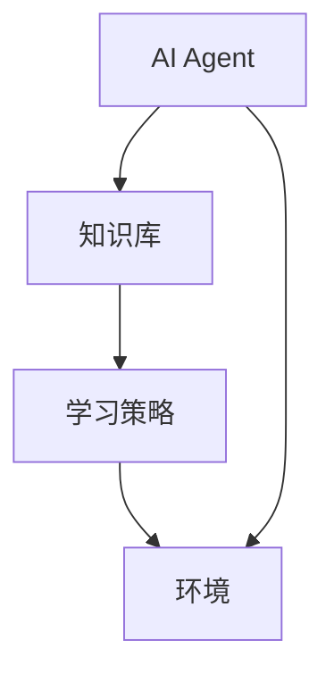
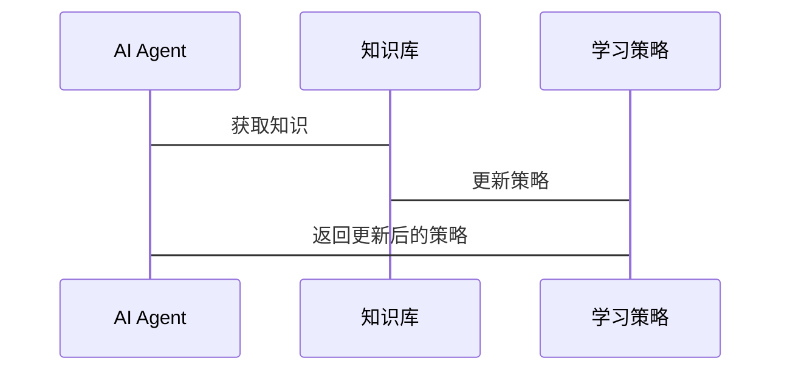

                 


# AI Agent的终身学习系统：持续适应新知识和技能

---

## 关键词：
AI Agent、终身学习系统、持续学习、知识表示、自适应学习、迁移学习、系统架构

---

## 摘要：
本文深入探讨了AI Agent的终身学习系统，分析其核心概念、算法原理、系统架构，并通过实际案例展示其应用。文章从背景介绍到系统设计，再到项目实战，全面解析如何构建一个能够持续适应新知识和技能的AI Agent系统。通过对比分析和系统设计，本文为读者提供了理论与实践相结合的深度解读。

---

## 第一部分: AI Agent终身学习系统概述

### 第1章: 背景与问题背景

#### 1.1 AI Agent的定义与特点
- **1.1.1 AI Agent的基本概念**
  - AI Agent是具有感知、推理和行动能力的智能体，能够与环境交互并实现目标。
  - AI Agent的特点包括自主性、反应性、社会性和持续性。

- **1.1.2 AI Agent的核心特点**
  - 自主性：无需外部干预，自主决策。
  - 反应性：实时感知环境并做出反应。
  - 社会性：能够与其他Agent或人类进行交互和协作。
  - 持续性：能够不断学习和适应新环境。

- **1.1.3 AI Agent与传统AI的区别**
  - 传统AI依赖预设规则，AI Agent具备自主学习和适应能力。
  - AI Agent强调与环境的动态交互，传统AI更多关注静态问题求解。

#### 1.2 终身学习系统的定义与特点
- **1.2.1 终身学习系统的定义**
  - 终身学习系统是一种能够持续从新数据中学习并更新知识的系统。
  - 其核心目标是适应动态变化的环境，保持高性能。

- **1.2.2 终身学习系统的核心特点**
  - 持续性：能够不断学习新知识。
  - 自适应性：根据新数据调整模型。
  - 灵活性：适应不同领域和任务。

- **1.2.3 终身学习系统与传统学习系统的区别**
  - 传统学习系统：一次性训练，固定模型。
  - 终身学习系统：动态学习，持续更新。

#### 1.3 问题背景与问题描述
- **1.3.1 AI Agent面临的挑战**
  - 动态环境：任务和环境不断变化。
  - 多样性：需要处理不同类型的数据和任务。
  - 资源限制：计算和数据资源有限。

- **1.3.2 终身学习系统的重要性**
  - 提高AI Agent的适应能力和灵活性。
  - 面对新任务和环境时，保持高性能。

- **1.3.3 问题解决的必要性**
  - 通过终身学习系统，AI Agent能够持续更新知识，应对复杂环境。

#### 1.4 边界与外延
- **1.4.1 终身学习系统的边界**
  - 学习范围：限定在特定领域。
  - 更新频率：定期或实时更新。

- **1.4.2 终身学习系统的外延**
  - 知识库：支持多种表示形式。
  - 适应性：能够处理不同数据类型。

- **1.4.3 相关概念的对比**
  - 对比表格：终身学习系统与传统学习系统的主要区别。

---

### 第2章: 核心概念与联系

#### 2.1 终身学习系统的核心概念
- **2.1.1 知识表示与更新机制**
  - 知识表示：使用符号逻辑或神经网络表示知识。
  - 更新机制：基于新数据更新知识库。

- **2.1.2 技能迁移与复用**
  - 迁移学习：将已学知识应用到新任务。
  - 复用策略：在不同任务中复用已有技能。

- **2.1.3 自适应学习策略**
  - 动态调整学习策略，适应新环境。

#### 2.2 AI Agent与终身学习系统的联系
- **2.2.1 AI Agent的自主性与学习能力**
  - AI Agent具备自主学习能力，能够主动探索新知识。

- **2.2.2 终身学习系统对AI Agent的支撑**
  - 提供持续的知识更新和技能提升。

- **2.2.3 两者的协同进化**
  - AI Agent通过终身学习系统不断进化，终身学习系统通过AI Agent的应用不断优化。

#### 2.3 核心概念对比表
- 对比终身学习系统与传统学习系统的区别。

#### 2.4 ER实体关系图
```mermaid
erd
  实体1: 终身学习系统
  实体2: AI Agent
  实体3: 知识库
  实体4: 学习策略
  实体1 --> 实体2: 支撑关系
  实体2 --> 实体3: 知识获取
  实体2 --> 实体4: 策略执行
```

---

## 第三部分：算法原理与数学模型

### 第3章: 迁移学习算法

#### 3.1 迁移学习算法的基本原理
- 迁移学习：将已学知识应用到新任务。
- 域适应(Domain Adaptation)：处理不同域的数据。
- 域初始化(Domain Initialization)：初始化不同域的数据。

#### 3.2 迁移学习的数学模型
- 源域和目标域的分布差异：
  $$ P(X, Y) \neq P'(X, Y) $$
- 迁移学习的目标：
  $$ \min_{\theta} \mathbb{E}_{P'}[L_{\text{source}}(f_\theta(x))] $$

#### 3.3 迁移学习的实现步骤
1. 数据预处理：对源域和目标域数据进行预处理。
2. 特征提取：提取数据特征。
3. 建模：构建迁移学习模型。
4. 训练：联合源域和目标域数据进行训练。
5. 验证：在目标域数据上验证模型性能。

#### 3.4 迁移学习的代码实现
```python
import torch
import torch.nn as nn

class迁移学习模型(nn.Module):
    def __init__(self):
        super(迁移学习模型, self).__init__()
        self特征提取层 = nn.Sequential(
            nn.Conv2d(输入通道数, 输出通道数, 核尺寸),
            nn.ReLU(),
            nn.MaxPool2d(池化尺寸)
        )
        self分类层 = nn.Linear(特征维度, 类别数)

    def forward(self, x):
        x = self.特征提取层(x)
        x = x.view(x.size(0), -1)
        x = self.分类层(x)
        return x

# 数据加载
source_loader = DataLoader(源域数据集, batch_size=批次大小, shuffle=True)
target_loader = DataLoader(目标域数据集, batch_size=批次大小, shuffle=True)

# 模型初始化
模型 = 迁移学习模型()
优化器 = torch.optim.Adam(模型.parameters(), lr=学习率)
损失函数 = nn.CrossEntropyLoss()

# 训练过程
for epoch in range(训练轮数):
    for batch_x, batch_y in source_loader:
        优化器.zero_grad()
        输出 = 模型(batch_x)
        损失 = 损失函数(输出, batch_y)
        损失.backward()
        优化器.step()

    # 验证在目标域上的性能
    valid_loss = 0
    correct = 0
    with torch.no_grad():
        for val_x, val_y in target_loader:
            输出 = 模型(val_x)
            预测 = torch.argmax(输出.data, dim=1)
            正确数 += (预测 == val_y).sum().item()
            valid_loss += 损失函数(输出, val_y).item()
    正确率 = 正确数 / len(target_loader.dataset)
    print(f"Epoch: {epoch}, Valid Loss: {valid_loss/len(target_loader)}, Accuracy: {正确率}")
```

#### 3.5 迁移学习的优缺点
- 优点：能够利用已有的知识快速适应新任务。
- 缺点：需要处理不同域的数据分布差异。

---

## 第四部分：系统架构与设计方案

### 第4章: 系统架构与设计方案

#### 4.1 问题场景介绍
- AI Agent需要在动态环境中不断学习新知识。

#### 4.2 系统功能设计
- 知识获取与存储：从环境中获取新知识并存储。
- 知识表示：使用符号逻辑或神经网络表示知识。
- 学习策略：动态调整学习策略。

#### 4.3 系统架构设计


#### 4.4 系统接口设计
- 接口1：AI Agent与知识库交互。
- 接口2：知识库与学习策略交互。

#### 4.5 系统交互设计


---

## 第五部分：项目实战

### 第5章: 项目实战

#### 5.1 环境安装
- 安装必要的库：PyTorch、numpy、scikit-learn等。

#### 5.2 核心代码实现
```python
import torch
import torch.nn as nn
import torch.optim as optim

class 终身学习模型(nn.Module):
    def __init__(self):
        super(终身学习模型, self).__init__()
        self.特征提取层 = nn.Sequential(
            nn.Conv2d(输入通道数, 输出通道数, 核尺寸),
            nn.ReLU(),
            nn.MaxPool2d(池化尺寸)
        )
        self.分类层 = nn.Linear(特征维度, 类别数)

    def forward(self, x):
        x = self.特征提取层(x)
        x = x.view(x.size(0), -1)
        x = self.分类层(x)
        return x

# 环境数据加载
环境_loader = DataLoader(环境数据集, batch_size=批次大小, shuffle=True)

# 模型初始化
模型 = 终身学习模型()
优化器 = optim.Adam(模型.parameters(), lr=学习率)
损失函数 = nn.CrossEntropyLoss()

# 训练过程
for epoch in range(训练轮数):
    for batch_x, batch_y in 环境_loader:
        优化器.zero_grad()
        输出 = 模型(batch_x)
        损失 = 损失函数(输出, batch_y)
        损失.backward()
        优化器.step()

# 知识更新过程
知识库.update(新的知识)
```

#### 5.3 案例分析
- 实际案例：AI Agent在动态环境中的知识更新。

#### 5.4 项目总结
- 项目实现的关键点：知识表示、迁移学习、系统架构设计。

---

## 第六部分：总结与展望

### 第6章: 总结与展望

#### 6.1 总结
- 本文详细探讨了AI Agent的终身学习系统，分析了其核心概念、算法原理和系统架构。

#### 6.2 未来展望
- 进一步研究如何在复杂环境中实现高效的知识更新。
- 探索更高效的迁移学习算法，提升系统性能。

#### 6.3 最佳实践 tips
- 定期更新知识库，保持系统的新鲜性。
- 在实际应用中，结合具体场景优化系统架构。

---

## 作者：
AI天才研究院/AI Genius Institute  
禅与计算机程序设计艺术 /Zen And The Art of Computer Programming

