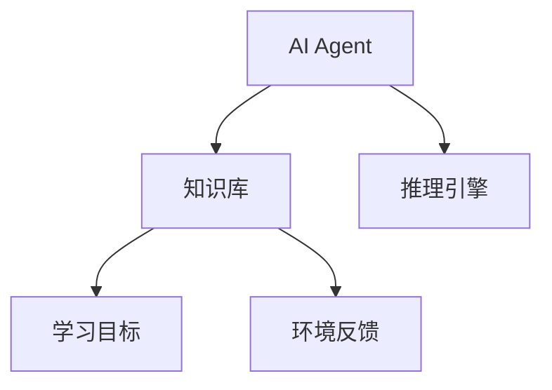
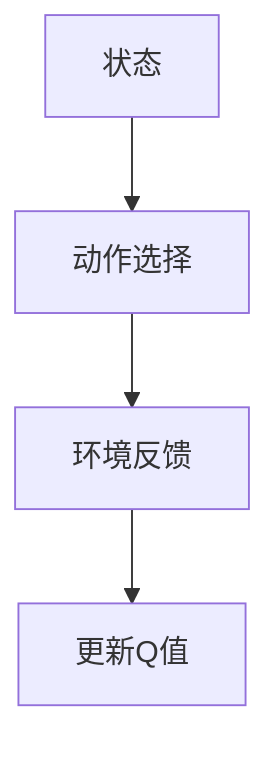
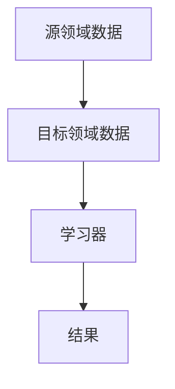
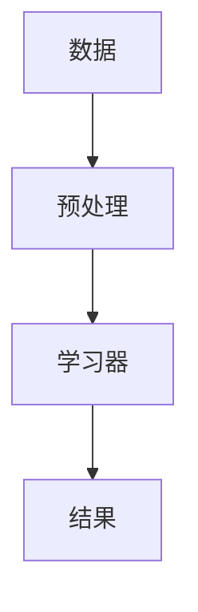
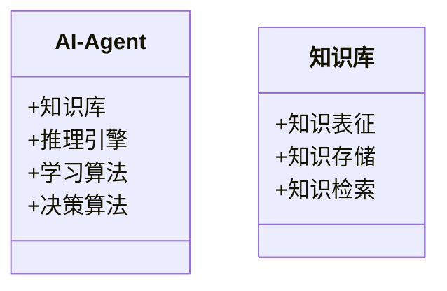
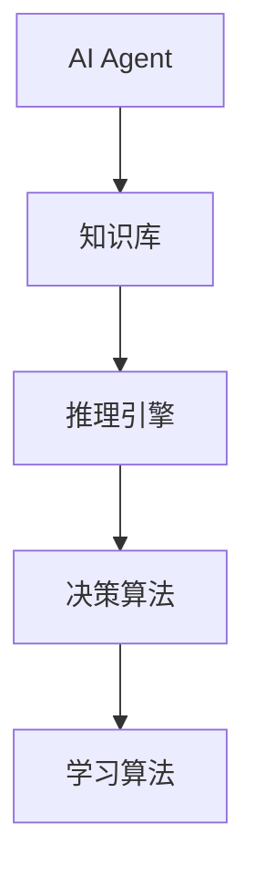
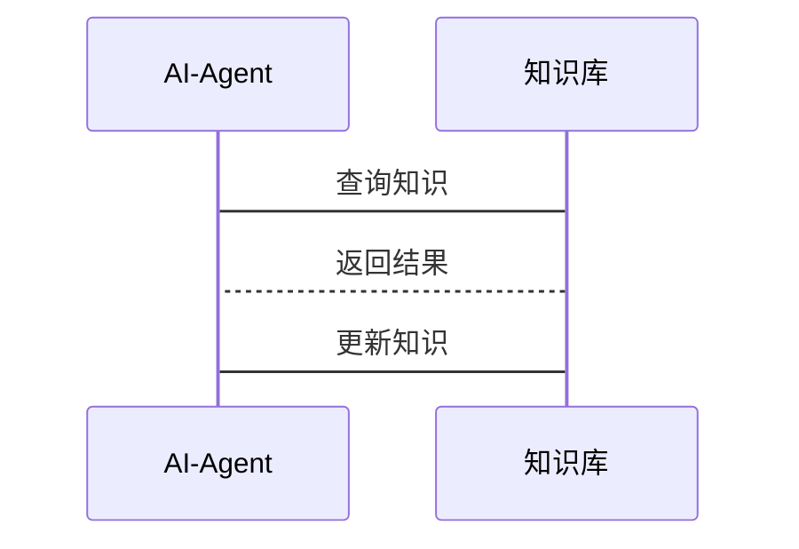

                 


# AI Agent的终身学习：持续更新和扩展知识库

> 关键词：AI Agent, 终身学习, 知识库, 动态更新, 自适应学习, 持续学习  
> 摘要：本文探讨AI Agent的终身学习机制，重点分析知识库的动态更新与扩展，涵盖核心概念、算法原理、系统设计、项目实战等，结合实际案例和代码实现，深入剖析终身学习的关键技术与实现方案。

---

## # 第1章: 背景介绍

### ## 1.1 问题背景

#### ### 1.1.1 AI Agent的定义与特点
AI Agent（人工智能代理）是能够感知环境、自主决策并执行任务的智能实体。其特点包括：
- **自主性**：无需外部干预，自主完成任务。
- **反应性**：能够实时感知环境变化并做出反应。
- **目标导向**：基于目标驱动行为。
- **知识驱动**：依赖知识库进行推理和决策。

#### ### 1.1.2 终身学习的必要性
AI Agent在动态环境中面临复杂问题，需要持续学习和更新知识库：
- **环境动态性**：环境不断变化，知识库需要实时更新。
- **任务多样性**：AI Agent需处理多种任务，知识库需覆盖多领域。
- **数据稀疏性**：某些领域数据不足，需通过学习扩展知识库。

#### ### 1.1.3 知识库的动态更新与扩展
知识库是AI Agent的核心，动态更新与扩展是终身学习的关键：
- **知识表示**：采用符号逻辑与深度学习结合，提升知识表达能力。
- **知识推理**：通过推理引擎实现从已知到未知的推理。
- **知识融合**：将新知识与现有知识融合，避免知识冲突。

### ## 1.2 问题描述

#### ### 1.2.1 AI Agent在动态环境中的挑战
- **动态环境适应**：环境变化快，需快速更新知识库。
- **知识过时风险**：知识库可能迅速过时，影响决策准确性。
- **学习效率**：大规模数据学习需高效算法支持。

#### ### 1.2.2 知识库更新的痛点与难点
- **数据质量**：数据噪声和错误影响知识准确性。
- **知识关联性**：知识间的关联复杂，需高效管理。
- **更新频率**：高频率更新需平衡资源消耗与效率。

#### ### 1.2.3 终身学习的核心问题
- **持续学习机制**：如何在不遗忘旧知识的前提下学习新知识。
- **知识表达与推理**：如何高效表示和推理动态知识。
- **自适应决策**：如何根据最新知识动态调整决策策略。

### ## 1.3 问题解决

#### ### 1.3.1 终身学习的实现方法
- **在线学习**：实时更新知识库，适应动态环境。
- **迁移学习**：利用已有知识快速学习新任务。
- **自监督学习**：通过自动生成数据标签提升学习效率。

#### ### 1.3.2 知识库动态更新策略
- **增量学习**：仅更新变化部分，减少计算开销。
- **模型蒸馏**：通过教师模型指导学生模型学习，减少资源消耗。
- **多任务学习**：同时处理多个任务，提升知识复用性。

#### ### 1.3.3 AI Agent自适应能力提升
- **动态规划**：通过规划算法优化决策路径。
- **强化学习**：通过奖励机制提升决策策略。
- **反馈机制**：根据环境反馈调整知识库更新策略。

### ## 1.4 边界与外延

#### ### 1.4.1 终身学习的边界条件
- **学习能力**：AI Agent的学习能力受限于计算资源和算法能力。
- **知识范围**：知识库的更新范围受到领域和任务的限制。
- **环境约束**：环境的复杂性影响知识库更新的速度和效率。

#### ### 1.4.2 知识库扩展的范围与限制
- **知识深度**：知识库的深度受限于数据质量和学习算法。
- **知识广度**：知识库的广度受限于学习时间和资源。
- **知识准确性**：知识库的准确性依赖于数据来源和学习算法。

#### ### 1.4.3 AI Agent能力的扩展性与局限性
- **能力扩展性**：AI Agent的能力可以通过知识库扩展和算法优化不断提升。
- **能力局限性**：AI Agent的能力受限于硬件性能和算法复杂度。

### ## 1.5 概念结构与核心要素

#### ### 1.5.1 终身学习的系统架构
- **感知层**：通过传感器或接口感知环境变化。
- **学习层**：通过学习算法更新知识库。
- **决策层**：基于最新知识库进行决策和行动。

#### ### 1.5.2 知识库的组织与管理
- **知识表示**：采用符号逻辑与深度学习结合。
- **知识存储**：采用分布式存储和索引技术。
- **知识检索**：通过高效的检索算法快速获取所需知识。

#### ### 1.5.3 AI Agent与环境的交互机制
- **输入输出接口**：定义AI Agent与环境交互的接口。
- **反馈机制**：通过反馈优化决策和学习策略。
- **自适应机制**：通过自适应算法动态调整交互策略。

---

## # 第2章: 核心概念与联系

### ## 2.1 核心概念原理

#### ### 2.1.1 知识表征与表示学习
知识表征是AI Agent理解世界的基础：
- **符号逻辑**：通过符号表示知识，如“如果下雨，那么带伞”。
- **向量表示**：通过向量表示知识，如词嵌入（Word Embedding）。
- **图结构表示**：通过图结构表示知识，如知识图谱。

#### ### 2.1.2 终身学习的驱动机制
终身学习的核心驱动力：
- **好奇心驱动**：AI Agent主动探索未知领域。
- **任务驱动**：为完成特定任务而学习新知识。
- **反馈驱动**：根据环境反馈调整学习策略。

#### ### 2.1.3 AI Agent的自适应推理
自适应推理是AI Agent的核心能力：
- **归纳推理**：从具体案例中归纳一般规律。
- **演绎推理**：从一般规律推出具体结论。
- ** abduction推理**：通过推理得出最可能的解释。

### ## 2.2 概念属性特征对比

| 概念      | 特征                     |
|-----------|--------------------------|
| 终身学习   | 持续性、自适应性、动态性   |
| 知识库     | 结构化、动态更新、可扩展性 |

### ## 2.3 ER实体关系图



---

## # 第3章: 算法原理讲解

### ## 3.1 强化学习算法

#### ### 3.1.1 Q-learning算法



数学公式：
$$ Q(s,a) = Q(s,a) + \alpha (r + \max Q(s',a') - Q(s,a)) $$

### ## 3.2 迁移学习算法

#### ### 3.2.1 迁移学习流程



### ## 3.3 自监督学习算法

#### ### 3.3.1 自监督学习流程



---

## # 第4章: 系统分析与架构设计

### ## 4.1 项目介绍

#### ### 4.1.1 项目介绍
本项目实现一个简单的AI Agent，具备终身学习能力，能够动态更新知识库。

### ## 4.2 系统功能设计

#### ### 4.2.1 领域模型



### ## 4.3 系统架构设计



### ## 4.4 系统接口设计

#### ### 4.4.1 接口设计
- `update_knowledge_base()`: 更新知识库
- `make_decision()`: 做出决策

### ## 4.5 系统交互设计



---

## # 第5章: 项目实战

### ## 5.1 环境安装

```bash
pip install numpy
pip install matplotlib
```

### ## 5.2 核心代码实现

```python
import numpy as np

class AI-Agent:
    def __init__(self):
        self.knowledge_base = {}
    
    def update_knowledge_base(self, data):
        # 更新知识库逻辑
        pass
    
    def make_decision(self, input):
        # 决策逻辑
        pass
```

### ## 5.3 案例分析与解读

#### ### 5.3.1 案例分析
假设AI Agent需要学习新的任务，更新知识库并做出决策。

### ## 5.4 项目小结

---

## # 第6章: 高级主题

### ## 6.1 在线学习与边缘计算

#### ### 6.1.1 在线学习
实时更新知识库，适应动态环境。

#### ### 6.1.2 边缘计算
在边缘设备上进行学习，减少数据传输成本。

### ## 6.2 未来发展趋势

#### ### 6.2.1 更高效的学习算法
开发更高效的学习算法，提升学习速度和准确性。

#### ### 6.2.2 更智能的知识表示
研究更智能的知识表示方法，提升知识复用性。

---

## # 第7章: 总结与展望

### ## 7.1 总结

### ## 7.2 展望

---

## # 第8章: 最佳实践 tips

### ## 8.1 tips
- 定期更新知识库，保持知识的准确性。
- 使用高效的算法，提升学习效率。
- 注重知识的组织与管理，确保知识的可扩展性。

### ## 8.2 小结
AI Agent的终身学习是一个复杂而重要的课题，需要持续研究和实践。

### ## 8.3 注意事项
- 注意数据的质量和来源，避免引入错误知识。
- 定期评估学习效果，及时调整学习策略。

### ## 8.4 拓展阅读
推荐阅读相关领域的最新论文和书籍，保持技术前沿性。

---

## 作者：AI天才研究院/AI Genius Institute & 禅与计算机程序设计艺术 /Zen And The Art of Computer Programming

