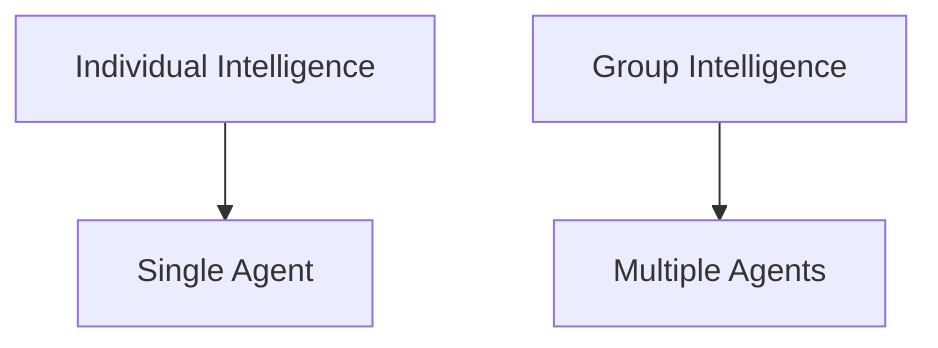
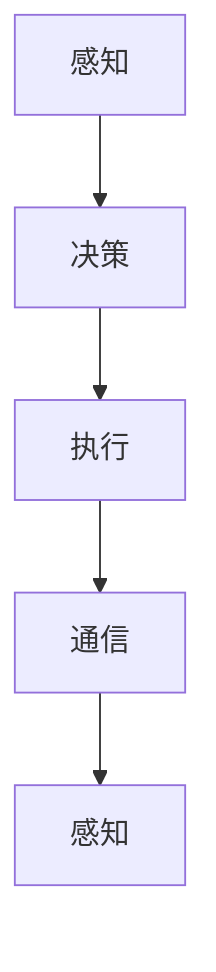
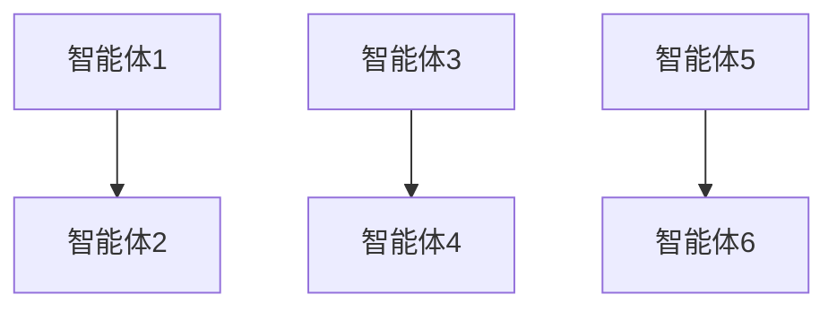

                 


# AI Agent的群体智能与集体决策机制

## 关键词
AI Agent, 群体智能, 集体决策, 多智能体系统, 群智算法, 一致性算法

## 摘要
本文深入探讨了AI Agent的群体智能与集体决策机制，从基本概念到核心算法，从系统设计到项目实战，全面分析了群体智能的实现原理与应用场景。通过详细的算法解析和系统设计，结合实际案例，为读者呈现了一个全面的群体智能与集体决策的知识体系。

---

# 第一部分: AI Agent与群体智能概述

## 第1章: AI Agent与群体智能概述

### 1.1 AI Agent的基本概念

#### 1.1.1 AI Agent的定义与分类
AI Agent（智能体）是指能够感知环境并采取行动以实现目标的实体。它可以分为简单反射型、基于模型的反射型、目标驱动型和效用驱动型四种类型。

#### 1.1.2 群体智能的定义与特点
群体智能是指多个智能体通过协作和竞争，共同实现比个体更复杂目标的智能形式。其特点包括分布式、自组织、涌现性和鲁棒性。

#### 1.1.3 AI Agent与群体智能的关系
AI Agent是群体智能的基本单元，而群体智能则通过多个AI Agent的协作，实现更高层次的智能行为。

### 1.2 群体智能的核心概念

#### 1.2.1 群体智能的特征分析
群体智能具有分布式、自适应、协作性和涌现性等特点。

#### 1.2.2 群体智能与个体智能的对比
通过对比表格展示个体智能与群体智能的差异：

| 特征       | 个体智能             | 群体智能             |
|------------|----------------------|----------------------|
| 结构       | 单一实体             | 多个实体协作         |
| 智能来源   | 个体决策             | 集体决策             |
| 行为方式   | 独立行动             | 协作与竞争          |
| 智能水平   | 有限                 | 更高                 |

#### 1.2.3 群体智能的实现机制
群体智能的实现机制包括通信、协调、协作和学习。

### 1.3 集体决策机制的背景与意义

#### 1.3.1 集体决策的定义
集体决策是指多个个体共同参与，通过协商、投票等方式，达成一致决策的过程。

#### 1.3.2 集体决策在群体智能中的作用
集体决策是群体智能的核心，能够提高系统的可靠性和适应性。

#### 1.3.3 集体决策的挑战与研究方向
集体决策的挑战包括信息不完全、计算复杂性和一致性问题。研究方向包括一致性算法、共识算法和分布式决策。

### 1.4 本章小结
本章介绍了AI Agent的基本概念，分析了群体智能的特点与实现机制，并探讨了集体决策在群体智能中的重要性。

---

# 第二部分: 群体智能的核心概念与数学模型

## 第2章: 群体智能的核心概念与联系

### 2.1 群体智能的核心概念

#### 2.1.1 多智能体系统（MAS）的定义
多智能体系统是指由多个智能体组成的协作系统，每个智能体都有自己的目标和行为。

#### 2.1.2 群体智能的层次结构
群体智能的层次结构包括个体层、群体层和系统层。

#### 2.1.3 群体智能的关键属性
关键属性包括分布式性、自组织性和涌现性。

### 2.2 群体智能与个体智能的对比

#### 2.2.1 个体智能与群体智能的特征对比
通过对比图展示个体智能与群体智能的差异：



#### 2.2.2 群体智能的协同机制
协同机制包括通信、协商和协作。

#### 2.2.3 群体智能的涌现性
涌现性是指群体智能通过个体协作产生的整体智能。

### 2.3 群体智能的ER实体关系图

```mermaid
er
actor: Agent
actor: Environment
actor: Decision-Making Process
actor: Communication Channel
```

### 2.4 本章小结
本章分析了群体智能的核心概念，探讨了多智能体系统的特点，并通过对比图和ER图展示了群体智能的结构。

---

# 第三部分: 群体智能的算法原理与数学模型

## 第3章: 群体智能的典型算法

### 3.1 基于规则的群体智能算法

#### 3.1.1 基于规则的算法原理
基于规则的算法通过预定义规则实现智能体的协作。

#### 3.1.2 基于规则的算法实现
通过Python代码实现基于规则的算法：

```python
class Agent:
    def __init__(self, id):
        self.id = id
        self.state = 'idle'
    
    def act(self, environment):
        if environment == 'obstacle':
            self.state = 'avoid'
        else:
            self.state = 'move'
```

#### 3.1.3 基于规则的算法优缺点
优点是简单易实现，缺点是缺乏灵活性。

### 3.2 基于模型的群体智能算法

#### 3.2.1 基于模型的算法原理
基于模型的算法通过建模环境实现智能体的协作。

#### 3.2.2 基于模型的算法实现
通过Python代码实现基于模型的算法：

```python
class ModelBasedAgent(Agent):
    def __init__(self, id, model):
        super().__init__(id)
        self.model = model
    
    def update_model(self, data):
        self.model.update(data)
```

#### 3.2.3 基于模型的算法优缺点
优点是精确性高，缺点是计算复杂。

### 3.3 基于学习的群体智能算法

#### 3.3.1 基于学习的算法原理
基于学习的算法通过机器学习实现智能体的协作。

#### 3.3.2 基于学习的算法实现
通过Python代码实现基于学习的算法：

```python
class LearningAgent(Agent):
    def __init__(self, id, model):
        super().__init__(id)
        self.model = model
    
    def learn(self, reward):
        self.model.train(reward)
```

#### 3.3.3 基于学习的算法优缺点
优点是适应性强，缺点是需要大量数据。

### 3.4 本章小结
本章介绍了群体智能的典型算法，包括基于规则、基于模型和基于学习的算法，并分析了它们的优缺点。

---

# 第四部分: 群体智能的系统分析与架构设计

## 第4章: 群体智能系统的分析与设计

### 4.1 群体智能系统的应用场景

#### 4.1.1 智能交通系统
智能交通系统通过多智能体协作实现交通优化。

#### 4.1.2 分布式计算系统
分布式计算系统通过多智能体协作实现任务分配。

#### 4.1.3 多智能体协作任务
多智能体协作任务包括机器人协作和无人机编队。

### 4.2 群体智能系统的功能设计

#### 4.2.1 系统功能模块划分
功能模块包括感知、决策、执行和通信。

#### 4.2.2 系统功能流程图



#### 4.2.3 系统功能的实现方式
通过模块化设计实现系统功能。

### 4.3 群体智能系统的架构设计

#### 4.3.1 系统架构图



#### 4.3.2 系统架构的设计原则
设计原则包括模块化、可扩展性和可维护性。

### 4.4 本章小结
本章分析了群体智能系统的应用场景，设计了系统的功能模块和架构，并展示了系统架构图。

---

# 第五部分: 群体智能的项目实战

## 第5章: 群体智能项目的实战分析

### 5.1 项目背景与目标

#### 5.1.1 项目背景
本项目旨在实现一个多智能体协作系统。

#### 5.1.2 项目目标
通过Python实现一个多智能体协作任务。

### 5.2 系统核心实现源代码

#### 5.2.1 环境配置
需要安装Python和相关库。

#### 5.2.2 核心代码实现

```python
class MultiAgentSystem:
    def __init__(self, num_agents):
        self.agents = [Agent(i) for i in range(num_agents)]
    
    def run(self):
        while True:
            for agent in self.agents:
                agent.act(environment)
```

#### 5.2.3 代码应用解读与分析
通过代码实现多智能体协作，分析系统的运行机制。

### 5.3 实际案例分析与详细讲解

#### 5.3.1 案例分析
分析一个多智能体协作任务的实现过程。

#### 5.3.2 详细讲解
通过案例分析展示系统设计和实现过程。

### 5.4 项目小结
本项目通过实际案例展示了群体智能的实现过程，验证了系统的可行性和有效性。

---

# 第六部分: 总结与展望

## 第6章: 总结与展望

### 6.1 本章总结
本文系统地介绍了AI Agent的群体智能与集体决策机制，分析了其核心概念、算法原理和系统设计，并通过实际案例展示了其应用。

### 6.2 群体智能的优势与挑战

#### 6.2.1 群体智能的优势
包括分布式、自组织和涌现性。

#### 6.2.2 群体智能的挑战
包括一致性问题和计算复杂性。

### 6.3 未来研究方向

#### 6.3.1 研究方向
包括一致性算法、自适应算法和分布式学习。

#### 6.3.2 展望
群体智能将在更多领域得到应用，推动人工智能的发展。

### 6.4 本章小结
本章总结了全文内容，分析了群体智能的优势与挑战，并展望了未来的研究方向。

---

# 作者：AI天才研究院/AI Genius Institute & 禅与计算机程序设计艺术 /Zen And The Art of Computer Programming

