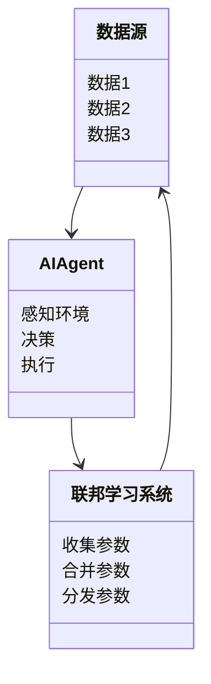
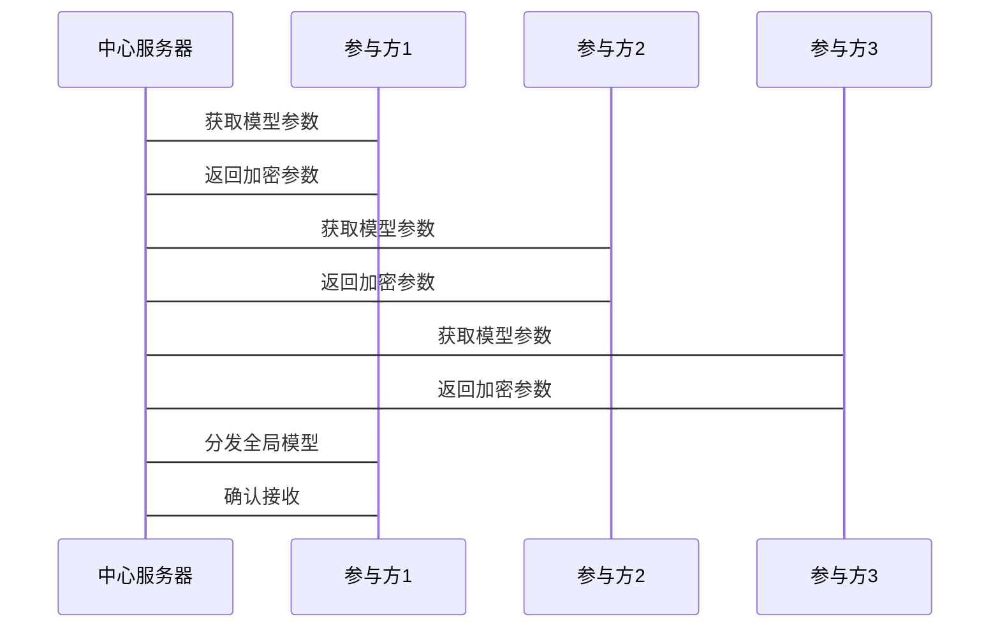

                 


# AI Agent的联邦学习：保护隐私的分布式LLM训练

> 关键词：AI Agent，联邦学习，分布式LLM，隐私保护，多代理系统，协同学习

> 摘要：本文探讨了在保护隐私的前提下，如何利用联邦学习技术进行分布式大语言模型（LLM）训练，并分析了AI Agent在其中的角色与应用。通过详细讲解联邦学习的基本原理、AI Agent的核心要素，以及它们在分布式LLM训练中的协同机制，本文旨在提供一个全面的技术视角，帮助读者理解如何在保护数据隐私的同时，实现高效的大规模模型训练。

---

# 第一部分: 背景介绍

# 第1章: AI Agent的联邦学习背景

## 1.1 问题背景与挑战

### 1.1.1 当前AI Agent的发展现状

AI Agent（智能体）是人工智能领域的重要组成部分，它能够根据环境信息自主决策并执行任务。随着技术的进步，AI Agent的应用场景不断扩大，例如智能助手、推荐系统、自动驾驶等。然而，随着AI Agent的普及，数据隐私和安全性问题日益突出。特别是在分布式系统中，数据往往分布在不同的设备或服务器上，如何在不泄露原始数据的情况下进行模型训练成为一大挑战。

### 1.1.2 分布式LLM训练的必要性

大语言模型（Large Language Model, LLM）的训练需要海量的数据，而数据通常分布在不同的机构或用户手中。传统的集中式训练方式不仅面临数据隐私泄露的风险，还可能因为数据过于集中而引发垄断问题。因此，分布式LLM训练成为一种趋势，它能够在保护数据隐私的前提下，利用分散的数据源进行模型训练。

### 1.1.3 隐私保护的重要性

数据是人工智能的核心资源，但数据的隐私性和敏感性使得直接共享数据变得困难。例如，医疗数据包含患者的个人健康信息，金融数据涉及用户的财务信息，这些数据的泄露可能导致严重的后果。因此，如何在不共享原始数据的情况下进行模型训练，成为了亟待解决的问题。

## 1.2 问题描述与目标

### 1.2.1 分布式LLM训练的核心问题

分布式LLM训练的核心问题在于如何在不共享原始数据的情况下，协同多个数据源进行模型训练。这需要设计一种机制，使得各个数据源能够在本地更新模型参数，而不必共享数据本身。

### 1.2.2 隐私保护的具体要求

隐私保护的具体要求包括：
1. 数据不被未经授权的第三方访问。
2. 模型更新过程中不泄露数据的细节。
3. 通过加密或其他技术手段确保通信过程的安全性。

### 1.2.3 联邦学习的目标与边界

联邦学习（Federated Learning）的目标是通过分布式计算技术，在保护数据隐私的前提下，实现模型的联合训练。其边界包括：
1. 数据所有权不发生转移。
2. 模型更新仅在参数层面进行，不涉及原始数据。
3. 适用于异构分布式环境。

## 1.3 核心概念与边界

### 1.3.1 联邦学习的定义与特点

联邦学习是一种分布式机器学习技术，允许多个参与方在不共享数据的情况下，共同训练一个全局模型。其特点包括：
- 数据局部性：数据保持在原始位置，不进行集中。
- 模型全局性：通过分布式计算，生成一个全局模型。
- 隐私保护：通过加密和差分隐私等技术，保护数据隐私。

### 1.3.2 AI Agent的核心要素

AI Agent的核心要素包括：
1. **感知能力**：能够感知环境并获取相关信息。
2. **决策能力**：基于感知信息做出决策。
3. **执行能力**：根据决策执行具体操作。
4. **学习能力**：能够通过经验改进自身的性能。

### 1.3.3 分布式LLM训练的边界与外延

分布式LLM训练的边界包括：
1. 数据不集中：所有数据保持在原始位置。
2. 模型参数同步：通过联邦学习技术，同步模型参数。
3. 仅共享参数：模型参数在参与方之间共享，但不共享原始数据。

其外延包括：
1. 多模态数据：支持文本、图像等多种数据类型。
2. 多任务学习：能够处理多种任务的联合训练。
3. 持续学习：模型能够持续更新，适应新数据。

---

# 第二部分: 核心概念与联系

# 第2章: 联邦学习与AI Agent的核心原理

## 2.1 联邦学习的基本原理

### 2.1.1 联邦学习的三要素

联邦学习的三要素包括：
1. **参与方**：参与联邦学习的各个数据持有方。
2. **模型**：需要在参与方之间协同训练的模型。
3. **通信机制**：参与方之间交换模型参数的方式。

### 2.1.2 联邦学习的通信机制

通信机制是联邦学习的核心，主要包括：
1. **参数同步**：参与方定期将本地模型参数上传到中心服务器，或者直接在参与方之间进行参数交换。
2. **参数聚合**：通过某种算法（如FedAvg）将各个参与方的模型参数聚合，生成全局模型。
3. **参数分发**：将聚合后的全局模型参数分发给参与方，供其本地模型更新。

### 2.1.3 联邦学习的同步策略

同步策略决定了模型参数的更新频率和方式，常见的策略包括：
1. **周期性同步**：每隔一定的时间或一定数量的样本后进行同步。
2. **事件驱动同步**：在特定事件发生时进行同步，例如检测到模型性能下降。

## 2.2 AI Agent的定义与属性

### 2.2.1 AI Agent的定义

AI Agent是一个能够感知环境、自主决策并执行任务的智能实体。它可以在分布式环境中与其他Agent或服务进行交互，完成复杂的任务。

### 2.2.2 AI Agent的核心属性

AI Agent的核心属性包括：
1. **自主性**：能够在没有外部干预的情况下自主决策。
2. **反应性**：能够根据环境变化做出实时反应。
3. **社交能力**：能够与其他Agent或服务进行有效通信和协作。
4. **学习能力**：能够通过经验改进自身的性能。

### 2.2.3 AI Agent的交互方式

AI Agent的交互方式包括：
1. **直接通信**：通过点对点的方式与其他Agent进行通信。
2. **通过中间件**：通过中间服务器或消息队列进行通信。
3. **基于API**：通过API接口进行数据交换和功能调用。

## 2.3 联邦学习与AI Agent的关系

### 2.3.1 联邦学习如何赋能AI Agent

联邦学习为AI Agent提供了以下能力：
1. **分布式计算能力**：支持AI Agent在分布式环境中进行协同计算。
2. **隐私保护能力**：确保AI Agent在交互过程中不泄露敏感数据。
3. **多模态数据处理能力**：支持多种数据类型，提升AI Agent的感知能力。

### 2.3.2 AI Agent在联邦学习中的角色

AI Agent在联邦学习中可以扮演以下角色：
1. **数据提供者**：提供本地数据用于模型训练。
2. **模型更新者**：负责本地模型的更新和优化。
3. **任务执行者**：根据全局模型执行具体任务。

### 2.3.3 联邦学习与AI Agent的协同机制

协同机制包括：
1. **任务分配**：中心服务器将任务分配给不同的AI Agent。
2. **模型同步**：AI Agent定期同步全局模型参数。
3. **反馈机制**：AI Agent将本地模型更新结果反馈给中心服务器。

## 2.4 核心概念对比表

| 概念       | 定义                                                                 | 特性                               | 区别                                   |
|------------|----------------------------------------------------------------------|------------------------------------|---------------------------------------|
| 联邦学习     | 分布式模型训练技术，允许多个参与方在不共享数据的情况下协同训练模型。 | 数据不集中，模型参数同步，隐私保护 | 数据隐私保护，模型全局性             |
| AI Agent    | 具有自主决策能力的智能体，能够在分布式环境中与其他实体交互。       | 自主性，反应性，社交能力，学习能力 | 交互方式多样化，任务多样性             |
| 分布式LLM   | 在分布式环境中训练的大语言模型，利用联邦学习技术保护数据隐私。     | 分布式训练，隐私保护，多模态支持   | 数据分散，模型全局性，隐私优先         |

## 2.5 ER实体关系图

```mermaid
erDiagram
    actor 联邦学习系统{}{
        联邦学习系统 -->+ 通过API与AI Agent交互
        联邦学习系统 -->+ 管理全局模型参数
        联邦学习系统 --> 确保数据隐私和通信安全
    }
    actor AI Agent{}{
        AI Agent --> 在本地进行模型训练
        AI Agent --> 接收全局模型参数
        AI Agent --> 反馈本地模型更新结果
    }
    actor 数据源{}{
        数据源 --> 提供本地数据用于模型训练
        数据源 --> 通过联邦学习系统进行模型同步
    }
    联邦学习系统 <---> 数据源
    联邦学习系统 <---> AI Agent
```

---

# 第三部分: 算法原理讲解

# 第3章: 联邦学习算法的核心原理

## 3.1 联邦平均算法（FedAvg）

### 3.1.1 算法流程

```mermaid
graph TD
    S[中心服务器] --> P1[参与方1]
    S --> P2[参与方2]
    S --> P3[参与方3]
    P1 --> (本地数据训练)
    P2 --> (本地数据训练)
    P3 --> (本地数据训练)
    P1 --> S[发送更新参数]
    P2 --> S[发送更新参数]
    P3 --> S[发送更新参数]
    S --> 合并参数
    S --> 分发全局模型
```

### 3.1.2 算法实现

以下是FedAvg算法的Python实现示例：

```python
import numpy as np

class FederatedAveraging:
    def __init__(self, num_parties):
        self.num_parties = num_parties
        self.global_params = None

    def aggregate(self, parties_params):
        # 将所有参与方的参数平均
        averaged_params = {}
        for key in parties_params[0].keys():
            averaged_params[key] = np.mean([party[key] for party in parties_params])
        return averaged_params

    def synchronize(self, party_id):
        # 将全局参数分发给指定的参与方
        return self.global_params

# 示例用法
fed_avg = FederatedAveraging(3)
participant_params = [
    {'weight': 0.1, 'bias': 0.2},
    {'weight': 0.2, 'bias': 0.1},
    {'weight': 0.15, 'bias': 0.15}
]
global_params = fed_avg.aggregate(participant_params)
```

### 3.1.3 算法的数学模型

FedAvg算法的核心是将各个参与方的模型参数进行平均，其数学模型如下：

$$
\theta_{global} = \frac{1}{N} \sum_{i=1}^{N} \theta_{i}
$$

其中，$\theta_{global}$ 是全局模型参数，$N$ 是参与方的数量，$\theta_{i}$ 是第 $i$ 个参与方的模型参数。

## 3.2 安全聚合算法（SecureAggregation）

### 3.2.1 算法流程

```mermaid
graph TD
    S[中心服务器] --> P1[参与方1]
    S --> P2[参与方2]
    S --> P3[参与方3]
    P1 --> (本地数据训练)
    P2 --> (本地数据训练)
    P3 --> (本地数据训练)
    P1 --> S[加密发送更新参数]
    P2 --> S[加密发送更新参数]
    P3 --> S[加密发送更新参数]
    S --> 解密参数
    S --> 合并参数
    S --> 分发全局模型
```

### 3.2.2 算法实现

以下是基于加密的参数聚合实现示例：

```python
import cryptography
from cryptography.fernet import Fernet

class SecureAggregation:
    def __init__(self, key):
        self.key = key
        self.cipher = Fernet(self.key)

    def encrypt(self, value):
        # 对数值进行加密
        return self.cipher.encrypt(str(value).encode())

    def decrypt(self, ciphertext):
        # 对密文进行解密
        return int(self.cipher.decrypt(ciphertext).decode())

    def aggregate(self, ciphertexts):
        # 解密并求平均
        decrypted = [self.decrypt(ct) for ct in ciphertexts]
        return np.mean(decrypted)

# 示例用法
key = Fernet.generate_key()
secure_agg = SecureAggregation(key)
ciphertexts = [b'encrypted_value_1', b'encrypted_value_2', b'encrypted_value_3']
global_param = secure_agg.aggregate(ciphertexts)
```

### 3.2.3 算法的数学模型

SecureAggregation算法的核心是通过加密的方式对模型参数进行聚合，其数学模型与FedAvg类似，但增加了加密和解密的步骤：

$$
\theta_{global} = \frac{1}{N} \sum_{i=1}^{N} \text{Decrypt}(E(\theta_{i}))
$$

其中，$E$ 表示加密操作，$\text{Decrypt}$ 表示解密操作。

---

# 第四部分: 系统分析与架构设计

# 第4章: 分布式LLM训练系统架构

## 4.1 问题场景介绍

分布式LLM训练系统需要满足以下需求：
1. 支持大规模数据集的分布式训练。
2. 保护数据隐私，防止数据泄露。
3. 支持多模态数据的处理。
4. 提供高效的模型更新机制。

## 4.2 系统功能设计

### 4.2.1 领域模型图



### 4.2.2 系统架构图


### 4.2.3 接口与交互流程图



---

# 第五部分: 项目实战

# 第5章: 分布式LLM训练的实现

## 5.1 环境安装与配置

以下是安装依赖的Python代码示例：

```python
import sys
import os
import requests
from cryptography.fernet import Fernet

# 安装必要的库
!pip install cryptography requests
```

## 5.2 核心功能实现

### 5.2.1 模型训练实现

```python
class DistributedLLM:
    def __init__(self, key):
        self.key = key
        self.cipher = Fernet(self.key)
        self.parties = []

    def add_party(self, party):
        self.parties.append(party)

    def train(self, epochs):
        for epoch in range(epochs):
            for party in self.parties:
                party.train_locally()
            global_params = self.aggregate()
            for party in self.parties:
                party.update_global(global_params)

    def aggregate(self):
        # 获取所有参与方的加密参数
        ciphertexts = [party.get_encrypted_params() for party in self.parties]
        # 解密并求平均
        decrypted = [self.decrypt(ct) for ct in ciphertexts]
        return np.mean(decrypted)

    def decrypt(self, ciphertext):
        return int(self.cipher.decrypt(ciphertext).decode())
```

### 5.2.2 本地训练实现

```python
class Participant:
    def __init__(self, model, data):
        self.model = model
        self.data = data
        self.key = key
        self.cipher = Fernet(self.key)

    def train_locally(self):
        # 在本地数据上训练模型
        for x, y in self.data:
            self.model.fit(x, y)

    def get_encrypted_params(self):
        # 加密模型参数
        params = self.model.get_weights()
        encrypted = {}
        for key, value in params.items():
            encrypted[key] = self.cipher.encrypt(str(value).encode())
        return encrypted

    def update_global(self, global_params):
        # 更新本地模型参数
        self.model.set_weights(global_params)
```

## 5.3 案例分析与实现

### 5.3.1 数据准备

```python
# 示例数据
data = {
    'participant_1': {'text': ['hello', 'world'], 'label': [0, 1]},
    'participant_2': {'text': ['apple', 'banana'], 'label': [1, 0]},
    'participant_3': {'text': ['cat', 'dog'], 'label': [0, 1]}
}
```

### 5.3.2 模型训练与评估

```python
# 初始化联邦学习系统
key = Fernet.generate_key()
fed_system = DistributedLLM(key)

# 添加参与方
participants = []
for participant_id, data in data.items():
    model = create_model()  # 初始化模型
    participants.append(Participant(model, data))

# 将参与方添加到联邦学习系统
for p in participants:
    fed_system.add_party(p)

# 开始训练
fed_system.train(epochs=5)

# 评估模型性能
accuracy = fed_system.model.evaluate(participants[0].data)
print(f"模型准确率：{accuracy}")
```

---

# 第六部分: 总结与展望

# 第6章: 总结与展望

## 6.1 本章总结

本文详细探讨了AI Agent在联邦学习中的应用，重点分析了分布式LLM训练的隐私保护机制。通过介绍联邦学习的基本原理、AI Agent的核心要素，以及它们在分布式训练中的协同机制，本文为实现隐私保护的分布式LLM训练提供了一种可行的技术方案。

## 6.2 后续工作与展望

未来的工作方向包括：
1. **优化联邦学习算法**：探索更高效的参数聚合方法，提升模型训练效率。
2. **增强隐私保护**：研究更先进的加密技术，确保数据的绝对隐私。
3. **扩展应用场景**：将联邦学习技术应用于更多领域，如医疗、金融等。

---

# 作者

作者：AI天才研究院/AI Genius Institute & 禅与计算机程序设计艺术 /Zen And The Art of Computer Programming

