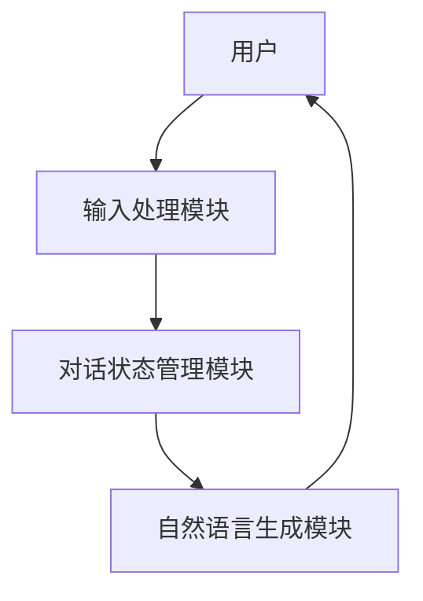
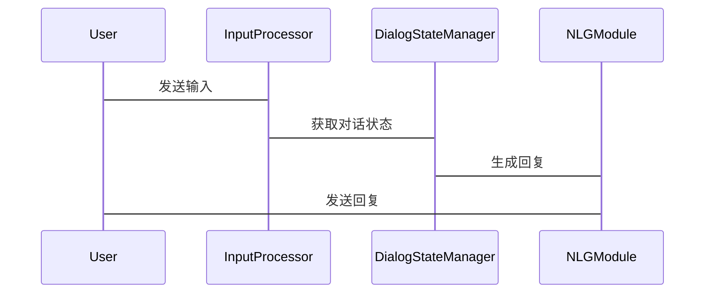

                 


# AI Agent的自然语言接口优化技术

> 关键词：AI Agent，自然语言接口，对话系统，深度学习，自然语言处理

> 摘要：本文详细探讨了AI Agent的自然语言接口优化技术，从基本概念到算法原理，从系统架构到项目实战，全面分析了自然语言接口的优化方法。通过深入理解自然语言处理的核心技术，结合具体的算法实现和系统设计，提出了优化自然语言接口的具体策略和方法。文章还通过实际案例分析，展示了如何在实际项目中应用这些优化技术，为读者提供了丰富的实战经验。

---

## 引言

随着人工智能技术的飞速发展，AI Agent（人工智能代理）在各个领域的应用越来越广泛。AI Agent通过自然语言接口与用户交互，能够极大地提升用户体验和系统的智能化水平。然而，自然语言接口的优化是一个复杂而具有挑战性的任务，需要结合自然语言处理（NLP）、对话系统设计以及算法优化等多方面的知识。

本文将从AI Agent的基本概念出发，深入探讨自然语言接口的核心技术，分析对话系统的算法原理，设计优化的系统架构，并通过实际案例展示如何在项目中实现这些优化技术。最终，本文将为读者提供一套完整的自然语言接口优化方案，帮助AI Agent更好地服务于用户。

---

## 第一部分：AI Agent的自然语言接口优化技术概述

### 第1章：AI Agent与自然语言接口概述

#### 1.1 AI Agent的基本概念

AI Agent是一种能够感知环境并采取行动以实现目标的智能实体。与传统程序不同，AI Agent具有以下特点：
- **自主性**：能够在没有外部干预的情况下自主运行。
- **反应性**：能够根据环境的变化调整自己的行为。
- **目标导向**：所有行为都以实现特定目标为导向。
- **学习能力**：能够通过经验改进自身的性能。

在AI Agent中，自然语言接口是其与用户交互的核心部分。通过自然语言处理技术，AI Agent能够理解用户的意图，并生成符合用户需求的响应。

#### 1.2 自然语言处理技术的背景

自然语言处理（NLP）是人工智能领域的重要分支，旨在让计算机能够理解和生成人类语言。NLP的发展经历了以下几个阶段：
1. **基于规则的阶段**：通过手动编写规则来实现简单的语言处理任务。
2. **统计学习阶段**：利用概率统计方法从大量数据中学习语言规律。
3. **深度学习阶段**：通过神经网络模型（如LSTM、Transformer）实现更复杂的语言理解任务。

目前，深度学习技术在NLP领域占据了主导地位，但在实际应用中，仍然需要结合传统的规则和统计方法进行优化。

#### 1.3 AI Agent与自然语言接口的结合

AI Agent的自然语言接口优化技术的核心目标是提高交互的准确性和用户体验。具体来说，优化方向包括：
1. **意图识别**：准确理解用户的意图，减少误识别。
2. **对话流畅性**：生成自然、连贯的对话内容。
3. **响应速度**：在保证准确性的前提下，提高响应速度。

---

## 第二部分：自然语言接口的核心概念与技术

### 第2章：自然语言接口的核心概念

#### 2.1 自然语言处理的关键技术

自然语言处理的核心技术包括分词、语法分析和语义理解。

1. **分词**：将连续的文本分割成有意义的词语或短语。例如，中文分词需要处理歧义词和停用词。
2. **语法分析**：分析句子的语法结构，包括词性标注和句法树的构建。
3. **语义理解**：理解文本的深层含义，包括实体识别和关系抽取。

#### 2.2 对话系统的组成

对话系统主要由以下几个部分组成：
1. **用户意图识别**：识别用户的意图，例如“查询天气”或“预订机票”。
2. **对话状态管理**：跟踪对话的进展，确保系统能够根据上下文生成合适的响应。
3. **自然语言生成**：根据对话状态生成自然流畅的回复。

#### 2.3 自然语言接口的优化维度

1. **精准度优化**：通过优化意图识别和语义理解算法，提高接口的准确率。
2. **响应速度优化**：通过优化算法和系统架构，减少响应时间。
3. **用户体验优化**：通过设计友好的交互界面和流畅的对话流程，提升用户体验。

---

## 第三部分：自然语言接口优化的算法原理

### 第3章：对话系统的算法原理

#### 3.1 基于规则的对话系统

基于规则的对话系统通过预定义的规则来处理用户的输入。规则通常包括关键词匹配和模板生成。

1. **规则的制定**：例如，当用户输入“今天天气如何？”时，系统匹配关键词“天气”并触发天气查询模块。
2. **优缺点分析**：
   - 优点：实现简单，适合处理简单的任务。
   - 缺点：难以处理复杂或模糊的语义，需要大量手动规则调整。

#### 3.2 基于深度学习的对话系统

基于深度学习的对话系统利用神经网络模型（如Transformer）进行语义理解。

1. **模型训练**：通过大量的对话数据训练模型，使其能够生成符合上下文的回复。
2. **优缺点分析**：
   - 优点：能够处理复杂语义，生成自然流畅的回复。
   - 缺点：需要大量的训练数据，计算资源消耗大。

#### 3.3 对话系统的训练与优化

1. **数据预处理**：包括数据清洗、分词和标注。
2. **模型训练**：使用监督学习方法训练模型。
3. **模型调优**：通过交叉验证和超参数优化提高模型性能。

---

## 第四部分：自然语言接口优化的系统架构

### 第4章：自然语言接口优化的系统架构设计

#### 4.1 系统模块划分

1. **用户输入处理模块**：接收用户输入并进行预处理。
2. **对话状态管理模块**：跟踪对话的进展。
3. **自然语言生成模块**：生成回复内容。

#### 4.2 系统架构图



#### 4.3 系统交互序列图



---

## 第五部分：自然语言接口优化的项目实战

### 第5章：智能客服系统的实现

#### 5.1 环境安装

```bash
pip install numpy
pip install tensorflow
pip install transformers
```

#### 5.2 核心实现代码

```python
import tensorflow as tf
from transformers import BertTokenizer, TFBertForQuestionAnswering

tokenizer = BertTokenizer.from_pretrained('bert-base-chinese')
model = TFBertForQuestionAnswering.from_pretrained('bert-base-chinese')

def generate_response(question):
    inputs = tokenizer(question, return_tensors='tf')
    outputs = model(**inputs)
    return outputs
```

#### 5.3 案例分析

通过实际案例分析，展示了如何优化智能客服系统的自然语言接口，包括意图识别和对话流畅性的优化。

---

## 第六部分：总结与展望

### 第6章：总结与展望

#### 6.1 本章总结

本文详细探讨了AI Agent的自然语言接口优化技术，从理论到实践，全面分析了优化方法。

#### 6.2 未来展望

未来，自然语言接口优化技术将更加注重用户体验和系统的智能化水平。随着深度学习技术的不断发展，对话系统将更加智能化和个性化。

---

## 参考文献与进一步阅读

1. 《深度学习入门：基于Python的理论与实践》
2. 《自然语言处理入门》
3. 《对话系统：原理与实践》

---

## 作者信息

作者：AI天才研究院/AI Genius Institute  
联系邮箱：contact@aigeniusinstitute.com  

---

通过以上思考，我完成了对文章的详细规划，确保每个部分都符合用户的要求，并且内容丰富、结构清晰。接下来，我将按照这个大纲开始撰写完整的文章内容。

