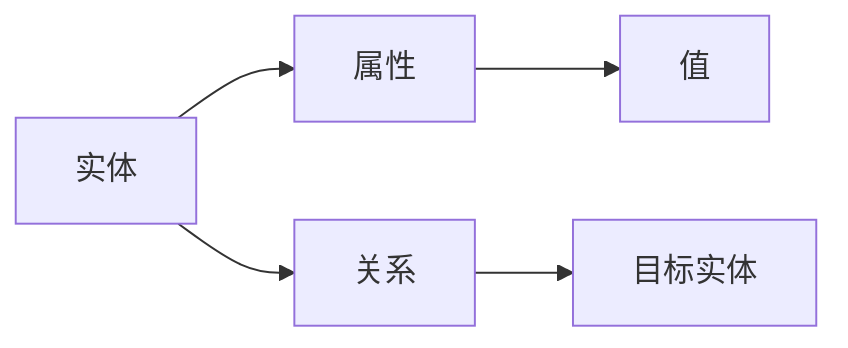
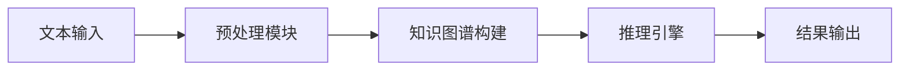
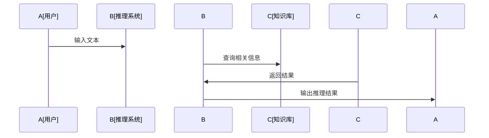

                 


# AI Agent的自然语言推理能力增强

> 关键词：AI Agent, 自然语言推理, 语言模型, 知识图谱, 多模态推理

> 摘要：本文探讨了如何增强AI Agent的自然语言推理能力，通过分析自然语言推理的核心原理、算法优化、系统设计和项目实现，提供了从理论到实践的全面指导。

---

## 第一部分: AI Agent与自然语言推理概述

### 第1章: AI Agent与自然语言推理概述

#### 1.1 AI Agent的基本概念
- **1.1.1 AI Agent的定义与特点**
  - AI Agent（智能体）是能够感知环境、自主决策并执行任务的实体。
  - 特点：自主性、反应性、目标导向、社交能力。

- **1.1.2 自然语言处理的背景与意义**
  - 自然语言处理（NLP）是AI Agent理解人类语言的关键技术。
  - 意义：增强AI Agent与人类的交互能力，使其能够理解复杂语义。

- **1.1.3 自然语言推理的定义与目标**
  - 自然语言推理（NLP）：从文本中推断隐含信息的能力。
  - 目标：提升AI Agent在对话中的逻辑推理能力。

#### 1.2 自然语言推理的核心问题
- **1.2.1 问题背景与挑战**
  - 背景：NLP任务中的语义理解难题。
  - 挑战：歧义性、知识缺损、上下文理解。

- **1.2.2 问题描述与解决思路**
  - 问题描述：给定输入文本，推断其隐含含义。
  - 解决思路：结合预训练模型与外部知识库。

- **1.2.3 边界与外延分析**
  - 边界：基于文本的推理，不依赖外部知识。
  - 外延：结合知识图谱的增强推理。

#### 1.3 自然语言推理的应用场景
- **1.3.1 语义理解与对话系统**
  - 应用于智能音箱、聊天机器人等场景。
  - 示例：用户输入“我有点冷”，AI Agent推断用户需求并提供解决方案。

- **1.3.2 信息抽取与知识图谱**
  - 从文本中抽取实体关系，构建知识图谱。
  - 示例：从新闻中提取“苹果”与“发布新产品”的关系。

- **1.3.3 多模态推理与复杂场景**
  - 综合文本、图像、语音等多种模态信息。
  - 示例：结合图片描述和上下文进行推理。

#### 1.4 本章小结
- 本章介绍了AI Agent和自然语言推理的基本概念，分析了推理的核心问题和应用场景，为后续内容奠定基础。

---

## 第二部分: 自然语言推理的核心概念与联系

### 第2章: 自然语言推理的核心原理

#### 2.1 自然语言推理的原理与模型
- **2.1.1 基于符号逻辑的推理**
  - 符号逻辑：使用逻辑规则进行推理。
  - 示例：使用谓词逻辑表达和推理。

- **2.1.2 基于概率统计的推理**
  - 统计学习：基于数据分布进行推理。
  - 示例：使用贝叶斯网络进行条件概率推断。

- **2.1.3 基于深度学习的推理**
  - 深度学习模型：如BERT、GPT等。
  - 示例：使用Transformer模型进行上下文理解。

#### 2.2 自然语言推理的关键技术
- **2.2.1 预训练语言模型的作用**
  - 预训练模型：如BERT、GPT-3。
  - 作用：提供强大的语义理解能力。

- **2.2.2 知识图谱的构建与应用**
  - 知识图谱：实体间的关系网络。
  - 应用：增强模型的外部知识推理能力。

- **2.2.3 多模态数据的融合与分析**
  - 多模态数据：文本、图像、语音等。
  - 示例：结合图像描述和文本进行推理。

#### 2.3 自然语言推理的实体关系图


---

## 第三部分: 自然语言推理的算法原理

### 第3章: 自然语言推理的算法优化

#### 3.1 基于预训练模型的推理优化
- **3.1.1 BERT模型的原理与改进**
  - BERT模型：基于Transformer的双向编码器。
  - 改进：引入知识图谱进行增强。

#### 3.2 知识图谱的推理算法
- **3.2.1 知识图谱表示学习**
  - 表示学习：如Word2Vec、Node2Vec。
  - 示例：将实体和关系映射为向量进行推理。

#### 3.3 多模态推理算法
- **3.3.1 多模态融合模型**
  - 示例：结合文本和图像的多模态模型。
  - 实现：使用多模态Transformer进行联合推理。

---

## 第四部分: 自然语言推理的系统分析与架构设计

### 第4章: 自然语言推理的系统设计

#### 4.1 项目背景与目标
- 项目目标：构建一个增强的自然语言推理系统。
- 项目背景：提升AI Agent的语义理解能力。

#### 4.2 系统功能设计
- 功能模块：
  1. 文本预处理模块。
  2. 知识图谱构建模块。
  3. 推理引擎模块。

#### 4.3 系统架构设计


#### 4.4 系统接口设计
- 输入接口：文本输入和知识库接口。
- 输出接口：推理结果输出。

#### 4.5 系统交互设计


---

## 第五部分: 自然语言推理的项目实战

### 第5章: 项目实战与案例分析

#### 5.1 项目环境与工具安装
- 工具：Python、TensorFlow、Keras、NLTK。
- 环境配置：安装依赖库。

#### 5.2 项目核心代码实现
```python
import tensorflow as tf
from tensorflow.keras import layers

# 示例代码：构建一个简单的自然语言推理模型
def build_model(max_length=128):
    input_text = layers.Input(shape=(max_length,), dtype='int32')
    embedding = layers.Embedding(input_dim=vocab_size, output_dim=128)(input_text)
    bi LSTM = layers.Bidirectional(layers.LSTM(64))(embedding)
    dense = layers.Dense(64, activation='relu')(bi LSTM)
    output = layers.Dense(2, activation='sigmoid')(dense)
    return Model(inputs=input_text, outputs=output)
```

#### 5.3 项目案例分析与解读
- 案例分析：一个简单的问答系统。
- 实际应用：在电商客服中应用自然语言推理。

#### 5.4 项目小结
- 总结项目实现的关键步骤和经验教训。

---

## 第六部分: 自然语言推理的最佳实践与总结

### 第6章: 最佳实践与总结

#### 6.1 总结与回顾
- 总结：自然语言推理的核心技术和实现步骤。

#### 6.2 注意事项与建议
- 注意事项：模型训练中的过拟合问题。
- 建议：结合知识图谱进行增强推理。

#### 6.3 未来研究方向
- 研究方向：多模态推理、动态知识图谱。

---

## 作者：AI天才研究院 & 禅与计算机程序设计艺术

---

通过以上内容，我们系统地分析了AI Agent的自然语言推理能力增强的各个方面，从理论到实践，为读者提供了全面的指导。

