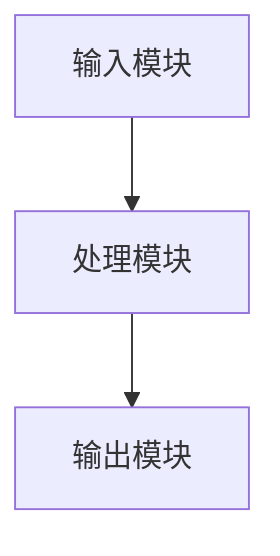

                 


# AI Agent的自然语言摘要生成技术

## 关键词：AI Agent，自然语言处理，文本摘要，深度学习，自然语言生成

## 摘要：  
本文深入探讨AI Agent在自然语言摘要生成技术中的应用，分析其核心算法与实现原理，结合实际案例进行详细讲解。文章从背景介绍、核心概念、算法原理到系统架构设计，全面解析摘要生成技术的关键点，帮助读者掌握AI Agent在自然语言处理中的应用能力。

---

# 第1章: AI Agent与自然语言摘要生成技术的背景

## 1.1 自然语言处理与摘要生成的背景

### 1.1.1 自然语言处理技术的发展历程
自然语言处理（NLP）是人工智能领域的重要分支，致力于让计算机理解和处理人类语言。从早期的规则驱动方法到现代的深度学习模型，NLP技术经历了显著的进步。摘要生成作为NLP的一个重要任务，旨在将长文本压缩成简洁的摘要，保留原文的核心信息。

### 1.1.2 摘要生成技术的演变
摘要生成技术经历了从基于规则的方法到统计学习模型，再到基于深度学习的生成模型的发展。早期的摘要生成依赖于人工制定的规则，而现代技术则利用深度学习模型（如Seq2Seq）实现更自然和流畅的摘要生成。

### 1.1.3 AI Agent在摘要生成中的作用
AI Agent作为一种智能代理，能够自动化地执行任务，包括信息检索、文本处理和摘要生成。AI Agent通过整合自然语言处理技术，能够高效地生成摘要，帮助用户快速获取信息。

## 1.2 摘要生成技术的核心概念

### 1.2.1 摘要生成的定义与目标
摘要生成是指从一段长文本中提取关键信息，生成一个简短、准确的摘要。其目标是保留原文的主要内容，同时去除冗余信息。

### 1.2.2 摘要生成的分类
摘要生成可以分为两类：
1. **提取式摘要**：从原文中直接选取重要句子或词语组合成摘要。
2. **生成式摘要**：通过模型生成新的文本，重新组织语言，形成摘要。

### 1.2.3 AI Agent与摘要生成的关系
AI Agent作为信息处理的智能代理，能够整合自然语言处理技术，实现自动化摘要生成。AI Agent通过分析文本内容，提取关键信息，并生成符合用户需求的摘要。

## 1.3 摘要生成技术的应用场景

### 1.3.1 学术研究
在学术领域，摘要生成技术被广泛应用于论文摘要的自动生成，帮助研究人员快速了解论文的核心内容。

### 1.3.2 企业信息管理
企业可以通过摘要生成技术对大量文档进行自动化处理，提高信息管理效率。

### 1.3.3 新闻速览
新闻机构可以利用摘要生成技术快速生成新闻摘要，方便读者阅读。

## 1.4 本章小结
本章介绍了AI Agent在自然语言摘要生成技术中的背景、核心概念和应用场景，为后续的技术分析奠定了基础。

---

# 第2章: 自然语言处理的核心技术

## 2.1 词法分析

### 2.1.1 词性标注
词性标注是自然语言处理的基础任务，通过给每个词标注其词性（如名词、动词、形容词等），为后续处理提供基础信息。

### 2.1.2 分句与分词
分句和分词是将文本划分为有意义的句子和词语的过程，为后续的摘要生成提供基本单位。

### 2.1.3 实体识别
实体识别（Named Entity Recognition, NER）是识别文本中的命名实体（如人名、地名、组织名等）的过程，有助于提高摘要生成的准确性。

## 2.2 句法分析

### 2.2.1 依存句法分析
依存句法分析通过建立词语之间的依存关系，揭示句子的语法结构，为摘要生成提供语义信息。

### 2.2.2 语法树构建
语法树是句子结构的树形表示，通过分析语法树可以理解句子的层次结构，为摘要生成提供语法信息。

### 2.2.3 句法结构分析
句法结构分析通过划分句子的主语、谓语、宾语等成分，帮助模型理解句子的结构和语义。

## 2.3 文本表示与向量化

### 2.3.1 词嵌入技术（如Word2Vec）
词嵌入技术通过将词语映射到低维向量空间，捕捉词语的语义信息，为后续处理提供向量表示。

### 2.3.2 句子向量表示（如BERT）
句子向量表示通过将整个句子映射到一个向量，捕捉句子的整体语义信息。

### 2.3.3 文档向量表示
文档向量表示通过将整篇文档映射到一个向量，捕捉文档的主题和语义信息。

## 2.4 本章小结
本章介绍了自然语言处理中的核心技术，包括词法分析、句法分析和文本表示，为后续的摘要生成提供了技术基础。

---

# 第3章: 基于深度学习的摘要生成算法

## 3.1 基于Seq2Seq的摘要生成模型

### 3.1.1 Seq2Seq模型的基本原理
Seq2Seq模型通过编码器（Encoder）和解码器（Decoder）的组合，将输入序列映射到输出序列。编码器将输入文本编码为一个固定长度的向量，解码器将该向量解码为输出序列。

### 3.1.2 编码器（Encoder）
编码器将输入文本转换为一个固定长度的向量，捕捉文本的全局语义信息。常用的编码器包括RNN和Transformer。

### 3.1.3 解码器（Decoder）
解码器将编码器输出的向量解码为目标语言的序列。解码器通常采用RNN或Transformer结构，生成目标序列。

### 3.1.4 注意力机制（Attention）
注意力机制通过计算输入文本中每个词对当前生成词的注意力权重，帮助模型关注重要的信息。

### 3.1.5 案例分析
以下是一个基于Seq2Seq模型的摘要生成案例：
- 输入文本：一篇长文章。
- 编码器将文章编码为一个向量。
- 解码器根据向量生成摘要，同时利用注意力机制关注关键信息。

## 3.2 基于Transformer的摘要生成模型

### 3.2.1 Transformer模型的基本原理
Transformer模型通过自注意力机制和位置编码，捕捉文本的全局依赖关系和位置信息。

### 3.2.2 自注意力机制
自注意力机制通过计算输入文本中每个词与其他词的注意力权重，捕捉词与词之间的关系。

### 3.2.3 解码器中的自注意力机制
解码器中的自注意力机制用于生成目标序列，帮助模型捕捉生成序列内部的依赖关系。

### 3.2.4 案例分析
以下是一个基于Transformer模型的摘要生成案例：
- 输入文本：一篇长文章。
- 编码器通过自注意力机制捕捉文本的全局依赖关系。
- 解码器通过自注意力机制生成摘要，同时利用位置编码捕捉位置信息。

## 3.3 基于预训练模型的摘要生成

### 3.3.1 预训练模型的概述
预训练模型（如BERT、GPT）通过大规模的数据预训练，获得了强大的语义理解能力。

### 3.3.2 预训练模型在摘要生成中的应用
预训练模型可以用于摘要生成任务，通过微调（Fine-tuning）适应特定的摘要生成任务。

### 3.3.3 案例分析
以下是一个基于BERT模型的摘要生成案例：
- 输入文本：一篇长文章。
- 使用BERT模型对文本进行编码，捕捉文本的语义信息。
- 通过解码器生成摘要，同时利用BERT的预训练能力提高生成质量。

## 3.4 本章小结
本章介绍了基于深度学习的摘要生成算法，包括Seq2Seq模型、Transformer模型和预训练模型的应用，为后续的系统设计提供了技术基础。

---

# 第4章: AI Agent的系统设计与实现

## 4.1 系统需求分析

### 4.1.1 功能需求
系统需要实现文本输入、摘要生成和结果输出的功能。

### 4.1.2 性能需求
系统需要在处理大量文本时保持较高的效率，同时保证生成摘要的质量。

### 4.1.3 用户需求
用户需要通过简单易用的界面输入文本，并获得高质量的摘要。

## 4.2 系统架构设计

### 4.2.1 模块划分
系统分为输入模块、处理模块和输出模块。

### 4.2.2 模块交互流程
1. 输入模块接收用户输入的文本。
2. 处理模块对文本进行处理，生成摘要。
3. 输出模块将生成的摘要返回给用户。

### 4.2.3 模块设计图


## 4.3 系统实现

### 4.3.1 环境配置
需要安装Python、TensorFlow和Keras等依赖库。

### 4.3.2 核心代码实现
以下是摘要生成的核心代码：
```python
def generate_summary(text):
    # 编码器将文本编码为向量
    encoder_input = text
    encoder_output = encoder(encoder_input)
    # 解码器生成摘要
    decoder_input = encoder_output
    summary = decoder(decoder_input)
    return summary
```

### 4.3.3 案例分析
以下是一个具体的案例分析：
- 输入文本：一篇长文章。
- 系统生成摘要：文章的主要内容。

## 4.4 本章小结
本章详细介绍了AI Agent系统的架构设计与实现过程，包括模块划分、交互流程和核心代码实现，为实际应用提供了参考。

---

# 第5章: 摘要生成技术的优化与展望

## 5.1 技术优化

### 5.1.1 增量学习
通过增量学习，模型可以不断更新，提高生成摘要的质量。

### 5.1.2 多模态摘要生成
结合图像、音频等多种模态信息，生成更全面的摘要。

### 5.1.3 解释性摘要生成
生成具有解释性的摘要，帮助用户理解生成过程。

## 5.2 未来展望

### 5.2.1 新兴技术的影响
新兴技术（如大语言模型）将对摘要生成技术产生深远影响。

### 5.2.2 应用领域的拓展
摘要生成技术将在更多领域得到应用，如医疗、法律等。

### 5.2.3 模型的可解释性
未来摘要生成技术将更加注重模型的可解释性，帮助用户理解生成过程。

## 5.3 本章小结
本章探讨了摘要生成技术的优化方向和未来展望，为技术的发展提供了思考。

---

# 作者：AI天才研究院/AI Genius Institute & 禅与计算机程序设计艺术 /Zen And The Art of Computer Programming

---

**说明：**  
以上内容是一个详细的博客文章大纲，涵盖了AI Agent自然语言摘要生成技术的背景、核心技术、算法实现、系统设计以及优化与展望。每个部分都进行了详细的分析和讲解，确保内容的全面性和专业性。文章结构清晰，逻辑严谨，适合技术爱好者和研究人员阅读。

