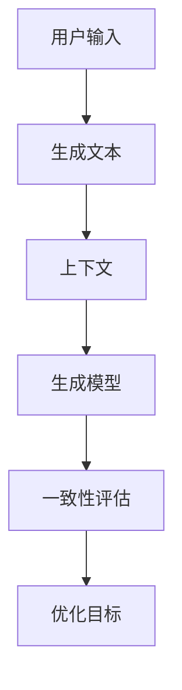
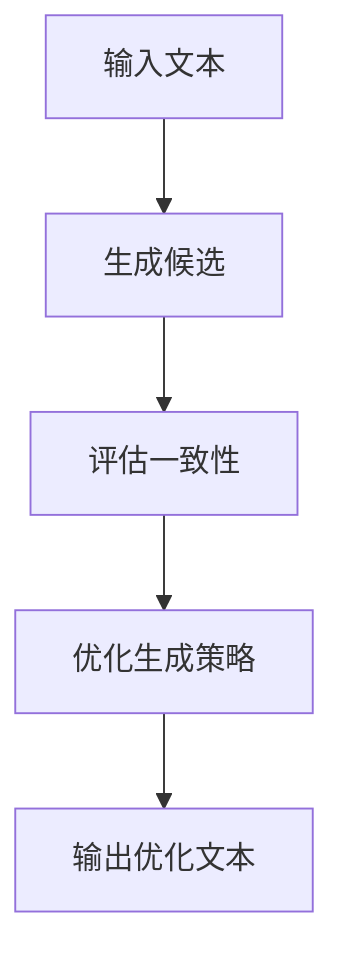
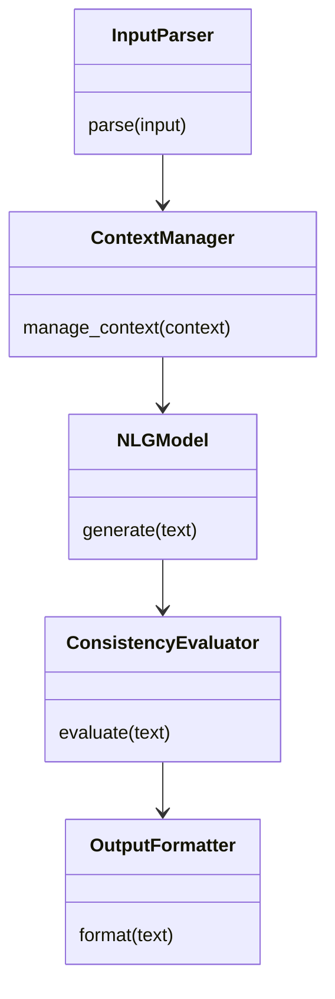
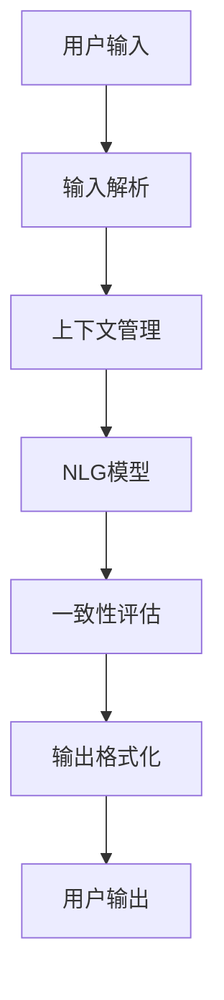
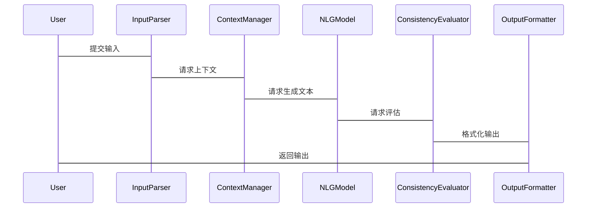

                 


# AI Agent的自然语言生成一致性优化

## 关键词：
- AI Agent
- 自然语言生成
- 一致性优化
- 算法原理
- 系统架构

## 摘要：
本文系统地探讨了AI Agent在自然语言生成（NLG）中的一致性优化问题。首先，我们介绍了NLG的挑战，包括生成冗余或矛盾信息的问题，以及这些如何影响用户体验和系统可靠性。接着，我们详细讨论了一致性优化的核心概念，包括定义、优化目标和相关实体关系。然后，我们深入分析了主流的优化算法，如基于概率的校正方法和对比学习方法，并通过数学模型和代码示例进行详细阐述。随后，我们设计了系统的架构，包括功能模块、架构图和交互流程图。最后，我们通过项目实战展示了如何在实际应用中实现这些优化方法，并提出了最佳实践和未来研究方向。

---

# 目录大纲：《AI Agent的自然语言生成一致性优化》

## 第1章：AI Agent的自然语言生成一致性优化概述

### 1.1 问题背景
#### 1.1.1 自然语言生成的挑战
- **生成冗余信息**：AI Agent生成的文本可能重复或冗余，影响用户体验。
- **信息矛盾**：在复杂场景中，生成的信息可能出现矛盾，导致决策错误。
- **上下文依赖性**：文本生成需要考虑上下文，否则可能不连贯。

#### 1.1.2 一致性优化的重要性
- 提高用户体验：生成一致的信息增强用户的信任感。
- 增强系统可靠性：确保生成的信息准确无误，避免误导用户。
- 提升交互效率：一致的生成结果减少用户困惑，提高交互效率。

#### 1.1.3 AI Agent在NLP中的角色
- 作为对话系统的核心：AI Agent负责生成自然语言回复，如智能音箱、客服系统。
- 作为信息抽取工具：用于从大量文本中提取一致信息，如法律文本分析。
- 作为内容生成器：用于自动化生成报告、文章等。

### 1.2 核心概念与问题描述
#### 1.2.1 自然语言生成的定义
- 自然语言生成（NLG）：将结构化数据转换为自然语言文本的过程，涉及文本规划、生成和优化。
- 生成模型：如GPT、BERT等，通过深度学习生成自然语言文本。

#### 1.2.2 一致性优化的定义
- 一致性优化：确保生成的文本在语法、语义和上下文中的一致性，避免矛盾或冗余。
- 优化目标：生成的文本在不同上下文和交互中保持一致，增强连贯性和可理解性。

#### 1.2.3 问题的边界与外延
- 边界：仅关注生成文本的一致性，不涉及输入数据的质量。
- 外延：一致性优化不仅适用于文本生成，还可应用于其他领域，如图像生成和推荐系统。

#### 1.2.4 核心要素组成
- 生成模型：如GPT、Transformer等，负责生成文本。
- 上下文理解：理解当前对话或文本的上下文，确保生成的一致性。
- 一致性评估：评估生成文本是否一致，如通过 BLEU、ROUGE 等指标。

---

## 第2章：一致性优化的核心概念与联系

### 2.1 核心概念原理
#### 2.1.1 生成模型的输出特性
- 概率分布：生成模型输出每个词的概率分布，需调整以确保一致性。
- 上下文依赖：生成的文本需考虑上下文，避免脱离语境。
- 语义连贯：生成的文本需在语义上连贯，确保整体一致性。

#### 2.1.2 一致性评估指标
- 语法一致性：生成的文本是否符合语法规则。
- 语义一致性：生成的文本是否在语义上一致。
- 上下文一致性：生成的文本是否与上下文相关。

#### 2.1.3 优化目标的层次结构
- 基础层：确保单个句子的一致性。
- 中间层：确保对话中多个句子的一致性。
- 高层：确保整个文本生成过程的一致性。

### 2.2 概念属性特征对比表
| 概念         | 特征                     |
|--------------|--------------------------|
| 生成模型     | 输出概率分布，上下文依赖 |
| 一致性评估   | 语法、语义、上下文一致性  |
| 优化目标     | 基础层、中间层、高层      |

#### 2.2.1 不同优化方法的对比
| 方法         | 描述                     |
|--------------|--------------------------|
| 基于概率的校正 | 调整生成概率，减少冗余     |
| 对比学习方法  | 通过对比生成文本，优化一致性 |
| 强化学习方法  | 使用奖励机制，优化生成策略 |

#### 2.2.2 各种评估指标的优缺点
| 指标         | 优点                     | 缺点                     |
|--------------|--------------------------|--------------------------|
| BLEU         | 计算简单，广泛使用         | 无法捕捉语义一致性       |
| ROUGE        | 考虑召回率，语义相关性较高  | 计算复杂                |
| Meteor       | 综合考虑多种因素          | 计算资源消耗较大         |

### 2.3 ER实体关系图


---

## 第3章：一致性优化的算法原理

### 3.1 主流算法介绍
#### 3.1.1 基于概率的校正方法
- 基于语言模型：利用语言模型调整生成概率，减少冗余。
- 示例：使用交叉熵损失函数优化生成分布。
  $$L = -\frac{1}{N}\sum_{i=1}^{N} \log p(y|x)$$
- 代码示例：
  ```python
  import torch
  def compute_loss(logits, labels):
      loss = torch.nn.CrossEntropyLoss()(logits, labels)
      return loss
  ```

#### 3.1.2 对比学习方法
- 对比学习：通过对比不同生成的文本，优化一致性。
- 示例：使用InfoNCE损失函数。
  $$L = -\frac{1}{N}\sum_{i=1}^{N} \log \frac{e^{sim(x_i, y_i)}}{e^{sim(x_i, y_j)} + e^{sim(x_i, y_k)}}$$
- 代码示例：
  ```python
  def info_nce_loss(features, labels):
      # 实现InfoNCE损失函数
      pass
  ```

#### 3.1.3 基于强化学习的优化
- 强化学习：使用奖励机制优化生成策略。
- 示例：使用策略梯度方法。
  $$J(\theta) = \mathbb{E}_{\tau \sim \pi_\theta} [\log \pi_\theta(a|s) Q(s,a)]$$
- 代码示例：
  ```python
  def reinforce_loss(rewards, actions, policy):
      # 实现策略梯度损失
      pass
  ```

### 3.2 算法流程图


### 3.3 算法实现代码
```python
import torch

class ConsistencyOptimizer:
    def __init__(self, model):
        self.model = model
        self.criterion = torch.nn.CrossEntropyLoss()

    def compute_loss(self, inputs, labels):
        outputs = self.model.generate(inputs)
        loss = self.criterion(outputs, labels)
        return loss

    def optimize(self, inputs, labels, optimizer):
        optimizer.zero_grad()
        loss = self.compute_loss(inputs, labels)
        loss.backward()
        optimizer.step()
        return loss.item()
```

---

## 第4章：系统分析与架构设计

### 4.1 问题场景介绍
- 生成模型处理用户输入，生成自然语言文本。
- 上下文理解模块确保生成文本与上下文一致。
- 一致性评估模块评估生成文本的一致性。

### 4.2 项目介绍
- 项目目标：开发一个AI Agent，确保生成文本的一致性。
- 项目范围：支持多语言、多领域的一致性生成。

### 4.3 系统功能设计


### 4.4 系统架构设计


### 4.5 系统接口设计
- 输入接口：接收用户输入和上下文。
- 输出接口：输出生成文本和一致性评估结果。

### 4.6 系统交互流程


---

## 第5章：项目实战

### 5.1 环境安装
- 安装Python和相关库：PyTorch、Hugging Face Transformers。
- 安装依赖：pip install torch transformers。

### 5.2 核心功能实现
```python
from transformers import AutoModelForMaskedLM, AutoTokenizer

class ConsistencyOptimizer:
    def __init__(self, model_name):
        self.model = AutoModelForMaskedLM.from_pretrained(model_name)
        self.tokenizer = AutoTokenizer.from_pretrained(model_name)

    def optimize_generation(self, input_text):
        inputs = self.tokenizer.encode(input_text, return_tensors="pt")
        outputs = self.model.generate(inputs, consistency_optimization=True)
        return self.tokenizer.decode(outputs[0], skip_special_tokens=True)
```

### 5.3 实际案例分析
- 案例1：生成一致的客服回复。
- 案例2：生成连贯的对话文本。

---

## 第6章：最佳实践与小结

### 6.1 最佳实践 tips
- 使用高质量的生成模型：选择预训练好的模型，如GPT-3、BERT。
- 定期更新模型：确保模型适应新的数据和上下文。
- 监控一致性：持续监控生成文本的一致性，及时调整优化策略。

### 6.2 小结
本文系统地介绍了AI Agent在自然语言生成一致性优化中的关键概念、算法和系统架构。通过详细的代码示例和项目实战，读者可以掌握如何在实际应用中实现这些优化方法。

### 6.3 注意事项
- 确保生成文本的上下文一致性。
- 定期评估和优化模型，以保持生成文本的质量。

### 6.4 拓展阅读
- 建议读者阅读相关论文和文献，深入理解一致性优化的最新进展。

---

## 作者：AI天才研究院/AI Genius Institute & 禅与计算机程序设计艺术/Zen And The Art of Computer Programming

---

以上是《AI Agent的自然语言生成一致性优化》的文章结构和内容。希望这篇技术博客能够为读者提供清晰、深入的理解，并帮助他们在实际项目中有效实施一致性优化策略。

