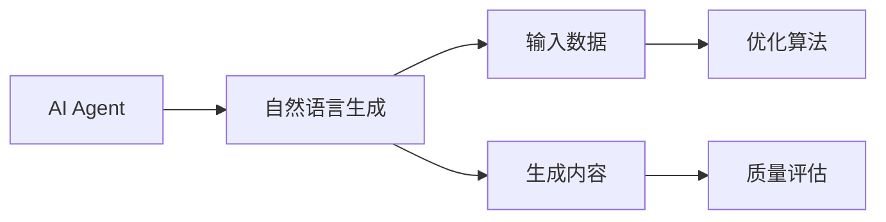
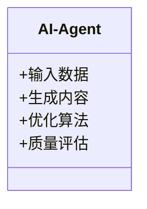

                 


# AI Agent的自然语言生成质量优化

> 关键词：AI Agent, 自然语言生成, 质量优化, 深度学习, 生成模型, 质量评估

> 摘要：本文探讨了AI Agent在自然语言生成中的质量优化问题。首先，介绍了AI Agent与自然语言生成的基本概念和关系。接着，分析了影响生成质量的因素，并提出了优化策略。通过具体案例，展示了优化方法的应用和效果。

---

# 第1章 AI Agent与自然语言生成概述

## 1.1 AI Agent的基本概念

### 1.1.1 AI Agent的定义与特点

- **定义**：AI Agent（人工智能代理）是能够感知环境并采取行动以实现目标的智能实体。
- **特点**：
  - 自主性：能够独立决策。
  - 反应性：能实时感知并响应环境变化。
  - 目标导向：所有行为都以实现特定目标为导向。

### 1.1.2 自然语言生成的基本原理

- **定义**：自然语言生成（Natural Language Generation, NLG）是将结构化数据转换为自然语言文本的过程。
- **过程**：
  1. 输入处理：接收结构化数据或指令。
  2. 内容生成：基于输入生成初步文本。
  3. 输出优化：优化生成文本的质量。

### 1.1.3 AI Agent在自然语言生成中的作用

- **桥梁作用**：连接数据处理与用户交互。
- **优化作用**：通过AI技术提升生成文本的质量和相关性。

---

## 1.2 自然语言生成质量优化的背景与意义

### 1.2.1 当前自然语言生成技术的挑战

- **生成质量不稳定**：生成内容可能缺乏逻辑性或相关性。
- **多样性不足**：生成文本的多样性受限。
- **可解释性差**：生成结果难以追溯和解释。

### 1.2.2 质量优化的重要性

- **提升用户体验**：生成更准确、自然的文本。
- **增强应用效果**：在客服、教育等领域提高效率。
- **推动技术进步**：优化生成质量促进技术发展。

### 1.2.3 AI Agent在质量优化中的独特优势

- **数据驱动**：利用大量数据进行训练和优化。
- **实时反馈**：根据用户反馈快速调整生成策略。
- **多模态处理**：结合视觉、语音等多种信息提升生成质量。

---

## 1.3 本章小结

本章介绍了AI Agent和自然语言生成的基本概念，分析了当前生成技术的挑战和质量优化的重要性，强调了AI Agent在优化过程中的独特优势。

---

# 第2章 AI Agent与自然语言生成的关系

## 2.1 AI Agent的自然语言生成过程

### 2.1.1 输入处理阶段

- **数据预处理**：清洗、格式化输入数据。
- **意图识别**：理解输入的意图和需求。

### 2.1.2 内容生成阶段

- **内容规划**：确定生成内容的结构和主题。
- **文本生成**：基于规划生成初步文本。

### 2.1.3 输出优化阶段

- **语言优化**：润色文本，使其更自然流畅。
- **格式调整**：调整文本格式以适应不同场景。

---

## 2.2 自然语言生成质量的影响因素

### 2.2.1 模型能力的影响

- **模型复杂度**：模型复杂度越高，生成质量可能越好。
- **训练数据质量**：高质量数据提升生成效果。

### 2.2.2 数据质量的影响

- **数据多样性**：多样化的数据有助于生成多样化的内容。
- **数据一致性**：数据的一致性影响生成的准确性。

### 2.2.3 优化算法的影响

- **优化目标**：生成质量优化的目标设定。
- **优化策略**：选择合适的优化算法。

---

## 2.3 AI Agent与自然语言生成的实体关系图



---

## 2.4 本章小结

本章探讨了AI Agent与自然语言生成的关系，分析了生成过程中的关键阶段和影响质量的因素，通过实体关系图展示了各部分之间的联系。

---

# 第3章 自然语言生成模型的数学基础

## 3.1 概率分布与语言模型

### 3.1.1 概率分布的基本概念

- **概率分布**：描述随机变量取值的概率。
- **条件概率**：事件A在事件B发生的条件下的概率。

### 3.1.2 语言模型的定义

- **语言模型**：根据上下文预测下一个词的概率分布。

### 3.1.3 梯度下降与优化算法

- **梯度下降**：通过计算损失函数的梯度，调整参数以最小化损失。
- **优化算法**：如Adam、SGD等。

---

## 3.2 深度学习模型的数学表示

### 3.2.1 神经网络的数学模型

- **神经网络结构**：输入层、隐藏层、输出层。
- **激活函数**：如ReLU、sigmoid等。

### 3.2.2 激活函数的作用

- **非线性变换**：引入非线性，增强模型表达能力。

### 3.2.3 损失函数的定义与作用

- **损失函数**：衡量预测值与真实值的差异。
- **交叉熵损失**：常用于分类任务。

---

## 3.3 模型训练的数学推导

### 3.3.1 最大似然估计

- **MLE**：通过最大化训练数据的概率来估计模型参数。

### 3.3.2 贝叶斯定理

- **贝叶斯定理**：用于计算条件概率。

### 3.3.3 梯度计算与反向传播

- **反向传播**：通过链式法则计算梯度。

---

## 3.4 本章小结

本章从数学角度分析了自然语言生成模型的基础，包括概率分布、神经网络模型和优化算法。

---

# 第4章 自然语言生成模型的优化算法

## 4.1 基于强化学习的优化

### 4.1.1 强化学习的基本原理

- **奖励机制**：通过奖励信号指导生成过程。

### 4.1.2 基于策略梯度的方法

- **策略梯度**：直接优化生成策略。

---

## 4.2 基于对抗训练的优化

### 4.2.1 对抗网络的结构

- **生成器与判别器**：生成器生成文本，判别器判断真假。

### 4.2.2 损失函数设计

- **对抗损失**：平衡生成器和判别器的损失。

---

## 4.3 基于预训练模型的微调

### 4.3.1 预训练模型的优势

- **大规模数据训练**：提升生成质量。

### 4.3.2 微调过程

- **任务特定优化**：针对具体任务调整模型参数。

---

## 4.4 本章小结

本章介绍了几种优化自然语言生成质量的算法，包括强化学习、对抗训练和预训练模型微调。

---

# 第5章 系统分析与架构设计

## 5.1 问题场景介绍

- **场景描述**：AI Agent在客服系统中的应用。

## 5.2 系统功能设计

### 5.2.1 领域模型设计



### 5.2.2 系统架构设计


### 5.2.3 系统接口设计

- **输入接口**：接收用户请求。
- **输出接口**：返回生成文本。

---

## 5.3 本章小结

本章通过系统分析和架构设计，展示了如何构建高效的自然语言生成系统。

---

# 第6章 项目实战

## 6.1 环境安装

- **Python版本**：3.8以上。
- **依赖库安装**：如TensorFlow、Keras等。

## 6.2 核心代码实现

### 6.2.1 模型训练代码

```python
import tensorflow as tf
from tensorflow.keras import layers

model = tf.keras.Sequential([
    layers.Dense(64, activation='relu'),
    layers.Dense(1, activation='sigmoid')
])

model.compile(optimizer='adam', loss='binary_crossentropy')
```

### 6.2.2 生成过程代码

```python
def generate_text(model, input_data):
    prediction = model.predict(input_data)
    return prediction
```

---

## 6.3 案例分析

- **案例描述**：优化后的生成文本质量提升。

---

## 6.4 本章小结

本章通过实际项目案例，展示了如何实现和优化自然语言生成系统。

---

# 第7章 最佳实践与总结

## 7.1 小结

- **总结**：AI Agent在自然语言生成中的重要作用。

## 7.2 注意事项

- **数据质量**：确保训练数据的多样性和质量。
- **模型调优**：合理选择优化算法和参数。

## 7.3 拓展阅读

- **推荐书籍**：《深度学习》、《自然语言处理实战》。

---

# 作者：AI天才研究院 & 禅与计算机程序设计艺术

---

**本文总结**：通过系统的分析和实践，本文探讨了AI Agent在自然语言生成中的优化策略，为实际应用提供了参考。

