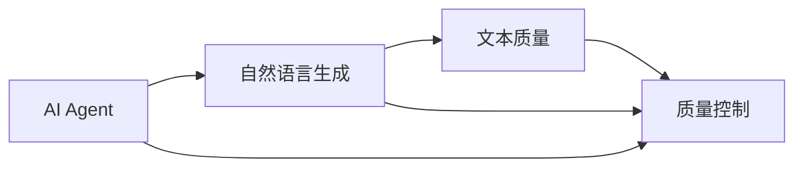
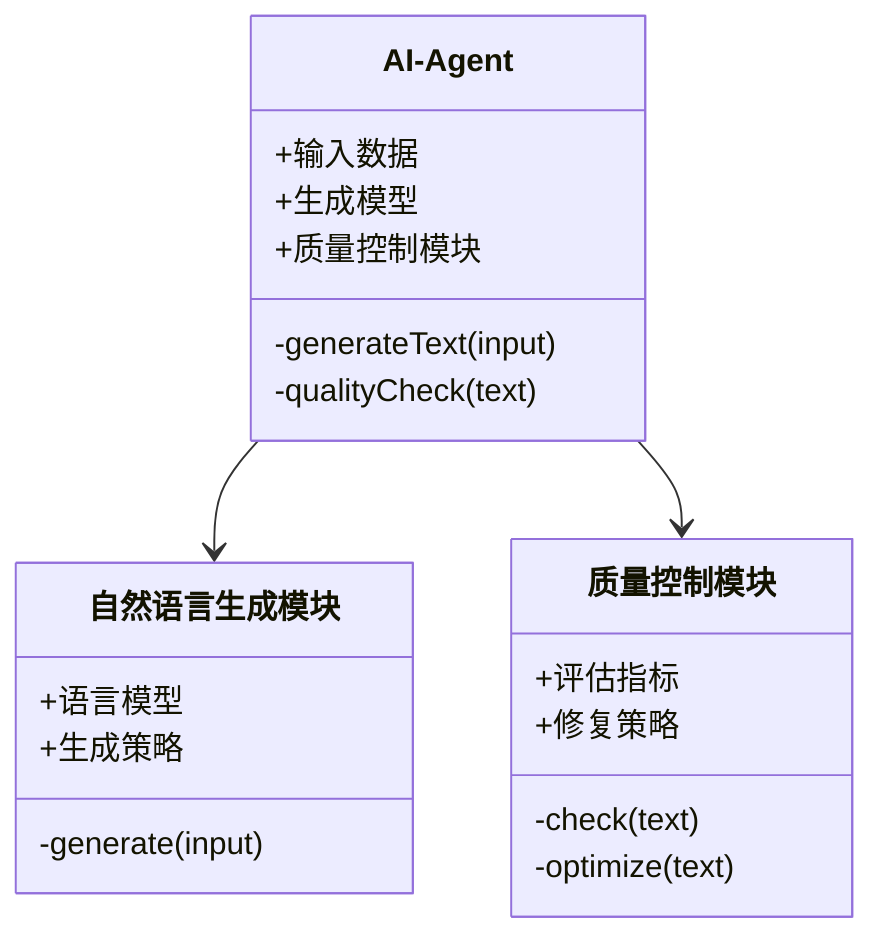
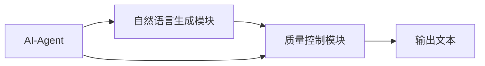
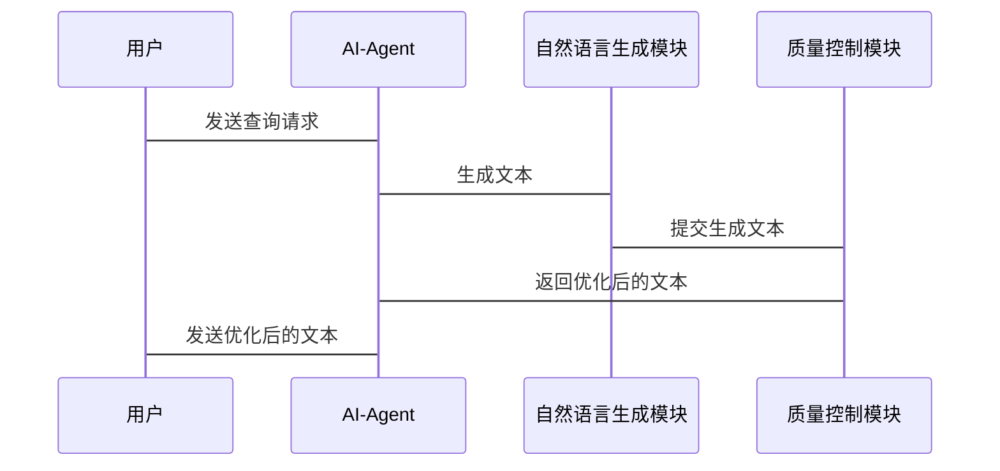

                 


# AI Agent的自然语言生成质量控制

> 关键词：AI Agent，自然语言生成，质量控制，文本生成，算法原理，系统架构

> 摘要：本文系统地探讨了AI Agent在自然语言生成中的质量控制问题，从核心概念、算法原理、系统架构到实际案例和最佳实践，全面分析了如何确保生成文本的质量，帮助读者掌握AI Agent自然语言生成的关键技术与质量控制方法。

---

# 第一部分: AI Agent的自然语言生成质量控制背景与概念

## 第1章: 问题背景与描述

### 1.1 问题背景

#### 1.1.1 自然语言生成的定义与应用领域
自然语言生成（Natural Language Generation, NLG）是指将结构化数据转换为自然语言文本的过程。其应用领域包括智能客服、机器翻译、文本摘要、聊天机器人等。

#### 1.1.2 AI Agent在自然语言生成中的角色
AI Agent（人工智能代理）作为智能系统的核心组件，负责接收输入、处理信息并生成自然语言输出。在自然语言生成中，AI Agent扮演着生成文本、与用户交互的角色。

#### 1.1.3 当前自然语言生成质量控制的挑战
尽管自然语言生成技术取得了显著进展，但生成文本的质量控制仍面临诸多挑战，如语法错误、语义不准确、内容冗余等。AI Agent生成的文本需要满足特定任务的要求，质量控制尤为重要。

### 1.2 问题描述

#### 1.2.1 自然语言生成质量控制的核心问题
自然语言生成质量控制的核心问题包括：生成文本的准确性、流畅性、相关性和一致性。AI Agent生成的文本需要在这些方面达到较高的标准。

#### 1.2.2 AI Agent生成文本的常见问题
AI Agent生成文本时可能出现的问题包括：语法错误、语义不准确、上下文理解不足、生成内容冗余等。

#### 1.2.3 质量控制的必要性与目标
质量控制的必要性在于确保生成文本的准确性和可靠性。其目标是通过技术手段，检测和修正生成文本中的问题，提升生成文本的质量。

### 1.3 问题解决与边界

#### 1.3.1 自然语言生成质量控制的解决方案
解决方案包括：基于规则的质量检查、统计模型评估、人工审核等方法。

#### 1.3.2 AI Agent生成文本的边界与限制
AI Agent生成文本的边界包括：生成文本的长度、生成内容的领域限制、生成文本的时延等。

#### 1.3.3 质量控制的实现边界与外延
质量控制的实现边界包括：生成文本的格式、生成内容的准确性、生成文本的可读性等。

### 1.4 核心概念与要素

#### 1.4.1 自然语言生成的核心要素
自然语言生成的核心要素包括：输入数据、生成模型、输出文本。

#### 1.4.2 AI Agent的生成机制
AI Agent的生成机制包括：基于规则的生成、基于统计的生成、基于深度学习的生成。

#### 1.4.3 质量控制的关键指标
质量控制的关键指标包括：准确率、召回率、F1分数、生成文本的流畅性等。

## 1.5 本章小结

---

## 第2章: 核心概念与联系

### 2.1 AI Agent与自然语言生成的关系

#### 2.1.1 AI Agent的定义与分类
AI Agent可以分为简单反射型AI Agent和复杂推理型AI Agent。简单反射型AI Agent基于规则生成文本，复杂推理型AI Agent基于深度学习模型生成文本。

#### 2.1.2 自然语言生成的原理与流程
自然语言生成的流程包括：输入数据处理、生成模型选择、生成文本输出。

#### 2.1.3 AI Agent在自然语言生成中的作用
AI Agent在自然语言生成中起到连接输入与输出的作用，负责生成符合用户需求的自然语言文本。

### 2.2 核心概念的原理分析

#### 2.2.1 自然语言生成的数学模型
自然语言生成的数学模型包括：语言模型和生成模型。语言模型用于评估生成文本的概率，生成模型用于生成具体的文本内容。

#### 2.2.2 AI Agent的生成策略
AI Agent的生成策略包括：贪心生成、束搜索生成、基于注意力机制的生成等。

#### 2.2.3 质量控制的评估方法
质量控制的评估方法包括：基于规则的评估、基于统计的评估、基于人工的评估。

### 2.3 核心概念的属性特征对比

#### 2.3.1 不同生成模型的特征对比
| 生成模型       | 基于规则 | 基于统计 | 基于深度学习 |
|----------------|----------|----------|--------------|
| 生成方式       | 确定性   | 概率性   | 非线性       |
| 可控性         | 高       | 中       | 低           |
| 生成效果       | 稳定     | 多样     | 创新         |

#### 2.3.2 AI Agent生成文本的优缺点
| 特性           | 优点     | 缺点     |
|----------------|----------|----------|
| 生成速度       | 快       | 可能较慢 |
| 生成文本的可控性 | 高       | 较低     |
| 生成文本的创新性 | 较低     | 较高     |

#### 2.3.3 质量控制指标的对比分析
| 质量指标       | 准确率 | 召回率 | F1分数 | 流畅性 |
|----------------|--------|--------|--------|--------|
| 适用场景       | 纯事实性内容 | 需要全面覆盖 | 综合表现 | 语言表达 |
| 评估方法       | 基于事实库 | 基于关键词匹配 | 综合评估 | 人工评估或基于模型 |

### 2.4 实体关系图



---

## 第3章: 算法原理讲解

### 3.1 基于规则的生成算法

#### 3.1.1 算法流程
基于规则的生成算法通过预定义的规则生成文本，具体流程包括：输入数据解析、规则匹配、文本生成。

#### 3.1.2 算法代码示例
```python
def generate_text(rule_set, input_data):
    for rule in rule_set:
        if rule.trigger(input_data):
            return rule.generate(input_data)
    return default_response
```

#### 3.1.3 数学模型与公式
基于规则的生成算法不依赖复杂的数学模型，主要依赖预定义的规则集。规则匹配的准确率可以用以下公式表示：
$$准确率 = \frac{\text{正确匹配的次数}}{\text{总匹配次数}}$$

### 3.2 基于统计的生成算法

#### 3.2.1 算法流程
基于统计的生成算法通过统计语言模型生成文本，具体流程包括：输入数据处理、概率计算、文本生成。

#### 3.2.2 算法代码示例
```python
import numpy as np

def generate_text(ngram_model, input_data):
    current_sequence = input_data
    while len(current_sequence) < max_length:
        probabilities = ngram_model.get_probabilities(current_sequence)
        next_word = sample_from_distribution(probabilities)
        current_sequence.append(next_word)
    return ' '.join(current_sequence)
```

#### 3.2.3 数学模型与公式
基于n-gram模型的概率生成公式为：
$$P(w_i | w_{i-n+1}, ..., w_{i-1}) = \frac{\text{count}(w_{i-n+1}, ..., w_i)}{\text{count}(w_{i-n+1}, ..., w_{i-1})}$$

### 3.3 基于深度学习的生成算法

#### 3.3.1 算法流程
基于深度学习的生成算法通过神经网络模型生成文本，具体流程包括：输入数据处理、生成模型编码、文本生成。

#### 3.3.2 算法代码示例
```python
import torch
import torch.nn as nn

class TransformerGenerator(nn.Module):
    def __init__(self, embedding_dim, hidden_dim):
        super(TransformerGenerator, self).__init__()
        self.embedding = nn.Embedding(vocab_size, embedding_dim)
        self.transformer = nn.Transformer(embedding_dim, hidden_dim)
        self.linear = nn.Linear(hidden_dim, vocab_size)

    def forward(self, input_sequence):
        embedded = self.embedding(input_sequence)
        transformed = self.transformer(embedded)
        output = self.linear(transformed)
        return output
```

#### 3.3.3 数学模型与公式
Transformer模型的注意力机制公式为：
$$\text{Attention}(Q, K, V) = \text{softmax}\left(\frac{QK^T}{\sqrt{d_k}}\right)V$$

---

## 第4章: 系统分析与架构设计

### 4.1 问题场景介绍

#### 4.1.1 项目介绍
本章将通过一个客服对话系统作为案例，介绍AI Agent自然语言生成质量控制的系统架构设计。

### 4.2 系统功能设计

#### 4.2.1 领域模型设计


### 4.3 系统架构设计

#### 4.3.1 系统架构图


### 4.4 系统接口设计

#### 4.4.1 系统接口定义
系统提供以下接口：
- `generateText(input)`: 生成文本
- `qualityCheck(text)`: 检查文本质量
- `optimize(text)`: 优化文本质量

### 4.5 系统交互流程图



---

## 第5章: 项目实战

### 5.1 环境安装

#### 5.1.1 安装Python
安装Python 3.8及以上版本。

#### 5.1.2 安装依赖库
安装以下依赖库：
```bash
pip install numpy torch transformers
```

### 5.2 系统核心实现

#### 5.2.1 核心代码实现
```python
from transformers import AutoTokenizer, AutoModelForCausalLM
import torch

class AIAgent:
    def __init__(self, model_name='gpt2'):
        self.tokenizer = AutoTokenizer.from_pretrained(model_name)
        self.model = AutoModelForCausalLM.from_pretrained(model_name)
    
    def generate_text(self, input_text, max_length=50):
        inputs = self.tokenizer.encode(input_text, return_tensors='pt')
        outputs = self.model.generate(inputs, max_length=max_length, do_sample=True)
        return self.tokenizer.decode(outputs[0], skip_special_tokens=True)
    
    def quality_check(self, generated_text):
        # 简单的质量检查，可以根据具体需求扩展
        if len(generated_text.split()) > max_length:
            return generated_text[:max_length]
        return generated_text
```

#### 5.2.2 代码解读与分析
- `generate_text`方法使用预训练的语言模型生成文本。
- `quality_check`方法对生成的文本进行简单的质量检查，确保生成文本的长度符合要求。

### 5.3 案例分析与详细讲解

#### 5.3.1 案例分析
以客服对话系统为例，分析生成文本的质量控制过程：
1. 用户输入查询请求。
2. AI-Agent生成初步文本。
3. 质量控制模块检查并优化文本。
4. 发送给用户。

#### 5.3.2 详细讲解
详细讲解质量控制模块的工作流程，包括文本的语法检查、语义理解、内容优化等步骤。

### 5.4 本章小结

---

## 第6章: 最佳实践与注意事项

### 6.1 最佳实践

#### 6.1.1 系统设计 tips
- 使用预训练模型可以提高生成文本的质量。
- 定期更新模型和规则库，以应对语言的变化。

#### 6.1.2 开发注意事项
- 确保生成文本的实时性，避免因质量控制导致时延过长。
- 处理敏感内容时，需严格控制生成文本的内容。

### 6.2 小结

#### 6.2.1 本章总结
总结AI Agent自然语言生成质量控制的关键点，包括系统设计、算法选择、质量控制策略等。

### 6.3 注意事项

#### 6.3.1 开发注意事项
- 生成文本的质量控制需结合具体应用场景。
- 注意保护用户隐私，避免生成敏感信息。

### 6.4 拓展阅读

#### 6.4.1 推荐书籍
- 《生成式人工智能：原理与应用》
- 《自然语言处理：算法与实践》

#### 6.4.2 推荐论文
- "Generating Accurate and Diverse Text with Pre-trained Language Models"
- "Quality Control in Neural Machine Translation"

---

## 作者：AI天才研究院/AI Genius Institute & 禅与计算机程序设计艺术 /Zen And The Art of Computer Programming

