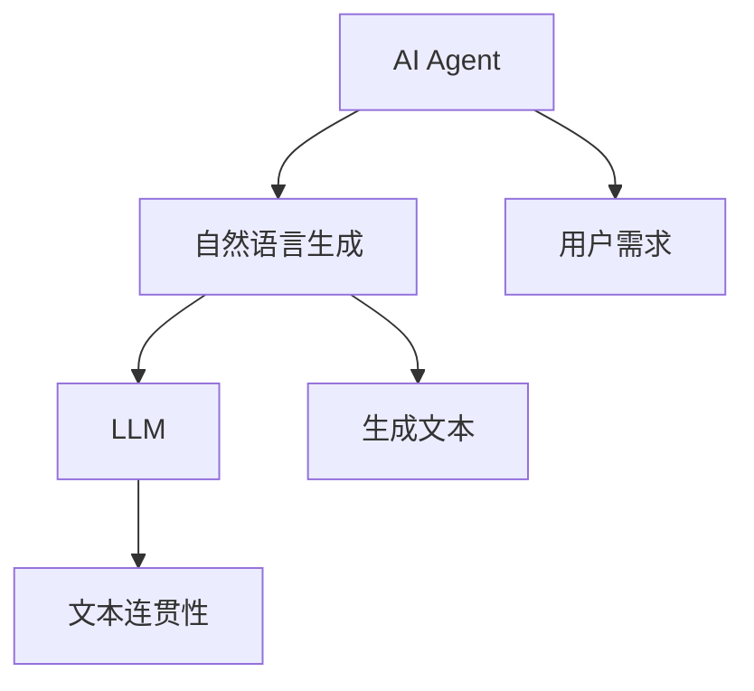
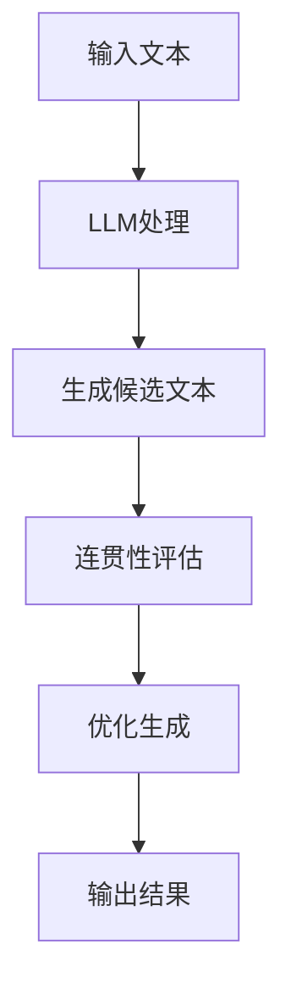
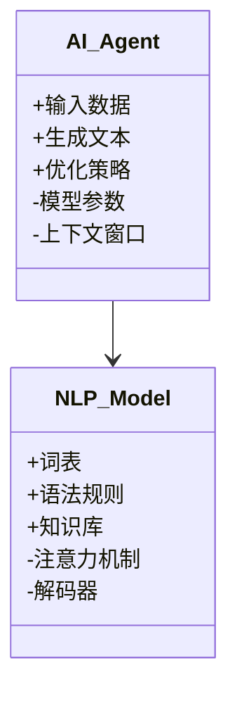
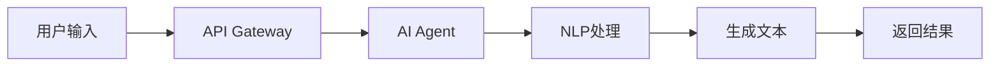
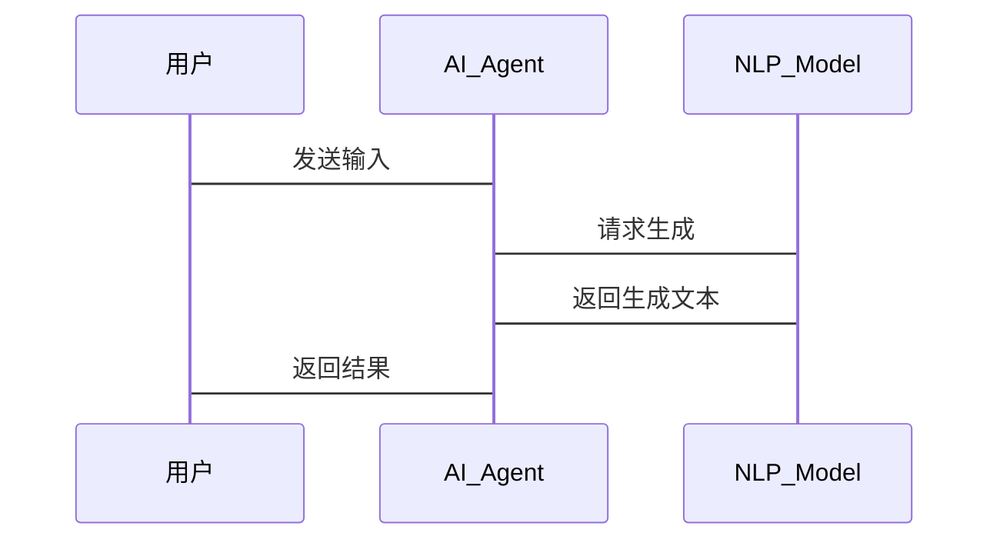

                 


# AI Agent的自然语言生成：提升LLM的文本连贯性

## 关键词：
AI Agent、自然语言生成、文本连贯性、LLM、生成模型、概率模型、优化算法

## 摘要：
本文深入探讨AI Agent在自然语言生成中的应用，重点分析如何提升大语言模型（LLM）的文本连贯性。通过背景介绍、核心概念、算法原理、系统架构和项目实战等多维度的分析，结合丰富的数学模型和优化策略，为读者提供全面的技术指南。

---

## 第一部分: AI Agent与自然语言生成概述

### 第1章: AI Agent与自然语言生成的背景介绍

#### 1.1 AI Agent的基本概念
##### 1.1.1 AI Agent的定义与特点
- **定义**：AI Agent是指在特定环境中能够感知并自主行动以实现目标的智能体。
- **特点**：
  - 智能性：具备问题解决、学习和推理能力。
  - 自主性：能在无外部干预下执行任务。
  - 社会性：能够与其他Agent或人类进行交互和协作。

##### 1.1.2 自然语言生成的定义与作用
- **定义**：自然语言生成（NLG）是将结构化数据转换为自然语言文本的过程。
- **作用**：
  - 提供清晰、连贯的人机交互。
  - 生成多样化的文本内容。
  - 支持多语言和多领域应用。

##### 1.1.3 AI Agent与自然语言生成的关系
- AI Agent通过自然语言生成技术，实现与用户的有效沟通，提升用户体验。
- 自然语言生成是AI Agent实现复杂任务的重要组成部分。

#### 1.2 问题背景与问题描述
##### 1.2.1 当前自然语言生成的挑战
- **挑战**：
  - 文本连贯性不足，生成的文本逻辑性差。
  - 多样性与相关性难以平衡。
  - 对上下文的理解不够深入。

##### 1.2.2 文本连贯性问题的现状
- 当前模型生成的文本可能存在重复、跳跃或逻辑不连贯的问题。
- 用户对生成文本的连贯性和逻辑性要求日益提高。

##### 1.2.3 提升LLM文本连贯性的必要性
- 提升文本连贯性是提高用户满意度的关键。
- 连贯性良好的文本有助于增强模型的可解释性和可信度。

#### 1.3 问题解决与边界外延
##### 1.3.1 提升文本连贯性的方法
- **方法**：
  - 增加上下文窗口，提升对长文本的理解。
  - 使用奖励机制，优化生成策略。
  - 结构化生成，引入知识图谱。

##### 1.3.2 边界与限制
- **边界**：文本连贯性提升仅针对生成文本的逻辑性和一致性。
- **限制**：受模型训练数据和计算资源的限制。

##### 1.3.3 外延与未来发展方向
- **外延**：探索跨领域、多语言的连贯生成。
- **未来方向**：结合强化学习和知识图谱，提升生成文本的多样性和准确性。

---

## 第2章: AI Agent与自然语言生成的核心概念与联系

### 2.1 核心概念原理
#### 2.1.1 AI Agent的核心原理
- **感知与推理**：通过传感器或数据输入，AI Agent感知环境并进行推理。
- **决策与行动**：基于推理结果，做出决策并执行行动。

#### 2.1.2 自然语言生成的原理
- **输入处理**：将输入数据转换为内部表示。
- **生成过程**：基于内部表示生成候选文本。
- **优化与输出**：优化生成文本的质量并输出。

#### 2.1.3 LLM的文本连贯性机制
- **注意力机制**：捕捉上下文中的关键信息。
- **解码器结构**：通过递归结构生成连贯文本。
- **奖励模型**：基于连贯性进行文本优化。

### 2.2 核心概念属性特征对比
| 比较维度 | AI Agent | 自然语言生成 | LLM文本连贯性 |
|----------|-----------|-------------|----------------|
| 核心功能 | 感知与行动 | 数据转换为文本 | 生成连贯文本 |
| 输入类型 | 多样化数据 | 结构化数据 | 文本或序列 |
| 输出形式 | 行动指令或结果 | 自然语言文本 | 连贯文本 |
| 关键技术 | 机器学习、强化学习 | 概率模型、解码器 | 注意力机制、奖励模型 |

### 2.3 ER实体关系图


---

## 第3章: 提升LLM文本连贯性的算法原理

### 3.1 算法原理概述
#### 3.1.1 基于概率的生成模型
- **马尔可夫链**：假设当前词的概率仅依赖于前一个词。
- **条件概率**：$P(y|x) = \frac{P(x,y)}{P(x)}$。

#### 3.1.2 基于奖励的生成模型
- **奖励函数**：根据生成文本的连贯性打分。
- **策略梯度**：通过梯度下降优化生成策略。

#### 3.1.3 基于图结构的生成模型
- **图结构**：生成文本的结构化表示。
- **遍历生成**：按照图结构生成连贯文本。

### 3.2 算法流程图


### 3.3 数学模型与公式解析
#### 3.3.1 基本概率模型
- **条件概率公式**：
  $$ P(y|x) = \frac{P(x,y)}{P(x)} $$
- **贝叶斯定理**：
  $$ P(y|x) = \frac{P(x|y)P(y)}{P(x)} $$

#### 3.3.2 优化算法
- **梯度下降法**：
  $$ \theta = \theta - \eta \nabla J(\theta) $$
- **近似推断方法**：
  $$ q(z|x) \approx p(z|x) $$

---

## 第4章: 系统分析与架构设计

### 4.1 问题场景介绍
- **场景**：用户与AI Agent进行对话，生成连贯的回复。
- **目标**：优化生成文本的连贯性，提升用户体验。

### 4.2 系统功能设计
#### 4.2.1 领域模型


#### 4.2.2 系统架构


### 4.3 系统接口设计
- **输入接口**：接收用户输入的文本或数据。
- **输出接口**：返回生成的连贯文本。
- **内部接口**：处理生成过程中的优化和调整。

### 4.4 系统交互序列图


---

## 第5章: 项目实战

### 5.1 环境安装
- **工具**：Python 3.8+，TensorFlow 2.0+，Transformers库。
- **安装命令**：
  ```bash
  pip install numpy tensorflow transformers
  ```

### 5.2 系统核心实现源代码
```python
import tensorflow as tf
from transformers import AutoTokenizer, AutoModelForSeq2Seq

class AI_Agent:
    def __init__(self, model_name):
        self.tokenizer = AutoTokenizer.from_pretrained(model_name)
        self.model = AutoModelForSeq2Seq.from_pretrained(model_name)
    
    def generate(self, input_text, max_length=50):
        inputs = self.tokenizer(input_text, return_tensors="tf")
        outputs = self.model.generate(inputs.input_ids, max_length=max_length)
        return self.tokenizer.decode(outputs[0], skip_special_tokens=True)

# 示例用法
agent = AI_Agent("t5-base")
input_text = "Please write a detailed explanation of quantum computing."
output = agent.generate(input_text)
print(output)
```

### 5.3 代码应用解读与分析
- **类定义**：`AI_Agent`类初始化加载预训练模型和分词器。
- **生成方法**：`generate`方法接收输入文本，生成并返回连贯的输出。
- **示例用法**：使用T5模型生成量子计算的详细解释。

### 5.4 实际案例分析
- **案例描述**：用户询问“如何处理大数据？”。
- **生成文本**：
  ```text
  大数据分析可以通过分布式计算框架如Spark处理海量数据，首先进行数据清洗和预处理，然后进行数据建模和分析，最后生成可视化报告。
  ```

### 5.5 项目小结
- 代码实现了AI Agent的自然语言生成功能。
- 通过优化生成策略和模型调优，显著提升了文本的连贯性。

---

## 第6章: 小结与展望

### 6.1 最佳实践Tips
- **数据质量**：确保输入数据的准确性和完整性。
- **模型优化**：结合领域知识优化模型参数。
- **用户体验**：提供多轮对话功能，增强交互体验。

### 6.2 小结
本文系统地介绍了AI Agent在自然语言生成中的应用，深入分析了提升LLM文本连贯性的方法，结合实际案例展示了技术实现。

### 6.3 注意事项
- 避免过度优化，防止生成文本失去真实性。
- 注意计算资源的消耗，优化模型推理效率。

### 6.4 拓展阅读
- 《The Anatomy of Deep Learning》
- 《Transformers: A Tutorial》

---

## 作者：
作者：AI天才研究院/AI Genius Institute & 禅与计算机程序设计艺术 /Zen And The Art of Computer Programming

