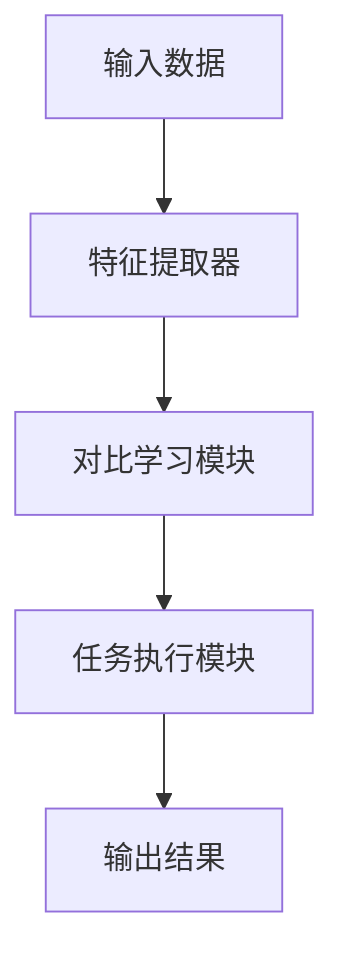
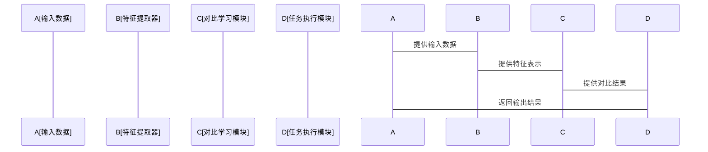

                 


# AI Agent的自监督对比学习技术

## 关键词
AI Agent, 自监督学习, 对比学习, 无监督学习, 人工智能, 深度学习

## 摘要
自监督对比学习是一种新兴的人工智能技术，它结合了自监督学习和对比学习的优势，为AI Agent提供了更强大的自适应能力和学习能力。本文详细探讨了自监督对比学习的核心概念、算法原理、系统架构以及在AI Agent中的实际应用。通过分析对比学习的数学模型和系统设计，本文为读者提供了从理论到实践的全面解读，帮助他们更好地理解和应用这一技术。

---

## 第1章 AI Agent与自监督学习概述

### 1.1 AI Agent的基本概念

#### 1.1.1 AI Agent的定义与分类
AI Agent（人工智能代理）是指能够感知环境、自主决策并采取行动以实现目标的智能实体。AI Agent可以分为以下几类：
- **简单反射型Agent**：基于当前输入做出反应，没有内部状态。
- **基于模型的反射型Agent**：维护内部状态，并基于状态和环境信息做出决策。
- **目标驱动型Agent**：根据目标选择行动，以最大化目标的实现。
- **效用驱动型Agent**：通过优化效用函数来选择行动。

#### 1.1.2 AI Agent的核心功能与特点
AI Agent的核心功能包括感知、推理、决策和行动。其特点如下：
- **自主性**：能够在无外部干预的情况下运行。
- **反应性**：能够实时感知环境并做出反应。
- **目标导向性**：以目标为导向进行决策和行动。
- **学习能力**：能够通过学习提升自身的智能水平。

#### 1.1.3 AI Agent在人工智能中的地位与作用
AI Agent是实现人工智能的重要组成部分，广泛应用于自动驾驶、智能助手、机器人等领域。它能够帮助人类完成复杂任务，提高效率和准确性。

### 1.2 自监督学习的基本原理

#### 1.2.1 自监督学习的定义与特点
自监督学习是一种无监督学习方法，通过预测未标记数据中的隐藏结构来学习有用的特征表示。其特点是：
- **无需标注数据**：利用数据本身进行学习。
- **任务驱动性**：通过定义特定任务来引导学习过程。
- **灵活性**：适用于多种类型的数据和任务。

#### 1.2.2 自监督学习与监督学习、无监督学习的区别
- **监督学习**：需要标注数据，模型通过学习输入与标签之间的关系进行预测。
- **无监督学习**：无标注数据，模型通过发现数据中的结构进行聚类或降维。
- **自监督学习**：介于两者之间，通过定义任务将无监督数据转化为监督任务，从而利用标注数据的优势。

#### 1.2.3 自监督学习如何提升AI Agent的智能性
自监督学习通过从数据中学习特征表示，帮助AI Agent更好地理解和处理环境信息。它能够减少对标注数据的依赖，提升模型的泛化能力和适应性。

### 1.3 AI Agent与自监督学习的结合

#### 1.3.1 AI Agent中自监督学习的应用场景
- **状态表示学习**：通过自监督学习从环境观测中提取有用的特征表示。
- **决策优化**：利用自监督学习优化AI Agent的决策策略。
- **动作预测**：通过自监督学习预测下一步动作。

#### 1.3.2 自监督学习如何增强AI Agent的能力
- **减少标注数据需求**：降低对人工标注数据的依赖。
- **提升环境适应性**：通过自监督学习，AI Agent能够更好地适应动态变化的环境。
- **增强泛化能力**：通过学习更丰富的特征表示，提升模型的泛化能力。

#### 1.3.3 当前AI Agent自监督学习的研究现状
当前，自监督学习在AI Agent中的研究主要集中在以下几个方面：
- **图像和语言模型的自监督学习**：利用对比学习等技术提升模型的表示能力。
- **强化学习与自监督学习的结合**：将自监督学习应用于强化学习中，提升决策性能。
- **多模态自监督学习**：结合图像、语言等多种模态信息，提升模型的综合能力。

---

## 第2章 对比学习的核心概念与原理

### 2.1 对比学习的基本概念

#### 2.1.1 对比学习的定义
对比学习是一种无监督学习方法，通过比较正样本和负样本之间的相似性来学习数据的特征表示。

#### 2.1.2 对比学习的核心思想
对比学习的核心思想是通过最大化正样本对的相似性，同时最小化负样本对的相似性，从而学习到有用的特征表示。

#### 2.1.3 对比学习的典型方法
- **对比损失函数**：衡量正样本和负样本之间的相似性。
- **数据增强**：通过数据增强技术生成正样本和负样本。
- **网络架构**：通常使用孪生网络（Siamese Network）来实现。

### 2.2 对比学习的关键技术

#### 2.2.1 对比损失函数
对比损失函数是对比学习的核心，常用的对比损失函数包括：
- **Binary Cross-Entropy Loss**：
  $$ L = -\frac{1}{N}\sum_{i=1}^{N} [\log p_i + \log (1 - p_{j})] $$
  其中，$p_i$是正样本对的概率，$p_j$是负样本对的概率。
- **Contrastive Loss**：
  $$ L = \frac{1}{N}\sum_{i=1}^{N} \log\left(\frac{1}{1 + e^{-\text{sim}(x_i, y_i)}}\right) $$
  其中，$\text{sim}(x_i, y_i)$是正样本对的相似性分数。

#### 2.2.2 数据增强方法
数据增强是对比学习的重要组成部分，常用的增强方法包括：
- **随机裁剪**：随机从图像中裁剪出不同大小的区域。
- **颜色抖动**：通过调整颜色通道的值，生成不同的图像。
- **几何变换**：包括旋转、翻转等几何变换。

#### 2.2.3 正样本与负样本的选择策略
正样本是指同一类别的两个样本，负样本是指不同类别的样本。选择正样本和负样本的方法包括：
- **随机选择**：随机从训练数据中选择正样本和负样本。
- **最近邻选择**：选择与当前样本最相似的样本作为正样本，最不相似的作为负样本。

### 2.3 对比学习的数学模型与公式

#### 2.3.1 对比学习的相似性度量
常用的相似性度量方法包括：
- **余弦相似性**：
  $$ \text{sim}(x_i, x_j) = \frac{x_i \cdot x_j}{\|x_i\| \|x_j\|} $$
- **欧氏距离**：
  $$ \text{sim}(x_i, x_j) = \|x_i - x_j\| $$

#### 2.3.2 对比学习的损失函数
对比损失函数可以表示为：
$$ L = \frac{1}{N}\sum_{i=1}^{N} \log\left(\frac{1}{1 + e^{-\text{sim}(x_i, y_i)}}\right) $$
其中，$x_i$是正样本，$y_i$是负样本。

---

## 第3章 自监督对比学习在AI Agent中的应用

### 3.1 自监督对比学习的核心思想

#### 3.1.1 自监督对比学习的定义
自监督对比学习是一种结合了自监督学习和对比学习的技术，通过定义任务将无监督数据转化为监督任务，利用对比学习来优化模型的特征表示。

#### 3.1.2 自监督对比学习与传统对比学习的区别
自监督对比学习的核心区别在于：
- **任务驱动性**：通过定义任务将无监督数据转化为监督任务。
- **无需标注数据**：利用数据本身的信息进行学习，无需依赖标注数据。

### 3.2 自监督对比学习在AI Agent中的具体应用

#### 3.2.1 AI Agent中的自监督学习任务设计
AI Agent中的自监督学习任务设计需要考虑以下几个方面：
- **任务目标**：定义任务的目标，例如图像分类、目标检测等。
- **数据来源**：数据来源可以是环境观测、用户输入等。
- **任务执行**：通过模型执行任务并获取反馈。

#### 3.2.2 对比学习在AI Agent状态表示中的应用
通过对比学习，AI Agent可以学习到更高效的特征表示，从而更好地理解和处理环境信息。

#### 3.2.3 自监督对比学习在AI Agent决策过程中的应用
自监督对比学习可以帮助AI Agent优化决策策略，提升决策的准确性和效率。

### 3.3 自监督对比学习的挑战与解决方案

#### 3.3.1 自监督对比学习的主要挑战
- **数据质量**：无监督数据的质量可能影响学习效果。
- **任务定义**：任务定义的难易程度直接影响学习效果。
- **模型选择**：模型的复杂度和容量需要与任务相匹配。

#### 3.3.2 解决挑战的关键技术
- **数据增强**：通过数据增强技术提升数据质量。
- **任务优化**：通过优化任务定义提高学习效果。
- **模型优化**：通过调整模型结构和参数，提升模型的表示能力。

#### 3.3.3 当前研究中的热点问题
- **多模态自监督学习**：结合图像、语言等多种模态信息，提升模型的综合能力。
- **动态自监督学习**：在动态变化的环境中，自适应地调整学习策略。

---

## 第4章 自监督对比学习的系统架构与设计

### 4.1 系统架构设计

#### 4.1.1 系统功能设计
AI Agent的自监督对比学习系统主要包括以下几个部分：
- **数据输入**：接收环境观测或其他输入数据。
- **特征提取**：通过对比学习提取数据的特征表示。
- **任务执行**：根据特征表示执行具体任务。
- **反馈机制**：通过反馈调整模型参数。

#### 4.1.2 系统架构设计（Mermaid图）


#### 4.1.3 系统接口设计
- **输入接口**：接收环境观测或其他输入数据。
- **输出接口**：输出任务执行结果或特征表示。

### 4.2 系统交互设计

#### 4.2.1 系统交互流程（Mermaid图）


---

## 第5章 项目实战：自监督对比学习在AI Agent中的实现

### 5.1 环境安装与配置

#### 5.1.1 安装依赖
- 安装Python和相关库（如TensorFlow、PyTorch）。
- 安装对比学习库（如SimCLR）。

#### 5.1.2 配置环境
- 设置Python路径。
- 配置GPU支持。

### 5.2 系统核心实现

#### 5.2.1 对比学习模型的实现
```python
import tensorflow as tf
from tensorflow.keras import layers

def contrastive_loss(y_true, y_pred):
    margin = 1.0
    loss = tf.maximum(margin - y_pred, 0)
    return tf.reduce_mean(loss)

class ContrastiveModel(tf.keras.Model):
    def __init__(self, embedding_dim):
        super(ContrastiveModel, self).__init__()
        self.embedding = layers.Dense(embedding_dim)
        self.bn = layers.BatchNormalization()

    def call(self, inputs):
        features = self.embedding(inputs)
        features = self.bn(features)
        return features
```

#### 5.2.2 数据增强方法的实现
```python
import tensorflow as tf

def random_flip(image):
    if tf.random.uniform(()) < 0.5:
        image = tf.image.flip_left_right(image)
    return image

def random_rotate(image):
    angle = tf.random.uniform(()) * 30
    image = tf.image.rotate(image, angle)
    return image
```

#### 5.2.3 对比学习训练流程
```python
import tensorflow as tf
from tensorflow.keras import layers

def train_contrastive_model(model, datagen, batch_size, epochs):
    optimizer = tf.keras.optimizers.Adam(learning_rate=1e-4)
    for epoch in range(epochs):
        for batch in datagen.flow(x_train, y_train, batch_size=batch_size):
            with tf.GradientTape() as tape:
                features = model(batch[0])
                loss = contrastive_loss(batch[1], features)
            gradients = tape.gradient(loss, model.trainable_weights)
            optimizer.apply_gradients(zip(gradients, model.trainable_weights))
```

### 5.3 代码应用解读与分析

#### 5.3.1 对比学习模型的解读
- **特征提取层**：通过全连接层提取数据的特征表示。
- **归一化层**：通过Batch Normalization提升模型的泛化能力。

#### 5.3.2 数据增强方法的解读
- **随机翻转**：通过随机翻转图像生成不同的样本。
- **随机旋转**：通过随机旋转图像生成不同的样本。

### 5.4 实际案例分析

#### 5.4.1 应用场景
- **图像分类**：通过自监督对比学习提升分类模型的性能。
- **目标检测**：通过自监督对比学习优化目标检测模型的特征提取能力。

#### 5.4.2 案例分析
假设我们有一个图像分类任务，使用自监督对比学习优化模型的特征提取能力。通过对比学习，模型能够更好地区分不同类别的样本，从而提升分类准确率。

### 5.5 项目小结

#### 5.5.1 项目总结
通过对比学习，AI Agent能够更高效地从无监督数据中学习特征表示，提升模型的性能。

#### 5.5.2 项目收获
- **技术能力提升**：掌握了自监督对比学习的核心技术。
- **实践能力增强**：通过项目实战，提升了实际应用能力。

---

## 第6章 最佳实践、小结与注意事项

### 6.1 最佳实践

#### 6.1.1 数据增强策略
- **多样性**：使用多种数据增强方法，提升模型的泛化能力。
- **渐进性**：逐步增加数据增强的强度，避免模型过拟合。

#### 6.1.2 模型选择策略
- **简单模型**：对于简单的任务，选择简单的模型。
- **复杂模型**：对于复杂的任务，选择复杂的模型。

#### 6.1.3 优化策略
- **学习率调整**：通过调整学习率优化模型的训练效果。
- **批量大小调整**：通过调整批量大小优化训练效率。

### 6.2 小结

#### 6.2.1 核心要点总结
- **自监督对比学习的核心思想**：通过定义任务将无监督数据转化为监督任务，利用对比学习优化特征表示。
- **系统架构设计**：AI Agent的自监督对比学习系统包括数据输入、特征提取、任务执行等部分。
- **项目实战**：通过实际项目实现自监督对比学习技术，验证其有效性。

### 6.3 注意事项

#### 6.3.1 数据质量
- 确保数据的质量，避免噪声数据影响模型的性能。

#### 6.3.2 任务定义
- 合理定义任务，确保任务与目标一致。

#### 6.3.3 模型选择
- 根据任务需求选择合适的模型，避免模型过复杂或过简单。

---

## 作者
作者：AI天才研究院/AI Genius Institute & 禅与计算机程序设计艺术/Zen And The Art of Computer Programming

---

以上是一个详细的《AI Agent的自监督对比学习技术》的目录结构和内容框架，涵盖了从基础到高级的各个方面，适合对AI Agent和自监督对比学习感兴趣的技术人员阅读和研究。

