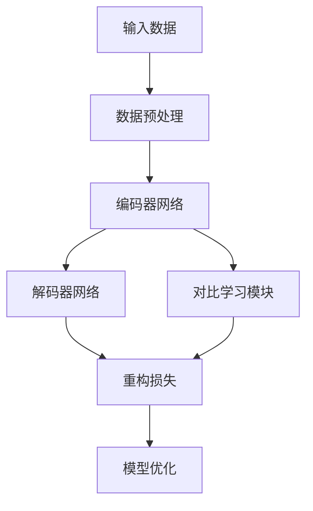

                 


# AI Agent的自监督表示学习技术

> 关键词：自监督学习，表示学习，AI Agent，机器学习，无监督学习

> 摘要：  
本文将详细介绍AI Agent中的自监督表示学习技术，探讨其核心概念、算法原理、系统架构设计以及实际应用。通过分析自监督学习的优势与挑战，结合具体案例，深入讲解其在AI Agent中的应用价值与未来发展方向。

---

# 第1章: AI Agent与自监督学习概述

## 1.1 AI Agent的基本概念

### 1.1.1 AI Agent的定义与特点  
AI Agent（人工智能代理）是指能够感知环境、执行任务并做出决策的智能实体。它具备以下特点：  
- **自主性**：能够自主决策，无需外部干预。  
- **反应性**：能够实时感知环境并做出响应。  
- **目标导向**：以实现特定目标为导向。  
- **学习能力**：能够通过经验改进自身的性能。  

### 1.1.2 AI Agent的分类与应用场景  
AI Agent可以分为以下几类：  
1. **简单反射型Agent**：基于当前感知做出简单反应，适用于环境简单、任务单一的场景。  
2. **基于模型的反射型Agent**：利用内部模型进行状态预测和决策，适用于复杂环境。  
3. **目标驱动型Agent**：以明确的目标为导向，优化行为以达到目标。  
4. **效用驱动型Agent**：通过最大化效用函数来优化决策。  

### 1.1.3 自监督学习的基本概念  
自监督学习是一种无监督学习的变体，通过利用数据本身的结构信息，构建监督信号来学习有用的表示。其核心思想是通过对比或重构数据来推断特征表示。

---

## 1.2 自监督表示学习的背景与意义  

### 1.2.1 表示学习的核心思想  
表示学习的目标是将高维数据映射到低维空间，同时保留数据的语义信息。通过学习数据的表示，可以简化后续任务的计算复杂度，提高模型的泛化能力。

### 1.2.2 自监督学习的优势与挑战  
自监督学习的优势：  
1. **无需标注数据**：自监督学习可以在无标注数据上进行，适用于数据标注成本高的场景。  
2. **学习能力强**：通过利用数据内部关系，自监督学习可以捕获数据的潜在结构信息。  
3. **迁移能力强**：自监督学习得到的表示可以在多种任务中迁移使用，提高模型的泛化能力。  

自监督学习的挑战：  
1. **数据质量**：自监督学习对数据质量要求较高，噪声数据可能影响模型性能。  
2. **计算复杂度**：自监督学习通常需要多次迭代优化，计算资源消耗较大。  

### 1.2.3 自监督表示学习在AI Agent中的应用  
在AI Agent中，自监督表示学习可以用于以下场景：  
1. **状态表示**：将环境状态映射到低维表示，便于Agent理解和决策。  
2. **动作选择**：通过学习动作的表示，优化Agent的决策过程。  
3. **目标识别**：通过自监督学习，Agent可以更好地理解任务目标。  

---

## 1.3 本章小结  
本章介绍了AI Agent的基本概念、分类以及应用场景，并重点探讨了自监督学习的核心思想及其在AI Agent中的应用价值。通过分析自监督学习的优势与挑战，为后续章节奠定了基础。

---

# 第2章: 自监督学习的核心原理  

## 2.1 自监督学习的基本原理  

### 2.1.1 自监督学习的定义与特点  
自监督学习是一种无监督学习方法，通过构建数据本身的监督信号来学习特征表示。其特点包括：  
- **无监督性**：无需外部标注数据。  
- **自适应性**：能够根据数据内部结构自适应地调整表示。  
- **任务无关性**：学习的表示可以用于多种任务。  

### 2.1.2 自监督学习的核心思想  
自监督学习的核心思想是通过对比或重构数据来推断特征表示。具体来说，模型通过预测或重构输入数据的不同视图，学习到数据的潜在表示。

### 2.1.3 自监督学习与监督学习的区别与联系  
- **区别**：自监督学习无需外部标注，而监督学习依赖于标注数据。  
- **联系**：自监督学习可以看作是监督学习的一种扩展，能够在无标注数据上进行特征学习。

---

## 2.2 表示学习的数学模型与公式  

### 2.2.1 表示学习的基本数学模型  
表示学习的目标是将输入数据$$x$$映射到低维表示$$z$$，即：$$z = f(x)$$，其中$$f$$是表示函数。

### 2.2.2 自监督学习的损失函数与优化目标  
自监督学习通常采用对比损失或重构损失作为优化目标。  
- 对比损失：$$L_{\text{contrast}} = -\log p(x|x')$$，其中$$x'$$是$$x$$的扰动视图。  
- 重构损失：$$L_{\text{recon}} = \mathbb{E}_{x,z}[f(x, z)]$$，其中$$f(x,z)$$是重构损失函数。  

### 2.2.3 一些常用的表示学习公式  
1. $$L = \frac{1}{N}\sum_{i=1}^{N} \text{loss}(x_i, x_j)$$，其中$$x_i$$和$$x_j$$是数据的两种不同视图。  
2. $$z = f(x)$$，表示函数$$f$$的具体实现可以是神经网络。  

---

## 2.3 自监督学习的算法流程  

### 2.3.1 自监督学习的通用流程  
1. 数据预处理与增强：对输入数据进行扰动或增强，生成不同的视图。  
2. 特征提取与编码：通过神经网络提取数据的特征表示。  
3. 损失计算与优化：计算对比或重构损失，并优化模型参数。  

### 2.3.2 数据预处理与特征提取  
- 数据预处理：对数据进行归一化、降维等处理，确保模型输入符合要求。  
- 特征提取：通过编码器或编码器-解码器结构提取数据的表示。  

### 2.3.3 表示学习的训练与优化  
- 训练目标：最小化对比损失或重构损失，优化模型参数。  
- 优化方法：使用梯度下降、Adam等优化算法。  

---

## 2.4 本章小结  
本章详细介绍了自监督学习的核心原理，包括其定义、数学模型以及算法流程。通过对比分析，明确了自监督学习与监督学习的区别与联系，为后续章节奠定了理论基础。

---

# 第3章: 对比学习算法原理  

## 3.1 对比学习的基本原理  

### 3.1.1 对比学习的定义与核心思想  
对比学习是一种自监督学习方法，通过对比正样本和负样本的相似性，学习数据的表示。其核心思想是最大化正样本的相似性，同时最小化负样本的相似性。

### 3.1.2 对比学习的损失函数与优化目标  
对比学习通常采用信息瓶颈损失或对比损失作为优化目标。  
- 信息瓶颈损失：$$L_{\text{ib}} = -\mathbb{E}_{x,z}[\log p(z|x)]$$，其中$$z$$是数据$$x$$的表示。  
- 对比损失：$$L_{\text{contrast}} = -\log \frac{p(x|x')}{\sum_{j \neq i} p(x|x_j)}$$，其中$$x'$$是$$x$$的扰动视图。  

### 3.1.3 对比学习的数学模型与公式  
1. $$z_i = f(x_i)$$，其中$$f$$是编码器。  
2. $$z_j = f(x_j)$$，其中$$x_j$$是$$x_i$$的扰动视图。  
3. 对比损失：$$L = -\log \frac{\exp(z_i^\top z_j / \tau)}{\sum_{k \neq i} \exp(z_i^\top z_k / \tau)}$$，其中$$\tau$$是温度参数。  

---

## 3.2 对比学习的实现流程  

### 3.2.1 数据预处理与增强  
- 数据预处理：对输入数据进行归一化、降维等处理。  
- 数据增强：通过随机裁剪、旋转等方式生成数据的扰动视图。  

### 3.2.2 特征提取与编码  
- 通过编码器网络提取数据的特征表示。  
- 对比学习的目标是优化编码器，使得正样本的相似性最大化，负样本的相似性最小化。  

### 3.2.3 损失计算与优化  
- 计算对比损失，并通过优化算法（如Adam）更新模型参数。  

---

## 3.3 对比学习的代码实现示例  

### 3.3.1 环境安装与配置  
- 安装Python和必要的库（如TensorFlow、PyTorch）。  
- 配置运行环境，确保硬件支持（如GPU）。  

### 3.3.2 对比学习算法的Python代码实现  

```python
import tensorflow as tf
from tensorflow.keras import layers

def contrastive_loss(y_true, y_pred, tau=0.1):
    similarity = tf.exp(y_pred / tau)
    loss = -tf.math.log(similarity / tf.reduce_sum(similarity, axis=1, keepdims=True))
    return tf.reduce_mean(loss)

def build_model(input_shape):
    inputs = layers.Input(shape=input_shape)
    z = layers.Dense(128, activation='relu')(inputs)
    return tf.keras.Model(inputs=inputs, outputs=z)

# 示例数据
x = tf.random.normal((100, 128))
model = build_model(x.shape[1:])
z = model(x)

# 计算对比损失
loss = contrastive_loss(tf.ones((100, 1)), z)
loss.backward()
```

---

## 3.4 本章小结  
本章详细介绍了对比学习的基本原理、数学模型和实现流程，并通过代码示例展示了对比学习的实现细节。对比学习作为一种有效的自监督学习方法，广泛应用于AI Agent的表示学习任务中。

---

# 第4章: 生成对抗网络在自监督表示学习中的应用  

## 4.1 生成对抗网络的基本原理  

### 4.1.1 GAN的定义与核心思想  
生成对抗网络（GAN）由生成器和判别器两部分组成，通过对抗训练生成逼真的数据样本。其核心思想是通过生成器和判别器的博弈，逐步优化生成器的生成能力。

### 4.1.2 GAN的损失函数与优化目标  
- 判别器的损失函数：$$L_{\text{D}} = -\mathbb{E}_{x \sim \text{真实数据}}[\log D(x)] - \mathbb{E}_{z \sim \text{先验分布}}[\log(1 - D(G(z)))]$$  
- 生成器的损失函数：$$L_{\text{G}} = -\mathbb{E}_{z \sim \text{先验分布}}[\log D(G(z))]$$  

---

## 4.2 GAN在自监督表示学习中的应用  

### 4.2.1 使用GAN进行数据增强  
通过生成对抗网络生成多样化的数据样本，增强模型的鲁棒性。  

### 4.2.2 GAN在无监督表示学习中的应用  
通过生成器生成数据的多种视图，利用判别器学习数据的表示。  

---

## 4.3 GAN的代码实现示例  

```python
import tensorflow as tf
from tensorflow.keras import layers

def build_generator(input_shape):
    inputs = layers.Input(shape=input_shape)
    x = layers.Dense(256, activation='relu')(inputs)
    x = layers.Dense(128, activation='relu')(x)
    outputs = layers.Dense(input_shape[0], activation='sigmoid')(x)
    return tf.keras.Model(inputs=inputs, outputs=outputs)

def build_discriminator(input_shape):
    inputs = layers.Input(shape=input_shape)
    x = layers.Dense(256, activation='relu')(inputs)
    x = layers.Dense(1, activation='sigmoid')(x)
    return tf.keras.Model(inputs=inputs, outputs=x)

# 示例数据
input_shape = (128,)
generator = build_generator(input_shape)
discriminator = build_discriminator(input_shape)

# GAN训练
discriminator.compile(loss='binary_crossentropy', optimizer='adam')
generator.compile(loss='binary_crossentropy', optimizer='adam', 
                 metrics=['accuracy'])
```

---

## 4.4 本章小结  
本章介绍了生成对抗网络的基本原理及其在自监督表示学习中的应用，展示了GAN在数据增强和无监督学习中的潜力。

---

# 第5章: 自监督表示学习的系统分析与架构设计  

## 5.1 问题场景介绍  

### 5.1.1 问题背景与目标  
在AI Agent中，自监督表示学习的目标是通过无监督方式学习环境状态的表示，以便Agent能够更好地感知和决策。  

### 5.1.2 系统需求分析  
- **输入**：环境状态数据。  
- **输出**：环境状态的表示。  
- **功能**：数据预处理、特征提取、表示学习。  

### 5.1.3 问题约束与边界条件  
- 数据量有限，标注数据不可用。  
- 计算资源有限，需优化模型复杂度。  

---

## 5.2 系统功能设计  

### 5.2.1 系统功能模块划分  
1. 数据预处理模块：对输入数据进行归一化、降维等处理。  
2. 特征提取模块：通过编码器网络提取数据的表示。  
3. 损失计算模块：计算对比损失或重构损失。  
4. 模型优化模块：优化模型参数，更新模型。  

### 5.2.2 功能模块之间的关系与交互  
- 数据预处理模块为特征提取模块提供输入数据。  
- 特征提取模块输出数据的表示，供损失计算模块使用。  
- 损失计算模块计算损失，驱动模型优化模块更新模型参数。  

---

## 5.3 系统架构设计  

### 5.3.1 系统架构的总体设计  
系统架构采用编码器-解码器结构，通过自监督学习优化编码器的表示能力。  

### 5.3.2 系统架构的详细设计  
- 编码器网络：提取数据的表示。  
- 解码器网络：重构数据，验证表示的准确性。  
- 对比学习模块：计算对比损失，优化编码器参数。  

### 5.3.3 系统架构图（Mermaid）  



---

## 5.4 本章小结  
本章通过系统分析与架构设计，明确了自监督表示学习在AI Agent中的实现框架，为后续章节的项目实战奠定了基础。

---

# 第6章: 项目实战——基于自监督学习的AI Agent实现  

## 6.1 项目介绍  

### 6.1.1 项目背景  
本项目旨在通过自监督学习技术，实现一个能够感知环境并做出决策的AI Agent。  

### 6.1.2 项目目标  
- 学习自监督表示学习的核心算法。  
- 实现一个简单的AI Agent系统。  
- 验证自监督学习在AI Agent中的有效性。  

---

## 6.2 项目核心代码实现  

### 6.2.1 环境安装与配置  
- 安装Python和必要的库（如TensorFlow、Keras）。  
- 配置运行环境，确保硬件支持（如GPU）。  

### 6.2.2 AI Agent的实现代码  

```python
import tensorflow as tf
from tensorflow.keras import layers

def build_agent(input_shape):
    inputs = layers.Input(shape=input_shape)
    z = layers.Dense(128, activation='relu')(inputs)
    outputs = layers.Dense(input_shape[0], activation='sigmoid')(z)
    return tf.keras.Model(inputs=inputs, outputs=outputs)

# 示例数据
input_shape = (128,)
agent = build_agent(input_shape)

# 自监督学习训练
optimizer = tf.keras.optimizers.Adam()
loss_fn = tf.keras.losses.binary_crossentropy
```

---

## 6.3 代码解读与优化建议  

### 6.3.1 代码解读  
- `build_agent`函数：构建AI Agent的网络模型，包含编码器和解码器部分。  
- `loss_fn`：定义损失函数，用于训练模型。  
- `optimizer`：定义优化器，用于更新模型参数。  

### 6.3.2 优化建议  
- 调整网络结构，如增加层数或改变激活函数。  
- 调整优化器参数，如学习率。  
- 使用早停机制，防止过拟合。  

---

## 6.4 实际案例分析与详细讲解  

### 6.4.1 案例背景  
假设我们有一个简单的环境，AI Agent需要根据输入的环境状态数据，输出动作决策。  

### 6.4.2 案例实现  
通过自监督学习训练编码器网络，提取环境状态的表示，然后基于表示进行动作决策。  

### 6.4.3 案例分析  
通过对比不同训练策略的效果，验证自监督学习在AI Agent中的有效性。  

---

## 6.5 项目小结  
本章通过一个实际的项目案例，详细讲解了自监督表示学习在AI Agent中的实现过程，展示了如何通过代码实现自监督学习算法，并验证其有效性。

---

# 第7章: 总结与展望  

## 7.1 本章小结  
本文详细介绍了AI Agent的自监督表示学习技术，探讨了其核心概念、算法原理、系统架构设计以及实际应用。通过对比分析，明确了自监督学习在AI Agent中的优势与挑战。

## 7.2 未来展望  
随着深度学习技术的不断发展，自监督表示学习在AI Agent中的应用前景广阔。未来的研究方向包括：  
1. 更高效的自监督学习算法。  
2. 自监督学习与强化学习的结合。  
3. 自监督表示学习在多智能体系统中的应用。  

---

# 作者：AI天才研究院/AI Genius Institute & 禅与计算机程序设计艺术 /Zen And The Art of Computer Programming  

---

以上是《AI Agent的自监督表示学习技术》的技术博客文章的完整目录结构和内容概要。由于篇幅限制，每章的具体内容需要进一步扩展和详细描述。

