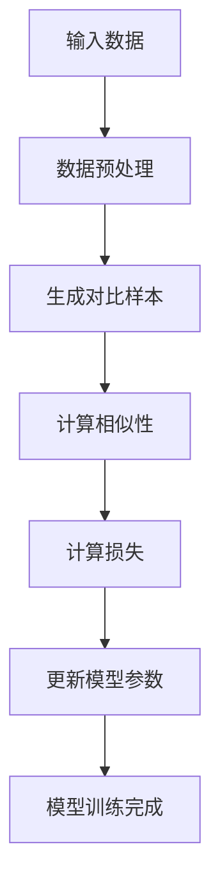
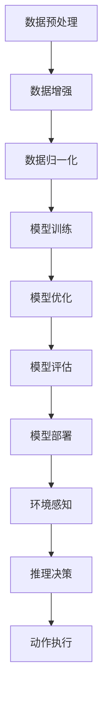

                 


# AI Agent的自监督表示学习：减少标注数据依赖

> 关键词：AI Agent，自监督学习，表示学习，无监督学习，标注数据，深度学习

> 摘要：本文深入探讨了AI Agent在自监督表示学习中的应用，重点分析了如何通过自监督学习技术减少对标注数据的依赖。文章从背景介绍、核心概念、算法原理、系统设计、项目实战到最佳实践等多个方面展开，详细阐述了自监督表示学习的理论基础和实际应用。通过具体的数学公式、算法流程图和代码实现，本文为读者提供了一个从理论到实践的完整学习路径，帮助读者深入理解如何在AI Agent中利用自监督学习技术优化模型性能，降低数据标注成本。

---

# 第一部分: AI Agent的自监督表示学习背景介绍

## 第1章: 问题背景与描述

### 1.1 数据标注的挑战

#### 1.1.1 数据标注的高昂成本
数据标注是机器学习和AI Agent开发中的关键步骤，但其成本高昂。标注数据需要专业人员对数据进行人工分类、打标签或注释，耗时且耗力。对于大规模数据集，标注成本可能占整个项目成本的50%以上。

#### 1.1.2 标注数据的稀缺性问题
许多实际场景中，高质量的标注数据非常稀缺。例如，在医疗影像分析或自动驾驶领域，获取标注数据需要大量专业人员的参与，导致数据获取成本极高。此外，标注数据的分布可能不平衡，难以覆盖所有可能的场景。

#### 1.1.3 数据标注的质量问题
数据标注的质量直接影响模型的性能。标注错误或不一致的数据会导致模型训练出现偏差，甚至导致模型无法正常工作。因此，数据标注的质量控制也是一个巨大的挑战。

### 1.2 自监督学习的提出

#### 1.2.1 自监督学习的定义
自监督学习是一种无监督学习的变体，其核心思想是利用数据本身的结构信息来构建监督信号。通过这种方式，模型可以在没有人工标注的情况下，从数据中学习有用的表示。

#### 1.2.2 自监督学习的核心思想
自监督学习的核心思想是通过预测任务（predictive task）来生成监督信号。例如，可以通过图像重建、样本对比或掩码预测等任务来训练模型，从而学习到数据的潜在表示。

#### 1.2.3 自监督学习与监督学习的对比
| 对比维度          | 监督学习                              | 自监督学习                            |
|--------------------|--------------------------------------|---------------------------------------|
| 数据需求          | 需要大量标注数据                     | 仅需要未标注数据，或少量标注数据       |
| 模型性能          | 依赖标注数据的质量和多样性           | 可以利用未标注数据的潜在结构信息       |
| 应用场景          | 适用于明确的任务，如分类、回归       | 适用于数据稀缺或标注成本高的场景       |

### 1.3 AI Agent的定义与特点

#### 1.3.1 AI Agent的基本概念
AI Agent（人工智能代理）是指能够感知环境、自主决策并执行任务的智能实体。它可以是一个软件程序，也可以是一个物理机器人，其目标是通过与环境交互来实现特定目标。

#### 1.3.2 AI Agent的核心能力
- **感知能力**：通过传感器或数据输入感知环境。
- **推理能力**：基于感知信息进行逻辑推理和决策。
- **执行能力**：根据决策结果执行动作，影响环境或与用户交互。

#### 1.3.3 AI Agent与传统机器学习模型的区别
| 对比维度          | 传统机器学习模型                  | AI Agent                          |
|--------------------|-----------------------------------|------------------------------------|
| 核心目标          | 学习特定任务的映射关系            | 实现自主决策和目标导向的行为        |
| 环境交互          | 通常不与环境动态交互              | 具备与环境交互的能力，可以改变环境状态|
| 决策机制          | 基于训练好的模型进行预测          | 具备自主决策能力，可以动态调整策略  |

---

## 第2章: 问题解决与边界

### 2.1 自监督学习在AI Agent中的应用

#### 2.1.1 自监督学习如何减少标注数据依赖
自监督学习通过构建预测任务，利用未标注数据的内在结构信息进行训练，从而减少对标注数据的依赖。例如，在图像领域，可以通过图像重建或样本对比任务，学习图像的潜在表示。

#### 2.1.2 自监督学习在AI Agent中的具体实现
AI Agent可以通过自监督学习来学习环境中的潜在表示。例如，在机器人导航任务中，AI Agent可以通过自监督学习预测下一步动作的潜在表示，从而减少对标注数据的依赖。

#### 2.1.3 自监督学习的优势与局限性
- **优势**：
  - 减少标注数据的需求，降低数据获取成本。
  - 可以利用未标注数据的潜在结构信息，提高模型的泛化能力。
- **局限性**：
  - 自监督学习的性能通常依赖于预测任务的设计，任务设计不当可能导致模型性能下降。
  - 自监督学习的收敛速度通常较慢，需要更多的训练时间。

### 2.2 问题的边界与外延

#### 2.2.1 自监督学习的适用场景
- 数据稀缺或标注成本高的场景。
- 任务目标可以通过预测任务间接实现的场景。
- 需要利用未标注数据进行模型优化的场景。

#### 2.2.2 自监督学习的不适用场景
- 需要精确监督信号的任务，例如需要明确的分类标签。
- 数据分布过于复杂或多样，难以通过自监督任务捕捉到关键信息的场景。

#### 2.2.3 自监督学习与其他学习方式的结合
自监督学习可以与其他学习方式结合，例如：
- **半监督学习**：结合少量标注数据和大量未标注数据进行训练。
- **强化学习**：通过自监督学习获取环境的潜在表示，辅助强化学习算法进行决策。

### 2.3 核心概念组成

#### 2.3.1 表示学习的基本概念
表示学习是一种通过学习数据的低维表示来捕捉数据潜在特征的机器学习技术。表示学习的目标是将高维数据映射到低维空间，同时保留数据的关键特征。

#### 2.3.2 自监督学习的核心要素
- **预测任务**：通过构建预测任务生成监督信号。
- **对比损失**：通过对比不同样本的相似性，学习数据的潜在表示。
- **数据增强**：通过数据增强技术，增加数据的多样性，提高模型的鲁棒性。

---

## 第3章: 自监督学习的核心概念与联系

### 3.1 自监督学习的核心原理

#### 3.1.1 对比学习
对比学习是一种常用的自监督学习方法，其核心思想是通过最大化正样本对的相似性，同时最小化负样本对的相似性，来学习数据的潜在表示。

#### 3.1.2 信息瓶颈理论
信息瓶颈理论认为，表示学习的目标是找到一个低维表示，既能够保留数据的关键特征，又能够忽略噪声和冗余信息。

### 3.2 自监督学习与无监督学习的联系

#### 3.2.1 无监督学习的定义
无监督学习是指在没有标注数据的情况下，通过发现数据的内在结构来学习模型。

#### 3.2.2 自监督学习与无监督学习的区别
- **无监督学习**：目标是发现数据的内在结构，通常不涉及预测任务。
- **自监督学习**：通过构建预测任务，利用数据的内在结构信息进行学习。

### 3.3 自监督学习与其他学习方式的对比

| 对比维度          | 监督学习                              | 无监督学习                            | 半监督学习                            |
|--------------------|--------------------------------------|---------------------------------------|---------------------------------------|
| 数据需求          | 需要标注数据                         | 仅需要未标注数据                      | 需要少量标注数据和大量未标注数据       |
| 学习目标          | 学习特定任务的映射关系               | 发现数据的内在结构                    | 在少量标注数据指导下，学习任务映射关系|
| 实际应用          | 图像分类、语音识别                   | 聚类、降维                            | 图像分类、自然语言处理                 |

---

## 第4章: 自监督学习的算法原理

### 4.1 对比学习的数学模型

#### 4.1.1 对比损失函数
$$ L = -\log \frac{e^{f(x_i, x_j)}}{e^{f(x_i, x_j)} + e^{f(x_i, x_k)}}} $$
其中，$x_i$ 是中心样本，$x_j$ 是正样本，$x_k$ 是负样本，$f$ 是相似性度量函数。

#### 4.1.2 信息瓶颈理论的数学表达
$$ I(X; Z) = H(Z) - H(Z|X) $$
其中，$X$ 是输入数据，$Z$ 是低维表示，$I(X; Z)$ 是$X$和$Z$之间的互信息，$H(Z)$ 是$Z$的熵，$H(Z|X)$ 是$X$给定下的$Z$的条件熵。

### 4.2 算法流程图



### 4.3 Python代码实现

```python
import torch
import torch.nn as nn

class SupConLoss(nn.Module):
    def __init__(self, temperature=0.1):
        super(SupConLoss, self).__init__()
        self.temperature = temperature

    def forward(self, features):
        # 扩展维度，方便计算相似性
        features = torch.cat(torch.unbind(features, dim=1), dim=0)
        labels = torch.cat([torch.arange(features.size(0)//2)]*2, dim=0)
        features = torch.nn.functional.normalize(features, dim=1)
        similarity_matrix = torch.mm(features, features.T)
        # 计算正样本和负样本的相似性
        positive_pairs = similarity_matrix[labels == labels[0].item(), labels == labels[0].item()]
        negative_pairs = similarity_matrix[labels != labels[0].item(), labels == labels[0].item()]
        # 计算损失
        loss = -torch.log(torch.mean(positive_pairs)/(torch.mean(negative_pairs)))
        return loss
```

---

## 第5章: 自监督学习在AI Agent中的系统设计

### 5.1 问题场景介绍

#### 5.1.1 数据预处理
在AI Agent中，数据预处理是自监督学习的第一步。需要对原始数据进行归一化、降维等处理，以便后续模型训练。

#### 5.1.2 模型训练
通过自监督学习算法，训练AI Agent的表示学习模型。训练过程中，需要不断调整模型参数，以最小化对比损失函数。

#### 5.1.3 模型部署
将训练好的模型部署到实际场景中，通过感知环境、推理决策和执行动作来实现AI Agent的目标。

### 5.2 系统功能设计

#### 5.2.1 数据预处理模块
- 数据归一化
- 数据增强
- 数据降维

#### 5.2.2 模型训练模块
- 对比学习算法实现
- 模型参数优化
- 模型评估与调优

#### 5.2.3 模型部署模块
- 模型推理接口
- 决策逻辑实现
- 动作执行接口

### 5.3 系统架构图



### 5.4 系统接口设计

#### 5.4.1 数据预处理接口
```python
def preprocess_data(data):
    # 数据归一化
    normalized_data = normalize(data)
    # 数据增强
    augmented_data = augment(normalized_data)
    return augmented_data
```

#### 5.4.2 模型训练接口
```python
def train_model(data_loader, model, optimizer, loss_fn):
    for epoch in range(num_epochs):
        for batch in data_loader:
            # 前向传播
            outputs = model(batch)
            # 计算损失
            loss = loss_fn(outputs)
            # 反向传播
            optimizer.zero_grad()
            loss.backward()
            optimizer.step()
    return model
```

---

## 第6章: 项目实战

### 6.1 环境安装

```bash
pip install torch==1.9.0+cu111 pytorch-lightning==1.5.0 numpy==1.21.2 matplotlib==3.5.0 seaborn==0.11.2
```

### 6.2 核心代码实现

#### 6.2.1 数据预处理
```python
import numpy as np
from sklearn.datasets import make_circles

def generate_data(n_samples=1000):
    X, y = make_circles(n_samples, shuffle=True, random_state=42)
    return X, y
```

#### 6.2.2 模型训练
```python
import torch
import torch.nn as nn
import torch.optim as optim

class SimpleNet(nn.Module):
    def __init__(self, input_dim=2, hidden_dim=64, output_dim=128):
        super(SimpleNet, self).__init__()
        self.fc1 = nn.Linear(input_dim, hidden_dim)
        self.fc2 = nn.Linear(hidden_dim, output_dim)
    
    def forward(self, x):
        x = torch.relu(self.fc1(x))
        x = torch.relu(self.fc2(x))
        return x

def train_model(X, model, criterion, optimizer, num_epochs=100):
    for epoch in range(num_epochs):
        for batch in range(0, X.shape[0], 64):
            inputs = torch.tensor(X[batch:batch+64], dtype=torch.float32)
            outputs = model(inputs)
            loss = criterion(outputs, inputs)
            loss.backward()
            optimizer.step()
            optimizer.zero_grad()
    return model
```

#### 6.2.3 模型评估
```python
def evaluate_model(model, X_test):
    with torch.no_grad():
        inputs = torch.tensor(X_test, dtype=torch.float32)
        outputs = model(inputs)
        return outputs.numpy()
```

### 6.3 实际案例分析

#### 6.3.1 数据生成
```python
X, y = generate_data()
print("Data generated successfully!")
```

#### 6.3.2 模型训练
```python
model = SimpleNet(input_dim=2, hidden_dim=64, output_dim=128)
criterion = nn.MSELoss()
optimizer = optim.Adam(model.parameters(), lr=0.001)
trained_model = train_model(X, model, criterion, optimizer, num_epochs=100)
```

#### 6.3.3 模型评估
```python
X_test = X[500:]
outputs = evaluate_model(trained_model, X_test)
print("Model evaluation complete!")
```

---

## 第7章: 最佳实践

### 7.1 关键点总结
- 在AI Agent中，自监督学习是一种有效减少标注数据依赖的方法。
- 对比学习是一种常用的自监督学习算法，可以通过最大化正样本对的相似性，同时最小化负样本对的相似性，来学习数据的潜在表示。
- 数据增强和模型优化是提高自监督学习性能的重要手段。

### 7.2 小结
通过本文的介绍，读者可以全面理解自监督学习在AI Agent中的应用，掌握自监督学习的核心原理和算法实现。同时，通过实际案例的分析，读者可以进一步掌握如何在实际项目中应用这些技术。

### 7.3 注意事项
- 数据质量对自监督学习的性能影响较大，需要特别注意数据预处理和数据增强的实现。
- 自监督学习的性能通常依赖于预测任务的设计，需要根据具体场景选择合适的任务。
- 在实际应用中，可以结合半监督学习或强化学习，进一步提高模型的性能。

### 7.4 拓展阅读
-《Self-Supervised Learning》 by Y. LeCun, S. Bengio, and G. Hinton
-《Contrastive Learning of Visual Representations》 by K. He, H. Fan, and J. Jiang

---

## 作者信息

作者：AI天才研究院/AI Genius Institute & 禅与计算机程序设计艺术 /Zen And The Art of Computer Programming

